

  

<strong>UNIVERSIDAD PERUANA DE CIENCIAS APLICADAS</strong>

Carrera de Ingeniería de Software · Ciclo 2026-2

Curso: 1ASI0728 — Arquitecturas de Software Emergentes

Sección (NRC): 9075

Profesor: Vega Calero, Wilder Aurelio

<h1 align="center">Informe de Trabajo Final</h1>

Startup: <strong>NodoB</strong>

Producto: <strong>Triple B</strong>

<strong>Relación de integrantes</strong>

| Código | Apellidos y nombres |
| :---: | :--- |
| U202120836 | Gonza Morales, Anderson |
| U202222745 | Guerrero Tomas, Nelson |
| U202118152 | Gutierrez Tume, Stanley Jeremy |
| U20231F226 | Tasayco Almonacid, Rafael Augusto |
| U202218531 | Mio Mejia, Andy Alejandro |

Septiembre de 2026

# Registro de versiones del informe

| Versión | Fecha | Autor | Descripción de modificación |
| :---: | :---: | :--- | :--- |
| 0.1.0 | 19/09/2026 | Gonza Morales, Anderson | Creación del informe de Triple B a partir del informe base del curso Fundamentos de Arquitectura de Software: nueva carátula, adaptación de los Capítulos I a III a la propuesta con Agente IA (Epic EP13, US51–US56) y primera versión del Capítulo IV (commit `90f6936`). |
| 0.2.0 | 19/09/2026 | Gutierrez Tume, Stanley Jeremy | Estructura completa del informe, Student Outcome, perfiles del equipo, nombre de la startup, registro de la entrevista de Gabriela Diaz, conclusiones, referencias y anexos (commits `2da6b07`, `66240dc`, `5faa99d`, `875c505`). |
| 0.3.0 | 20/09/2026 | Gutierrez Tume, Stanley Jeremy | Sección Project Report Collaboration Insights y fotografía de perfil (commits `feb5585`, `3de8914`). |
| 0.4.0 | 20/09/2026 | Tasayco Almonacid, Rafael Augusto | Lean UX Canvas actualizado con el Agente IA, perfil del integrante e Impact Maps regenerados (commits `e287a32`, `2241afa`, `503abac`). |
| 0.5.0 | 20/09/2026 | Gonza Morales, Anderson | Corrección de la numeración del Capítulo I, imágenes de competidores y fotografías de perfil (commits `064693d`, `52a2b60`). |
| 0.6.0 | 25/09/2026 | Guerrero Tomas, Nelson | Revisión integral contra el enunciado y el sílabo previa a la entrega TB1: carátula completa; Student Outcome con los cinco integrantes; Capítulo I con objetivos, alcance, restricciones, impacto, supuestos de negocio e hipótesis por segmento; Capítulo II con AIApply como competidor, entrevistas recuperadas del historial, análisis con porcentajes, User Task Matrix por tareas y nueva sección 2.4 Ubiquitous Language; Capítulo III con To-Be e Impact Maps rehechos, cuadro único de User Stories (incluye Technical Stories y EP14) y Product Backlog ordenado por valor; Capítulo IV reestructurado según el enunciado (ADD, DDD estratégico y C4 en Structurizr); bibliografía verificada y anexos. |

# Project Report Collaboration Insights

El informe se elabora en el repositorio **1ASI0728-2620-9075-Report** de la organización de GitHub **1ASI0728-2620-9075-Triple-B**:

- Repositorio: https://github.com/1ASI0728-2620-9075-Triple-B/1ASI0728-2620-9075-Report

**Flujo de trabajo.** El equipo aplica GitFlow sobre el informe: `main` contiene únicamente las versiones entregadas (cada entrega se etiqueta con Semantic Versioning, por ejemplo `v1.0.0` para TB1); `develop` integra el trabajo en curso; cada capítulo o artefacto se trabaja en una rama `feature/<capitulo-o-artefacto>` (por ejemplo `feature/capitulo-4-strategic-design`) que se integra a `develop` mediante pull request; antes de cada entrega se crea una rama `release/<entrega>` (por ejemplo `release/tb1`) que se fusiona en `main` y en `develop`; las correcciones urgentes sobre una entrega usan `hotfix/<descripcion>`. Los mensajes de commit siguen Conventional Commits (`docs:` para contenido del informe, `chore:` para configuración, `fix:` para correcciones), en inglés y en modo imperativo.

**Origen del repositorio.** El informe se inició a partir del informe del curso Fundamentos de Arquitectura de Software (ciclo 2026-1), elaborado por un equipo anterior del que formó parte Andy Mio Mejia. Por ello, el historial contiene commits anteriores al 19/09/2026 de autores que no integran el equipo actual; los aportes correspondientes a este curso comienzan el 19/09/2026.

**Actividades de la entrega TB1.** Cada integrante asumió secciones específicas del informe, registradas en el Registro de versiones y en el Student Outcome. La tabla siguiente resume los commits del periodo TB1 registrados en el repositorio del informe.

| Repositorio | Rama | Commit Id | Mensaje del commit | Autor | Fecha |
| --- | --- | --- | --- | --- | :---: |
| 1ASI0728-2620-9075-Report | develop | `520fb0d` | Initial commit | Gutierrez Tume, Stanley Jeremy | 19/09/2026 |
| 1ASI0728-2620-9075-Report | develop | `90f6936` | feat:add readme Triple B | Gonza Morales, Anderson | 19/09/2026 |
| 1ASI0728-2620-9075-Report | develop | `2da6b07` | docs: complete README structure, fix Student Outcome and add team profiles | Gutierrez Tume, Stanley Jeremy | 19/09/2026 |
| 1ASI0728-2620-9075-Report | develop | `66240dc`, `5faa99d`, `875c505` | Update README.md | Gutierrez Tume, Stanley Jeremy | 19/09/2026 |
| 1ASI0728-2620-9075-Report | develop | `feb5585`, `3de8914` | Update README.md | Gutierrez Tume, Stanley Jeremy | 20/09/2026 |
| 1ASI0728-2620-9075-Report | develop | `e287a32` | docs: update team profile and regenerate impact maps | Tasayco Almonacid, Rafael Augusto | 20/09/2026 |
| 1ASI0728-2620-9075-Report | develop | `2241afa` | docs: update Lean UX Canvas image | Tasayco Almonacid, Rafael Augusto | 20/09/2026 |
| 1ASI0728-2620-9075-Report | develop | `503abac` | docs: add Rafael Tasayco profile image and update README | Tasayco Almonacid, Rafael Augusto | 20/09/2026 |
| 1ASI0728-2620-9075-Report | develop | `064693d` | docs:fix errors | Gonza Morales, Anderson | 20/09/2026 |
| 1ASI0728-2620-9075-Report | develop | `52a2b60` | docs:add img competidores and img perfil | Gonza Morales, Anderson | 20/09/2026 |

> ⚠️ **PENDIENTE (equipo):** agregar a la tabla los commits de la versión 0.6.0 y los que se realicen hasta la entrega, e insertar las capturas de **Insights → Contributors** y **Insights → Commits** de GitHub filtradas desde el 19/09/2026. Todos los integrantes deben registrar commits propios en el periodo de la entrega; a la fecha, Guerrero Tomas, Nelson y Mio Mejia, Andy Alejandro no tienen commits en este repositorio. Los tres primeros commits de Stanley y los de Anderson no siguen Conventional Commits; a partir de la versión 0.6.0 se aplica la convención descrita.

# Contenido

* [Student Outcome](#student-outcome)
* [Capítulo I: Introducción](#capítulo-i-introducción)
  * [1.1. Startup Profile](#11-startup-profile)
    * [1.1.1. Descripción de la Startup](#111-descripción-de-la-startup)
    * [1.1.2. Perfiles de integrantes del equipo](#112-perfiles-de-integrantes-del-equipo)
  * [1.2. Solution Profile](#12-solution-profile)
    * [1.2.1. Antecedentes y problemática](#121-antecedentes-y-problemática)
    * [1.2.2. Lean UX Process](#122-lean-ux-process)
      * [1.2.2.1. Lean UX Problem Statement](#1221-lean-ux-problem-statement)
      * [1.2.2.2. Lean UX Assumptions](#1222-lean-ux-assumptions)
      * [1.2.2.3. Lean UX Hypothesis Statements](#1223-lean-ux-hypothesis-statements)
      * [1.2.2.4. Lean UX Canvas](#1224-lean-ux-canvas)
  * [1.3. Segmentos objetivo](#13-segmentos-objetivo)
* [Capítulo II: Requirements Elicitation & Analysis](#capítulo-ii-requirements-elicitation--analysis)
  * [2.1. Competidores](#21-competidores)
    * [2.1.1. Análisis competitivo](#211-análisis-competitivo)
    * [2.1.2. Estrategias y tácticas frente a competidores](#212-estrategias-y-tácticas-frente-a-competidores)
  * [2.2. Entrevistas](#22-entrevistas)
    * [2.2.1. Diseño de entrevistas](#221-diseño-de-entrevistas)
    * [2.2.2. Registro de entrevistas](#222-registro-de-entrevistas)
    * [2.2.3. Análisis de entrevistas](#223-análisis-de-entrevistas)
  * [2.3. Needfinding](#23-needfinding)
    * [2.3.1. User Personas](#231-user-personas)
    * [2.3.2. User Task Matrix](#232-user-task-matrix)
    * [2.3.3. Empathy Mapping](#233-empathy-mapping)
    * [2.3.4. As-Is Scenario Mapping](#234-as-is-scenario-mapping)
  * [2.4. Ubiquitous Language](#24-ubiquitous-language)
* [Capítulo III: Requirements Specification](#capítulo-iii-requirements-specification)
  * [3.1. To-Be Scenario Mapping](#31-to-be-scenario-mapping)
  * [3.2. User Stories](#32-user-stories)
  * [3.3. Impact Mapping](#33-impact-mapping)
  * [3.4. Product Backlog](#34-product-backlog)
* [Capítulo IV: Strategic-Level Software Design](#capítulo-iv-strategic-level-software-design)
  * [4.1. Strategic-Level Attribute-Driven Design](#41-strategic-level-attribute-driven-design)
    * [4.1.1. Design Purpose](#411-design-purpose)
    * [4.1.2. Attribute-Driven Design Inputs](#412-attribute-driven-design-inputs)
      * [4.1.2.1. Primary Functionality (Primary User Stories)](#4121-primary-functionality-primary-user-stories)
      * [4.1.2.2. Quality attribute Scenarios](#4122-quality-attribute-scenarios)
      * [4.1.2.3. Constraints](#4123-constraints)
    * [4.1.3. Architectural Drivers Backlog](#413-architectural-drivers-backlog)
    * [4.1.4. Architectural Design Decisions](#414-architectural-design-decisions)
    * [4.1.5. Quality Attribute Scenario Refinements](#415-quality-attribute-scenario-refinements)
  * [4.2. Strategic-Level Domain-Driven Design](#42-strategic-level-domain-driven-design)
    * [4.2.1. EventStorming](#421-eventstorming)
    * [4.2.2. Candidate Context Discovery](#422-candidate-context-discovery)
    * [4.2.3. Domain Message Flows Modeling](#423-domain-message-flows-modeling)
    * [4.2.4. Bounded Context Canvases](#424-bounded-context-canvases)
    * [4.2.5. Context Mapping](#425-context-mapping)
  * [4.3. Software Architecture](#43-software-architecture)
    * [4.3.1. Software Architecture System Landscape Diagram](#431-software-architecture-system-landscape-diagram)
    * [4.3.2. Software Architecture Context Level Diagrams](#432-software-architecture-context-level-diagrams)
    * [4.3.3. Software Architecture Container Level Diagrams](#433-software-architecture-container-level-diagrams)
    * [4.3.4. Software Architecture Deployment Diagrams](#434-software-architecture-deployment-diagrams)
* [Conclusiones](#conclusiones)
  * [Conclusiones y recomendaciones](#conclusiones-y-recomendaciones)
* [Bibliografía](#bibliografía)
* [Anexos](#anexos)
  * [Anexo A. Tableros, fuentes de diagramas y backlog](#anexo-a-tableros-fuentes-de-diagramas-y-backlog)
  * [Anexo B. Videos de Exposiciones](#anexo-b-videos-de-exposiciones)
  * [Anexo C. Videos de entrevistas (Needfinding)](#anexo-c-videos-de-entrevistas-needfinding)
  * [Anexo D. Uso de inteligencia artificial generativa](#anexo-d-uso-de-inteligencia-artificial-generativa)

# Student Outcome

El curso contribuye al cumplimiento del Student Outcome ABET: ABET – EAC - Student Outcome 3.

Criterio: Capacidad de comunicarse efectivamente con un rango de audiencias.

En el siguiente cuadro se describe las acciones realizadas y enunciados de conclusiones por parte del grupo, que permiten sustentar el haber alcanzado el logro del ABET – EAC - Student Outcome 3.

| Criterio específico | Acciones realizadas | Conclusiones |
| --- | --- | --- |
| Comunica oralmente sus ideas y/o resultados con objetividad a público de diferentes especialidades y niveles jerárquicos, en el marco del desarrollo de un proyecto en ingeniería. | **Gonza Morales, Anderson** **TB1:** Expuse al equipo las decisiones de la primera versión del Capítulo IV (bounded contexts, rol del Agente IA e impacto en la arquitectura), adaptando la explicación a integrantes con distintos niveles de experiencia técnica.  **Guerrero Tomas, Nelson** **TB1:** Participé en las discusiones del equipo para validar las User Stories del Agente IA (US51–US56) y expliqué el impacto funcional de cada escenario; presenté al equipo los resultados de la revisión del informe contra el enunciado y el plan de corrección.  **Gutierrez Tume, Stanley Jeremy** **TB1:** Comuniqué al equipo el flujo de colaboración del repositorio y presenté los hallazgos de las entrevistas para decidir cómo reflejarlos en los artefactos de Needfinding.  **Tasayco Almonacid, Rafael Augusto** **TB1:** ⚠️ PENDIENTE: registrar la acción de comunicación oral realizada en TB1.  **Mio Mejia, Andy Alejandro** **TB1:** ⚠️ PENDIENTE: registrar la acción de comunicación oral realizada en TB1. | En TB1, el equipo comunicó oralmente sus decisiones en sesiones internas de trabajo, explicando la problemática, el rol del Agente IA y las decisiones de arquitectura a integrantes con distintos niveles de conocimiento técnico. Estas discusiones permitieron alinear criterios antes de documentar y preparan la exposición grabada de la entrega. |
| Comunica en forma escrita ideas y/o resultados con objetividad a público de diferentes especialidades y niveles jerárquicos, en el marco del desarrollo de un proyecto en ingeniería. | **Gonza Morales, Anderson** **TB1:** Adapté el informe al curso de Arquitecturas de Software Emergentes, reescribiendo los Capítulos I, II y III para explicar la incorporación del Agente IA, y redacté la primera versión del Capítulo IV.  **Guerrero Tomas, Nelson** **TB1:** Contribuí al Lean UX Process y a las User Stories del Agente IA (US51–US56). Coordiné la revisión integral del informe (versión 0.6.0), con apoyo de IA generativa documentado en el Anexo D: reestructuración del Capítulo IV según el enunciado, Ubiquitous Language y trazabilidad entre entrevistas, User Personas, User Stories y Product Backlog.  **Gutierrez Tume, Stanley Jeremy** **TB1:** Estructuré la documentación base del informe (carátula, registro de versiones, tabla de contenido y Student Outcome), registré la entrevista de Gabriela Diaz y redacté el diseño y análisis de entrevistas y los artefactos de Needfinding del Capítulo II.  **Tasayco Almonacid, Rafael Augusto** **TB1:** Actualicé el Lean UX Canvas del Capítulo I con la propuesta del Agente IA y regeneré los Impact Maps del Capítulo III.  **Mio Mejia, Andy Alejandro** **TB1:** ⚠️ PENDIENTE: registrar la acción de comunicación escrita realizada en TB1. | En TB1, el equipo redactó un informe técnico que conecta la problemática, sustentada con fuentes oficiales, con decisiones de arquitectura trazables. Se empleó una estructura común (User Stories en Gherkin, cuadros de ADD, notación de DDD y C4) para que lectores técnicos y de negocio puedan seguir el razonamiento desde la necesidad del usuario hasta la solución. |

# Capítulo I: Introducción

## 1.1. Startup Profile

### 1.1.1. Descripción de la Startup

**NodoB** es una startup formada por estudiantes de Ingeniería de Software de la Universidad Peruana de Ciencias Aplicadas (UPC). Su nombre expresa su propósito: ser el nodo que conecta el talento universitario con emprendedores y empresas que necesitan resolver tareas concretas.

**Misión.** Conectar a estudiantes universitarios con oportunidades de trabajo freelance y de práctica compatibles con su formación y horarios, mediante productos digitales confiables que les permitan generar ingresos y experiencia verificable mientras estudian.

**Visión.** Ser, al 2030, la plataforma de referencia en Perú y Latinoamérica para que los estudiantes universitarios construyan su primera experiencia profesional, reconocida por la confianza que genera en estudiantes y empleadores.

**Producto.** El producto de NodoB es **Triple B** (Bueno, Bonito y Barato), una plataforma que conecta a estudiantes con clientes interesados en servicios freelance y con empleadores que ofrecen puestos de practicante. Los estudiantes publican sus servicios, definen tarifas y reciben sugerencias de precio según el tiempo estimado, la complejidad y las tarifas del mercado. Su diferenciador es un **Agente de Inteligencia Artificial** que actúa bajo un mandato controlado por el estudiante: revisa las ofertas publicadas en Triple B por empleadores de Latinoamérica, identifica las compatibles con el perfil y el CV del estudiante, adapta el CV resaltando únicamente información verificada, prepara la postulación y coordina la entrevista con el empleador. En el modo **Asistido** (predeterminado) ninguna postulación se envía sin la aprobación del estudiante; en el modo **Autónomo** el estudiante autoriza envíos dentro de un umbral de compatibilidad y un límite diario que él mismo define, y puede pausar o revocar el mandato en cualquier momento. La solución está compuesta por una landing page, una aplicación web, una aplicación móvil para estudiantes y servicios web RESTful desplegados en la nube.

### 1.1.2. Perfiles de integrantes del equipo

| Integrante | Perfil |
| :--- | :--- |
|  **Gonza Morales, Anderson** **Código:** U202120836 **Carrera:** Ingeniería de Software | Estudiante de Ingeniería de Software. Destaca por su capacidad de liderazgo y organización en equipos de trabajo. Tiene conocimientos en Python, Java, HTML, CSS, MySQL, análisis de datos y arquitectura de software, así como en el seguimiento de actividades orientadas a cumplir los objetivos del proyecto. |
| ⚠️ **PENDIENTE:** foto **Guerrero Tomas, Nelson** **Código:** U202222745 **Carrera:** Ingeniería de Software | Estudiante de Ingeniería de Software en la UPC, con enfoque en el análisis de requisitos, la especificación de User Stories y el modelado de negocio. Le interesan la automatización de procesos con IA y el diseño de productos centrados en el usuario. Aporta habilidades en Lean UX, needfinding, gestión del Product Backlog y comunicación de ideas técnicas a audiencias diversas. |
|  **Gutierrez Tume, Stanley Jeremy** **Código:** U202118152 **Carrera:** Ingeniería de Software | Estudiante de Ingeniería de Software en la UPC. Cuenta con experiencia en proyectos desarrollados con C++, Python, HTML y CSS, además de conocimientos en JavaScript, TypeScript y Java. Se considera una persona responsable y comprometida, que mantiene una comunicación efectiva para el trabajo en equipo. |
|  **Tasayco Almonacid, Rafael Augusto** **Código:** U20231F226 **Carrera:** Ingeniería de Software | Estudiante de Ingeniería de Software en la UPC, actualmente en sexto ciclo. Su principal interés profesional es la ciberseguridad, área en la que desea especializarse; en el proyecto aporta criterios de protección de datos y control de accesos. ⚠️ **PENDIENTE:** indicar lenguajes, frameworks y herramientas que domina. |
|  **Mio Mejia, Andy Alejandro** **Código:** U202218531 **Carrera:** Ingeniería de Software | Estudiante de Ingeniería de Software en la UPC, curioso y motivado por el aprendizaje constante. Tiene experiencia previa en especificación de requisitos (User Stories, Impact Mapping, Product Backlog y To-Be Scenario Mapping) y en Attribute-Driven Design, adquirida en el curso de Fundamentos de Arquitectura de Software. ⚠️ **PENDIENTE:** indicar lenguajes, frameworks y herramientas que domina. |

## 1.2. Solution Profile

### 1.2.1. Antecedentes y problemática

Para describir la problemática se aplicó la técnica **5W2H** (What, When, Where, Who, Why, How y How much).

##### **¿Cuál es el problema? (What)**

Muchos estudiantes universitarios enfrentan dificultades para generar ingresos y adquirir experiencia profesional mientras estudian. Esta falta de oportunidades adecuadas limita su independencia económica, el desarrollo temprano de habilidades prácticas y su inserción competitiva en el mercado laboral. Aunque cuentan con conocimientos valiosos, la mayoría no dispone de un canal accesible, seguro y adaptado para ofrecer sus servicios de forma organizada, y buscar ofertas, adaptar el CV y postular a cada una consume un tiempo que compite con su carga académica.

Como antecedente, el Ministerio de Educación aplicó la Encuesta Nacional de Estudiantes de Educación Superior Universitaria 2019 a 63 412 estudiantes de 18 universidades públicas. El 28.5% de quienes interrumpieron sus estudios señaló como razón principal la falta de recursos económicos, y el 27.3% de los estudiantes realizó alguna actividad para obtener ingresos o experiencia laboral (Ministerio de Educación del Perú, 2021).

La población universitaria peruana está expuesta a esta problemática: el 65% de los estudiantes universitarios tiene entre 18 y 25 años y el 24% se encuentra en situación de pobreza o pobreza extrema (Ministerio de Educación del Perú, 2023).

##### **¿Cuándo ocurre el problema? (When)**

El problema se presenta a lo largo de toda la etapa universitaria, con mayor énfasis a partir del segundo o tercer año de carrera, cuando los estudiantes ya cuentan con capacidades técnicas, académicas o creativas aplicables en el ámbito laboral. La necesidad de ingresos se intensifica en periodos críticos como matrículas, proyectos finales o gastos personales.

También es evidente en la transición entre la formación académica y la empleabilidad temprana. La universidad exige progresivamente prácticas y experiencia demostrable, pero el acceso a oportunidades compatibles con los horarios académicos es limitado: el 31.6% de los estudiantes que no realizaron prácticas preprofesionales señaló como razón principal la falta de tiempo (Ministerio de Educación del Perú, 2021). Si bien la Ley Universitaria N.º 30220 promueve mecanismos de empleabilidad como las bolsas de trabajo (Congreso de la República del Perú, 2014), estos se orientan al egreso y a las prácticas, no a servicios freelance flexibles durante la etapa formativa.

##### **¿Dónde ocurre el problema? (Where)**

La problemática se presenta en el contexto universitario peruano y latinoamericano, especialmente en instituciones con políticas de empleabilidad limitadas y escasos vínculos con el mercado freelance. En el entorno digital no existe una plataforma centralizada y especializada que permita a los estudiantes ofrecer servicios de manera organizada, validada y segura.

En América Latina y el Caribe, la tasa de desocupación juvenil fue en 2023 tres veces mayor que la de los adultos y cerca del 60% de las personas jóvenes trabaja en la informalidad (Organización Internacional del Trabajo, 2025). Este contexto refuerza la necesidad de soluciones que conecten oferta y demanda con mayor confianza y transparencia.

##### **¿A quién afecta el problema? (Who)**

Afecta directamente a estudiantes universitarios que buscan generar ingresos, adquirir experiencia temprana y construir un portafolio antes de egresar. También afecta a microempresas, emprendedores y particulares que requieren servicios puntuales de diseño, desarrollo web, edición, marketing o producción de contenido, pero no cuentan con presupuesto para agencias o personal permanente y no encuentran talento joven verificado en su entorno.

El Banco Mundial estima que el trabajo en plataformas en línea representa hasta el 12% de la fuerza laboral mundial y que la mayoría de quienes lo realizan son jóvenes menores de 30 años que buscan ingresos o desarrollar habilidades; al mismo tiempo, advierte que estos mercados requieren mecanismos de confianza y protección para ser sostenibles (Banco Mundial, 2023).

##### **¿Por qué sucede el problema? (Why)**

No existen plataformas diseñadas específicamente para conectar a estudiantes con clientes, considerando sus limitaciones de tiempo, experiencia y recursos. Las plataformas freelance globales imponen barreras de entrada: comisiones elevadas, competencia global y ausencia de validación académica. El Banco Mundial señala que los freelancers nuevos, sin historial de calificaciones, no logran establecerse con facilidad en plataformas globales como Upwork o Fiverr, razón por la cual los programas de empleabilidad juvenil recurren a plataformas regionales más pequeñas para que ganen su primera experiencia (Banco Mundial, 2024). Del total de 545 plataformas de trabajo en línea identificadas en su estudio, cerca de tres cuartas partes son regionales o locales (Banco Mundial, 2023).

##### **¿Cómo sucede el problema? (How)**

Sin alternativas especializadas, los estudiantes ofrecen sus servicios por redes sociales, contactos personales o plataformas genéricas que no garantizan seguridad ni visibilidad. Esta informalidad los expone a incumplimientos de pago, sobreexplotación de tiempo y poco reconocimiento de sus capacidades. En las entrevistas realizadas, los cuatro estudiantes buscan clientes por redes sociales y todos reportan desconfianza de los clientes por su condición de estudiante; quienes indicaron su disponibilidad dedican entre 6 y 12 horas semanales al trabajo freelance (ver 2.2.3). Por el lado de la demanda, los emprendedores entrevistados buscan talento por Instagram, Facebook, LinkedIn o recomendaciones, canales que consideran poco confiables.

La Organización Internacional del Trabajo señala que el trabajo mediante plataformas digitales amplía oportunidades, pero plantea riesgos vinculados a ingresos variables y protección insuficiente cuando no existen reglas claras (Organización Internacional del Trabajo, 2021).

##### **¿Cuán grande es el impacto de este problema? (How much)**

En el primer trimestre de 2025 la tasa de desempleo nacional fue de 5.5%, mientras que en jóvenes de 14 a 24 años alcanzó 11.3%; el desempleo afectó al 8.0% de la población con educación superior universitaria y el subempleo al 58.2% de la PEA ocupada joven (Instituto Nacional de Estadística e Informática, 2025a). En el segundo trimestre de 2025 la tasa de desempleo nacional fue de 5.9%, la de jóvenes de 14 a 24 años de 13.0% y la de personas con educación superior universitaria de 7.0% (Instituto Nacional de Estadística e Informática, 2025b). Estos datos no corresponden exclusivamente a estudiantes universitarios, pero describen el entorno laboral del grupo etario y educativo al que pertenecen.

##### **Objetivos del proyecto**

- **Objetivo general.** Diseñar, implementar y desplegar durante el ciclo 2026-2 una solución multicomponente (landing page, aplicación web, aplicación móvil y servicios web RESTful) que conecte a estudiantes universitarios con oportunidades freelance y de práctica mediante un Agente IA supervisado por el propio estudiante.
- **OE1.** Validar la problemática y las hipótesis del Agente IA con al menos tres entrevistas por segmento objetivo antes de cerrar la especificación (TB1).
- **OE2.** Definir una arquitectura basada en Attribute-Driven Design y Domain-Driven Design que cumpla los escenarios de atributos de calidad priorizados (TB1 y TP1).
- **OE3.** Desplegar un producto mínimo viable con el flujo de postulación asistida por IA de punta a punta (TB2).
- **OE4.** Evaluar con usuarios de ambos segmentos la confianza en el agente y la usabilidad mediante entrevistas de validación basadas en heurísticas (TB2 y TF1).

##### **Alcance y restricciones**

- **Incluye:** landing page con llamados a la acción por segmento; aplicación web para estudiantes, empleadores y administradores; aplicación móvil para estudiantes; servicios web de perfiles y reputación, marketplace, Agente IA, contratación y comunicaciones; integración con servicios externos (autenticación, modelos de IA, calendarios, pagos y notificaciones).
- **No incluye:** búsqueda o postulación automática en portales de empleo de terceros (el agente opera solo sobre ofertas publicadas en Triple B, lo que evita incumplir términos de uso ajenos); gestión de planillas o contratos laborales; publicación de la app en las tiendas (se distribuye en beta).
- **Restricciones:** tecnologías establecidas por el curso (ver 4.1.2.3); cumplimiento de la Ley N.º 29733 de Protección de Datos Personales (Congreso de la República del Perú, 2011); principios de IA responsable (el agente nunca agrega información no verificada al CV y todas sus acciones son visibles y reversibles para el estudiante); presupuesto de infraestructura acotado a una etapa MVP; plazo de 16 semanas.

##### **Impacto de la solución**

- **Social:** amplía el acceso a experiencia profesional de estudiantes con recursos limitados, en un país donde el 24% de los universitarios está en situación de pobreza o pobreza extrema (Ministerio de Educación del Perú, 2023), y reduce la informalidad de los acuerdos.
- **Económico:** genera ingresos para estudiantes y da a las 2 294 284 MIPYME formales del país (Ministerio de la Producción, 2024) acceso a talento a menor costo que una agencia.
- **Ambiental:** favorece el trabajo remoto, que reduce desplazamientos, y usa infraestructura serverless que escala a cero cuando no hay demanda.
- **Global:** conecta estudiantes y empleadores de Latinoamérica y contribuye al Objetivo de Desarrollo Sostenible 8 (trabajo decente y crecimiento económico).

### 1.2.2. Lean UX Process

#### 1.2.2.1. Lean UX Problem Statement

- **Dominio:** empleabilidad temprana y trabajo freelance de estudiantes universitarios en Perú y Latinoamérica.
- **Segmentos de clientes:** estudiantes universitarios freelancers; empleadores, microempresas y emprendedores.
- **Pain points:** los estudiantes no logran que confíen en ellos por su falta de experiencia, dedican tiempo que no tienen a buscar ofertas y postular, y sufren retrasos de pago; los empleadores pierden tiempo revisando perfiles sin referencias y coordinando por chat, y temen a la mala calidad o al incumplimiento.
- **Brecha (gap):** las plataformas existentes son globales y generalistas, no verifican la condición de estudiante ni ayudan a quien no tiene historial; las herramientas de auto-postulación con IA postulan masivamente en portales de terceros sin relación con el empleador ni control de la veracidad del CV.
- **Visión / estrategia:** un marketplace para talento universitario verificado con un Agente IA que recomienda, adapta el CV con hechos verificados y coordina entrevistas, siempre bajo el control del estudiante y con pagos en custodia.
- **Segmento inicial:** estudiantes universitarios y emprendedores de Lima Metropolitana.

El estado actual de la empleabilidad universitaria se ha enfocado en bolsas de trabajo institucionales y plataformas freelance globales, orientadas a profesionales con experiencia. Estos productos no resuelven la falta de confianza hacia perfiles sin historial ni el tiempo que el estudiante debe invertir en buscar, adaptar su CV y postular, y tampoco ofrecen al emprendedor un canal confiable para contratar talento joven. Nuestro producto abordará esta brecha con perfiles verificados, un Agente IA supervisado por el estudiante y pagos en custodia. Nuestro enfoque inicial serán los estudiantes universitarios y emprendedores de Lima Metropolitana. Sabremos que tuvimos éxito cuando más del 50% de los estudiantes activos reciba al menos una entrevista gestionada por Triple B en su primer mes y cuando el tiempo entre la publicación de una oferta y la primera entrevista sea menor a 72 horas.

¿Cómo podríamos ayudar a los estudiantes universitarios de Perú y Latinoamérica a insertarse en el mercado laboral de forma formal, flexible y proactiva durante su etapa académica, desarrollando habilidades prácticas y generando ingresos, sin que dediquen tiempo extra a la búsqueda manual de oportunidades?

#### 1.2.2.2. Lean UX Assumptions

Los supuestos se organizan en supuestos de negocio y supuestos de usuario, según las hojas de trabajo de Lean UX (Gothelf y Seiden, 2021).

**Business Assumptions**

1. Creemos que nuestros clientes tienen la necesidad de conseguir ingresos y experiencia verificable sin descuidar sus estudios (estudiantes) y de contratar talento confiable a bajo costo sin invertir tiempo en filtrar perfiles (empleadores).
2. Estas necesidades pueden resolverse con un marketplace de talento universitario verificado, un Agente IA supervisado que recomienda y prepara postulaciones, y pagos en custodia.
3. Nuestros clientes iniciales serán estudiantes universitarios y emprendedores de Lima Metropolitana.
4. El valor principal que el estudiante espera obtener es conseguir entrevistas y trabajos compatibles con su horario sin buscarlos manualmente; el del empleador, recibir pocos candidatos pero compatibles y agendar entrevistas sin fricción.
5. Los clientes también obtienen reputación verificable, portafolio real y seguridad en el pago.
6. Adquiriremos la mayoría de clientes mediante alianzas con universidades, redes sociales dirigidas a estudiantes y la landing page con llamados a la acción por segmento.
7. Generaremos ingresos con una comisión del 10% sobre cada servicio contratado y cobrado a través de la plataforma.
8. Nuestra competencia principal serán Fiverr, Freelancer, Workana y las herramientas de auto-postulación con IA como AIApply.
9. Les ganaremos por la verificación académica, el agente supervisado dentro de un marketplace con empleadores reales y el enfoque en el primer trabajo del estudiante.
10. Nuestro mayor riesgo de producto es que los estudiantes no confíen en delegar su postulación a una IA o que los empleadores desconfíen de postulaciones asistidas por IA.
11. Lo mitigaremos con el modo Asistido por defecto, la explicación de cada recomendación, la etiqueta visible de postulación asistida por IA y el CV adaptado solo con hechos verificados.
12. Si resultara falso que los estudiantes tienen menos tiempo que interés en postular, el agente perdería relevancia; lo validaremos en las entrevistas complementarias y de validación.

**User Assumptions**

**¿Quién es el usuario?** Estudiantes universitarios peruanos y latinoamericanos, principalmente entre 18 y 25 años, que buscan ingresos y experiencia compatibles con sus horarios. También lo son los empleadores, microempresas y emprendedores que publican servicios requeridos o puestos de practicante.

**¿Dónde encaja nuestro producto en su vida?** Triple B complementa la formación académica con experiencia real. El Agente IA trabaja en segundo plano sobre las ofertas publicadas en Triple B: identifica las compatibles con el perfil del estudiante, prepara la postulación con un CV adaptado y coordina la entrevista, y notifica al estudiante cuando necesita su decisión.

**¿Qué problemas tiene nuestro producto y cómo se pueden resolver?**

* Posible desconfianza hacia la formalidad de las oportunidades. Solución: verificación de empleadores y estudiantes, acuerdos registrados en la plataforma y pagos en custodia. La ejecución de acuerdos como smart contracts sobre blockchain se evaluará en la Unidad 3 del curso (Web3).
* El estudiante no tiene tiempo para buscar y postular a cada oportunidad. Solución: el Agente IA recomienda y prepara las postulaciones; el estudiante solo aprueba.
* Dificultad para adaptar el CV a cada oferta. Solución: el agente adapta el CV resaltando solo información del CV maestro verificado y muestra las diferencias.
* Riesgo de que la IA cometa errores o actúe sin permiso. Solución: consentimiento explícito, modo Asistido por defecto, límites en el modo Autónomo, historial de acciones y opción de pausar o revocar el mandato.
* Baja retención o uso esporádico. Solución: notificaciones relevantes sobre oportunidades y estado de las postulaciones.

**¿Cómo y cuándo es usado nuestro producto?** El estudiante completa y verifica su perfil, sube su CV maestro y configura el mandato del agente. A partir de ahí recibe recomendaciones y aprueba postulaciones desde la app móvil o la web. Los empleadores publican ofertas, revisan la preselección y agendan entrevistas desde la aplicación web.

**¿Qué características son importantes?**

* Perfil del estudiante verificado con CV maestro, historial académico y portafolio.
* Agente IA con recomendaciones explicadas, CV adaptado verificable y postulación bajo mandato.
* Coordinación automática de entrevistas con los calendarios de ambas partes.
* Panel de seguimiento de postulaciones y de las acciones del agente.
* Reseñas, reputación e insignias por proyectos completados.
* Mensajería interna y pagos en custodia.

**¿Cómo debe verse nuestro producto y cómo comportarse?** Debe tener un diseño moderno, amigable y responsivo basado en Material Design. Su comportamiento debe ser transparente respecto de las acciones del Agente IA: el estudiante decide el nivel de autonomía y, en el modo Asistido, ninguna postulación se envía sin su aprobación; en todo momento puede ver, pausar o revocar las acciones del agente.

#### 1.2.2.3. Lean UX Hypothesis Statements

Las hipótesis siguen la plantilla de Lean UX (Gothelf y Seiden, 2021): *Creemos que lograremos [resultado de negocio] si [usuario] obtiene [beneficio] con [funcionalidad]*.

| ID | Segmento | Hipótesis | Sabremos que tuvimos éxito cuando… |
| :---: | --- | --- | --- |
| H1 | Estudiantes | Creemos que lograremos que los estudiantes obtengan entrevistas en su primer mes si Julio obtiene oportunidades compatibles con su carrera y horario sin buscarlas manualmente con las recomendaciones del Agente IA. | Más del 50% de los estudiantes activos reciba al menos una entrevista gestionada por Triple B en su primer mes. |
| H2 | Estudiantes | Creemos que aumentaremos la conversión de postulaciones en entrevistas si Julio obtiene postulaciones de calidad sin esfuerzo con el CV adaptado solo con información verificada y la aprobación en un paso. | La tasa de conversión de postulación preparada por el agente a entrevista confirmada supere el 30%. |
| H3 | Estudiantes | Creemos que lograremos la confianza de los estudiantes en el agente si Julio obtiene control y transparencia con la explicación del match, el panel de actividad y la opción de pausar o revocar el mandato. | La retención al tercer mes supere el 60% y el uso semanal promedio supere los 30 minutos. |
| H4 | Empleadores | Creemos que lograremos que los empleadores valoren a los candidatos de Triple B si Luisa obtiene CVs pertinentes para su oferta con el CV adaptado y la preselección del agente. | Al menos el 60% de los empleadores califique como muy relevantes los CVs recibidos. |
| H5 | Empleadores | Creemos que reduciremos el tiempo de contratación si Luisa obtiene candidatos preseleccionados y entrevistas agendadas sin coordinación manual con la preselección y el cruce de calendarios. | El tiempo promedio entre la publicación de una oferta y la primera entrevista sea menor a 72 horas. |
| H6 | Empleadores | Creemos que aumentaremos las contrataciones de servicios si Luisa obtiene seguridad al pagar con la custodia de pagos y las reseñas verificadas. | Se completen 300 servicios pagados en custodia y calificados en los primeros 8 meses. |

#### 1.2.2.4. Lean UX Canvas

El Lean UX Canvas consolida el problema de negocio, los usuarios, los resultados esperados, las hipótesis y los experimentos propuestos para validar primero la confianza de ambos segmentos en el Agente IA.

## 1.3. Segmentos objetivo

El segmento inicial es **Lima Metropolitana**; la expansión a otras ciudades de Perú y Latinoamérica se evaluará después de validar el producto. Las características se sustentan en estadísticas oficiales y en las entrevistas del Capítulo II; las marcadas con **(H)** son hipótesis por validar.

**Segmento 1: Estudiantes universitarios freelancers**

Estudiantes de cualquier ciclo que ofrecen servicios de manera independiente o postulan a prácticas para generar ingresos, adquirir experiencia y construir un portafolio. Pertenecen a especialidades como diseño gráfico, programación, marketing digital, redacción o tutorías.

- **Tamaño del segmento:** 1 321 708 jóvenes estudian en universidades licenciadas del Perú, con corte a septiembre de 2022 (Ministerio de Educación del Perú, 2023).
- **Demografía:** el 65% de los universitarios tiene entre 18 y 25 años y el 24% está en situación de pobreza o pobreza extrema (Ministerio de Educación del Perú, 2023). Los estudiantes entrevistados tienen entre 20 y 27 años y viven en Santiago de Surco y San Isidro.
- **Relación con el trabajo:** el 27.3% de los estudiantes realiza alguna actividad para obtener ingresos o experiencia y el 31.6% de quienes no hicieron prácticas preprofesionales lo atribuye a la falta de tiempo (Ministerio de Educación del Perú, 2021).
- **Características observadas en las entrevistas:** buscan clientes por redes sociales (Instagram, TikTok, grupos de Facebook) y plataformas como Workana; cobran por Yape, Plin o transferencia; perciben desconfianza por su condición de estudiante; disponen de 6 a 12 horas semanales para trabajos freelance.
- **(H)** Valoran delegar la búsqueda y la preparación de postulaciones a un agente siempre que conserven el control de lo que se envía.

**Segmento 2: Empleadores, microempresas y emprendedores**

Personas, microempresas, startups o emprendimientos que requieren servicios puntuales o desean incorporar practicantes universitarios sin contratar personal permanente.

- **Tamaño del segmento:** en 2023 existían 2 294 284 MIPYME formales en el Perú, de las cuales el 94.5% son microempresas; representan el 99.4% de la estructura empresarial y emplean al 89.4% de la población ocupada del sector privado (Ministerio de la Producción, 2024).
- **Características observadas en las entrevistas:** emprendedores jóvenes (19 y 22 años) de Santiago de Surco y La Molina que venden productos por redes sociales, necesitan marketing digital y diseño, buscan talento por Instagram, Facebook, LinkedIn o recomendaciones, eligen principalmente por el portafolio y prefieren que la plataforma gestione acuerdos y pagos.
- **(H)** Valoran recibir una preselección de candidatos compatibles y agendar entrevistas sin intercambiar mensajes.

# Capítulo II: Requirements Elicitation & Analysis

## 2.1. Competidores

Ninguna plataforma del mercado está orientada exclusivamente al talento universitario. Los competidores directos de Triple B son plataformas freelance generalistas que comparten el modelo de marketplace (**Fiverr**, **Freelancer** y **Workana**). Como el diferenciador de Triple B es el Agente IA, se incluye también **AIApply**, representante de las herramientas de auto-postulación con IA que adaptan el CV y postulan en nombre del candidato. Además, se consideran como referencia de mercado los agentes de IA que los marketplaces ya incorporan: Upwork evolucionó su asistente Uma a un agente que redacta propuestas para freelancers y realiza entrevistas iniciales para los clientes (Upwork Inc., 2025).

### 2.1.1. Análisis competitivo

| Competitive Analysis Landscape | |
| :--- | :--- |
| **¿Por qué llevar a cabo este análisis?** | Para conocer cómo resuelven hoy los competidores la conexión entre freelancers sin experiencia y clientes, identificar qué parte del proceso ya automatizan con IA y definir estrategias que conviertan sus debilidades en la ventaja competitiva de Triple B. |

| Categoría | Subcategoría | 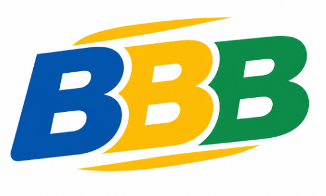 Triple B |  Fiverr |  Freelancer |  Workana | **AIApply** |
| :--- | :--- | :--- | :--- | :--- | :--- | :--- |
| **Perfil** | **Overview** | Marketplace para estudiantes universitarios verificados de Latinoamérica, con un Agente IA supervisado que recomienda ofertas, adapta el CV con información verificada, prepara postulaciones y coordina entrevistas. | Plataforma global donde freelancers ofrecen servicios en paquetes con precio fijo; el cliente contrata directamente según precio, reputación y tiempo de entrega. | Plataforma internacional que conecta clientes con freelancers mediante proyectos abiertos a licitación; el cliente elige entre propuestas según precio, perfil y experiencia. | Plataforma freelance enfocada en Latinoamérica: los clientes publican proyectos y reciben propuestas de freelancers de la región. | Herramienta de búsqueda de empleo con IA que genera CVs y cartas adaptadas a cada oferta y postula automáticamente a vacantes de un agregador de más de 20 millones de ofertas (AIApply, 2026). |
| | **Ventaja competitiva ¿Qué valor ofrece a los clientes?** | Ahorra al estudiante el tiempo de búsqueda y postulación sin perder el control de lo que se envía, y ofrece al empleador una preselección de estudiantes verificados y entrevistas agendadas automáticamente. | Contratación rápida y directa con precios visibles desde el inicio. | Múltiples propuestas personalizadas para un mismo proyecto, que permiten comparar presupuestos y plazos. | Interfaz en español y portugués y afinidad cultural y horaria con la región. | Automatiza de punta a punta la postulación del candidato e incluye práctica de entrevistas con IA. |
| **Perfil de Marketing** | **Mercado objetivo** | Estudiantes universitarios de Lima Metropolitana (segmento inicial) y Latinoamérica; emprendedores y microempresas que buscan talento joven verificado. | Emprendedores, pymes y usuarios individuales de todo el mundo que requieren servicios rápidos y económicos. | Empresas de todos los tamaños y particulares que contratan proyectos mediante propuestas. | Startups, empresas y emprendedores de Latinoamérica que contratan talento regional remoto. | Buscadores de empleo de todos los niveles, desde estudiantes hasta ejecutivos; ofrece 13 idiomas, incluido el español. |
| | **Estrategias de marketing** | • Mensaje centrado en el ahorro de tiempo con control del estudiante. • Alianzas con universidades para la verificación académica. • Casos de éxito de primeras contrataciones. • Landing page con llamados a la acción por segmento. | • Publicidad digital global en Google Ads y redes sociales. • Sistema de niveles de vendedor. • Colaboraciones con creadores de contenido. | • Campañas para proyectos grandes. • Certificaciones internas. • Programa de referidos. • Email marketing. | • Campañas regionales por país. • Historias de éxito locales. • Promoción en LinkedIn y medios especializados. | • Prueba social en su sitio (más de 2 millones de usuarios y "61% consigue una entrevista en sus primeros 10 días", según la empresa). • Páginas comparativas frente a otras herramientas. • Descuentos para estudiantes. |
| **Perfil de productos** | **Productos & Servicios** | • Agente IA supervisado: recomendaciones explicadas, CV adaptado verificable, postulación bajo mandato y agendamiento de entrevistas. • Marketplace de servicios de estudiantes. • Perfiles verificados, portafolio y reseñas. • Pagos en custodia. | • Paquetes de servicios por niveles. • Fiverr Business. • Cursos Fiverr Learn. • Niveles y reputación del vendedor. | • Marketplace de proyectos. • Licitación de proyectos y concursos. • Certificaciones. • Freelancer Enterprise. | • Publicación de proyectos y propuestas. • Reputación por entregas. • Filtros por categoría, país e idioma. | • Auto-Apply. • Constructor de CV y cartas de presentación con IA. • Revisión de compatibilidad con sistemas ATS. • Simulador y asistente de entrevistas. • Traductor de CV. |
| | **Precios & Costos** | • Comisión del **10%** por cada servicio cobrado, que incluye el uso del Agente IA. • Uso gratuito para clientes y empleadores. | • Comisión del **20%** por venta del freelancer. • Tarifa de servicio de 5.5% al cliente (USD 3 en compras menores a USD 100). • Fiverr Pro: USD 129 mensuales. | • Comisión del 10% o USD 5 al freelancer. • Tarifa de 3% o USD 3 al cliente. • Planes de USD 4.49 a 99. | • Comisión escalonada: 20% hasta USD 300, 10% de USD 301 a 3000 y 5% desde USD 3001. • Gratuito para clientes. • Planes de USD 3.92 a 19.92. | • Suscripción Premium mensual o anual. • Créditos de auto-postulación por paquetes (por ejemplo, 100 o 250 postulaciones); comparativas de 2026 reportan USD 99 por 250 postulaciones. |
| | **Canales de distribución (Web y/o Móvil)** | • **Aplicación web** para estudiantes, empleadores y administradores. • **Aplicación móvil** para estudiantes (Android e iOS, Flutter). • Landing page. | • **Plataforma web**. • **App móvil** Android e iOS. | • **Plataforma web**. • **App móvil** Android e iOS. | • **Plataforma web**. • **App móvil** Android e iOS. | • **Aplicación web**. |
| **Análisis SWOT** | **Fortalezas** | • Agente IA que opera dentro de un marketplace con empleadores reales y bajo control del estudiante. • Verificación de la condición de estudiante. • Enfoque en el primer trabajo y en la reputación inicial. | • Posicionamiento global y alto reconocimiento de marca. • Base de usuarios extensa. • Pagos seguros y protección al comprador. | • Gran diversidad de categorías y proyectos empresariales. • Múltiples propuestas por proyecto. • Gran base de usuarios. | • Enfoque en habla hispana y portuguesa. • Contratos y pagos seguros. • Comunidad sólida en Latinoamérica. | • Automatización completa de la postulación. • Amplia base de usuarios declarada. • Soporte multilingüe. |
| | **Debilidades** | • Plataforma nueva sin base de usuarios. • Dependencia de costos y disponibilidad de los modelos de IA. • Desconfianza inicial hacia perfiles estudiantiles. | • Alta competencia para nuevos freelancers. • Comisión elevada. • Servicios masificados. | • Licitación compleja para freelancers nuevos. • Comisiones a ambas partes. • Interfaz menos intuitiva. | • Base de usuarios menor que la de Fiverr o Freelancer. • Remuneraciones bajas. • Difícil ingreso para nuevos usuarios. | • Postula en portales de terceros sin relación con el empleador. • No verifica la condición de estudiante. • No gestiona la contratación ni los pagos. |
| | **Oportunidades** | • Alta adopción de herramientas de IA por los jóvenes. • Ninguno de los competidores analizados combina verificación académica, agente de postulación supervisado y pagos en custodia para el mercado universitario peruano. • Crecimiento del trabajo en plataformas en países en desarrollo. | • Nuevos nichos (IA y automatización). • Herramientas educativas. • Alianzas con grandes empresas. | • Emparejamiento con IA. • Mercados localizados. • Soluciones corporativas. | • Expansión a nuevos países. • Programas de mentoría para jóvenes. • Planes para instituciones. | • Crecimiento de la búsqueda de empleo asistida por IA. • Alianzas con portales de empleo. |
| | **Amenazas** | • Upwork ya ofrece un agente de IA que redacta propuestas y entrevista (Upwork Inc., 2025). • Herramientas como AIApply o LazyApply ya adaptan CVs y postulan masivamente. • Desconfianza de empleadores hacia postulaciones generadas con IA. | • Saturación del mercado. • Regulación tributaria del trabajo freelance. • Plataformas con comisiones más bajas. | • Complejidad del sistema de propuestas. • Experiencias negativas con proyectos. • Plataformas de nicho más ágiles. | • Presión de plataformas globales. • Mercado estandarizado. • Fuga de talento. | • Portales que restrinjan la automatización de postulaciones. • Empleadores que descarten postulaciones masivas. |

### 2.1.2. Estrategias y tácticas frente a competidores

Triple B adopta una estrategia de **diferenciación centrada en el talento universitario verificado y en la IA supervisada**. La tabla relaciona cada debilidad o amenaza identificada con la estrategia y la táctica preliminar.

| Competidor | Debilidad o amenaza identificada | Estrategia | Tácticas |
| --- | --- | --- | --- |
| Fiverr, Freelancer | Los freelancers nuevos no logran destacar frente a perfiles con historial y comisiones de hasta 20%. | Posicionar a Triple B como el lugar del primer trabajo. | Verificación académica, insignias por primeros proyectos, comisión de 10% y reseñas visibles desde el primer encargo. |
| Workana | Afinidad regional similar a la de Triple B. | Diferenciarse por el segmento universitario y el agente. | Alianzas con universidades de Lima y comunicación centrada en el ahorro de tiempo del estudiante. |
| AIApply y herramientas de auto-postulación | Postulan masivamente sin relación con el empleador ni control de la veracidad del CV. | Ofrecer un agente dentro del marketplace, confiable para ambas partes. | CV adaptado solo con hechos verificados, etiqueta visible de postulación asistida por IA y límite diario de postulaciones. |
| Upwork (agente Uma) | Los marketplaces globales ya incorporan agentes de IA. | Competir por foco y confianza, no por escala. | Preselección explicada y sin atributos personales, modo Asistido por defecto y agendamiento con calendarios. |
| Todos | Pagos informales (Yape, transferencias) y desconfianza del cliente. | Formalizar el acuerdo dentro de la plataforma. | Pagos en custodia liberados al aceptar la entrega y acuerdos registrados. |

## 2.2. Entrevistas

### 2.2.1. Diseño de entrevistas

El objetivo de las entrevistas es identificar motivaciones, dificultades, comportamientos de búsqueda de trabajo o de contratación y las características necesarias para construir los arquetipos de cada segmento. Se realizan por videollamada, con una duración de 15 a 30 minutos y previo consentimiento para grabar. Las preguntas se formulan sobre experiencias pasadas y comportamientos concretos, sin sugerir la solución, para evitar respuestas complacientes.

Las preguntas marcadas con **†** se incorporaron en la versión TB1 de la guía y se aplican en las entrevistas complementarias. Las entrevistas registradas antes de esa versión no las incluyeron; por ello, sus hallazgos sobre el Agente IA se tratan como hipótesis (ver 2.2.3).

**Segmento objetivo 1: Estudiantes universitarios freelancers**

*Preguntas de perfil (arquetipo)*

* ¿Cuál es tu nombre completo, tu edad y tu distrito de residencia?
* ¿Qué carrera estudias, en qué universidad y en qué ciclo? †
* ¿Con quién vives y cómo financias tus estudios? †
* ¿Qué dispositivos, navegador y aplicaciones usas a diario? ¿En qué redes sociales pasas más tiempo? †
* ¿Qué marcas, creadores de contenido o referentes sigues en tu área? †
* ¿Cómo te describirías como persona y como trabajador? †

*Preguntas principales*

* ¿Has ofrecido tus servicios como freelancer? ¿En qué área?
* ¿Qué te motivó a ofrecer tus servicios de manera independiente?
* ¿Dónde sueles buscar oportunidades freelance (redes, plataformas, conocidos)?
* ¿Qué dificultades has encontrado al intentar conseguir clientes como estudiante?
* ¿Qué métodos usas para cobrar tus servicios? ¿Has tenido problemas con eso?
* ¿Cuánto tiempo a la semana podrías dedicarle a trabajos freelance?
* ¿Qué características debería tener una plataforma ideal para ayudarte a encontrar clientes?

*Preguntas complementarias sobre búsqueda y postulación*

* Cuéntame la última vez que postulaste a un trabajo o práctica: ¿cuánto tiempo te tomó encontrarlo y postular? †
* ¿Adaptas tu CV o portafolio para cada oportunidad? ¿Cómo lo haces y cuánto demora? †
* ¿Has usado alguna herramienta de IA para buscar trabajo o redactar tu CV? ¿Qué te funcionó y qué no? †
* Si una herramienta preparara postulaciones por ti, ¿qué tendrías que revisar antes de que se envíen y qué nunca permitirías que hiciera? †

**Segmento objetivo 2: Empleadores, microempresas y emprendedores**

*Preguntas de perfil (arquetipo)*

* ¿Cuál es tu nombre completo, tu edad y tu distrito de residencia?
* ¿Cuál es tu negocio o cargo, cuántas personas trabajan contigo y cuánto tiempo lleva operando? †
* ¿Qué dispositivos y canales digitales usas para gestionar tu negocio? †

*Preguntas principales*

* ¿Alguna vez has contratado a un freelancer? ¿Cómo fue tu experiencia?
* ¿Qué tipo de tareas sueles tercerizar o te gustaría tercerizar?
* ¿Qué canales usas para encontrar freelancers (plataformas, conocidos, redes)?
* ¿Qué te haría confiar en un estudiante universitario como freelancer?
* ¿Qué tan importante es para ti ver recomendaciones o validaciones de otros clientes?
* ¿Prefieres que una plataforma gestione los pagos y acuerdos o hacerlo directamente con la persona?
* ¿Qué haría que descartes a un freelancer incluso si su precio es atractivo?
* ¿Qué factores tomas en cuenta al elegir a un freelancer y cuál pesa más?
* ¿Qué tan importante es negociar el precio antes de contratar?

*Preguntas complementarias sobre selección y coordinación*

* La última vez que buscaste a alguien, ¿cuántos perfiles revisaste y cuánto tiempo te tomó? †
* ¿Cómo coordinaste la reunión o entrevista con la persona y cuánto demoró? †
* ¿Cómo reaccionarías si supieras que una postulación fue preparada con ayuda de IA? ¿Qué información necesitarías para confiar en ella? †

### 2.2.2. Registro de entrevistas

Las entrevistas de Bruno, Werner, Mario, Yulia y Fabrizio se realizaron en el ciclo 2026-1 para el proyecto base del equipo anterior, en el mismo dominio (plataforma freelance para universitarios), y se reutilizan como evidencia con sus datos originales. La entrevista de Gabriela Diaz se incorporó en TB1.

> ⚠️ **PENDIENTE (equipo):** (1) realizar al menos una entrevista adicional del Segmento 2, con la guía TB1, para cumplir el mínimo de tres por segmento; (2) subir a Microsoft Stream el video consolidado de needfinding (`upc-pre-202620-1asi0728-9075-nodob-needfinding-sprint-1`) y reemplazar los enlaces faltantes; (3) completar en cada resumen los datos de dispositivos, redes, marcas e influencias y personalidad a partir de las grabaciones; (4) confirmar en el video el instante de inicio y la duración de las entrevistas de Bruno, Werner y Fabrizio.

**Segmento objetivo #1: Estudiantes universitarios freelancers**

**Entrevistado N°1: Bruno Sebastián Gamarra Torres**

* Sexo: Masculino · Edad: 23 · Distrito: Santiago de Surco
* Video: ⚠️ PENDIENTE (enlace de Microsoft Stream) · Instante de inicio: 0:03 · Duración: 3:44

**Resumen:** Bruno ofrece servicios de diseño gráfico y edición de video desde hace algunos meses, motivado por la necesidad económica y por ganar experiencia. Consigue clientes sobre todo por Instagram y TikTok, pero lidia con la desconfianza hacia los estudiantes. Cobra por Yape, Plin y transferencias, y a veces sufre retrasos en los pagos. Considera que una plataforma ideal debería permitir reseñas reales, chat integrado y contratos.

**Entrevistado N°2: Werner Lang**

* Sexo: Masculino · Edad: 20 · Distrito: San Isidro
* Video: ⚠️ PENDIENTE (enlace de Microsoft Stream) · Instante de inicio: 3:45 · Duración: 9:57

**Resumen:** Werner trabaja en diseño gráfico y desarrollo web como freelancer para aplicar lo aprendido y ganar experiencia antes de egresar. Consigue clientes por conocidos, redes sociales y Workana, pero siente que no lo toman en serio por ser estudiante; además, carece de un portafolio sólido. Cobra por Yape o transferencia, con demoras ocasionales. Dedica de 8 a 12 horas semanales. Considera que una plataforma ideal debe facilitar mostrar habilidades, cotizar, asegurar pagos y permitir comunicación fluida, además de sugerirle proyectos alineados a su perfil.

**Entrevistado N°3: Mario André Cacho Seminario**

* Sexo: Masculino · Edad: 21 · Distrito: Santiago de Surco
* Video: [YouTube](https://youtu.be/hSg2bZ3Jgbc) · Instante de inicio: 0:10 · Duración: 3:26

**Resumen:** Mario crea videos de marketing para pequeñas empresas. Le motiva ampliar su perspectiva profesional, pero le resulta difícil conseguir clientes porque priorizan la experiencia. Consigue oportunidades por redes sociales y contactos cercanos, y cobra por transferencia bancaria. Dedica de 6 a 8 horas semanales. Valora que una plataforma muestre perfiles de todos los niveles, sugiera proyectos por habilidades, exhiba un historial de trabajos y cuente con un sistema de cobros seguro.

**Entrevistada N°4: Gabriela Diaz**

* Sexo: Femenino · Edad: 27 · Distrito: Santiago de Surco
* Video: [Microsoft Stream (SharePoint UPC)](https://upcedupe-my.sharepoint.com/:v:/g/personal/u202118152_upc_edu_pe/IQCYZtcqd5fXSLvFSwvj0aurAVTUJ0an7Q1sDr3I0NYXtVo?nav=eyJyZWZlcnJhbEluZm8iOnsicmVmZXJyYWxBcHAiOiJPbmVEcml2ZUZvckJ1c2luZXNzIiwicmVmZXJyYWxBcHBQbGF0Zm9ybSI6IldlYiIsInJlZmVycmFsTW9kZSI6InZpZXciLCJyZWZlcnJhbFZpZXciOiJNeUZpbGVzTGlua0NvcHkifX0&e=XxdZm7) · Instante de inicio: 0:00 · Duración: 4:01

**Resumen:** Gabriela hace diseño gráfico y community management desde hace aproximadamente un año; empezó creando piezas para el negocio de su tía. Busca oportunidades principalmente por recomendación de conocidos y, a veces, en grupos de Facebook o en Workana. Le cuesta que confíen en ella por ser estudiante y por no tener muchos trabajos anteriores que mostrar.

**Segmento objetivo #2: Empleadores, microempresas y emprendedores**

**Entrevistada N°1: Yulia Estephania Martinez Martinez**

* Sexo: Femenino · Edad: 19 · Distrito: Santiago de Surco
* Video: [YouTube](https://youtu.be/MFs44DHr8_Q) · Instante de inicio: 0:01 · Duración: 5:46

**Resumen:** Yulia tiene un emprendimiento de cuadros personalizados (*Quack_cuadros*). Aún no ha contratado freelancers, pero está interesada en tercerizar marketing digital (reels) y diseño web. Busca talento por Instagram y contactos, lo cual considera poco confiable.

* **Criterios para confiar:** portafolio visual para trabajos creativos; CV para otros; valora recomendaciones y validaciones.
* **Pagos:** prefiere que la plataforma gestione pagos y acuerdos.
* **Motivos de descarte:** mala calidad, falta de responsabilidad y poca puntualidad.
* **Funciones deseadas:** perfiles detallados, herramientas de negociación, reuniones dentro de la plataforma, chats y acuerdos formales.
* **Factores de decisión:** el portafolio es lo más determinante, seguido del precio; un trabajo que impacte positivamente la vuelve flexible en el pago.

**Entrevistado N°2: Fabrizio Morales**

* Sexo: Masculino · Edad: 22 · Distrito: La Molina
* Video: [Microsoft Stream (SharePoint UPC)](https://upcedupe-my.sharepoint.com/:v:/g/personal/u202213241_upc_edu_pe/ERWRYYotMDNKrb9UZXiaV90BczcuHnygJ1UOZNQE1nmmxQ?nav=eyJyZWZlcnJhbEluZm8iOnsicmVmZXJyYWxBcHAiOiJPbmVEcml2ZUZvckJ1c2luZXNzIiwicmVmZXJyYWxBcHBQbGF0Zm9ybSI6IldlYiIsInJlZmVycmFsTW9kZSI6InZpZXciLCJyZWZlcnJhbFZpZXciOiJNeUZpbGVzTGlua0NvcHkifX0&e=v3wSIJ) · Instante de inicio: 25:32 · Duración: 31:17

**Resumen:** Fabrizio dirige un negocio de venta de vapes y contrata freelancers para marketing y ventas, principalmente por Facebook y LinkedIn, apoyándose también en recomendaciones cercanas.

* **Criterios para confiar:** portafolio visual o ejemplos previos para trabajos creativos; CV para otros; testimonios de antiguos clientes.
* **Pagos:** prefiere que la plataforma gestione acuerdos y pagos para evitar negociaciones directas.
* **Motivos de descarte:** trabajo deficiente, falta de responsabilidad y retrasos en las entregas.
* **Funciones deseadas:** perfiles completos, herramientas de negociación, reuniones dentro de la plataforma y chats formales con acuerdos visibles.
* **Factores de decisión:** el portafolio visual es lo más determinante; si un resultado impacta positivamente, acepta pagar más de lo previsto.

**Entrevistado N°3: ⚠️ PENDIENTE**

* Registrar nombres y apellidos, sexo, edad, distrito, captura, enlace de Microsoft Stream con instante de inicio y duración, y resumen, siguiendo la guía TB1.

### 2.2.3. Análisis de entrevistas

Los porcentajes se calculan sobre las entrevistas registradas: cuatro del Segmento 1 y dos del Segmento 2. Con dos entrevistas, los porcentajes del Segmento 2 son indicativos hasta completar el mínimo de tres.

**Segmento 1 — Estudiantes universitarios freelancers (n = 4: Bruno, Werner, Mario y Gabriela)**

| Variable | Resultado | Entrevistas que lo sustentan |
| --- | --- | --- |
| Edad y sexo | 20 a 27 años (promedio 22.8); 75% hombres | Todas |
| Distrito | Santiago de Surco 75%; San Isidro 25% | Todas |
| Servicios que ofrecen | Diseño gráfico 75%; edición o producción de video 50%; desarrollo web 25%; community management 25% | Bruno, Werner, Gabriela; Bruno, Mario; Werner; Gabriela |
| Canales para conseguir clientes | Redes sociales 100%; conocidos o recomendaciones 75%; Workana 50% | Todas; Werner, Mario, Gabriela; Werner, Gabriela |
| Principal barrera | Desconfianza del cliente por ser estudiante o por falta de experiencia: 100% | Todas |
| Medios de cobro | Transferencias o billeteras digitales (Yape, Plin): 75%; retrasos en pagos: 50% | Bruno, Werner, Mario; Bruno, Werner |
| Disponibilidad semanal | De 6 a 12 horas (dato reportado por el 50%) | Werner, Mario |
| Funcionalidades deseadas | Sugerencia de proyectos por perfil o habilidades 50%; pagos seguros 50%; reseñas o historial de trabajos 50%; comunicación o chat 50%; mostrar habilidades 25%; contratos 25%; cotización 25% | Werner, Mario; Werner, Mario; Bruno, Mario; Bruno, Werner; Werner; Bruno; Werner |

**Hallazgos.** La motivación común es generar ingresos y ganar experiencia antes de egresar, y la barrera universal (100%) es la desconfianza del cliente hacia un estudiante sin historial. Esto evidencia la necesidad de **mecanismos de validación**: verificación de la condición de estudiante, reseñas y contratos dentro de la plataforma. La mitad de los entrevistados pidió que la plataforma les **sugiera proyectos alineados a su perfil o habilidades**, y quienes informaron su disponibilidad dedican solo de 6 a 12 horas semanales: esto sustenta las recomendaciones automáticas (US51). Los retrasos en pagos (50%) refuerzan la necesidad de **pagos seguros**.

**Segmento 2 — Empleadores y emprendedores (n = 2: Yulia y Fabrizio)**

| Variable | Resultado | Entrevistas que lo sustentan |
| --- | --- | --- |
| Edad, sexo y distrito | 19 y 22 años; 50% mujeres; Santiago de Surco y La Molina | Todas |
| Tipo de negocio | Emprendimientos que venden productos por redes sociales: 100% | Todas |
| Experiencia contratando freelancers | Ya contrató: 50% | Fabrizio |
| Servicios que necesita | Marketing digital 100%; diseño web 50% | Todas; Yulia |
| Canales de búsqueda | Redes sociales (Instagram, Facebook, LinkedIn) 100%; recomendaciones o contactos 100% | Todas |
| Criterios de confianza | Portafolio visual 100%; CV para trabajos no creativos 100%; recomendaciones o testimonios 100% | Todas |
| Gestión de pagos y acuerdos | Prefiere que la plataforma los gestione: 100% | Todas |
| Motivos de descarte | Mala calidad, falta de responsabilidad e impuntualidad: 100% | Todas |
| Funcionalidades deseadas | Perfiles detallados, negociación, reuniones dentro de la plataforma, chat y acuerdos formales: 100% | Todas |
| Factor de decisión | El portafolio pesa más que el precio; pagarían más por un resultado de impacto: 100% | Todas |

**Hallazgos.** Los empleadores priorizan **calidad y responsabilidad** por encima del precio y confían en el **portafolio visual** y los testimonios. Ambos prefieren que la plataforma gestione acuerdos y pagos y piden **reuniones dentro de la plataforma**, lo que sustenta la coordinación de entrevistas (US55) y los pagos en custodia.

**Trazabilidad hacia el Agente IA.** Las entrevistas sustentan directamente las recomendaciones por perfil (Segmento 1) y la coordinación de reuniones y la gestión de acuerdos (Segmento 2). En cambio, **ningún entrevistado fue consultado sobre la postulación autónoma ni sobre la adaptación del CV con IA**: estas capacidades son hipótesis (H1 a H4 del Lean UX Process) y se validarán con las preguntas † de la guía TB1 y en las entrevistas de validación. Por esta razón, el diseño adopta el modo Asistido como predeterminado.

**Conclusión transversal.** Ambos segmentos necesitan una plataforma con perfiles verificados y portafolios, emparejamiento por habilidades, acuerdos y pagos gestionados por la plataforma, reseñas y reputación, y comunicación y reuniones dentro del entorno. Estos hallazgos alimentan los User Personas, la User Task Matrix, los Empathy Maps y los Scenario Maps.

## 2.3. Needfinding

En esta sección se presentan los artefactos derivados del análisis de la información recolectada, que sintetizan motivaciones, problemas y necesidades de cada segmento.

**Segmento objetivo #1: Estudiantes universitarios freelancers**

* **Motivaciones:** generar ingresos, aplicar lo aprendido y ganar experiencia real antes de egresar; ampliar su perspectiva profesional.
* **Problemas identificados:** desconfianza de los clientes por su condición de estudiante; poca visibilidad en redes y plataformas; retrasos y falta de seguridad en los pagos; tiempo limitado por la carga académica.
* **Necesidades:** mostrar habilidades y portafolio aun con poca experiencia; recibir sugerencias de proyectos alineados a su perfil; cobrar de forma segura; contar con historial y reseñas. **(H)** Delegar la búsqueda y la preparación de postulaciones conservando el control.

**Segmento objetivo #2: Empleadores, microempresas y emprendedores**

* **Motivaciones:** tercerizar tareas específicas (diseño, marketing, desarrollo web) sin contratar personal fijo.
* **Problemas identificados:** desconfianza hacia perfiles sin referencias; temor a la mala calidad o al incumplimiento; negociación y pagos informales.
* **Necesidades:** perfiles detallados con muestras de trabajo; reseñas verificadas; gestión de acuerdos y pagos dentro de la plataforma; reuniones y chat en la plataforma. **(H)** Recibir una preselección de candidatos compatibles.

### 2.3.1. User Personas

Cada User Persona se construye con las variables del análisis de entrevistas (2.2.3) y con la brecha frente a la competencia (2.1): *Julio Bernal* representa al estudiante freelancer y *Luisa Fuentes* a la emprendedora. En cada ficha se indica la fuente de cada característica. Las fichas se elaboran en UXPressia.

**User Persona: Julio Bernal — Estudiante universitario freelancer**

| Atributo | Descripción | Fuente |
| --- | --- | --- |
| Datos demográficos | 21 años, hombre, vive en Santiago de Surco, estudiante universitario de una carrera creativa o tecnológica | Edad 20–27, 75% hombres, 75% en Surco |
| Actividad | Ofrece diseño gráfico y edición de video; empieza a construir su portafolio | 75% diseño gráfico, 50% video |
| Disponibilidad | De 6 a 12 horas semanales para trabajos freelance | Werner, Mario |
| Canales | Instagram, TikTok, grupos de Facebook, Workana y recomendaciones | 100% redes sociales, 50% Workana |
| Cobro | Yape, Plin o transferencia; ha sufrido retrasos | 75% billeteras o transferencias, 50% retrasos |
| Objetivos | Obtener experiencia laboral mientras estudia y construir una cartera de clientes | Motivación común |
| Frustraciones | "No me toman en serio por ser estudiante"; poca visibilidad; pagos que llegan tarde | 100% desconfianza |
| Necesidades | Que le sugieran proyectos alineados a su perfil; pagos seguros; reseñas visibles | 50% sugerencia de proyectos |
| Hipótesis por validar (H) | Delegaría la búsqueda y la preparación de postulaciones al Agente IA si conserva el control | H1–H3 |
| Dispositivos, marcas y personalidad | ⚠️ PENDIENTE: completar a partir de las grabaciones | — |
| Cita | "Me gustaría encontrar oportunidades para generar dinero con los conocimientos que sé y así poder generar una red de contactos para entrar al mundo laboral." | Ficha UXPressia |

> ⚠️ **PENDIENTE (equipo):** en UXPressia, corregir el texto de *Fondo* ("Julia es una estudiante" → "Julio es un estudiante"), completar los datos de la ficha anterior y volver a exportar la imagen.

**User Persona: Luisa Fuentes — Emprendedora**

| Atributo | Descripción | Fuente |
| --- | --- | --- |
| Datos demográficos | 22 años, mujer, vive en Santiago de Surco, dueña de un emprendimiento que vende productos personalizados por redes sociales | 19 y 22 años; Surco y La Molina; 100% emprendimientos de productos |
| Necesidades de servicios | Marketing digital (reels) y diseño web | 100% marketing, 50% diseño web |
| Canales de búsqueda | Instagram, Facebook, LinkedIn y recomendaciones de conocidos | 100% |
| Criterios de confianza | Portafolio visual, testimonios de clientes y CV para trabajos no creativos | 100% |
| Motivos de descarte | Mala calidad, falta de responsabilidad e impuntualidad | 100% |
| Preferencias | Que la plataforma gestione acuerdos y pagos; reuniones y chat dentro de la plataforma | 100% |
| Objetivos | Acceder a talento para tareas específicas de forma rápida y recibir el trabajo en el plazo acordado | Ficha UXPressia |
| Frustraciones | No encontrar freelancers confiables; falta de validación de otros clientes | Empathy Map |
| Hipótesis por validar (H) | Valoraría recibir una preselección de candidatos y agendar entrevistas sin intercambiar mensajes | H4–H5 |
| Dispositivos, marcas y personalidad | ⚠️ PENDIENTE: completar a partir de las grabaciones | — |
| Cita | "Me interesa que me muestres lo que ya has hecho." | Empathy Map |

> ⚠️ **PENDIENTE (equipo):** rehacer en UXPressia la ficha de Luisa Fuentes con los datos de la tabla anterior. La versión anterior (40 años, área de GDH) no correspondía a las entrevistadas, por lo que se retiró su imagen del informe.

### 2.3.2. User Task Matrix

La User Task Matrix considera a los dos User Personas identificados: **Julio Bernal** (estudiante freelancer) y **Luisa Fuentes** (emprendedora). Las filas son tareas que cada segmento realiza hoy para cumplir sus objetivos, independientemente de que exista Triple B; para cada User Persona se indica la frecuencia y la importancia de la tarea según lo observado en las entrevistas.

| Tarea (task) | Julio Bernal — Frecuencia | Julio Bernal — Importancia | Luisa Fuentes — Frecuencia | Luisa Fuentes — Importancia |
| --- | :---: | :---: | :---: | :---: |
| Buscar oportunidades de trabajo o clientes | Often | High | — | — |
| Buscar freelancers o talento para una tarea | — | — | Sometimes | High |
| Preparar o adaptar el CV y el portafolio para una oportunidad | Sometimes | High | — | — |
| Postular o enviar una propuesta | Often | High | — | — |
| Revisar perfiles, portafolios y referencias de candidatos | — | — | Sometimes | High |
| Coordinar reuniones o entrevistas | Sometimes | Medium | Sometimes | Medium |
| Negociar el precio y las condiciones del trabajo | Sometimes | High | Always | High |
| Cobrar o pagar el trabajo | Always | High | Always | High |
| Entregar o revisar el trabajo realizado | Always | High | Always | High |
| Pedir o dar recomendaciones y reseñas | Sometimes | Medium | Sometimes | Medium |

**Análisis.** Para Julio, las tareas más frecuentes e importantes son buscar oportunidades y postular (Often / High), que hoy realiza manualmente en redes sociales y compiten con su tiempo de estudio; son las tareas que el Agente IA busca reducir. Para Luisa, las tareas críticas son negociar (Always / High) y revisar perfiles y portafolios (High), porque de ellas depende la calidad del resultado. Ambos coinciden en la importancia de cobrar o pagar y de entregar o revisar el trabajo, lo que justifica los pagos en custodia y los acuerdos dentro de la plataforma. La coordinación de reuniones tiene importancia media para ambos, pero es la tarea que más retrasa el inicio del trabajo.

### 2.3.3. Empathy Mapping

Los Empathy Maps se elaboraron en UXPressia colocando a cada User Persona al centro y registrando las observaciones del equipo, basadas en las entrevistas, en las secciones de la herramienta: con quién empatizamos, qué necesita hacer, qué ve, qué dice, qué hace, qué escucha y qué piensa y siente. Finalmente se identificaron los *pains* (qué le preocupa) y los *gains* (qué puede ayudar a resolver sus problemas y convencerlo de usar Triple B).

Empathy Map de Julio Bernal (estudiante freelancer): destaca la frustración por no ser tomado en serio, la inseguridad al negociar y el deseo de un lugar donde mostrar su trabajo.

Empathy Map de Luisa Fuentes (emprendedora): destaca la incertidumbre sobre la calidad y el cumplimiento, la falta de herramientas para acordar y pagar, y la valoración del portafolio.

> ⚠️ **PENDIENTE (equipo):** actualizar en UXPressia la fotografía del Empathy Map de Luisa Fuentes para que coincida con la nueva ficha y volver a exportar.

### 2.3.4. As-Is Scenario Mapping

Los As-Is Scenario Maps se elaboraron en Miro. El proceso incluyó: (1) preparación, revisando los resúmenes de entrevistas y los User Personas; (2) lluvia de ideas individual con notas sobre lo que cada persona hace, piensa y siente; (3) revisión conjunta e identificación de las fases como columnas; (4) nombre de las fases; y (5) identificación de áreas positivas, negativas y *blank areas* (aspectos que requieren más investigación).

As-Is de Julio Bernal (búsqueda de clientes, negociación informal y cobro por Yape o transferencias):

As-Is de Luisa Fuentes (búsqueda de freelancers en redes, contratación sin acuerdos formales y coordinación manual de pagos):

**Áreas identificadas.** (+) positiva, (−) negativa, (?) blank area.

| User Persona | Fase | Área | Observación |
| --- | --- | :---: | --- |
| Julio | Búsqueda de oportunidad | − | Busca en grupos de WhatsApp o Facebook y se frustra por la falta de opciones claras. |
| Julio | Completar perfil de freelancer | − | Envía su CV por mensajes sin saber si será considerado. |
| Julio | Recibir una oferta | − | Espera respuesta durante días, impaciente e inseguro. |
| Julio | Llegar a un acuerdo con el pago | − | Negocia sin garantías y teme ser estafado. |
| Julio | Enviar el proyecto final | + / ? | Siente alivio al entregar, pero persiste la incertidumbre sobre el pago. **(?)** Cuánto tiempo dedica a buscar y postular cada semana. |
| Luisa | Búsqueda de freelancer | − | Publica "¿alguien recomienda un freelancer?" en redes; se siente perdida. |
| Luisa | Buscar perfil de freelancer | − | Recibe recomendaciones variadas y sin filtro. |
| Luisa | Mandar una oferta | − | Escribe por inbox o WhatsApp sin formalidad ni protección. |
| Luisa | Llegar a un acuerdo con el pago | − | Teme pagar y no recibir nada. |
| Luisa | Recibir el proyecto final | + / ? | Alivio si cumple, pero sin control de calidad. **(?)** Cuántos perfiles revisa y cuánto demora en agendar una reunión. |

## 2.4. Ubiquitous Language

El glosario contiene los términos del dominio de negocio de Triple B, sin términos técnicos de ingeniería de software. Los términos están en inglés, con su equivalente en español entre paréntesis, y se usan de forma consistente en el EventStorming, los Bounded Context Canvases y los diagramas de arquitectura.

| Término (equivalente en español) | Definición |
| --- | --- |
| **Student Freelancer** (Estudiante freelancer) | Estudiante universitario matriculado que ofrece servicios o postula a oportunidades en Triple B. |
| **Verified Student** (Estudiante verificado) | Estudiante cuya condición fue validada con un correo institucional o una constancia de matrícula aprobada por un administrador. |
| **Employer** (Empleador) | Persona, emprendimiento o empresa que publica ofertas o contrata servicios. |
| **Verified Employer** (Empleador verificado) | Empleador cuya identidad o RUC fue validado; solo él puede publicar ofertas. |
| **Visitor** (Visitante) | Persona que navega la landing page sin haberse registrado. |
| **Student Profile** (Perfil del estudiante) | Información profesional pública del estudiante: carrera, universidad, habilidades, descripción y reputación. |
| **Master CV** (CV maestro) | Versión completa del CV del estudiante, con hechos verificados, que sirve de única fuente para los CV adaptados. |
| **Tailored CV** (CV adaptado) | Versión del CV maestro que reordena y resalta la información pertinente para una oferta, sin agregar hechos nuevos. |
| **Portfolio Item** (Evidencia de portafolio) | Muestra de un trabajo previo (imagen, archivo o enlace) asociada al perfil. |
| **Skill** (Habilidad) | Capacidad declarada o evidenciada por el estudiante, tomada de una taxonomía común de habilidades. |
| **Gig** (Servicio) | Servicio publicado por un estudiante con descripción, tarifa y plazo de entrega. |
| **Job Offer** (Oferta) | Requerimiento de trabajo o puesto de practicante publicado por un empleador. |
| **Internship Position** (Puesto de practicante) | Tipo de oferta que corresponde a prácticas preprofesionales o profesionales. |
| **Opportunity** (Oportunidad) | Oferta evaluada por el Agente IA para un estudiante específico. |
| **Agent Mandate** (Mandato del agente) | Autorización explícita y revocable que el estudiante otorga al Agente IA, con nivel de autonomía, umbral, límite diario y categorías. |
| **Autonomy Level** (Nivel de autonomía) | Grado de acción permitido al agente: *Assisted* (Asistido: requiere aprobación) o *Autonomous* (Autónomo: envía dentro de los límites del mandato). |
| **Match Score** (Puntaje de compatibilidad) | Valor de 0 a 100 que estima la compatibilidad entre un estudiante y una oferta. |
| **Match Reason** (Razón del match) | Explicación de las habilidades, experiencias o condiciones que sustentan el puntaje. |
| **Match Threshold** (Umbral de compatibilidad) | Puntaje mínimo definido por el estudiante para recibir una recomendación. |
| **Daily Application Limit** (Límite diario de postulaciones) | Máximo de postulaciones que el agente puede enviar por día en modo Autónomo. |
| **Application Draft** (Borrador de postulación) | Postulación preparada por el agente, pendiente de aprobación o de envío. |
| **Application** (Postulación) | Candidatura registrada para una oferta; sus estados son Submitted, Shortlisted, Rejected, Interviewing, Hired y Withdrawn. |
| **AI-Assisted Application** (Postulación asistida por IA) | Postulación preparada por el agente y marcada como tal ante el empleador. |
| **Shortlist** (Preselección) | Lista ordenada de los candidatos más compatibles con una oferta, con sus razones. |
| **Interview** (Entrevista) | Reunión acordada entre un empleador y un candidato para una postulación. |
| **Interview Slot** (Franja de entrevista) | Intervalo de tiempo disponible para ambas partes que se propone para una entrevista. |
| **Hire Request** (Solicitud de contratación) | Pedido de un cliente para contratar un servicio publicado. |
| **Engagement** (Encargo) | Relación de trabajo acordada entre las partes, desde el inicio hasta la entrega y el pago. |
| **Delivery** (Entrega) | Resultado del trabajo presentado por el estudiante para la aceptación del cliente. |
| **Escrow** (Custodia) | Retención del pago del cliente hasta que acepta la entrega. |
| **Payment Release** (Liberación del pago) | Transferencia al estudiante del pago en custodia, descontada la comisión. |
| **Commission** (Comisión) | Porcentaje (10%) que Triple B retiene de cada servicio cobrado. |
| **Price Suggestion** (Sugerencia de precio) | Tarifa recomendada según categoría, complejidad y tiempo estimado. |
| **Review** (Reseña) | Calificación de 1 a 5 y comentario que una parte registra sobre la otra al completar un encargo. |
| **Reputation** (Reputación) | Indicador agregado de las reseñas y encargos completados de un usuario. |
| **Badge** (Insignia) | Reconocimiento visible otorgado por hitos, como el primer encargo completado. |
| **Conversation** (Conversación) | Intercambio de mensajes entre dos usuarios. |
| **Notification** (Notificación) | Aviso al usuario sobre un evento relevante, como una nueva recomendación o una entrevista agendada. |
| **User Report** (Reporte) | Denuncia de un comportamiento indebido para revisión de moderación. |
| **Support Ticket** (Ticket de soporte) | Solicitud de ayuda registrada por un usuario. |

# Capítulo III: Requirements Specification

En este capítulo se especifican los requisitos de los productos digitales de Triple B a partir del análisis del Capítulo II. Primero se describe la experiencia futura de cada User Persona (To-Be Scenario Mapping); luego se formalizan los requisitos como Epics, User Stories, Technical Stories y Spikes con criterios de aceptación; después se relacionan con los objetivos de negocio mediante Impact Mapping; y finalmente se priorizan y estiman en el Product Backlog.

## 3.1. To-Be Scenario Mapping

Los To-Be Scenario Maps parten de los As-Is Scenario Maps (2.3.4) y de las hipótesis del Lean UX Process. El proceso incluyó: (1) preparación, revisando las áreas negativas y *blank areas* del As-Is; (2) lluvia de ideas individual sobre cómo cambiaría cada fase con Triple B y el Agente IA; (3) revisión conjunta y definición de las fases; (4) nombre de las fases; y (5) comparación con el As-Is para identificar los cambios que ofrece la solución. Los mapas se modelan como código en `diagrams/cap3.py` para mantenerlos sincronizados con el backlog; el marcador **IA** indica los pasos en los que interviene el Agente IA.

To-Be Scenario Map de Julio Bernal (estudiante universitario freelancer):

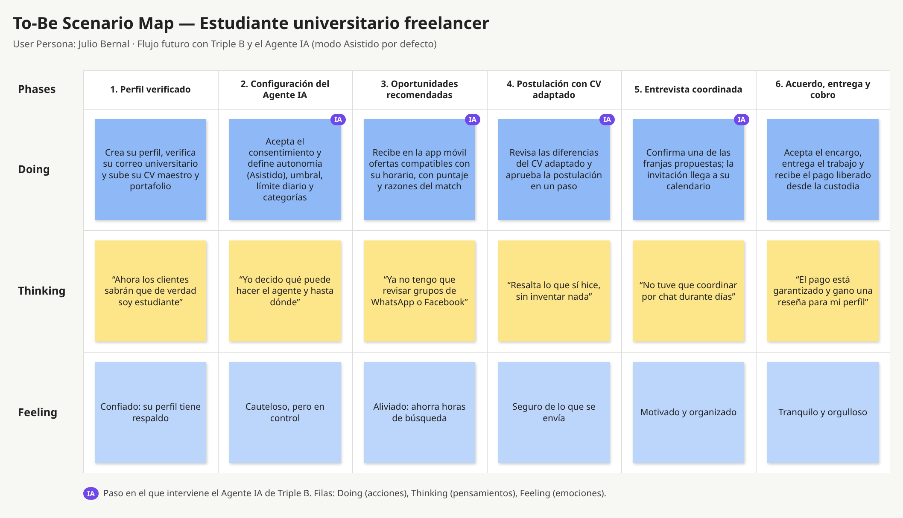

To-Be Scenario Map de Luisa Fuentes (emprendedora):

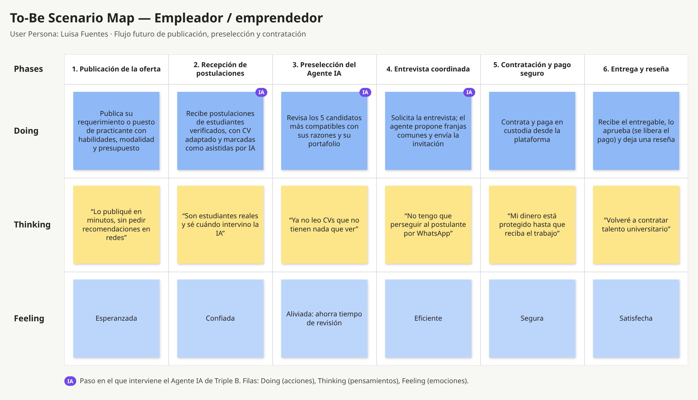

**Comparación As-Is frente a To-Be**

| User Persona | As-Is (situación actual) | To-Be (con Triple B) | Cambio principal |
| --- | --- | --- | --- |
| Julio | Busca oportunidades en grupos de WhatsApp o Facebook y se frustra. | Recibe ofertas compatibles con su horario, con puntaje y razones del match. | Elimina la búsqueda manual (US51, US61). |
| Julio | Envía su CV por mensajes sin saber si será considerado. | Aprueba en un paso una postulación con CV adaptado solo con hechos verificados. | Postulación de calidad sin redactarla (US52, US60). |
| Julio | Espera días sin saber si lo leyeron. | Sigue el estado de cada postulación en el panel del agente. | Transparencia del proceso (US56). |
| Julio | Negocia el pago sin garantías y teme ser estafado. | El pago queda en custodia hasta que el cliente acepta la entrega. | Seguridad en el cobro (US30, TS12). |
| Luisa | Publica en redes "¿alguien recomienda un freelancer?". | Publica su oferta o puesto de practicante en la plataforma. | Canal formal de contratación (US57). |
| Luisa | Evalúa perfiles sin información clara. | Revisa una preselección de estudiantes verificados con razones y portafolio. | Menos tiempo de revisión (US54, US63). |
| Luisa | Coordina por inbox o WhatsApp sin formalidad. | El agente propone franjas comunes y envía la invitación. | Entrevista agendada sin mensajes (US55). |
| Luisa | Recibe el trabajo sin control de calidad y paga sin protección. | Aprueba la entrega, se libera el pago y registra una reseña. | Pago protegido y reputación verificable (US38, US39). |

## 3.2. User Stories

Los requisitos se organizan en 14 Epics. Cada Epic agrupa User Stories redactadas con el formato *Como [rol], deseo [funcionalidad] para [beneficio]* y con criterios de aceptación en estructura Gherkin (*Dado que… cuando… entonces…*), en tiempo presente, tercera persona, sin detalles de interfaz y comprobables. Se incluyen:

- **User Stories de la landing page** (EP01), con el rol visitante y, cuando corresponde, el segmento (visitante del segmento estudiante o empleador), cuyos llamados a la acción conducen a las vistas de la aplicación web o a la descarga de la aplicación móvil.
- **User Stories del Agente IA** (EP13), que incorporan los controles de IA responsable: mandato con consentimiento (US59), aprobación previa en modo Asistido (US60), explicación del match (US61) y revocación del consentimiento (US62).
- **User Stories del empleador** (EP14), que cubren la publicación de ofertas que el Agente IA evalúa.
- **Technical Stories** (TS01–TS12) para los servicios web RESTful, con el rol developer y escenarios de request/response.
- **Spikes** (SP01–SP09) de investigación técnica previos a las historias de mayor incertidumbre, entre ellos la evaluación de modelos y costos del Agente IA (SP09).

| Epic / User Story ID | Título | Descripción | Criterios de Aceptación | Relacionado con (Epic ID) |
| :---: | --- | --- | --- | :---: |
| **EP01** | **Onboarding del Visitante** | Como visitante, deseo navegar la landing page, conocer los beneficios y el modelo de uso de Triple B y consultar preguntas frecuentes para decidir si me registro. | — | — |
| **EP02** | **Autenticación y Gestión de Cuenta** | Como usuario, deseo registrarme, iniciar sesión y recuperar mi acceso de forma segura para proteger mi información y operar bajo mi identidad. | — | — |
| **EP03** | **Perfil Profesional del Freelancer** | Como estudiante freelancer, deseo crear, verificar y mantener un perfil profesional para presentar mi propuesta a empleadores y clientes. | — | — |
| **EP04** | **Portafolio y Evidencias del Freelancer** | Como estudiante freelancer, deseo publicar evidencias de trabajos previos en mi portafolio para respaldar mi experiencia y generar confianza. | — | — |
| **EP05** | **Publicación y Mantenimiento de Servicios** | Como estudiante freelancer, deseo publicar, editar, pausar y retirar servicios con descripción, tarifa y plazo para ofrecerlos en el catálogo de Triple B. | — | — |
| **EP06** | **Descubrimiento del Catálogo** | Como cliente, deseo explorar el catálogo de servicios mediante búsqueda, filtros y ordenamiento para encontrar la oferta que mejor se ajuste a mi necesidad. | — | — |
| **EP07** | **Reputación y Reseñas Públicas** | Como cliente y estudiante freelancer, deseo registrar y consultar calificaciones y comentarios sobre trabajos entregados para sustentar la confianza entre las partes. | — | — |
| **EP08** | **Solicitud y Acuerdo de Contratación** | Como cliente y estudiante freelancer, deseo enviar, recibir, aceptar o rechazar solicitudes de contratación y asegurar el pago para formalizar el inicio de un proyecto. | — | — |
| **EP09** | **Gestión del Ciclo de Vida del Proyecto** | Como cliente y estudiante freelancer, deseo dar seguimiento a los proyectos activos, registrar avances y formalizar la entrega para coordinar el trabajo de forma transparente. | — | — |
| **EP10** | **Sugerencia de Precio Asistida** | Como estudiante freelancer, deseo recibir una sugerencia de precio basada en complejidad, tiempo y categoría del servicio para cotizar de forma consistente y justa. | — | — |
| **EP11** | **Mensajería Coordinada Cliente-Freelancer** | Como cliente y estudiante freelancer, deseo intercambiar mensajes y notificaciones dentro de la plataforma para coordinar detalles antes y durante el proyecto. | — | — |
| **EP12** | **Reportes, Moderación y Soporte** | Como usuario y administrador, deseo reportar comportamientos indebidos, bloquear interacciones no deseadas y abrir tickets de soporte para mantener un entorno seguro y atendido. | — | — |
| **EP13** | **Agente de Inteligencia Artificial (AI Agent)** | Como estudiante o empleador, deseo que un Agente IA, bajo un mandato que yo controlo, busque oportunidades, adapte el CV con información verificada, prepare postulaciones, preseleccione candidatos y coordine entrevistas para ahorrar tiempo y mejorar la precisión de las contrataciones. | — | — |
| **EP14** | **Publicación de Ofertas del Empleador** | Como empleador, deseo publicar y administrar ofertas de trabajo o puestos de practicante para recibir postulaciones de estudiantes verificados y compatibles. | — | — |
| US01 | Navegar de forma intuitiva en la landing page | Como visitante de Triple B, deseo que la landing page tenga una barra de navegación clara y accesible para encontrar fácilmente las secciones importantes. | **Escenario 1:** Dado que un visitante está en la landing page, cuando consulta el menú de navegación, entonces el sistema muestra las secciones principales del sitio.  **Escenario 2:** Dado que un visitante navega por la página, cuando cambia de sección, entonces el sistema indica la sección activa. | EP01 |
| US02 | Acceder rápidamente a funcionalidades clave | Como visitante, deseo acceder desde la landing page a secciones clave como publicar proyecto o registrarme para actuar rápidamente. | **Escenario 1:** Dado que un visitante está en la landing page, cuando busca acciones principales, entonces el sistema muestra accesos visibles a funcionalidades clave.  **Escenario 2:** Dado que un visitante selecciona una acción principal, cuando solicita registrarse o publicar un proyecto, entonces el sistema lo dirige al flujo correspondiente. | EP01 |
| US03 | Registrarse con correo y contraseña | Como visitante, deseo registrarme con mi correo y una contraseña indicando si soy estudiante o empleador para acceder a las funcionalidades de mi rol. | **Escenario 1:** Dado que el visitante proporciona un correo no registrado, una contraseña que cumple la política de seguridad y su rol, cuando solicita el registro, entonces el sistema crea la cuenta y envía un correo de verificación.  **Escenario 2:** Dado que el correo ya está registrado, cuando el visitante solicita el registro, entonces el sistema rechaza la solicitud e informa que existe una cuenta asociada.  **Escenario 3:** Dado que la contraseña no cumple la política de seguridad, cuando el visitante solicita el registro, entonces el sistema indica los requisitos que no se cumplen. | EP02 |
| US04 | Iniciar sesión como freelancer o cliente | Como usuario registrado, deseo poder iniciar sesión para acceder a mi cuenta y funcionalidades específicas según mi rol. | **Escenario 1:** Dado que un usuario proporciona credenciales válidas, cuando el sistema procesa el inicio de sesión, entonces habilita las funcionalidades según su rol.  **Escenario 2:** Dado que un usuario proporciona credenciales incorrectas, cuando intenta autenticarse, entonces el sistema rechaza el acceso. | EP02 |
| US05 | Registrarse con cuenta de Google | Como visitante, deseo registrarme con Google para agilizar el proceso de creación de cuenta. | **Escenario 1:** Dado que un visitante elige registrarse con Google, cuando autoriza el uso de sus datos básicos, entonces el sistema crea su cuenta.  **Escenario 2:** Dado que una cuenta de Google ya está registrada, cuando intenta registrarse nuevamente, entonces el sistema notifica que ya existe una cuenta asociada. | EP02 |
| US06 | Solicitar recuperación de contraseña | Como usuario, deseo solicitar la recuperación de mi contraseña para volver a acceder si la olvido. | **Escenario 1:** Dado que un usuario olvidó su contraseña, cuando proporciona un correo registrado, entonces el sistema genera un mecanismo seguro de recuperación.  **Escenario 2:** Dado que ingresa un correo no registrado, cuando solicita recuperar, entonces el sistema informa que no existe una cuenta asociada. | EP02 |
| US07 | Restablecer contraseña mediante enlace seguro | Como usuario, deseo restablecer mi contraseña usando un enlace enviado a mi correo para recuperar el acceso a mi cuenta de forma segura. | **Escenario 1:** Dado que un usuario recibe un enlace de restablecimiento vigente, cuando registra una contraseña que cumple la política, entonces el sistema actualiza la contraseña e invalida el enlace.  **Escenario 2:** Dado que el enlace ha expirado o ya fue utilizado, cuando el usuario intenta usarlo, entonces el sistema rechaza la operación e informa que debe solicitar uno nuevo. | EP02 |
| US08 | Conocer los beneficios de Triple B | Como visitante, deseo conocer los beneficios de usar Triple B para entender por qué debería utilizar la plataforma. | **Escenario 1:** Dado que un visitante accede a la sección de información, cuando consulta los beneficios, entonces el sistema presenta los principales beneficios de la plataforma.  **Escenario 2:** Dado que selecciona un beneficio, cuando solicita ampliación, entonces recibe más información explicativa. | EP01 |
| US09 | Conocer diferencias entre roles | Como visitante, deseo saber las diferencias entre registrarme como freelancer o cliente para elegir el rol adecuado. | **Escenario 1:** Dado que un visitante revisa la sección de roles, cuando consulta la información, entonces el sistema muestra comparaciones claras.  **Escenario 2:** Dado que el visitante selecciona un rol, cuando consulta más detalles, entonces el sistema muestra información específica del flujo de ese rol. | EP01 |
| US10 | Ver experiencias de otros usuarios | Como visitante, deseo ver testimonios de usuarios anteriores para confiar en la plataforma. | **Escenario 1:** Dado que un visitante accede a la sección de experiencias, cuando visualiza testimonios, entonces el sistema muestra nombre, rol y comentario.  **Escenario 2:** Dado que solicita ver más testimonios, cuando el sistema detecta la acción, entonces muestra más experiencias registradas. | EP01 |
| US11 | Conocer tipos de servicios disponibles | Como visitante, deseo conocer los tipos de servicios que puedo contratar o brindar en Triple B para decidir si la plataforma responde a mi necesidad. | **Escenario 1:** Dado que un visitante consulta la sección de tipos de servicios, cuando selecciona uno, entonces el sistema muestra su descripción.  **Escenario 2:** Dado que desea más información, cuando selecciona detalles, entonces el sistema presenta casos prácticos y ejemplos. | EP01 |
| US12 | Acceder a preguntas frecuentes | Como visitante, deseo ver una sección de preguntas frecuentes para resolver dudas comunes sin ayuda externa. | **Escenario 1:** Dado que un visitante accede a FAQ, cuando consulta las preguntas, entonces el sistema muestra un listado con respuestas.  **Escenario 2:** Dado que selecciona una pregunta, cuando visualiza o cierra la respuesta, entonces el sistema muestra u oculta la información según corresponda. | EP01 |
| US13 | Buscar información dentro de preguntas frecuentes | Como usuario, deseo buscar palabras clave en la sección de FAQ para encontrar respuestas más rápido. | **Escenario 1:** Dado que un usuario busca información, cuando ingresa una palabra clave, entonces el sistema muestra las preguntas relacionadas.  **Escenario 2:** Dado que la búsqueda no tiene coincidencias, cuando el sistema procesa el término, entonces informa que no se encontraron resultados. | EP01 |
| US14 | Enviar un ticket de soporte | Como usuario, deseo enviar un mensaje de soporte si no encuentro mi duda en la FAQ para recibir asistencia personalizada. | **Escenario 1:** Dado que un usuario no encuentra solución, cuando proporciona la información necesaria, entonces el sistema registra el ticket.  **Escenario 2:** Dado que los datos están incompletos, cuando intenta registrar el ticket, entonces el sistema rechaza el envío e informa los campos faltantes. | EP12 |
| US15 | Crear perfil freelance | Como estudiante, deseo crear mi perfil freelance con mi nombre, carrera y universidad para que los clientes conozcan mi identidad profesional. | **Escenario 1:** Dado que un estudiante proporciona nombre, carrera y universidad válidos, cuando solicita crear su perfil, entonces el sistema registra el perfil y lo deja disponible.  **Escenario 2:** Dado que el estudiante omite la carrera o la universidad, cuando solicita crear el perfil, entonces el sistema rechaza el registro e indica los campos obligatorios. | EP03 |
| US16 | Añadir habilidades y descripción personal | Como freelancer, deseo añadir habilidades y una descripción personal para destacar mis fortalezas. | **Escenario 1:** Dado que un freelancer edita su perfil, cuando añade habilidades y descripción válida, entonces el sistema almacena la información.  **Escenario 2:** Dado que el freelancer actualiza sus habilidades, cuando consulta su perfil público, entonces el sistema muestra la información actualizada. | EP03 |
| US17 | Establecer tarifas por servicio | Como freelancer, deseo establecer mis tarifas por tipo de servicio para que los clientes conozcan mis precios. | **Escenario 1:** Dado que un freelancer asigna una tarifa válida, cuando el sistema valida el valor ingresado, entonces registra el precio y lo muestra públicamente.  **Escenario 2:** Dado que el freelancer ingresa un valor fuera de rango, cuando intenta guardarlo, entonces el sistema rechaza la tarifa e informa el error. | EP05 |
| US18 | Subir portafolio de proyectos | Como freelancer, deseo subir muestras de trabajos anteriores para demostrar mi experiencia a los clientes. | **Escenario 1:** Dado que un freelancer proporciona archivos o enlaces válidos, cuando el sistema valida el contenido, entonces lo almacena y muestra en su perfil.  **Escenario 2:** Dado que intenta subir un archivo no permitido, cuando el sistema valida el tipo, entonces rechaza la carga e informa el error. | EP04 |
| US19 | Actualizar perfil freelance | Como freelancer, deseo poder actualizar mi perfil cuando quiera para mantener mi información al día. | **Escenario 1:** Dado que un freelancer modifica datos válidos, cuando el sistema los valida, entonces actualiza la información públicamente.  **Escenario 2:** Dado que el perfil es actualizado, cuando consulta su vista pública, entonces los cambios se muestran sin procesos adicionales. | EP03 |
| US20 | Publicar un servicio personalizado | Como freelancer, deseo publicar un servicio con título, descripción y precio para ofrecerlo a potenciales clientes. | **Escenario 1:** Dado que un freelancer completa los datos del servicio, cuando el sistema los valida, entonces registra la publicación.  **Escenario 2:** Dado que falta un campo obligatorio, cuando intenta guardar, entonces el sistema indica la información faltante. | EP05 |
| US21 | Establecer plazos de entrega | Como freelancer, deseo definir el tiempo de entrega estimado para que el cliente tenga expectativas claras. | **Escenario 1:** Dado que un freelancer define un plazo, cuando el sistema valida el valor, entonces lo registra y muestra públicamente.  **Escenario 2:** Dado que el plazo está registrado, cuando el servicio se consulta, entonces incluye los días estimados. | EP05 |
| US22 | Editar servicios publicados | Como freelancer, deseo editar mis servicios publicados para corregir errores o actualizar precios. | **Escenario 1:** Dado que un freelancer modifica la información de un servicio, cuando el sistema la valida, entonces actualiza la publicación.  **Escenario 2:** Dado que el servicio es editado, cuando un usuario lo consulta, entonces visualiza la versión actualizada. | EP05 |
| US23 | Pausar o eliminar servicios publicados | Como freelancer, deseo pausar o eliminar mis servicios para dejar de recibir solicitudes cuando no tengo disponibilidad. | **Escenario 1:** Dado que un freelancer decide pausar o eliminar un servicio, cuando el sistema procesa la acción, entonces lo retira de la vista pública.  **Escenario 2:** Dado que el servicio está pausado o eliminado, cuando el freelancer revisa su listado, entonces el sistema muestra su estado actual. | EP05 |
| US24 | Añadir imágenes o archivos al servicio | Como freelancer, deseo subir imágenes o archivos a mis servicios para facilitar la comprensión del cliente. | **Escenario 1:** Dado que un freelancer sube archivos permitidos, cuando el sistema valida el contenido, entonces los muestra asociados al servicio.  **Escenario 2:** Dado que sube múltiples imágenes, cuando el servicio se visualiza, entonces el sistema permite recorrerlas secuencialmente. | EP05 |
| US25 | Buscar freelancers por palabra clave | Como cliente, deseo buscar freelancers usando palabras clave para encontrar rápidamente lo que necesito. | **Escenario 1:** Dado que un cliente ingresa una palabra clave, cuando el sistema procesa la búsqueda, entonces muestra freelancers relacionados.  **Escenario 2:** Dado que ingresa múltiples palabras, cuando el sistema filtra, entonces muestra coincidencias con al menos una de ellas. | EP06 |
| US26 | Filtrar freelancers por habilidad | Como cliente, deseo filtrar freelancers según sus habilidades para encontrar al más apto para mi proyecto. | **Escenario 1:** Dado que el cliente selecciona una habilidad, cuando el sistema filtra, entonces muestra solo freelancers que la tengan registrada.  **Escenario 2:** Dado que selecciona varias habilidades, cuando el sistema filtra, entonces muestra freelancers que cumplan con al menos una de ellas. | EP06 |
| US27 | Filtrar por rango de precios | Como cliente, deseo establecer un rango de precios para ver freelancers dentro de mi presupuesto. | **Escenario 1:** Dado que el cliente define un rango, cuando el sistema filtra, entonces muestra freelancers dentro del presupuesto.  **Escenario 2:** Dado que no existen coincidencias, cuando el sistema completa el filtrado, entonces informa que no hay resultados. | EP06 |
| US28 | Filtrar freelancers por experiencia | Como cliente, deseo filtrar freelancers según su nivel de experiencia para elegir al adecuado. | **Escenario 1:** Dado que un cliente selecciona un nivel, cuando el sistema procesa el filtro, entonces muestra freelancers con dicho nivel.  **Escenario 2:** Dado que el freelancer tiene nivel registrado, cuando aparece en los resultados, entonces el sistema muestra su nivel en la tarjeta informativa. | EP06 |
| US29 | Ordenar resultados de búsqueda | Como cliente, deseo ordenar resultados por relevancia o calificación para comparar perfiles. | **Escenario 1:** Dado que un cliente elige un criterio de ordenamiento, cuando el sistema procesa la solicitud, entonces reordena los resultados.  **Escenario 2:** Dado que cambia el criterio, cuando se muestran los resultados, entonces se mantienen los filtros aplicados. | EP06 |
| US30 | Contratar desde el perfil del freelancer | Como cliente, deseo contratar a un freelancer directamente desde su perfil para ahorrar tiempo al iniciar una negociación. | **Escenario 1:** Dado que un cliente consulta el perfil del freelancer, cuando envía una solicitud de contratación, entonces el sistema registra la solicitud.  **Escenario 2:** Dado que la contratación fue iniciada, cuando el sistema la procesa, entonces se registra en el historial del cliente. | EP08 |
| US31 | Confirmación de contratación exitosa | Como cliente, deseo recibir una confirmación en la plataforma y por correo al contratar a un freelancer para tener constancia de los términos acordados. | **Escenario 1:** Dado que la contratación es procesada, cuando el sistema finaliza el registro, entonces muestra una confirmación en pantalla.  **Escenario 2:** Dado que la contratación fue exitosa, cuando el sistema envía la notificación, entonces el cliente recibe un correo con los detalles. | EP08 |
| US32 | Aceptar o rechazar solicitud de contrato | Como freelancer, deseo aceptar o rechazar solicitudes de contratación para gestionar mi disponibilidad. | **Escenario 1:** Dado que un freelancer recibe una solicitud, cuando consulta los detalles, entonces puede aceptarla o rechazarla.  **Escenario 2:** Dado que rechaza una solicitud, cuando registra la acción, entonces el sistema almacena el motivo si fue proporcionado. | EP08 |
| US33 | Ver historial de contrataciones | Como cliente, deseo ver un historial de mis contrataciones para tener un registro de mis actividades. | **Escenario 1:** Dado que el cliente ha realizado contrataciones, cuando accede al historial, entonces el sistema muestra la lista con fechas y estados.  **Escenario 2:** Dado que selecciona una contratación, cuando solicita más información, entonces el sistema muestra los detalles. | EP08 |
| US34 | Visualizar proyectos activos | Como freelancer, deseo ver una lista de mis proyectos activos para organizar mi trabajo. | **Escenario 1:** Dado que existen proyectos activos, cuando el freelancer accede al listado, entonces el sistema muestra los proyectos con su información relevante.  **Escenario 2:** Dado que existen múltiples proyectos, cuando el freelancer solicita ordenarlos, entonces el sistema permite ordenarlos por criterios definidos. | EP09 |
| US35 | Gestionar solicitudes recibidas | Como freelancer, deseo revisar y gestionar solicitudes de nuevos proyectos para aceptar las que se ajusten a mi disponibilidad. | **Escenario 1:** Dado que el freelancer tiene solicitudes pendientes, cuando accede al panel, entonces el sistema muestra los detalles de cada solicitud.  **Escenario 2:** Dado que acepta o rechaza una solicitud, cuando el sistema procesa la acción, entonces actualiza su estado. | EP08 |
| US36 | Marcar proyecto como finalizado | Como freelancer, deseo marcar un proyecto como finalizado para indicar que mi trabajo fue completado. | **Escenario 1:** Dado que un freelancer concluye un proyecto, cuando lo marca como finalizado, entonces el sistema actualiza su estado.  **Escenario 2:** Dado que un proyecto está finalizado, cuando el cliente lo consulta, entonces visualiza su estado actualizado. | EP09 |
| US37 | Ver estado del proyecto | Como cliente, deseo ver el estado de mis proyectos en curso para saber si están en espera, en proceso o finalizados. | **Escenario 1:** Dado que el cliente consulta sus proyectos, cuando accede al listado, entonces el sistema muestra su estado actual.  **Escenario 2:** Dado que un proyecto cambia de estado, cuando el cliente consulta su historial, entonces el sistema muestra los cambios registrados. | EP09 |
| US38 | Calificar al freelancer | Como cliente, deseo calificar al freelancer al finalizar un proyecto para compartir mi experiencia. | **Escenario 1:** Dado que un proyecto finalizó, cuando el cliente registra una calificación con comentario, entonces el sistema guarda la reseña.  **Escenario 2:** Dado que ya calificó, cuando consulta el proyecto, entonces visualiza la calificación registrada. | EP07 |
| US39 | Ver calificaciones del freelancer | Como cliente, deseo ver las calificaciones que otros usuarios han dejado a un freelancer para decidir con información si lo contrato. | **Escenario 1:** Dado que un cliente visita un perfil, cuando consulta la sección de calificaciones, entonces visualiza el promedio y comentarios existentes.  **Escenario 2:** Dado que un comentario tiene más contenido, cuando el cliente solicita verlo completo, entonces el sistema muestra la versión extendida. | EP07 |
| US40 | Editar calificación después de un proyecto | Como cliente, deseo editar una calificación que registré para que refleje con precisión mi experiencia final con el freelancer. | **Escenario 1:** Dado que el cliente escribió una reseña, cuando solicita editarla, entonces el sistema permite cambiar puntuación y comentario.  **Escenario 2:** Dado que la reseña es modificada, cuando otros usuarios la visualizan, entonces el sistema muestra que fue editada y registra la fecha. | EP07 |
| US41 | Calificar al cliente | Como freelancer, deseo calificar al cliente luego de terminar un proyecto para informar a otros freelancers sobre su comportamiento. | **Escenario 1:** Dado que un proyecto terminó, cuando el freelancer registra una calificación y comentario, entonces el sistema guarda la reseña.  **Escenario 2:** Dado que la calificación fue registrada, cuando el freelancer revisa su historial, entonces visualiza que ya calificó ese proyecto. | EP07 |
| US42 | Enviar mensaje a usuario desde perfil | Como usuario, deseo enviar un mensaje a otro usuario desde su perfil para coordinar detalles. | **Escenario 1:** Dado que un usuario accede al perfil de otro, cuando inicia una conversación, entonces el sistema crea el canal de mensajería.  **Escenario 2:** Dado que se recibe un mensaje, cuando el sistema registra la llegada, entonces notifica dentro de la plataforma. | EP11 |
| US43 | Ver historial de conversaciones | Como usuario, deseo ver mi historial de conversaciones previas para recordar acuerdos importantes. | **Escenario 1:** Dado que el usuario tiene conversaciones previas, cuando accede a la sección de mensajes, entonces el sistema muestra la lista de chats recientes.  **Escenario 2:** Dado que revisa un chat antiguo, cuando navega hacia arriba, entonces el sistema carga el historial completo. | EP11 |
| US44 | Recibir notificación de nuevo mensaje | Como usuario, deseo recibir una notificación cuando me envíen un nuevo mensaje para no perder comunicación importante. | **Escenario 1:** Dado que se recibe un mensaje, cuando el sistema lo registra, entonces genera una notificación visible.  **Escenario 2:** Dado que el usuario está dentro del chat, cuando se envía un mensaje nuevo, entonces aparece automáticamente sin recargar. | EP11 |
| US45 | Bloquear o reportar usuario desde el chat | Como usuario, deseo bloquear o reportar a otra persona para protegerme de mensajes inapropiados o spam. | **Escenario 1:** Dado que un usuario reporta a otro, cuando especifica un motivo válido, entonces el sistema registra el reporte.  **Escenario 2:** Dado que un usuario bloquea a otro, cuando el sistema procesa la acción, entonces impide futuras interacciones. | EP12 |
| US46 | Recibir sugerencia automática de precio | Como freelancer, deseo recibir una sugerencia automática de precio basada en las variables del servicio para cotizar de forma consistente con el mercado. | **Escenario 1:** Dado que el usuario especifica tipo de servicio y nivel de experiencia, cuando el sistema procesa los datos, entonces genera una sugerencia automática.  **Escenario 2:** Dado que el usuario cambia parámetros, cuando el sistema recalcula, entonces actualiza la sugerencia. | EP10 |
| US47 | Ajustar manualmente el precio sugerido | Como freelancer, deseo modificar manualmente el precio sugerido para adaptarlo a mis condiciones. | **Escenario 1:** Dado que existe una sugerencia, cuando el usuario ingresa un nuevo valor, entonces el sistema lo registra sin afectar la lógica base.  **Escenario 2:** Dado que el usuario ya modificó el precio, cuando consulta nuevamente la sección, entonces el sistema muestra el valor manual ingresado. | EP10 |
| US48 | Ver detalle del cálculo del precio | Como freelancer, deseo ver una explicación breve de cómo se calculó el precio sugerido para entenderlo y justificarlo ante el cliente. | **Escenario 1:** Dado que existe una sugerencia, cuando el usuario solicita ver detalles, entonces el sistema muestra los factores utilizados.  **Escenario 2:** Dado que se muestran factores, cuando el usuario solicita más información de uno, entonces el sistema explica su influencia. | EP10 |
| US49 | Comparar propuesta y oferta | Como usuario, deseo comparar mi propuesta y la oferta de la otra parte para facilitar un acuerdo. | **Escenario 1:** Dado que ambas partes ingresan valores, cuando el usuario solicita compararlos, entonces el sistema muestra una tabla comparativa.  **Escenario 2:** Dado que hay diferencia significativa, cuando el sistema analiza los datos, entonces sugiere continuar negociación o ajustar valores. | EP10 |
| US50 | Consultar historial de precios similares | Como usuario, deseo ver precios históricos de servicios similares para tomar decisiones informadas. | **Escenario 1:** Dado que existen datos históricos, cuando el usuario solicita verlos, entonces el sistema muestra un listado o gráfico.  **Escenario 2:** Dado que el usuario cambia de categoría, cuando el sistema actualiza los datos, entonces muestra información correspondiente a la nueva categoría. | EP10 |
| US51 | Búsqueda autónoma de proyectos | Como estudiante, deseo que el Agente IA revise continuamente las ofertas publicadas en Triple B y me recomiende las compatibles con mi perfil, carrera y disponibilidad para no tener que buscarlas manualmente. | **Escenario 1:** Dado que el estudiante tiene un mandato activo y se publica una oferta cuyo match score es mayor o igual a su umbral, cuando el Agente IA procesa la oferta, entonces la añade a sus oportunidades recomendadas con el puntaje y las razones del match.  **Escenario 2:** Dado que una oferta obtiene un match score menor al umbral del estudiante, cuando el Agente IA la procesa, entonces no la recomienda ni genera una notificación.  **Escenario 3:** Dado que el estudiante excluyó una categoría en su mandato, cuando se publica una oferta de esa categoría, entonces el Agente IA no la evalúa para él. | EP13 |
| US52 | Adaptación automática del CV | Como estudiante, deseo que el Agente IA adapte mi CV a cada oportunidad resaltando únicamente información verificada de mi CV maestro para aumentar mis probabilidades de éxito sin faltar a la verdad. | **Escenario 1:** Dado que el Agente IA prepara una postulación, cuando genera el CV adaptado, entonces reordena y resalta únicamente logros, cursos y habilidades existentes en el CV maestro del estudiante.  **Escenario 2:** Dado que el CV adaptado contiene una afirmación que no existe en el CV maestro, cuando el sistema valida el documento, entonces lo rechaza y genera una nueva versión sin esa afirmación.  **Escenario 3:** Dado que un CV fue adaptado, cuando el estudiante consulta la postulación, entonces visualiza las diferencias entre su CV maestro y la versión adaptada. | EP13 |
| US53 | Postulación autónoma bajo mandato | Como estudiante, deseo autorizar al Agente IA, mediante un mandato con umbral y límite diario, a enviar postulaciones en mi nombre a oportunidades altamente compatibles para no perder tiempo en procesos manuales. | **Escenario 1:** Dado que el estudiante activó el modo autónomo con umbral de 85 y límite de 5 postulaciones diarias, cuando el Agente IA prepara una postulación con match score mayor o igual a 85 y no se alcanzó el límite, entonces la envía y la registra en el historial del agente.  **Escenario 2:** Dado que se alcanzó el límite diario, cuando el Agente IA prepara una nueva postulación, entonces la deja pendiente de aprobación del estudiante.  **Escenario 3:** Dado que el Agente IA envió una postulación, cuando esta se registra, entonces el estudiante recibe una notificación con la opción de retirarla. | EP13 |
| US54 | Filtrado inteligente de candidatos | Como empleador, deseo que el Agente IA ordene las postulaciones recibidas y me presente a los candidatos más compatibles con sus razones para ahorrar tiempo en la revisión. | **Escenario 1:** Dado que una oferta recibió 50 postulaciones, cuando el empleador solicita la preselección, entonces el sistema presenta los 5 candidatos con mayor match score junto con las razones de cada puntaje.  **Escenario 2:** Dado que el empleador revisa la preselección, cuando solicita ver al resto de candidatos, entonces el sistema muestra todas las postulaciones ordenadas por compatibilidad.  **Escenario 3:** Dado que el Agente IA calcula el ranking, cuando evalúa a los candidatos, entonces no utiliza atributos personales como sexo, edad, fotografía o distrito de residencia. | EP13 |
| US55 | Agendamiento automático de entrevistas | Como estudiante o empleador, deseo que el Agente IA proponga fechas de entrevista según la disponibilidad de ambas partes para evitar el intercambio manual de mensajes. | **Escenario 1:** Dado que el empleador solicita entrevistar a un candidato preseleccionado y ambos tienen su calendario conectado, cuando el Agente IA procesa la solicitud, entonces propone al menos tres franjas comunes y, al confirmarse una, se envía la invitación a ambas partes.  **Escenario 2:** Dado que el estudiante rechaza las franjas propuestas, cuando registra el rechazo, entonces el Agente IA propone nuevas franjas.  **Escenario 3:** Dado que una de las partes no tiene calendario conectado, cuando se solicita la entrevista, entonces el sistema le solicita registrar su disponibilidad manualmente. | EP13 |
| US56 | Seguimiento de estado y notificaciones del Agente IA | Como estudiante o empleador, deseo un panel donde el Agente IA me informe el estado de las postulaciones y las próximas entrevistas para mantener el control sobre sus acciones. | **Escenario 1:** Dado que el Agente IA realizó acciones, cuando el usuario consulta su panel, entonces visualiza las postulaciones enviadas, las pendientes de aprobación y las entrevistas programadas.  **Escenario 2:** Dado que el estudiante solicita pausar al Agente IA, cuando el sistema procesa la solicitud, entonces el agente deja de evaluar ofertas y de enviar postulaciones y conserva las ya enviadas. | EP13 |
| US57 | Publicar oferta o puesto de practicante | Como empleador, deseo publicar una oferta de trabajo o un puesto de practicante con habilidades requeridas, modalidad y presupuesto para recibir postulaciones de estudiantes compatibles. | **Escenario 1:** Dado que un empleador verificado completa título, descripción, habilidades requeridas, modalidad y presupuesto o subvención, cuando publica la oferta, entonces el sistema la registra como publicada y la deja disponible para el Agente IA.  **Escenario 2:** Dado que falta un campo obligatorio, cuando el empleador intenta publicar, entonces el sistema rechaza la publicación e indica los campos faltantes.  **Escenario 3:** Dado que el empleador aún no está verificado, cuando intenta publicar, entonces el sistema guarda la oferta como borrador e informa los pasos de verificación. | EP14 |
| US58 | Editar o cerrar una oferta publicada | Como empleador, deseo editar o cerrar mis ofertas publicadas para mantener actualizada la información y dejar de recibir postulaciones cuando cubro el puesto. | **Escenario 1:** Dado que una oferta está publicada, cuando el empleador modifica sus datos, entonces el sistema registra la nueva versión y el Agente IA reevalúa la compatibilidad con ella.  **Escenario 2:** Dado que el empleador cierra una oferta, cuando el sistema procesa el cierre, entonces deja de aceptar postulaciones y descarta los borradores pendientes del Agente IA para esa oferta. | EP14 |
| US59 | Configurar el mandato y nivel de autonomía del Agente IA | Como estudiante, deseo aceptar un consentimiento explícito y configurar el nivel de autonomía, el umbral de compatibilidad, el límite diario y las categorías del Agente IA para decidir cuánto control delego. | **Escenario 1:** Dado que el estudiante acepta el consentimiento de uso de sus datos, cuando registra el nivel de autonomía, umbral, límite diario y categorías, entonces el sistema activa el mandato con esa configuración.  **Escenario 2:** Dado que el estudiante no acepta el consentimiento, cuando intenta activar el Agente IA, entonces el sistema no activa el mandato.  **Escenario 3:** Dado que el estudiante no elige un nivel de autonomía, cuando activa el mandato, entonces el sistema aplica el nivel Asistido, en el que ninguna postulación se envía sin su aprobación. | EP13 |
| US60 | Aprobar o editar la postulación preparada | Como estudiante, deseo revisar, editar, aprobar o rechazar cada postulación preparada por el Agente IA para que ninguna se envíe sin mi conformidad en el modo Asistido. | **Escenario 1:** Dado que el Agente IA preparó un borrador de postulación, cuando el estudiante lo aprueba, entonces el sistema envía la postulación al empleador identificada como asistida por IA.  **Escenario 2:** Dado que el estudiante rechaza el borrador indicando un motivo, cuando el sistema registra el rechazo, entonces descarta el borrador y el Agente IA ajusta sus preferencias de recomendación.  **Escenario 3:** Dado que el estudiante edita el CV adaptado, cuando confirma los cambios, entonces el sistema valida que el contenido corresponda al CV maestro antes de enviarlo. | EP13 |
| US61 | Consultar la explicación del match | Como estudiante o empleador, deseo ver las razones por las que el Agente IA considera compatible una oferta o un candidato para confiar en sus recomendaciones. | **Escenario 1:** Dado que existe una recomendación, cuando el usuario solicita su explicación, entonces el sistema muestra el match score y las habilidades, experiencias y condiciones que lo sustentan.  **Escenario 2:** Dado que una habilidad requerida no está en el perfil del estudiante, cuando se muestra la explicación, entonces el sistema la identifica como brecha. | EP13 |
| US62 | Revocar el consentimiento del Agente IA | Como estudiante, deseo revocar el mandato del Agente IA y solicitar la eliminación de los datos derivados para ejercer mis derechos sobre mis datos personales. | **Escenario 1:** Dado que el estudiante revoca el mandato, cuando el sistema procesa la solicitud, entonces el agente se desactiva y se eliminan los CV adaptados no enviados y las representaciones vectoriales de su perfil.  **Escenario 2:** Dado que existen postulaciones ya enviadas, cuando se revoca el mandato, entonces el sistema las conserva e informa al estudiante que puede retirarlas individualmente. | EP13 |
| US63 | Verificar la condición de estudiante | Como estudiante, deseo verificar mi condición de estudiante universitario con mi correo institucional para que los empleadores confíen en mi perfil. | **Escenario 1:** Dado que el estudiante registra un correo con dominio de una universidad reconocida, cuando ingresa el código enviado a ese correo, entonces el sistema marca su perfil como verificado.  **Escenario 2:** Dado que el dominio del correo no corresponde a una universidad reconocida, cuando solicita la verificación, entonces el sistema le permite adjuntar una constancia de matrícula para revisión del administrador. | EP03 |
| US64 | Acceder al registro de estudiante desde la landing | Como visitante del segmento estudiante, deseo un llamado a la acción dirigido a estudiantes en la landing page para registrarme directamente como freelancer en la aplicación web. | **Escenario 1:** Dado que un visitante consulta la sección para estudiantes, cuando selecciona el llamado a la acción de registro, entonces el sistema lo dirige a la vista de registro de estudiante de la aplicación web.  **Escenario 2:** Dado que el visitante navega desde un dispositivo móvil, cuando selecciona el llamado a la acción, entonces el sistema le ofrece también el enlace de descarga de la aplicación móvil. | EP01 |
| US65 | Acceder a publicar una oferta desde la landing | Como visitante del segmento empleador, deseo un llamado a la acción dirigido a empleadores en la landing page para publicar mi primera oferta sin buscar la opción. | **Escenario 1:** Dado que un visitante consulta la sección para empleadores, cuando selecciona el llamado a la acción, entonces el sistema lo dirige al registro de empleador y, tras registrarse, a la publicación de oferta.  **Escenario 2:** Dado que el visitante ya tiene sesión iniciada como empleador, cuando selecciona el llamado a la acción, entonces el sistema lo dirige directamente a la publicación de oferta. | EP01 |
| TS01 | Endpoint para publicar ofertas | Como developer, deseo implementar el endpoint POST /api/v1/job-offers del Marketplace Service para que la aplicación web publique ofertas de empleadores. | **Escenario 1:** Dado que el developer envía una oferta válida con el token de un empleador verificado, cuando se procesa POST /api/v1/job-offers, entonces la API responde 201 Created con el identificador de la oferta y publica el evento JobOfferPublished.  **Escenario 2:** Dado que el cuerpo omite título, modalidad o habilidades requeridas, cuando se procesa la solicitud, entonces la API responde 400 Bad Request con el detalle de validación.  **Escenario 3:** Dado que el token pertenece a un estudiante, cuando se procesa la solicitud, entonces la API responde 403 Forbidden. | EP14 |
| TS02 | Endpoint de búsqueda del catálogo | Como developer, deseo implementar el endpoint GET /api/v1/gigs con filtros de texto, habilidades, precio y ordenamiento para que los clientes exploren el catálogo. | **Escenario 1:** Dado que existen servicios publicados que cumplen los filtros, cuando se procesa GET /api/v1/gigs?q=logo&minPrice=50&maxPrice=200, entonces la API responde 200 OK con la lista paginada y el total de resultados.  **Escenario 2:** Dado que ningún servicio cumple los filtros, cuando se procesa la solicitud, entonces la API responde 200 OK con una lista vacía y total 0.  **Escenario 3:** Dado que minPrice es mayor que maxPrice, cuando se procesa la solicitud, entonces la API responde 400 Bad Request. | EP06 |
| TS03 | Endpoint del mandato del Agente IA | Como developer, deseo implementar el endpoint PUT /api/v1/agent/mandates/{studentId} del AI Agent Service para registrar el consentimiento y la configuración del agente. | **Escenario 1:** Dado que el cuerpo incluye consentAccepted=true, autonomyLevel, threshold entre 0 y 100 y dailyLimit entre 1 y 10, cuando se procesa la solicitud del propio estudiante, entonces la API responde 200 OK con el mandato vigente y publica AgentMandateGranted.  **Escenario 2:** Dado que consentAccepted es false, cuando se procesa la solicitud, entonces la API responde 422 Unprocessable Entity.  **Escenario 3:** Dado que el token pertenece a otro usuario, cuando se procesa la solicitud, entonces la API responde 403 Forbidden. | EP13 |
| TS04 | Endpoint de oportunidades recomendadas | Como developer, deseo implementar el endpoint GET /api/v1/agent/students/{studentId}/matches para que las aplicaciones muestren las recomendaciones del Agente IA. | **Escenario 1:** Dado que el estudiante tiene recomendaciones, cuando se procesa la solicitud, entonces la API responde 200 OK con jobOfferId, matchScore y reasons ordenados por matchScore descendente.  **Escenario 2:** Dado que el estudiante no tiene recomendaciones, cuando se procesa la solicitud, entonces la API responde 200 OK con una lista vacía.  **Escenario 3:** Dado que el estudiante no existe, cuando se procesa la solicitud, entonces la API responde 404 Not Found. | EP13 |
| TS05 | Endpoint de aprobación de borradores | Como developer, deseo implementar el endpoint POST /api/v1/agent/application-drafts/{draftId}/approval para que el estudiante apruebe las postulaciones preparadas por el agente. | **Escenario 1:** Dado que el borrador está pendiente y la oferta sigue abierta, cuando el estudiante envía la aprobación, entonces la API responde 202 Accepted y publica ApplicationDraftApproved.  **Escenario 2:** Dado que la oferta fue cerrada, cuando se procesa la aprobación, entonces la API responde 409 Conflict indicando que la oferta ya no recibe postulaciones.  **Escenario 3:** Dado que el borrador ya fue aprobado o descartado, cuando se procesa la solicitud, entonces la API responde 409 Conflict. | EP13 |
| TS06 | Endpoint de registro de postulaciones | Como developer, deseo implementar el endpoint POST /api/v1/applications del Hiring & Engagements Service para registrar postulaciones enviadas por el estudiante o por el Agente IA. | **Escenario 1:** Dado que la oferta está abierta y el estudiante no ha postulado antes, cuando se procesa la solicitud, entonces la API responde 201 Created con estado SUBMITTED y el origen STUDENT o AI_AGENT.  **Escenario 2:** Dado que ya existe una postulación del estudiante a la misma oferta, cuando se procesa la solicitud, entonces la API responde 409 Conflict.  **Escenario 3:** Dado que la oferta está cerrada, cuando se procesa la solicitud, entonces la API responde 422 Unprocessable Entity. | EP13 |
| TS07 | Endpoint de preselección de candidatos | Como developer, deseo implementar el endpoint GET /api/v1/job-offers/{jobOfferId}/shortlist para que el empleador obtenga la preselección del Agente IA. | **Escenario 1:** Dado que el empleador es dueño de la oferta, cuando se procesa GET /api/v1/job-offers/{jobOfferId}/shortlist?top=5, entonces la API responde 200 OK con los candidatos, su matchScore y reasons, sin atributos personales sensibles.  **Escenario 2:** Dado que el empleador no es dueño de la oferta, cuando se procesa la solicitud, entonces la API responde 403 Forbidden. | EP13 |
| TS08 | Endpoint de solicitud de entrevistas | Como developer, deseo implementar el endpoint POST /api/v1/interviews del Hiring & Engagements Service para proponer franjas de entrevista según los calendarios. | **Escenario 1:** Dado que ambas partes tienen calendario conectado y franjas comunes en los próximos 14 días, cuando se procesa la solicitud, entonces la API responde 201 Created con al menos tres franjas propuestas.  **Escenario 2:** Dado que no existen franjas comunes en los próximos 14 días, cuando se procesa la solicitud, entonces la API responde 409 Conflict indicando que se requiere disponibilidad manual.  **Escenario 3:** Dado que Google Calendar no responde, cuando se procesa la solicitud, entonces la API responde 202 Accepted con estado PENDING_AVAILABILITY y el sistema reintenta la consulta. | EP13 |
| TS09 | Endpoint del CV maestro | Como developer, deseo implementar el endpoint PUT /api/v1/students/{studentId}/master-cv del Profiles & Reputation Service para registrar el CV maestro que usa el Agente IA. | **Escenario 1:** Dado que el estudiante envía un CV en formato PDF de hasta 5 MB, cuando se procesa la solicitud, entonces la API responde 200 OK con la nueva versión del CV y publica MasterCvUpdated.  **Escenario 2:** Dado que el archivo no es PDF o supera 5 MB, cuando se procesa la solicitud, entonces la API responde 422 Unprocessable Entity con el detalle del error. | EP04 |
| TS10 | Endpoint de reseñas | Como developer, deseo implementar el endpoint POST /api/v1/engagements/{engagementId}/reviews para registrar reseñas al finalizar un proyecto. | **Escenario 1:** Dado que el engagement está completado y el usuario participó en él, cuando envía una calificación de 1 a 5 con comentario, entonces la API responde 201 Created y publica ReviewSubmitted.  **Escenario 2:** Dado que el engagement no está completado, cuando se procesa la solicitud, entonces la API responde 409 Conflict.  **Escenario 3:** Dado que el usuario ya registró una reseña para ese engagement, cuando se procesa la solicitud, entonces la API responde 409 Conflict. | EP07 |
| TS11 | Endpoint de mensajes | Como developer, deseo implementar el endpoint POST /api/v1/conversations/{conversationId}/messages del Communications Service para el intercambio de mensajes. | **Escenario 1:** Dado que el remitente participa en la conversación, cuando envía un mensaje, entonces la API responde 201 Created y notifica al destinatario en tiempo real.  **Escenario 2:** Dado que el destinatario bloqueó al remitente, cuando se procesa la solicitud, entonces la API responde 403 Forbidden. | EP11 |
| TS12 | Webhook de pagos | Como developer, deseo implementar el endpoint POST /api/v1/payments/webhooks/mercado-pago para actualizar el estado de los pagos en custodia. | **Escenario 1:** Dado que la notificación tiene una firma válida y el pago figura aprobado al consultarlo en Mercado Pago, cuando se procesa la notificación, entonces la API responde 200 OK y el pago queda en estado HELD_IN_ESCROW.  **Escenario 2:** Dado que la firma de la notificación es inválida, cuando se procesa la solicitud, entonces la API responde 401 Unauthorized y no modifica ningún pago. | EP08 |
| SP01 | Investigación de autenticación con Google | Como equipo de desarrollo, deseo investigar cómo integrar Google OAuth 2.0 para permitir registro e inicio de sesión seguro. | **Escenario 1:** Dado que se revisa la documentación, cuando se analizan los requisitos, entonces se documentan los pasos de integración.  **Escenario 2:** Dado que se desarrolla un prototipo, cuando se completa el flujo, entonces se valida que el token generado es seguro. | EP02 |
| SP02 | Recuperación segura de contraseña | Como equipo de desarrollo, deseo investigar mecanismos seguros de recuperación de contraseña mediante enlaces temporales para evitar el secuestro de cuentas. | **Escenario 1:** Dado que se revisan buenas prácticas, cuando se analiza la documentación, entonces se define la estrategia recomendada.  **Escenario 2:** Dado que se genera un prototipo de envío de correo, cuando el usuario recibe el enlace, entonces este expira según configuración. | EP02 |
| SP03 | Investigación de motores de búsqueda y filtros | Como equipo de desarrollo, deseo investigar motores de búsqueda eficientes para mejorar la experiencia de encontrar freelancers. | **Escenario 1:** Dado que se revisan alternativas, cuando se documentan pros y contras, entonces se incluye una recomendación técnica.  **Escenario 2:** Dado que se desarrolla un prototipo, cuando se ejecuta en un dataset, entonces se mide el tiempo de respuesta. | EP06 |
| SP04 | Investigación de mensajería en tiempo real | Como equipo de desarrollo, deseo investigar opciones para implementar mensajería en tiempo real. | **Escenario 1:** Dado que se revisan tecnologías, cuando se comparan, entonces el informe incluye la mejor opción.  **Escenario 2:** Dado que se crea un prototipo básico, cuando dos usuarios intercambian mensajes, entonces estos se reciben sin refrescar la página. | EP11 |
| SP05 | Investigación para cálculo inteligente de precios | Como equipo de desarrollo, deseo investigar modelos para sugerir precios justos evaluando variables y reglas. | **Escenario 1:** Dado que se analizan variables, cuando se desarrolla un prototipo, entonces devuelve un precio sugerido.  **Escenario 2:** Dado que se documenta la investigación, cuando se presentan resultados, entonces se incluye complejidad y enfoque recomendado. | EP10 |
| SP06 | Gestión de archivos y portafolio | Como equipo de desarrollo, deseo investigar almacenamiento seguro de imágenes y archivos para portafolios multimedia. | **Escenario 1:** Dado que se evalúan proveedores de nube, cuando se documentan costos y seguridad, entonces se elige la opción más viable.  **Escenario 2:** Dado que se construye un prototipo, cuando un usuario carga una imagen, entonces esta es accesible mediante una URL segura. | EP04 |
| SP07 | Contratación directa y pagos | Como equipo de desarrollo, deseo investigar opciones de integración de pagos para habilitar contrataciones directas. | **Escenario 1:** Dado que se revisan APIs de pago, cuando se comparan, entonces se documentan dependencias y requisitos legales.  **Escenario 2:** Dado que se desarrolla un prototipo, cuando el cliente confirma, entonces se genera un registro de prueba. | EP08 |
| SP08 | Sistema de calificaciones y opiniones | Como equipo de desarrollo, deseo investigar formas seguras de almacenar calificaciones evitando fraudes para sustentar la confianza en la reputación pública. | **Escenario 1:** Dado que se diseña un esquema de BD, cuando se prueba, entonces soporta calificaciones con comentarios vinculados a proyectos finalizados.  **Escenario 2:** Dado que se documentan riesgos, cuando se presenta el informe, entonces se incluyen medidas de mitigación. | EP07 |
| SP09 | Evaluación de modelos, costos y riesgos del Agente IA | Como equipo de desarrollo, deseo evaluar modelos generativos y de embeddings de Vertex AI, su costo por postulación y sus riesgos (alucinaciones e inyección de instrucciones) para seleccionar la configuración del Agente IA. | **Escenario 1:** Dado que se prueban al menos dos modelos con un conjunto de 30 pares CV-oferta etiquetados por el equipo, cuando se comparan la precisión del match y el costo, entonces se documenta la recomendación con el costo estimado por postulación.  **Escenario 2:** Dado que se incluyen ofertas con instrucciones maliciosas en su texto, cuando el prototipo las procesa, entonces se documentan las mitigaciones necesarias y su efectividad. | EP13 |

## 3.3. Impact Mapping

Los Impact Maps relacionan los objetivos de negocio de NodoB con los User Personas, los cambios de comportamiento esperados (impacts), los entregables del producto (deliverables) y las User Stories que los implementan. Los Business Goals cumplen los criterios SMART y se usan también como Business Goals en los escenarios de atributos de calidad del Capítulo IV.

| ID | Business Goal (SMART) | Segmento |
| :---: | --- | --- |
| BG1 | Lograr que 1 000 estudiantes universitarios de Lima Metropolitana activen el Agente IA en los primeros 6 meses desde el lanzamiento. | Estudiantes |
| BG2 | Reducir en 80% el tiempo semanal que un estudiante dedica a buscar y postular, respecto de la línea base medida en la validación, durante sus primeros 3 meses de uso. | Estudiantes |
| BG3 | Lograr que al menos el 30% de las postulaciones preparadas por el Agente IA se conviertan en entrevistas confirmadas al cierre del primer semestre de operación. | Estudiantes |
| BG4 | Lograr que 150 empleadores o emprendimientos de Lima Metropolitana publiquen al menos una oferta en los primeros 6 meses desde el lanzamiento. | Empleadores |
| BG5 | Reducir a menos de 72 horas el tiempo promedio entre la publicación de una oferta y la primera entrevista agendada durante el primer semestre de operación. | Empleadores |
| BG6 | Alcanzar 300 servicios contratados, pagados en custodia y calificados en los primeros 8 meses de operación. | Empleadores |

**Impact Map del segmento Estudiantes universitarios freelancers.** Para que Julio active y mantenga el Agente IA (BG1), necesita confiar en él y contar con un perfil verificado; para reducir su tiempo de búsqueda (BG2), delega la búsqueda y aprueba postulaciones en lugar de redactarlas; y para convertir postulaciones en entrevistas (BG3), confirma franjas propuestas y sigue sus postulaciones.

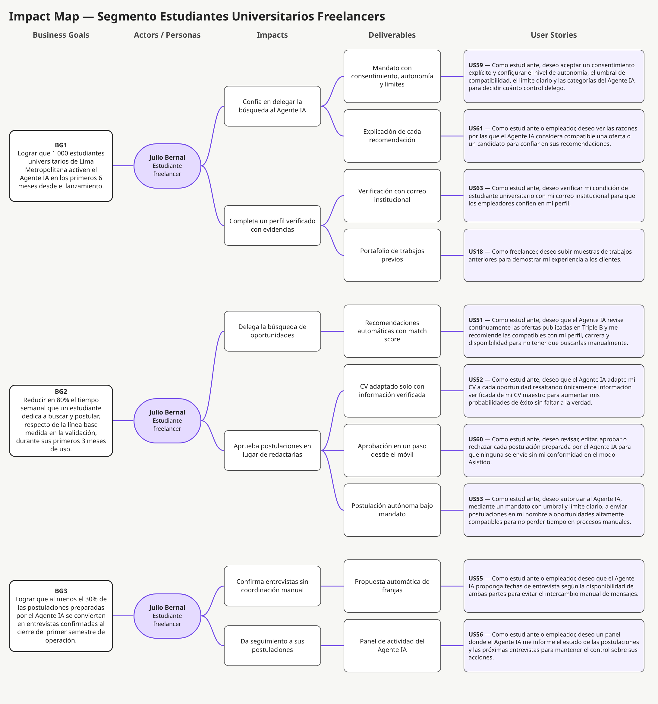

**Impact Map del segmento Empleadores, microempresas y emprendedores.** Para que Luisa publique ofertas (BG4), la landing y la publicación guiada deben ser más convenientes que las redes sociales; para reducir el tiempo hasta la primera entrevista (BG5), revisa solo candidatos compatibles y agenda sin intercambiar mensajes; y para completar servicios pagados y calificados (BG6), contrata, paga y decide dentro de la plataforma.

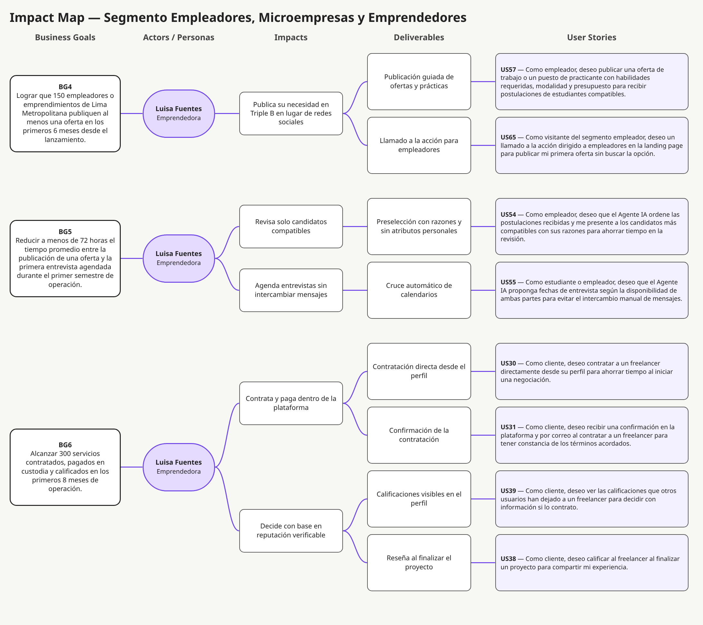

## 3.4. Product Backlog

El Product Backlog incluye las 86 historias (User Stories, Technical Stories y Spikes) de la sección 3.2, estimadas en Story Points con la escala de Fibonacci (1, 2, 3, 5 y 8), con un total de **318 Story Points**. El orden responde al valor para el negocio:

1. **Landing page desde el primer sprint** (EP01), porque es el canal de adquisición de ambos segmentos.
2. **Valor central de la propuesta:** perfil verificado del estudiante, publicación de ofertas y el flujo completo del Agente IA (mandato, recomendaciones, CV adaptado, aprobación, postulación, preselección y entrevistas), precedido por el spike de evaluación de modelos (SP09).
3. **Gestión de cuenta** (registro, inicio de sesión y recuperación), que habilita el uso pero no constituye el valor diferencial y, por ello, no encabeza el backlog.
4. **Marketplace de servicios, contratación y pagos, reputación, comunicaciones y sugerencia de precio**, en ese orden.

Respecto de la versión anterior se re-estimaron tres historias cuya estimación era inconsistente con historias equivalentes (US09, US16 y US17 pasaron de 8 a 3 puntos) y se estimaron por primera vez las historias del Agente IA (US51–US65), las Technical Stories y los Spikes.

| # Orden | User Story Id | Título | Descripción | Story Points (1 / 2 / 3 / 5 / 8) |
| :---: | :---: | --- | --- | :---: |
| 1 | US01 | Navegar de forma intuitiva en la landing page | Como visitante de Triple B, deseo que la landing page tenga una barra de navegación clara y accesible para encontrar fácilmente las secciones importantes. | 3 |
| 2 | US64 | Acceder al registro de estudiante desde la landing | Como visitante del segmento estudiante, deseo un llamado a la acción dirigido a estudiantes en la landing page para registrarme directamente como freelancer en la aplicación web. | 2 |
| 3 | US65 | Acceder a publicar una oferta desde la landing | Como visitante del segmento empleador, deseo un llamado a la acción dirigido a empleadores en la landing page para publicar mi primera oferta sin buscar la opción. | 2 |
| 4 | US02 | Acceder rápidamente a funcionalidades clave | Como visitante, deseo acceder desde la landing page a secciones clave como publicar proyecto o registrarme para actuar rápidamente. | 3 |
| 5 | US08 | Conocer los beneficios de Triple B | Como visitante, deseo conocer los beneficios de usar Triple B para entender por qué debería utilizar la plataforma. | 1 |
| 6 | US09 | Conocer diferencias entre roles | Como visitante, deseo saber las diferencias entre registrarme como freelancer o cliente para elegir el rol adecuado. | 3 |
| 7 | US11 | Conocer tipos de servicios disponibles | Como visitante, deseo conocer los tipos de servicios que puedo contratar o brindar en Triple B para decidir si la plataforma responde a mi necesidad. | 5 |
| 8 | US10 | Ver experiencias de otros usuarios | Como visitante, deseo ver testimonios de usuarios anteriores para confiar en la plataforma. | 5 |
| 9 | US12 | Acceder a preguntas frecuentes | Como visitante, deseo ver una sección de preguntas frecuentes para resolver dudas comunes sin ayuda externa. | 3 |
| 10 | US15 | Crear perfil freelance | Como estudiante, deseo crear mi perfil freelance con mi nombre, carrera y universidad para que los clientes conozcan mi identidad profesional. | 5 |
| 11 | US63 | Verificar la condición de estudiante | Como estudiante, deseo verificar mi condición de estudiante universitario con mi correo institucional para que los empleadores confíen en mi perfil. | 5 |
| 12 | US16 | Añadir habilidades y descripción personal | Como freelancer, deseo añadir habilidades y una descripción personal para destacar mis fortalezas. | 3 |
| 13 | TS09 | Endpoint del CV maestro | Como developer, deseo implementar el endpoint PUT /api/v1/students/{studentId}/master-cv del Profiles & Reputation Service para registrar el CV maestro que usa el Agente IA. | 3 |
| 14 | US57 | Publicar oferta o puesto de practicante | Como empleador, deseo publicar una oferta de trabajo o un puesto de practicante con habilidades requeridas, modalidad y presupuesto para recibir postulaciones de estudiantes compatibles. | 5 |
| 15 | TS01 | Endpoint para publicar ofertas | Como developer, deseo implementar el endpoint POST /api/v1/job-offers del Marketplace Service para que la aplicación web publique ofertas de empleadores. | 3 |
| 16 | SP09 | Evaluación de modelos, costos y riesgos del Agente IA | Como equipo de desarrollo, deseo evaluar modelos generativos y de embeddings de Vertex AI, su costo por postulación y sus riesgos (alucinaciones e inyección de instrucciones) para seleccionar la configuración del Agente IA. | 3 |
| 17 | US59 | Configurar el mandato y nivel de autonomía del Agente IA | Como estudiante, deseo aceptar un consentimiento explícito y configurar el nivel de autonomía, el umbral de compatibilidad, el límite diario y las categorías del Agente IA para decidir cuánto control delego. | 5 |
| 18 | TS03 | Endpoint del mandato del Agente IA | Como developer, deseo implementar el endpoint PUT /api/v1/agent/mandates/{studentId} del AI Agent Service para registrar el consentimiento y la configuración del agente. | 3 |
| 19 | US51 | Búsqueda autónoma de proyectos | Como estudiante, deseo que el Agente IA revise continuamente las ofertas publicadas en Triple B y me recomiende las compatibles con mi perfil, carrera y disponibilidad para no tener que buscarlas manualmente. | 8 |
| 20 | TS04 | Endpoint de oportunidades recomendadas | Como developer, deseo implementar el endpoint GET /api/v1/agent/students/{studentId}/matches para que las aplicaciones muestren las recomendaciones del Agente IA. | 5 |
| 21 | US61 | Consultar la explicación del match | Como estudiante o empleador, deseo ver las razones por las que el Agente IA considera compatible una oferta o un candidato para confiar en sus recomendaciones. | 3 |
| 22 | US52 | Adaptación automática del CV | Como estudiante, deseo que el Agente IA adapte mi CV a cada oportunidad resaltando únicamente información verificada de mi CV maestro para aumentar mis probabilidades de éxito sin faltar a la verdad. | 8 |
| 23 | US60 | Aprobar o editar la postulación preparada | Como estudiante, deseo revisar, editar, aprobar o rechazar cada postulación preparada por el Agente IA para que ninguna se envíe sin mi conformidad en el modo Asistido. | 5 |
| 24 | TS05 | Endpoint de aprobación de borradores | Como developer, deseo implementar el endpoint POST /api/v1/agent/application-drafts/{draftId}/approval para que el estudiante apruebe las postulaciones preparadas por el agente. | 3 |
| 25 | TS06 | Endpoint de registro de postulaciones | Como developer, deseo implementar el endpoint POST /api/v1/applications del Hiring & Engagements Service para registrar postulaciones enviadas por el estudiante o por el Agente IA. | 3 |
| 26 | US53 | Postulación autónoma bajo mandato | Como estudiante, deseo autorizar al Agente IA, mediante un mandato con umbral y límite diario, a enviar postulaciones en mi nombre a oportunidades altamente compatibles para no perder tiempo en procesos manuales. | 5 |
| 27 | US56 | Seguimiento de estado y notificaciones del Agente IA | Como estudiante o empleador, deseo un panel donde el Agente IA me informe el estado de las postulaciones y las próximas entrevistas para mantener el control sobre sus acciones. | 5 |
| 28 | US54 | Filtrado inteligente de candidatos | Como empleador, deseo que el Agente IA ordene las postulaciones recibidas y me presente a los candidatos más compatibles con sus razones para ahorrar tiempo en la revisión. | 8 |
| 29 | TS07 | Endpoint de preselección de candidatos | Como developer, deseo implementar el endpoint GET /api/v1/job-offers/{jobOfferId}/shortlist para que el empleador obtenga la preselección del Agente IA. | 3 |
| 30 | US55 | Agendamiento automático de entrevistas | Como estudiante o empleador, deseo que el Agente IA proponga fechas de entrevista según la disponibilidad de ambas partes para evitar el intercambio manual de mensajes. | 8 |
| 31 | TS08 | Endpoint de solicitud de entrevistas | Como developer, deseo implementar el endpoint POST /api/v1/interviews del Hiring & Engagements Service para proponer franjas de entrevista según los calendarios. | 5 |
| 32 | US62 | Revocar el consentimiento del Agente IA | Como estudiante, deseo revocar el mandato del Agente IA y solicitar la eliminación de los datos derivados para ejercer mis derechos sobre mis datos personales. | 3 |
| 33 | US58 | Editar o cerrar una oferta publicada | Como empleador, deseo editar o cerrar mis ofertas publicadas para mantener actualizada la información y dejar de recibir postulaciones cuando cubro el puesto. | 3 |
| 34 | US03 | Registrarse con correo y contraseña | Como visitante, deseo registrarme con mi correo y una contraseña indicando si soy estudiante o empleador para acceder a las funcionalidades de mi rol. | 3 |
| 35 | US04 | Iniciar sesión como freelancer o cliente | Como usuario registrado, deseo poder iniciar sesión para acceder a mi cuenta y funcionalidades específicas según mi rol. | 5 |
| 36 | SP01 | Investigación de autenticación con Google | Como equipo de desarrollo, deseo investigar cómo integrar Google OAuth 2.0 para permitir registro e inicio de sesión seguro. | 2 |
| 37 | US05 | Registrarse con cuenta de Google | Como visitante, deseo registrarme con Google para agilizar el proceso de creación de cuenta. | 2 |
| 38 | SP02 | Recuperación segura de contraseña | Como equipo de desarrollo, deseo investigar mecanismos seguros de recuperación de contraseña mediante enlaces temporales para evitar el secuestro de cuentas. | 2 |
| 39 | US06 | Solicitar recuperación de contraseña | Como usuario, deseo solicitar la recuperación de mi contraseña para volver a acceder si la olvido. | 2 |
| 40 | US07 | Restablecer contraseña mediante enlace seguro | Como usuario, deseo restablecer mi contraseña usando un enlace enviado a mi correo para recuperar el acceso a mi cuenta de forma segura. | 2 |
| 41 | SP06 | Gestión de archivos y portafolio | Como equipo de desarrollo, deseo investigar almacenamiento seguro de imágenes y archivos para portafolios multimedia. | 2 |
| 42 | US18 | Subir portafolio de proyectos | Como freelancer, deseo subir muestras de trabajos anteriores para demostrar mi experiencia a los clientes. | 5 |
| 43 | US20 | Publicar un servicio personalizado | Como freelancer, deseo publicar un servicio con título, descripción y precio para ofrecerlo a potenciales clientes. | 5 |
| 44 | US17 | Establecer tarifas por servicio | Como freelancer, deseo establecer mis tarifas por tipo de servicio para que los clientes conozcan mis precios. | 3 |
| 45 | US21 | Establecer plazos de entrega | Como freelancer, deseo definir el tiempo de entrega estimado para que el cliente tenga expectativas claras. | 5 |
| 46 | US24 | Añadir imágenes o archivos al servicio | Como freelancer, deseo subir imágenes o archivos a mis servicios para facilitar la comprensión del cliente. | 3 |
| 47 | US22 | Editar servicios publicados | Como freelancer, deseo editar mis servicios publicados para corregir errores o actualizar precios. | 5 |
| 48 | US23 | Pausar o eliminar servicios publicados | Como freelancer, deseo pausar o eliminar mis servicios para dejar de recibir solicitudes cuando no tengo disponibilidad. | 5 |
| 49 | US19 | Actualizar perfil freelance | Como freelancer, deseo poder actualizar mi perfil cuando quiera para mantener mi información al día. | 3 |
| 50 | SP03 | Investigación de motores de búsqueda y filtros | Como equipo de desarrollo, deseo investigar motores de búsqueda eficientes para mejorar la experiencia de encontrar freelancers. | 2 |
| 51 | US25 | Buscar freelancers por palabra clave | Como cliente, deseo buscar freelancers usando palabras clave para encontrar rápidamente lo que necesito. | 3 |
| 52 | TS02 | Endpoint de búsqueda del catálogo | Como developer, deseo implementar el endpoint GET /api/v1/gigs con filtros de texto, habilidades, precio y ordenamiento para que los clientes exploren el catálogo. | 3 |
| 53 | US26 | Filtrar freelancers por habilidad | Como cliente, deseo filtrar freelancers según sus habilidades para encontrar al más apto para mi proyecto. | 3 |
| 54 | US29 | Ordenar resultados de búsqueda | Como cliente, deseo ordenar resultados por relevancia o calificación para comparar perfiles. | 3 |
| 55 | US27 | Filtrar por rango de precios | Como cliente, deseo establecer un rango de precios para ver freelancers dentro de mi presupuesto. | 5 |
| 56 | US28 | Filtrar freelancers por experiencia | Como cliente, deseo filtrar freelancers según su nivel de experiencia para elegir al adecuado. | 5 |
| 57 | SP07 | Contratación directa y pagos | Como equipo de desarrollo, deseo investigar opciones de integración de pagos para habilitar contrataciones directas. | 2 |
| 58 | US30 | Contratar desde el perfil del freelancer | Como cliente, deseo contratar a un freelancer directamente desde su perfil para ahorrar tiempo al iniciar una negociación. | 5 |
| 59 | US35 | Gestionar solicitudes recibidas | Como freelancer, deseo revisar y gestionar solicitudes de nuevos proyectos para aceptar las que se ajusten a mi disponibilidad. | 3 |
| 60 | US32 | Aceptar o rechazar solicitud de contrato | Como freelancer, deseo aceptar o rechazar solicitudes de contratación para gestionar mi disponibilidad. | 3 |
| 61 | US31 | Confirmación de contratación exitosa | Como cliente, deseo recibir una confirmación en la plataforma y por correo al contratar a un freelancer para tener constancia de los términos acordados. | 3 |
| 62 | TS12 | Webhook de pagos | Como developer, deseo implementar el endpoint POST /api/v1/payments/webhooks/mercado-pago para actualizar el estado de los pagos en custodia. | 5 |
| 63 | US34 | Visualizar proyectos activos | Como freelancer, deseo ver una lista de mis proyectos activos para organizar mi trabajo. | 5 |
| 64 | US37 | Ver estado del proyecto | Como cliente, deseo ver el estado de mis proyectos en curso para saber si están en espera, en proceso o finalizados. | 5 |
| 65 | US36 | Marcar proyecto como finalizado | Como freelancer, deseo marcar un proyecto como finalizado para indicar que mi trabajo fue completado. | 3 |
| 66 | US33 | Ver historial de contrataciones | Como cliente, deseo ver un historial de mis contrataciones para tener un registro de mis actividades. | 2 |
| 67 | SP08 | Sistema de calificaciones y opiniones | Como equipo de desarrollo, deseo investigar formas seguras de almacenar calificaciones evitando fraudes para sustentar la confianza en la reputación pública. | 2 |
| 68 | US38 | Calificar al freelancer | Como cliente, deseo calificar al freelancer al finalizar un proyecto para compartir mi experiencia. | 3 |
| 69 | TS10 | Endpoint de reseñas | Como developer, deseo implementar el endpoint POST /api/v1/engagements/{engagementId}/reviews para registrar reseñas al finalizar un proyecto. | 3 |
| 70 | US39 | Ver calificaciones del freelancer | Como cliente, deseo ver las calificaciones que otros usuarios han dejado a un freelancer para decidir con información si lo contrato. | 5 |
| 71 | US41 | Calificar al cliente | Como freelancer, deseo calificar al cliente luego de terminar un proyecto para informar a otros freelancers sobre su comportamiento. | 5 |
| 72 | US40 | Editar calificación después de un proyecto | Como cliente, deseo editar una calificación que registré para que refleje con precisión mi experiencia final con el freelancer. | 5 |
| 73 | SP04 | Investigación de mensajería en tiempo real | Como equipo de desarrollo, deseo investigar opciones para implementar mensajería en tiempo real. | 2 |
| 74 | US42 | Enviar mensaje a usuario desde perfil | Como usuario, deseo enviar un mensaje a otro usuario desde su perfil para coordinar detalles. | 3 |
| 75 | TS11 | Endpoint de mensajes | Como developer, deseo implementar el endpoint POST /api/v1/conversations/{conversationId}/messages del Communications Service para el intercambio de mensajes. | 3 |
| 76 | US44 | Recibir notificación de nuevo mensaje | Como usuario, deseo recibir una notificación cuando me envíen un nuevo mensaje para no perder comunicación importante. | 1 |
| 77 | US43 | Ver historial de conversaciones | Como usuario, deseo ver mi historial de conversaciones previas para recordar acuerdos importantes. | 2 |
| 78 | US45 | Bloquear o reportar usuario desde el chat | Como usuario, deseo bloquear o reportar a otra persona para protegerme de mensajes inapropiados o spam. | 2 |
| 79 | US14 | Enviar un ticket de soporte | Como usuario, deseo enviar un mensaje de soporte si no encuentro mi duda en la FAQ para recibir asistencia personalizada. | 3 |
| 80 | US13 | Buscar información dentro de preguntas frecuentes | Como usuario, deseo buscar palabras clave en la sección de FAQ para encontrar respuestas más rápido. | 3 |
| 81 | SP05 | Investigación para cálculo inteligente de precios | Como equipo de desarrollo, deseo investigar modelos para sugerir precios justos evaluando variables y reglas. | 2 |
| 82 | US46 | Recibir sugerencia automática de precio | Como freelancer, deseo recibir una sugerencia automática de precio basada en las variables del servicio para cotizar de forma consistente con el mercado. | 8 |
| 83 | US47 | Ajustar manualmente el precio sugerido | Como freelancer, deseo modificar manualmente el precio sugerido para adaptarlo a mis condiciones. | 5 |
| 84 | US48 | Ver detalle del cálculo del precio | Como freelancer, deseo ver una explicación breve de cómo se calculó el precio sugerido para entenderlo y justificarlo ante el cliente. | 5 |
| 85 | US49 | Comparar propuesta y oferta | Como usuario, deseo comparar mi propuesta y la oferta de la otra parte para facilitar un acuerdo. | 3 |
| 86 | US50 | Consultar historial de precios similares | Como usuario, deseo ver precios históricos de servicios similares para tomar decisiones informadas. | 2 |

El backlog se gestiona en Jira Software. El archivo [`backlog/product-backlog.csv`](backlog/product-backlog.csv) contiene el backlog en el formato de importación de Jira (orden, clave, resumen, descripción, story points, epic y criterios de aceptación).

> ⚠️ **PENDIENTE (equipo):** importar el CSV en el proyecto de Jira Software del equipo (el backlog anterior estaba en Notion, que no es una de las herramientas indicadas), insertar aquí la captura del backlog y el enlace público.

# Capítulo IV: Strategic-Level Software Design

En este capítulo se presentan las decisiones que dirigen la arquitectura de Triple B. Primero se aplica Attribute-Driven Design (ADD) para derivar la estructura de la solución a partir de los drivers arquitectónicos; luego se aplica Domain-Driven Design estratégico para descomponer el dominio en bounded contexts y definir sus relaciones; finalmente se especifica la arquitectura con el C4 Model en los niveles de landscape, contexto, contenedores y despliegue.

## 4.1. Strategic-Level Attribute-Driven Design

El equipo aplica ADD 3.0 (Cervantes y Kazman, 2016) en su nivel estratégico. El proceso toma como entradas el propósito del diseño, la funcionalidad primaria, los escenarios de atributos de calidad y las restricciones; consolida los drivers en un backlog priorizado mediante un Quality Attribute Workshop (QAW); y en cada iteración selecciona drivers, evalúa patrones candidatos y registra las decisiones con su justificación. Siguiendo la metodología del curso, se utilizaron asistentes de IA generativa para proponer una primera versión de drivers, escenarios y patrones candidatos a partir de las User Stories; el equipo revisa, depura y prioriza esas propuestas en el QAW (ver Anexo D).

### 4.1.1. Design Purpose

Triple B es un sistema nuevo (*greenfield*) en un dominio emergente: un agente de IA que actúa en nombre de estudiantes dentro de un marketplace. El propósito del diseño es producir una arquitectura inicial que:

- Permita construir en TB2 un producto mínimo viable con el flujo de postulación asistida de punta a punta, con un equipo de cinco personas y un presupuesto acotado.
- Aísle el Agente IA, que es el dominio central, para que evolucione y cambie de modelo o de proveedor sin afectar al resto de la plataforma.
- Garantice la confianza de ambos segmentos: privacidad de los datos personales, veracidad del CV adaptado y control del estudiante sobre el agente.

El diseño responde a la problemática del Capítulo I: reducir el tiempo que el estudiante dedica a buscar y postular (BG2) y el que el empleador tarda en llegar a la primera entrevista (BG5), con perfiles verificados y pagos seguros que sustenten la confianza (BG1 y BG6). Además, sirve de base para estimar los sprints y para el diseño táctico de cada bounded context en el Capítulo V.

### 4.1.2. Attribute-Driven Design Inputs

Las entradas del proceso son de tres tipos: la funcionalidad primaria (Epics y User Stories con mayor impacto en la arquitectura), los escenarios de atributos de calidad y las restricciones impuestas por el curso, la normativa y el negocio.

#### 4.1.2.1. Primary Functionality (Primary User Stories)

Se seleccionaron el Epic EP13 (Agente IA) y las historias que condicionan la arquitectura: la recomendación autónoma de oportunidades (US51) exige procesamiento asíncrono y búsqueda semántica; la adaptación del CV (US52) introduce un modelo generativo cuya salida debe validarse; el mandato, la aprobación y la postulación autónoma (US59, US60 y US53) requieren una máquina de estados con el estudiante en el circuito; la preselección (US54) debe ser explicable y libre de atributos personales; el agendamiento (US55) integra calendarios externos; la publicación de ofertas (US57) es el evento que dispara el flujo del agente; y la contratación desde el perfil (US30) inicia el flujo de pagos en custodia.

| Epic / User Story ID | Título | Descripción | Criterios de Aceptación | Relacionado con (Epic ID) |
| :---: | --- | --- | --- | :---: |
| **EP13** | **Agente de Inteligencia Artificial (AI Agent)** | Como estudiante o empleador, deseo que un Agente IA, bajo un mandato que yo controlo, busque oportunidades, adapte el CV con información verificada, prepare postulaciones, preseleccione candidatos y coordine entrevistas para ahorrar tiempo y mejorar la precisión de las contrataciones. | — | — |
| US51 | Búsqueda autónoma de proyectos | Como estudiante, deseo que el Agente IA revise continuamente las ofertas publicadas en Triple B y me recomiende las compatibles con mi perfil, carrera y disponibilidad para no tener que buscarlas manualmente. | **Escenario 1:** Dado que el estudiante tiene un mandato activo y se publica una oferta cuyo match score es mayor o igual a su umbral, cuando el Agente IA procesa la oferta, entonces la añade a sus oportunidades recomendadas con el puntaje y las razones del match.  **Escenario 2:** Dado que una oferta obtiene un match score menor al umbral del estudiante, cuando el Agente IA la procesa, entonces no la recomienda ni genera una notificación.  **Escenario 3:** Dado que el estudiante excluyó una categoría en su mandato, cuando se publica una oferta de esa categoría, entonces el Agente IA no la evalúa para él. | EP13 |
| US52 | Adaptación automática del CV | Como estudiante, deseo que el Agente IA adapte mi CV a cada oportunidad resaltando únicamente información verificada de mi CV maestro para aumentar mis probabilidades de éxito sin faltar a la verdad. | **Escenario 1:** Dado que el Agente IA prepara una postulación, cuando genera el CV adaptado, entonces reordena y resalta únicamente logros, cursos y habilidades existentes en el CV maestro del estudiante.  **Escenario 2:** Dado que el CV adaptado contiene una afirmación que no existe en el CV maestro, cuando el sistema valida el documento, entonces lo rechaza y genera una nueva versión sin esa afirmación.  **Escenario 3:** Dado que un CV fue adaptado, cuando el estudiante consulta la postulación, entonces visualiza las diferencias entre su CV maestro y la versión adaptada. | EP13 |
| US53 | Postulación autónoma bajo mandato | Como estudiante, deseo autorizar al Agente IA, mediante un mandato con umbral y límite diario, a enviar postulaciones en mi nombre a oportunidades altamente compatibles para no perder tiempo en procesos manuales. | **Escenario 1:** Dado que el estudiante activó el modo autónomo con umbral de 85 y límite de 5 postulaciones diarias, cuando el Agente IA prepara una postulación con match score mayor o igual a 85 y no se alcanzó el límite, entonces la envía y la registra en el historial del agente.  **Escenario 2:** Dado que se alcanzó el límite diario, cuando el Agente IA prepara una nueva postulación, entonces la deja pendiente de aprobación del estudiante.  **Escenario 3:** Dado que el Agente IA envió una postulación, cuando esta se registra, entonces el estudiante recibe una notificación con la opción de retirarla. | EP13 |
| US59 | Configurar el mandato y nivel de autonomía del Agente IA | Como estudiante, deseo aceptar un consentimiento explícito y configurar el nivel de autonomía, el umbral de compatibilidad, el límite diario y las categorías del Agente IA para decidir cuánto control delego. | **Escenario 1:** Dado que el estudiante acepta el consentimiento de uso de sus datos, cuando registra el nivel de autonomía, umbral, límite diario y categorías, entonces el sistema activa el mandato con esa configuración.  **Escenario 2:** Dado que el estudiante no acepta el consentimiento, cuando intenta activar el Agente IA, entonces el sistema no activa el mandato.  **Escenario 3:** Dado que el estudiante no elige un nivel de autonomía, cuando activa el mandato, entonces el sistema aplica el nivel Asistido, en el que ninguna postulación se envía sin su aprobación. | EP13 |
| US60 | Aprobar o editar la postulación preparada | Como estudiante, deseo revisar, editar, aprobar o rechazar cada postulación preparada por el Agente IA para que ninguna se envíe sin mi conformidad en el modo Asistido. | **Escenario 1:** Dado que el Agente IA preparó un borrador de postulación, cuando el estudiante lo aprueba, entonces el sistema envía la postulación al empleador identificada como asistida por IA.  **Escenario 2:** Dado que el estudiante rechaza el borrador indicando un motivo, cuando el sistema registra el rechazo, entonces descarta el borrador y el Agente IA ajusta sus preferencias de recomendación.  **Escenario 3:** Dado que el estudiante edita el CV adaptado, cuando confirma los cambios, entonces el sistema valida que el contenido corresponda al CV maestro antes de enviarlo. | EP13 |
| US54 | Filtrado inteligente de candidatos | Como empleador, deseo que el Agente IA ordene las postulaciones recibidas y me presente a los candidatos más compatibles con sus razones para ahorrar tiempo en la revisión. | **Escenario 1:** Dado que una oferta recibió 50 postulaciones, cuando el empleador solicita la preselección, entonces el sistema presenta los 5 candidatos con mayor match score junto con las razones de cada puntaje.  **Escenario 2:** Dado que el empleador revisa la preselección, cuando solicita ver al resto de candidatos, entonces el sistema muestra todas las postulaciones ordenadas por compatibilidad.  **Escenario 3:** Dado que el Agente IA calcula el ranking, cuando evalúa a los candidatos, entonces no utiliza atributos personales como sexo, edad, fotografía o distrito de residencia. | EP13 |
| US55 | Agendamiento automático de entrevistas | Como estudiante o empleador, deseo que el Agente IA proponga fechas de entrevista según la disponibilidad de ambas partes para evitar el intercambio manual de mensajes. | **Escenario 1:** Dado que el empleador solicita entrevistar a un candidato preseleccionado y ambos tienen su calendario conectado, cuando el Agente IA procesa la solicitud, entonces propone al menos tres franjas comunes y, al confirmarse una, se envía la invitación a ambas partes.  **Escenario 2:** Dado que el estudiante rechaza las franjas propuestas, cuando registra el rechazo, entonces el Agente IA propone nuevas franjas.  **Escenario 3:** Dado que una de las partes no tiene calendario conectado, cuando se solicita la entrevista, entonces el sistema le solicita registrar su disponibilidad manualmente. | EP13 |
| US57 | Publicar oferta o puesto de practicante | Como empleador, deseo publicar una oferta de trabajo o un puesto de practicante con habilidades requeridas, modalidad y presupuesto para recibir postulaciones de estudiantes compatibles. | **Escenario 1:** Dado que un empleador verificado completa título, descripción, habilidades requeridas, modalidad y presupuesto o subvención, cuando publica la oferta, entonces el sistema la registra como publicada y la deja disponible para el Agente IA.  **Escenario 2:** Dado que falta un campo obligatorio, cuando el empleador intenta publicar, entonces el sistema rechaza la publicación e indica los campos faltantes.  **Escenario 3:** Dado que el empleador aún no está verificado, cuando intenta publicar, entonces el sistema guarda la oferta como borrador e informa los pasos de verificación. | EP14 |
| US30 | Contratar desde el perfil del freelancer | Como cliente, deseo contratar a un freelancer directamente desde su perfil para ahorrar tiempo al iniciar una negociación. | **Escenario 1:** Dado que un cliente consulta el perfil del freelancer, cuando envía una solicitud de contratación, entonces el sistema registra la solicitud.  **Escenario 2:** Dado que la contratación fue iniciada, cuando el sistema la procesa, entonces se registra en el historial del cliente. | EP08 |

#### 4.1.2.2. Quality attribute Scenarios

Se identificaron diez escenarios de atributos de calidad. Los de mayor impacto se relacionan con el Agente IA: rendimiento y escalabilidad del matching asíncrono (QA-01, QA-02), tolerancia a fallas del proveedor de IA (QA-03), veracidad del CV adaptado (QA-05), independencia del proveedor (QA-06) y costo por postulación (QA-09). Se complementan con escenarios de seguridad (QA-04, QA-10), interoperabilidad con calendarios (QA-07) y usabilidad del control del agente (QA-08).

| Atributo | Fuente | Estímulo | Artefacto | Entorno | Respuesta | Medida |
| --- | --- | --- | --- | --- | --- | --- |
| **QA-01 Performance** | Empleador | Publica una oferta | AI Agent Worker (matching) | Operación normal con 10 000 estudiantes con mandato activo | Calcula la compatibilidad con los estudiantes elegibles y registra las recomendaciones de forma asíncrona, sin bloquear la publicación | El 95% de las recomendaciones está disponible en 5 minutos o menos desde la publicación; la publicación responde en 800 ms o menos (p95) |
| **QA-02 Scalability** | Empleadores durante una campaña de prácticas | Se publican 500 ofertas en 10 minutos | Event Bus y AI Agent Worker | Pico de carga | Encola los eventos y escala horizontalmente las instancias del worker | 0 eventos perdidos; cola procesada en 30 minutos o menos; p95 de la aplicación web de 1 s o menos durante el pico |
| **QA-03 Availability** | Vertex AI | El servicio de modelos no responde o devuelve errores | AI Agent Worker | Operación normal | Reintenta con backoff exponencial, abre un circuit breaker y deja los borradores en estado pendiente; el resto de la plataforma sigue operando | Disponibilidad mensual de 99.5% o más de las funciones que no dependen del modelo; 0 postulaciones perdidas; procesamiento reanudado en 5 minutos o menos tras la recuperación |
| **QA-04 Security (confidencialidad)** | Usuario autenticado con rol empleador | Solicita el CV maestro o los datos de contacto de un estudiante que no postuló a sus ofertas | API Gateway y Profiles & Reputation Service | Operación normal | Deniega la solicitud (403) y registra un evento de auditoría | 100% de accesos no autorizados denegados; evento de auditoría registrado en 1 s o menos |
| **QA-05 Integrity & Responsible AI** | Modelo generativo | Genera un CV adaptado con una afirmación que no existe en el CV maestro | AI Agent Worker (validador de hechos) | Preparación de una postulación | Rechaza el CV, lo regenera con restricciones y, si vuelve a fallar, lo deja para edición del estudiante | 0 postulaciones enviadas con afirmaciones no verificadas en la auditoría semanal por muestreo; 100% de CV adaptados con diferencias visibles |
| **QA-06 Modifiability** | Equipo de desarrollo | Cambiar el modelo o el proveedor de IA por costo o calidad | Puerto `LLMProvider` del AI Agent | Tiempo de desarrollo | Se implementa un nuevo adaptador sin modificar el dominio, los demás servicios ni los frontends | 3 días-persona o menos; cambios confinados al módulo de infraestructura del AI Agent; coincidencia del top 5 de recomendaciones de 90% o más en las pruebas de regresión |
| **QA-07 Interoperability** | Empleador | Solicita una entrevista con un candidato | Hiring & Engagements Service y Google Calendar API | Ambas partes con calendario conectado | Consulta la disponibilidad, propone al menos tres franjas y, al confirmarse una, crea el evento con enlace de videollamada | Propuesta en 10 s o menos; 100% de invitaciones enviadas a ambas partes; si falta un calendario, se solicita disponibilidad manual en el 100% de los casos |
| **QA-08 Usability (transparencia)** | Estudiante | Recibe un borrador de postulación | Mobile Application y Web Application | Uso normal | Muestra el match score, las razones y las diferencias del CV, y permite aprobar o rechazar en un máximo de dos interacciones | 80% o más de los participantes de las pruebas de usabilidad aprueba o rechaza un borrador en menos de 60 s sin ayuda |
| **QA-09 Cost efficiency** | Operación de la plataforma | Procesamiento mensual de recomendaciones y postulaciones | AI Agent Worker | MVP con 1 000 estudiantes activos | Prefiltra candidatos con búsqueda vectorial antes de invocar el modelo generativo y usa modelos ligeros para tareas simples | Costo de IA de USD 0.05 o menos por postulación preparada; infraestructura total de USD 100 mensuales o menos |
| **QA-10 Security (integridad de pagos)** | Atacante externo | Envía una notificación de pago falsificada | Webhook de pagos de Hiring & Engagements | Producción | Verifica la firma y confirma el estado consultando a Mercado Pago antes de cambiar el pago | 100% de notificaciones sin firma válida rechazadas; 0 liberaciones sin confirmación del proveedor |

#### 4.1.2.3. Constraints

Las restricciones provienen del enunciado del curso (tecnologías, documentación, internacionalización y control de versiones), de la normativa peruana de protección de datos, de los principios de IA responsable adoptados por el equipo y del presupuesto de la etapa MVP. Se expresan como Technical Stories.

| Technical Story ID | Título | Descripción | Criterios de Aceptación | Relacionado con (Epic ID) |
| :---: | --- | --- | --- | :---: |
| TS-C01 | Servicios web con NestJS | Como developer, deseo implementar los servicios web RESTful con NestJS y TypeScript para cumplir el estándar tecnológico del curso. | **Escenario 1:** Dado que se crea un servicio web, cuando se revisa su repositorio, entonces está implementado con NestJS y TypeScript bajo el estilo RESTful. | Transversal |
| TS-C02 | Aplicación web con Vue y Material Design | Como developer, deseo construir la aplicación web con Vue 3, TypeScript y Vuetify para aplicar Material Design como lenguaje de diseño. | **Escenario 1:** Dado que se construye una vista de la aplicación web, cuando se revisa su código, entonces usa componentes de Vuetify y el tema definido en la guía de estilos. | EP02–EP14 |
| TS-C03 | Landing page estática | Como developer, deseo construir la landing page con HTML5, CSS3 y JavaScript, consistente con la aplicación web, para cumplir el estándar del curso. | **Escenario 1:** Dado que se publica la landing page, cuando se revisan sus archivos, entonces solo contiene HTML5, CSS3 y JavaScript y sus llamados a la acción enlazan a las vistas de la aplicación web. | EP01 |
| TS-C04 | Aplicación móvil con Flutter | Como developer, deseo construir la aplicación móvil con Flutter (Dart) para cumplir la estrategia cross-platform permitida sin tecnologías híbridas. | **Escenario 1:** Dado que se compila la aplicación móvil, cuando se revisa el proyecto, entonces está desarrollado en Flutter y genera binarios nativos para Android e iOS. | EP13 |
| TS-C05 | Documentación OpenAPI | Como developer, deseo documentar cada servicio web con OpenAPI (Swagger) para que los consumidores conozcan sus contratos. | **Escenario 1:** Dado que un servicio expone un endpoint, cuando se consulta su documentación, entonces el endpoint aparece en Swagger con parámetros, ejemplos y respuestas. | Transversal |
| TS-C06 | Despliegue en la nube | Como developer, deseo desplegar los productos en Google Cloud y Firebase para usar una plataforma cloud permitida por el curso. | **Escenario 1:** Dado que se publica una versión, cuando se revisa el despliegue, entonces los servicios corren en Google Cloud y la landing page y la aplicación web en Firebase Hosting. | Transversal |
| TS-C07 | Internacionalización y accesibilidad | Como developer, deseo implementar i18n (en_US y es_419) y atributos ARIA para que la solución sea inclusiva, con inglés como idioma por defecto. | **Escenario 1:** Dado que un usuario cambia el idioma, cuando navega la landing page o la aplicación web, entonces el contenido se muestra en el idioma elegido.  **Escenario 2:** Dado que se audita la accesibilidad, cuando se revisan los controles interactivos, entonces cuentan con atributos ARIA. | Transversal |
| TS-C08 | Control de versiones | Como developer, deseo gestionar el código en GitHub con GitFlow, Conventional Commits y Semantic Versioning para mantener la trazabilidad de los cambios. | **Escenario 1:** Dado que se integra una funcionalidad, cuando se revisa el historial, entonces proviene de una rama `feature/*` con commits convencionales y las entregas están etiquetadas con SemVer. | Transversal |
| TS-C09 | Protección de datos personales | Como developer, deseo tratar los datos personales conforme a la Ley N.º 29733 para respetar el consentimiento y los derechos de acceso, rectificación, cancelación y oposición. | **Escenario 1:** Dado que un usuario se registra, cuando acepta los términos, entonces el sistema registra su consentimiento con fecha y finalidad.  **Escenario 2:** Dado que un usuario solicita la cancelación de sus datos, cuando se procesa la solicitud, entonces el sistema elimina o anonimiza sus datos personales. | EP02, EP03, EP13 |
| TS-C10 | IA responsable | Como developer, deseo que el Agente IA solo use hechos del CV maestro, identifique sus postulaciones como asistidas por IA y no use atributos personales en el ranking para cumplir los principios de IA responsable del proyecto. | **Escenario 1:** Dado que el agente envía una postulación, cuando el empleador la consulta, entonces la ve identificada como asistida por IA.  **Escenario 2:** Dado que el agente calcula un ranking, cuando se audita el modelo de entrada, entonces no incluye sexo, edad, fotografía ni distrito. | EP13 |
| TS-C11 | Alcance del agente | Como developer, deseo que el Agente IA opere solo sobre ofertas publicadas en Triple B para no automatizar postulaciones en portales de terceros ni incumplir sus términos de uso. | **Escenario 1:** Dado que el agente busca oportunidades, cuando se revisan sus fuentes, entonces solo consulta ofertas del Marketplace de Triple B. | EP13 |
| TS-C12 | Pagos sin datos de tarjeta | Como developer, deseo procesar los pagos mediante Mercado Pago sin almacenar datos de tarjeta para operar en Perú y delegar el cumplimiento PCI DSS. | **Escenario 1:** Dado que un cliente paga un servicio, cuando se revisa la base de datos, entonces no contiene números de tarjeta ni códigos de seguridad. | EP08 |
| TS-C13 | Presupuesto de la etapa MVP | Como developer, deseo mantener el costo de infraestructura y de IA dentro del presupuesto del MVP para que la operación sea sostenible. | **Escenario 1:** Dado que finaliza un mes de operación, cuando se revisa la facturación, entonces la infraestructura cuesta USD 100 o menos y la IA USD 0.05 o menos por postulación preparada. | Transversal |

### 4.1.3. Architectural Drivers Backlog

El backlog se obtiene de las etapas de identificación, consolidación y priorización del QAW: se listan los drivers funcionales y de calidad propuestos, se unifican los que describen la misma preocupación y se califica cada uno según su importancia para los stakeholders y su impacto en la complejidad técnica de la arquitectura. Todas las restricciones se incluyen como drivers. El cuadro se ordena colocando primero los drivers de alta importancia y alto impacto.

| Driver ID | Título de Driver | Descripción | Importancia para Stakeholders | Impacto en Architecture Technical Complexity |
| :---: | --- | --- | :---: | :---: |
| QA-05 | Veracidad del CV adaptado | El CV adaptado solo contiene hechos del CV maestro verificado. | High | High |
| US51 | Recomendación autónoma de oportunidades | Evaluar cada oferta nueva contra los estudiantes con mandato activo. | High | High |
| QA-01 | Recomendaciones oportunas | Recomendaciones en 5 minutos o menos sin bloquear la publicación. | High | High |
| TS-C10 | IA responsable | Etiqueta de IA, ranking sin atributos personales y uso exclusivo de hechos verificados. | High | High |
| US52 | CV adaptado a la oferta | Generar un CV adaptado y mostrar sus diferencias. | High | High |
| US54 | Preselección explicable | Ranking de candidatos con razones y sin sesgos. | High | High |
| US59 | Mandato del agente | Consentimiento y nivel de autonomía configurables y revocables. | High | Medium |
| US60 | Aprobación de borradores | Ninguna postulación se envía sin aprobación en modo Asistido. | High | Medium |
| US53 | Postulación autónoma | Envío dentro del umbral y del límite diario definidos por el estudiante. | High | Medium |
| QA-03 | Tolerancia a fallas del proveedor de IA | La plataforma sigue operando si el modelo no está disponible. | High | Medium |
| QA-04 | Confidencialidad de los datos | Acceso a datos personales solo por roles y propiedad legítimos. | High | Medium |
| QA-06 | Independencia del proveedor de IA | Cambiar de modelo o proveedor sin afectar el dominio. | High | Medium |
| QA-09 | Costo por postulación | Costo de IA de USD 0.05 o menos por postulación preparada. | High | Medium |
| QA-10 | Integridad de pagos | Solo se confirman pagos verificados con el proveedor. | High | Medium |
| TS-C09 | Protección de datos personales | Cumplimiento de la Ley N.º 29733. | High | Medium |
| US55 | Agendamiento automático | Proponer franjas comunes y enviar invitaciones. | High | Medium |
| US57 | Publicación de ofertas | Evento que dispara el flujo del agente. | High | Low |
| QA-08 | Transparencia del agente | Aprobar o rechazar un borrador en dos interacciones como máximo. | High | Low |
| TS-C11 | Alcance del agente | El agente opera solo sobre ofertas de Triple B. | High | Low |
| TS-C13 | Presupuesto de la etapa MVP | Infraestructura de USD 100 mensuales o menos. | High | Low |
| QA-02 | Escalabilidad en picos | Procesar 500 ofertas en 10 minutos sin pérdida. | Medium | High |
| QA-07 | Interoperabilidad con calendarios | Integración con Google Calendar con alternativa manual. | Medium | Medium |
| US30 | Contratación con pago en custodia | Contratar un servicio y retener el pago hasta la entrega. | Medium | Medium |
| TS-C12 | Pagos sin datos de tarjeta | Uso de Mercado Pago sin almacenar tarjetas. | Medium | Medium |
| TS-C01 | Servicios web con NestJS | Estándar tecnológico del curso. | Medium | Low |
| TS-C02 | Aplicación web con Vue y Material Design | Estándar tecnológico del curso. | Medium | Low |
| TS-C03 | Landing page estática | Estándar tecnológico del curso. | Medium | Low |
| TS-C04 | Aplicación móvil con Flutter | Estrategia cross-platform permitida. | Medium | Low |
| TS-C05 | Documentación OpenAPI | Contratos documentados de los servicios. | Medium | Low |
| TS-C06 | Despliegue en la nube | Google Cloud y Firebase. | Medium | Low |
| TS-C07 | Internacionalización y accesibilidad | i18n y a11y en las experiencias web. | Medium | Low |
| TS-C08 | Control de versiones | GitFlow, Conventional Commits y SemVer. | Medium | Low |

### 4.1.4. Architectural Design Decisions

Las decisiones se registran siguiendo las etapas del Quality Attribute Workshop (Bass et al., 2021): (1) presentación del QAW y de los roles; (2) presentación de los objetivos de negocio (BG1–BG6); (3) presentación del plan arquitectónico inicial (versión 0.1.0 del capítulo); (4) identificación de drivers; (5) lluvia de ideas de escenarios; (6) consolidación; (7) priorización; y (8) refinamiento de los escenarios prioritarios (4.1.5). Con el backlog resultante se realizaron tres iteraciones de diseño. En cada una se seleccionaron drivers, se evaluaron hasta tres patrones candidatos por driver y se eligió el que mejor satisfacía los drivers con menor costo y riesgo.

**Iteración 1 — Estructura general de la solución.** Drivers: QA-01, QA-02, QA-03, QA-09, TS-C01, TS-C06 y TS-C13. Objetivo: definir el estilo arquitectónico, el mecanismo de integración y la plataforma de despliegue.

| Driver ID | Título de Driver | | Microservicios por bounded context | Monolito modular | Funciones serverless (FaaS) |
| :---: | --- | :---: | --- | --- | --- |
| QA-02, QA-09 | Escalabilidad con costo controlado | **Pro** | Despliegue y escalado independientes por contexto; el Agente IA escala sin arrastrar al resto; alineado con DDD. | Simple de desplegar y depurar; menor costo inicial. | Pago por invocación y escalado automático. |
| | | **Con** | Mayor complejidad de integración y observabilidad. | Escala como un todo: el matching intensivo afecta a toda la plataforma; ciclos de despliegue acoplados. | Arranques en frío, límites de ejecución para tareas con modelos de IA y dominio disperso en funciones. |

| Driver ID | Título de Driver | | Integración por eventos (publish/subscribe) | Llamadas síncronas REST | Procesamiento batch programado |
| :---: | --- | :---: | --- | --- | --- |
| QA-01, QA-03 | Matching sin bloquear la plataforma | **Pro** | Desacopla productores y consumidores, absorbe picos y permite reintentos. | Simple y con respuesta inmediata. | Costo predecible y fácil de implementar. |
| | | **Con** | Consistencia eventual y trazabilidad más compleja. | La publicación esperaría al modelo de IA; fallas en cascada si el proveedor no responde. | Recomendaciones con horas de retraso (incumple QA-01). |

| Driver ID | Título de Driver | | Cloud Run (contenedores serverless) | Google Kubernetes Engine | Compute Engine (máquinas virtuales) |
| :---: | --- | :---: | --- | --- | --- |
| TS-C06, TS-C13 | Plataforma de despliegue | **Pro** | Escala a cero, pago por uso e integración nativa con Pub/Sub y API Gateway. | Control total del runtime y autoscaling fino. | Control completo y costo fijo. |
| | | **Con** | Límite de tiempo por solicitud y menor control del runtime. | Costo base del clúster y complejidad operativa desproporcionados para un MVP. | Escalado, parches y alta disponibilidad manuales. |

**Iteración 2 — Agente IA (dominio central).** Drivers: US51, US52, US53, US59, US60, QA-05, QA-06, QA-09 y TS-C10. Objetivo: definir cómo el agente evalúa, genera y actúa manteniendo la veracidad y el control del estudiante.

| Driver ID | Título de Driver | | Búsqueda vectorial (embeddings + pgvector) y reordenamiento con LLM | Puntuación solo con LLM | Reglas y palabras clave |
| :---: | --- | :---: | --- | --- | --- |
| US51, QA-09 | Matching de estudiantes y ofertas | **Pro** | Escala a miles de perfiles con bajo costo; el modelo generativo solo procesa los mejores candidatos; explicable al combinar similitud y reglas. | Alta comprensión semántica sin preparar datos. | Transparente y económico. |
| | | **Con** | Requiere mantener los embeddings actualizados y calibrar el puntaje. | Costo y latencia proporcionales a estudiantes × ofertas; resultados poco reproducibles. | No reconoce sinónimos ni habilidades transferibles; matching de baja calidad. |

| Driver ID | Título de Driver | | Ports & Adapters (puerto `LLMProvider`) | SDK del proveedor en el dominio | Gateway de modelos externo |
| :---: | --- | :---: | --- | --- | --- |
| QA-06 | Independencia del proveedor de IA | **Pro** | Dominio aislado; cambiar de proveedor implica un nuevo adaptador; pruebas con dobles. | Menos código inicial. | Cambio de proveedor por configuración. |
| | | **Con** | Capa adicional que diseñar y mantener. | Acopla el dominio al proveedor; cambios dispersos. | Nuevo componente que operar y un tercero adicional que procesa datos personales. |

| Driver ID | Título de Driver | | Validador de hechos contra el CV maestro | Solo instrucciones en el prompt | Revisión manual obligatoria |
| :---: | --- | :---: | --- | --- | --- |
| QA-05, TS-C10 | Veracidad del CV adaptado | **Pro** | Garantía verificable antes del envío y auditable. | Implementación inmediata. | Máxima seguridad. |
| | | **Con** | Costo de desarrollo; posibles falsos positivos que requieren edición. | No garantiza la ausencia de alucinaciones. | Anula el ahorro de tiempo (BG2) si se exige siempre. |

| Driver ID | Título de Driver | | Mandato con niveles de autonomía (estudiante en el circuito por defecto) | Agente totalmente autónomo | Solo recomendaciones, sin envío |
| :---: | --- | :---: | --- | --- | --- |
| US53, US59, US60 | Control del estudiante sobre el agente | **Pro** | Equilibra ahorro de tiempo y control; registra el consentimiento. | Máximo ahorro de tiempo. | Simple y seguro. |
| | | **Con** | Más estados y reglas (máquina de estados del borrador). | Riesgo reputacional y legal; contradice la hipótesis H3. | No reduce el esfuerzo de postular. |

**Iteración 3 — Seguridad, datos e integraciones.** Drivers: QA-04, QA-07, QA-10, TS-C09 y TS-C12. Objetivo: definir la gestión de identidad, la persistencia por contexto y la integración con servicios externos.

| Driver ID | Título de Driver | | Firebase Authentication y validación en API Gateway | Servicio de identidad propio con JWT | Auth0 |
| :---: | --- | :---: | --- | --- | --- |
| QA-04 | Autenticación y autorización | **Pro** | Registro, Google Sign-In y recuperación de contraseña listos; tokens estándar; bajo costo. | Control total del modelo de identidad. | Funcionalidades empresariales completas. |
| | | **Con** | Dependencia del proveedor; migración de usuarios compleja. | Alto riesgo de errores de seguridad y esfuerzo sin valor diferencial. | Costo creciente por usuario activo y un proveedor adicional. |

| Driver ID | Título de Driver | | Base de datos lógica por contexto en una instancia de Cloud SQL | Base de datos compartida | Instancia por contexto |
| :---: | --- | :---: | --- | --- | --- |
| TS-C09, QA-04 | Persistencia por bounded context | **Pro** | Autonomía del modelo de cada contexto, permisos por base de datos y costo de una sola instancia. | Consultas cruzadas simples. | Aislamiento total. |
| | | **Con** | La instancia es un punto común de falla, mitigado con alta disponibilidad. | Acopla los contextos y dificulta minimizar el acceso a datos personales. | Multiplica el costo (incumple QA-09). |

| Driver ID | Título de Driver | | Anticorruption Layer (un adaptador por proveedor) | Llamadas directas desde el dominio | Plataforma de integración (iPaaS) |
| :---: | --- | :---: | --- | --- | --- |
| QA-07, QA-10, TS-C12 | Integración con servicios externos | **Pro** | Aísla los modelos externos, facilita cambiar de proveedor y probar. | Implementación rápida. | Conectores listos. |
| | | **Con** | Más código de traducción. | El modelo del proveedor contamina el dominio. | Costo y un componente más que operar. |

**Decisiones adoptadas**

| ID | Decisión | Drivers atendidos |
| :---: | --- | --- |
| DD-01 | Microservicios alineados a los cinco bounded contexts, desplegados en Cloud Run. | QA-02, QA-09, TS-C06 |
| DD-02 | Integración asíncrona mediante eventos de dominio en Pub/Sub (Published Language) y API REST síncrona a través de API Gateway para comandos y consultas de las aplicaciones. | QA-01, QA-02, QA-03 |
| DD-03 | El Agente IA se separa en un servicio de API y un worker asíncrono, con barridos periódicos disparados por Cloud Scheduler. | QA-01, QA-02 |
| DD-04 | Matching en dos etapas: embeddings de Vertex AI almacenados en PostgreSQL con pgvector para preseleccionar y Gemini para reordenar y explicar el top N. | US51, US54, QA-09 |
| DD-05 | Acceso a modelos mediante el puerto `LLMProvider` con adaptadores intercambiables. | QA-06 |
| DD-06 | Validador de hechos del CV adaptado contra el CV maestro y modo Asistido por defecto. | QA-05, TS-C10 |
| DD-07 | Mandato con niveles de autonomía y máquina de estados del borrador (preparado, aprobado, enviado, descartado). | US53, US59, US60 |
| DD-08 | Firebase Authentication para identidad, validación del JWT en API Gateway y autorización por rol y propiedad en cada servicio. | QA-04 |
| DD-09 | Una base de datos lógica por bounded context en una instancia de Cloud SQL for PostgreSQL con alta disponibilidad. | TS-C09, QA-04, QA-09 |
| DD-10 | Anticorruption Layer para Google Calendar, Mercado Pago, SendGrid y Firebase Cloud Messaging; webhooks verificados por firma y consulta al proveedor. | QA-07, QA-10, TS-C12 |

**Decisiones diferidas.** DF-01: la custodia de pagos se implementa con Mercado Pago; su ejecución como smart contract en una red blockchain de prueba se evaluará en la Unidad 3 del curso (Web3), para lo cual Hiring & Engagements expone un puerto `EscrowProvider`. DF-02: si el volumen lo requiere, el AI Agent podrá dividirse en los contextos Matching y Agent Orchestration.

### 4.1.5. Quality Attribute Scenario Refinements

Al finalizar el QAW se priorizaron cinco escenarios, presentados en orden de prioridad. Las principales decisiones asociadas son el validador de hechos del CV adaptado, el procesamiento asíncrono del matching, el aislamiento del proveedor de IA mediante un puerto y la degradación controlada ante fallas del modelo.

| Scenario Refinement for Scenario 1 | |
| --- | --- |
| **Scenario(s):** | QA-05 — El CV adaptado no contiene afirmaciones inexistentes en el CV maestro. |
| **Business Goals:** | BG2 y BG3 (postulaciones de calidad que el empleador pueda confiar). |
| **Relevant Quality Attributes:** | Integridad, IA responsable. |
| **Scenario Components — Stimulus:** | El modelo generativo produce un CV con una habilidad o experiencia inexistente. |
| **Stimulus Source:** | Modelo generativo de Vertex AI. |
| **Environment:** | Preparación de una postulación en modo Asistido o Autónomo. |
| **Artifact (if Known):** | AI Agent Worker — componente de validación de hechos. |
| **Response:** | Rechaza el CV, regenera con restricciones explícitas y, si vuelve a fallar, deja el borrador para edición del estudiante. |
| **Response Measure:** | 0 postulaciones enviadas con afirmaciones no verificadas en la auditoría semanal; 100% de CV adaptados con diferencias visibles. |
| **Questions:** | ¿Qué nivel de reformulación del texto se considera aceptable? ¿Cómo se auditan las muestras? |
| **Issues:** | Los falsos positivos del validador pueden aumentar la edición manual. |

| Scenario Refinement for Scenario 2 | |
| --- | --- |
| **Scenario(s):** | QA-01 — Recomendaciones oportunas tras la publicación de una oferta. |
| **Business Goals:** | BG2 y BG5. |
| **Relevant Quality Attributes:** | Performance, scalability. |
| **Scenario Components — Stimulus:** | Un empleador publica una oferta. |
| **Stimulus Source:** | Empleador mediante la aplicación web. |
| **Environment:** | Operación normal con 10 000 estudiantes con mandato activo. |
| **Artifact (if Known):** | Marketplace Service, Event Bus y AI Agent Worker. |
| **Response:** | Se publica JobOfferPublished; el worker preselecciona por similitud vectorial, reordena el top N con el modelo generativo y registra las recomendaciones. |
| **Response Measure:** | 95% de las recomendaciones en 5 minutos o menos; publicación en 800 ms o menos (p95). |
| **Questions:** | ¿Cuántos candidatos se reordenan con el modelo generativo por oferta? |
| **Issues:** | Consistencia eventual: el estudiante puede ver la oferta antes que su recomendación. |

| Scenario Refinement for Scenario 3 | |
| --- | --- |
| **Scenario(s):** | QA-06 — Cambio de modelo o proveedor de IA. |
| **Business Goals:** | Sostenibilidad del costo (QA-09) y calidad del matching (BG3). |
| **Relevant Quality Attributes:** | Modifiability. |
| **Scenario Components — Stimulus:** | El equipo decide cambiar el modelo por costo o calidad. |
| **Stimulus Source:** | Equipo de desarrollo. |
| **Environment:** | Tiempo de desarrollo. |
| **Artifact (if Known):** | Puerto `LLMProvider` y sus adaptadores en el AI Agent. |
| **Response:** | Se implementa y configura un nuevo adaptador sin modificar el dominio ni otros servicios. |
| **Response Measure:** | 3 días-persona o menos; coincidencia del top 5 de 90% o más en las pruebas de regresión. |
| **Questions:** | ¿Se deben recalcular todos los embeddings al cambiar de modelo? |
| **Issues:** | Los embeddings de distintos modelos no son comparables; se requiere una migración planificada. |

| Scenario Refinement for Scenario 4 | |
| --- | --- |
| **Scenario(s):** | QA-03 — Falla del proveedor de IA. |
| **Business Goals:** | BG1 (confianza y activación) y BG6 (continuidad del marketplace). |
| **Relevant Quality Attributes:** | Availability. |
| **Scenario Components — Stimulus:** | Vertex AI no responde o devuelve errores. |
| **Stimulus Source:** | Servicio externo de modelos. |
| **Environment:** | Operación normal. |
| **Artifact (if Known):** | AI Agent Worker (adaptador `LLMProvider` con circuit breaker). |
| **Response:** | Reintentos con backoff, apertura del circuito, borradores en estado pendiente y aviso al estudiante; el resto de la plataforma opera con normalidad. |
| **Response Measure:** | 99.5% o más de disponibilidad de las funciones sin IA; 0 postulaciones perdidas; reanudación en 5 minutos o menos. |
| **Questions:** | ¿Se usa un modelo alternativo como respaldo? |
| **Issues:** | Un respaldo con otro proveedor implicaría otro tratamiento de datos personales. |

| Scenario Refinement for Scenario 5 | |
| --- | --- |
| **Scenario(s):** | QA-04 — Acceso no autorizado a datos personales. |
| **Business Goals:** | BG1 y BG4 (confianza de ambos segmentos). |
| **Relevant Quality Attributes:** | Security (confidencialidad), privacidad. |
| **Scenario Components — Stimulus:** | Un empleador solicita el CV maestro de un estudiante que no postuló a sus ofertas. |
| **Stimulus Source:** | Usuario autenticado con rol empleador. |
| **Environment:** | Operación normal. |
| **Artifact (if Known):** | API Gateway y Profiles & Reputation Service. |
| **Response:** | Deniega la solicitud con 403 y registra un evento de auditoría. |
| **Response Measure:** | 100% de accesos no autorizados denegados; auditoría en 1 s o menos. |
| **Questions:** | ¿Qué datos del perfil son públicos por defecto? |
| **Issues:** | La autorización por propiedad requiere que Profiles conozca las postulaciones (se resuelve con una proyección local desde eventos de Hiring). |

## 4.2. Strategic-Level Domain-Driven Design

En esta sección se aplica Domain-Driven Design estratégico (Evans, 2003; Vernon, 2016) para descomponer el dominio de Triple B en bounded contexts con límites naturales. El proceso inicia con EventStorming, continúa con el descubrimiento de contextos candidatos y el modelado de los flujos de mensajes con Domain Storytelling, detalla cada contexto con un Bounded Context Canvas y termina con el Context Map.

### 4.2.1. EventStorming

El modelo se construyó siguiendo los pasos de EventStorming propuestos por Brandolini (2021):

1. **Exploración no estructurada:** se registraron los eventos de dominio en tiempo pasado (notas naranjas).
2. **Línea de tiempo:** los eventos se ordenaron cronológicamente y se agruparon en cuatro flujos: registro y perfiles; ofertas y Agente IA; servicios, contratación y reputación; y comunicación y soporte.
3. **Caminos alternativos y hotspots:** se agregaron los eventos de fallas o rechazos (borde punteado) y las dudas y riesgos (notas magenta).
4. **Pivotal events:** se marcaron los eventos que cambian la etapa del negocio (ver 4.2.2).
5. **Modelo de proceso:** para los dos flujos principales se añadieron actores, comandos, políticas, agregados, read models y sistemas externos.

> ⚠️ **PENDIENTE (equipo):** registrar la fecha, la duración (1 a 2 horas) y los participantes de la sesión y agregar las capturas del tablero en Miro, si se replica en la herramienta.

**Big Picture.** Muestra la línea de tiempo completa del dominio con sus hotspots. Los hotspots se resolvieron así: la veracidad del CV adaptado con el validador de hechos (DD-06); el límite de postulaciones autónomas con el mandato (DD-07); los sesgos de la preselección con la exclusión de atributos personales (TS-C10); la ausencia de calendario con la disponibilidad manual (QA-07); y la custodia con Mercado Pago, dejando la opción de smart contract para la Unidad 3 (DF-01). Quedan abiertos la comisión en contrataciones de práctica y el tratamiento de disputas.

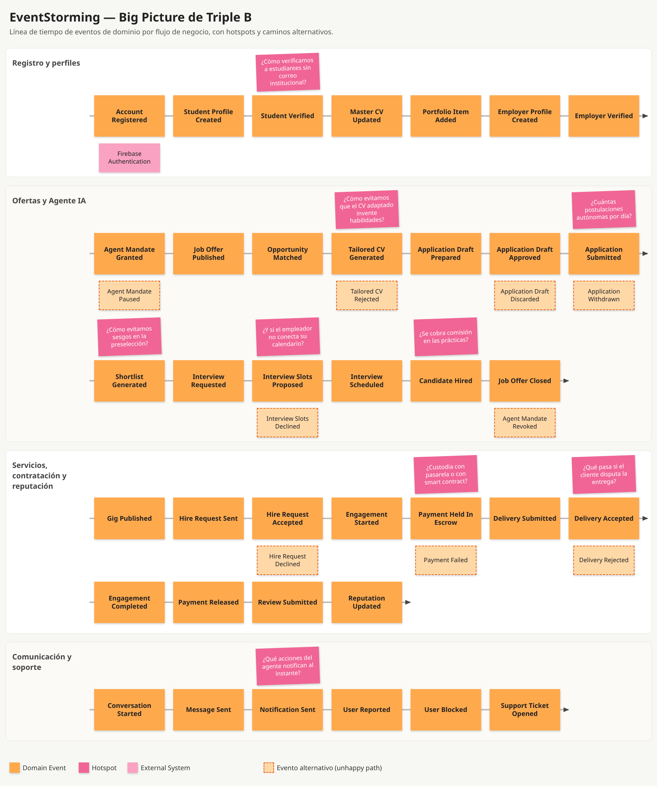

**Process level — Postulación asistida por el Agente IA.** El empleador publica una oferta; la política de matching evalúa a los estudiantes con mandato activo; si el match score supera el umbral, el agente genera el CV adaptado y prepara el borrador; el estudiante lo aprueba (o el agente lo envía dentro de los límites del modo Autónomo); luego el empleador genera la preselección, solicita la entrevista y el estudiante confirma una de las franjas propuestas.

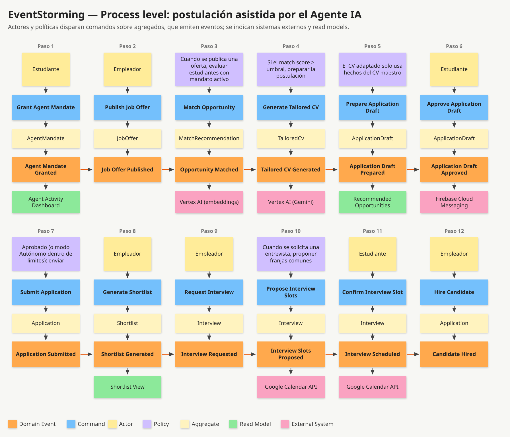

**Process level — Contratación de un servicio y pago en custodia.** El cliente contrata un servicio publicado; al aceptarse la solicitud inicia el encargo y el pago queda retenido en Mercado Pago; al aceptar la entrega se libera el pago descontando la comisión y se habilita la reseña, que actualiza la reputación del estudiante.

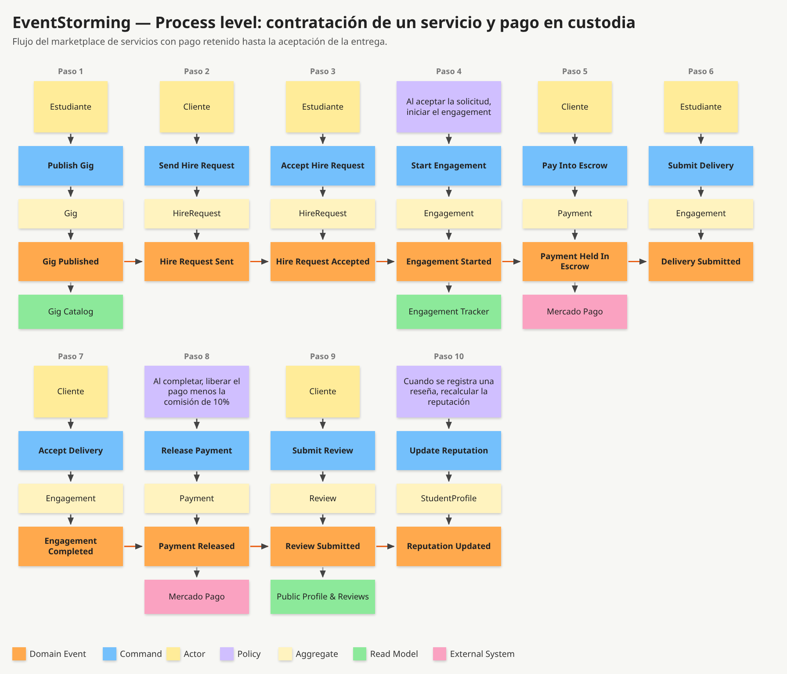

### 4.2.2. Candidate Context Discovery

Para descubrir los bounded contexts candidatos se combinaron dos técnicas:

- **Look-for-pivotal-events:** se marcaron los eventos que indican un cambio de etapa en el negocio (StudentVerified, AgentMandateGranted, JobOfferPublished, ApplicationSubmitted, CandidateHired, EngagementStarted, PaymentReleased y ReviewSubmitted). Las fronteras entre contextos se ubican alrededor de estos eventos.
- **Start-with-value:** se identificó el núcleo que genera la ventaja competitiva: el Agente IA y la identidad profesional verificada. Esos contextos se modelan primero y con mayor detalle.

El proceso fue: (1) marcar los pivotal events en el Big Picture; (2) agrupar los eventos entre ellos según la capacidad de negocio que representan; (3) nombrar cada grupo con el lenguaje ubicuo; y (4) clasificar los contextos en core, supporting o generic y contrastarlos con los Epics.

**Paso 1 — Pivotal events marcados sobre la línea de tiempo:**

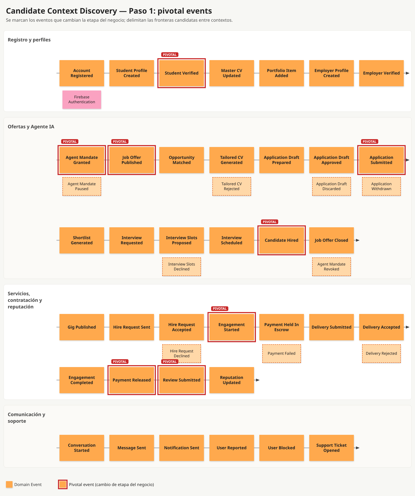

**Paso 2 — Eventos agrupados en bounded contexts candidatos:**

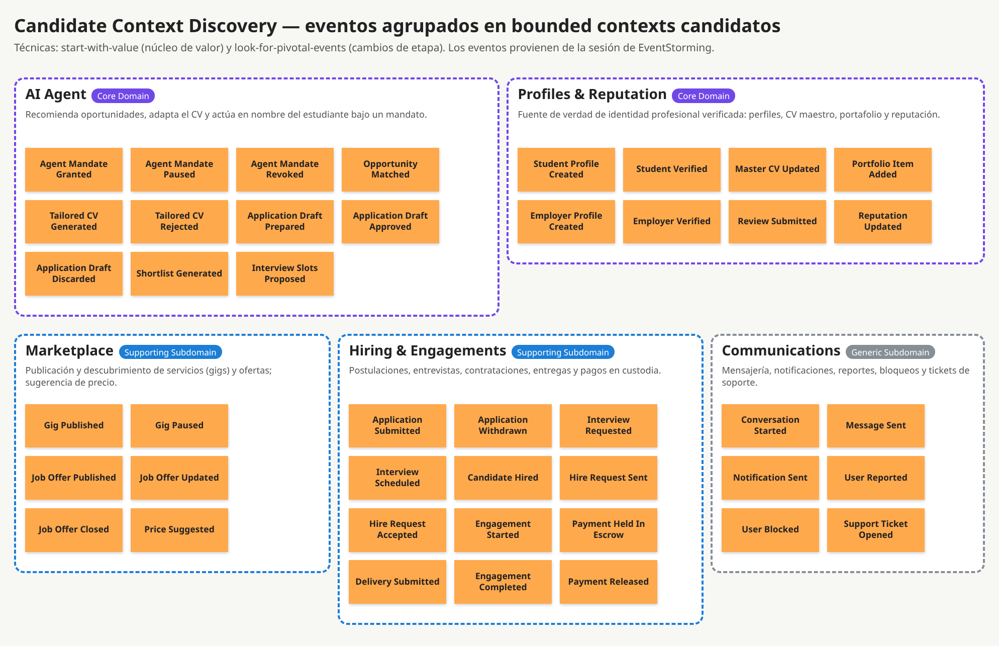

| Bounded context | Clasificación | Justificación | Epics |
| --- | --- | --- | --- |
| **AI Agent** | Core domain | Es el diferenciador frente a todos los competidores y concentra la mayor complejidad (IA, mandato y validación). | EP13 |
| **Profiles & Reputation** | Core domain | La verificación académica y la reputación inicial son la base de la confianza, segunda ventaja competitiva. | EP03, EP04, EP07 |
| **Marketplace** | Supporting subdomain | Necesario para el negocio, pero similar a los marketplaces existentes. | EP05, EP06, EP10, EP14 |
| **Hiring & Engagements** | Supporting subdomain | Coordina postulaciones, entrevistas, encargos y pagos; delega la custodia a un proveedor. | EP08, EP09 |
| **Communications** | Generic subdomain | Mensajería, notificaciones y soporte resueltos con servicios de terceros. | EP11, EP12 |

La autenticación (EP02) se considera un subdominio genérico que no se construye: se delega a Firebase Authentication y se integra mediante una capa anticorrupción en Profiles & Reputation. La landing page (EP01) es contenido estático sin modelo de dominio propio.

### 4.2.3. Domain Message Flows Modeling

Los flujos de mensajes entre bounded contexts se modelaron con **Domain Storytelling** (Hofer y Schwentner, 2021). Cada historia describe un escenario de negocio en oraciones numeradas con la notación pictográfica *actor → actividad → objeto de trabajo (→ actor)*; el color de cada oración indica el bounded context que atiende la actividad, de modo que los cambios de color muestran dónde un contexto envía un mensaje a otro.

**Historia 1 — Postulación asistida por el Agente IA.** Marketplace publica JobOfferPublished; AI Agent lo consume, consulta el CV maestro en Profiles & Reputation, genera la recomendación y el CV adaptado y, a través de Communications, notifica el borrador al estudiante. Tras la aprobación, AI Agent envía el comando de registro de la postulación a Hiring & Engagements.

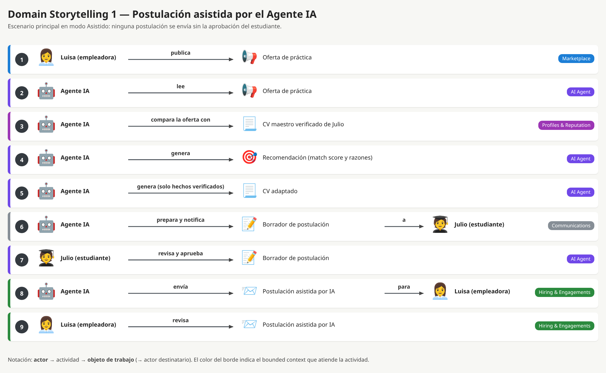

**Historia 2 — Preselección y entrevista.** El empleador pide la preselección a AI Agent, que ordena las postulaciones registradas en Hiring & Engagements sin usar atributos personales. La solicitud de entrevista se registra en Hiring & Engagements, que obtiene la disponibilidad de Google Calendar; AI Agent propone las franjas al estudiante y, al confirmarse una, Google Calendar envía la invitación.

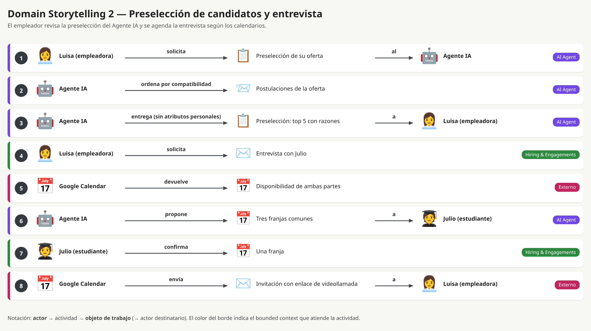

**Historia 3 — Contratación de un servicio y pago en custodia.** El cliente elige un servicio en Marketplace; la solicitud, el encargo, la entrega y el pago se gestionan en Hiring & Engagements con Mercado Pago como custodio; al completarse el encargo, Hiring & Engagements publica EngagementCompleted y Profiles & Reputation habilita la reseña.

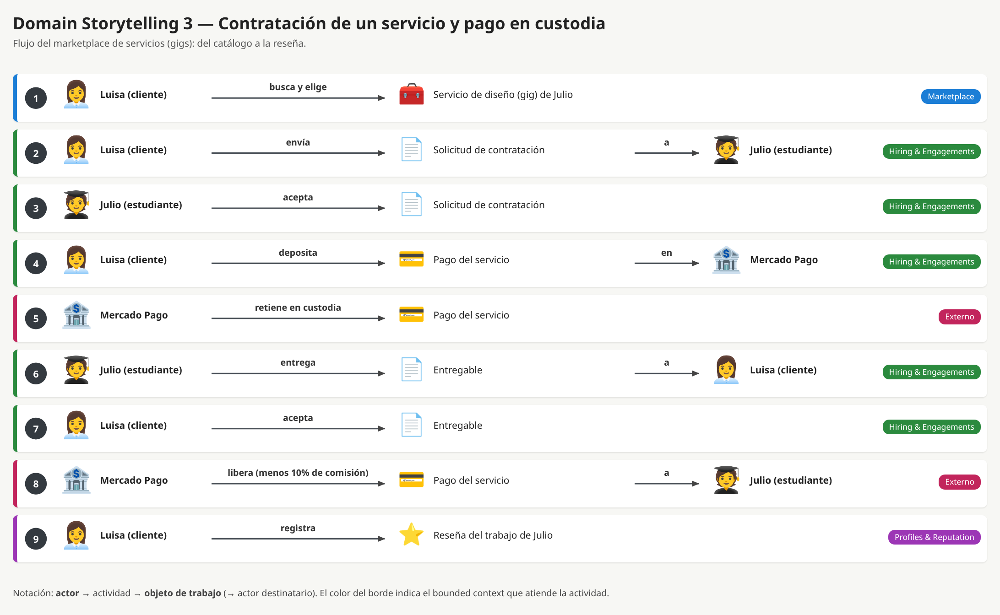

**Historia 4 — El estudiante mantiene el control.** Caminos alternativos dentro de AI Agent: rechazo de un borrador con ajuste de preferencias, pausa del agente y revocación del mandato con eliminación de los datos derivados.

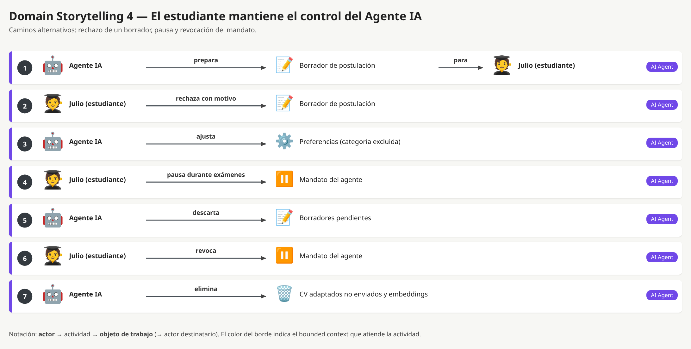

### 4.2.4. Bounded Context Canvases

Los canvases siguen la plantilla Bounded Context Canvas (DDD Crew, s.f.) y se elaboraron por orden de importancia (primero los core domains) con el proceso iterativo: definición del propósito (*context overview*), destilación de reglas de negocio y captura del lenguaje ubicuo, análisis de capacidades, estratificación de capacidades, registro de dependencias y crítica del diseño (*design critique*).

**Bounded Context Canvas — AI Agent**

| Campo | Contenido |
| --- | --- |
| **Name** | AI Agent |
| **Purpose** | Reducir el tiempo que el estudiante dedica a encontrar y postular a oportunidades, y el que el empleador dedica a preseleccionar, actuando siempre dentro del mandato otorgado por el estudiante. |
| **Strategic Classification** | Domain: Core · Business model: engagement y revenue · Evolution: custom built |
| **Domain Roles** | Analysis context (evalúa compatibilidad) y execution context (prepara y envía postulaciones bajo mandato). |
| **Inbound Communication** | Marketplace: JobOfferPublished, JobOfferUpdated, JobOfferClosed · Profiles & Reputation: StudentVerified, MasterCvUpdated y consulta del CV maestro · Hiring & Engagements: ApplicationStatusChanged, InterviewScheduled · Estudiante: GrantAgentMandate, ApproveApplicationDraft, PauseAgent, RevokeMandate · Empleador: GenerateShortlist · Agent Scheduler: barrido periódico · Vertex AI (ACL): embeddings y generación de texto. |
| **Outbound Communication** | Hiring & Engagements: SubmitApplication, RequestInterviewSlots · Communications: OpportunityMatched, ApplicationDraftPrepared, AgentMandatePaused · Todos los suscriptores: AgentMandateGranted, AgentMandateRevoked. |
| **Ubiquitous Language** | Agent Mandate, Autonomy Level, Opportunity, Match Score, Match Reason, Match Threshold, Tailored CV, Application Draft, Daily Application Limit, Shortlist. |
| **Business Decisions** | Sin consentimiento no hay mandato · El modo Asistido es el predeterminado · En modo Autónomo solo se envían borradores con match score mayor o igual al umbral y dentro del límite diario (máximo 10) · El CV adaptado solo contiene hechos del CV maestro · Toda postulación del agente se identifica como asistida por IA · El ranking de candidatos excluye sexo, edad, fotografía y distrito · Al cerrarse una oferta se descartan sus borradores · Al revocarse el mandato se eliminan los CV adaptados no enviados y los embeddings del perfil. |
| **Assumptions** | El modo Asistido ahorra suficiente tiempo al estudiante · El costo de Vertex AI se mantiene dentro de QA-09 · Los embeddings capturan la compatibilidad de habilidades descritas en español. |
| **Verification Metrics** | Tasa de aprobación de borradores · Conversión de postulación a entrevista (meta 30%) · Porcentaje de CV rechazados por el validador · Costo por postulación (meta USD 0.05) · Tiempo de publicación a recomendación (meta 5 min). |
| **Open Questions** | ¿Qué umbral se propone por defecto? · ¿Cómo explicar el match al empleador sin exponer datos personales? · ¿Se permite el modo Autónomo a estudiantes sin reseñas? |
| **Capabilities (layering)** | Mandate Management → Opportunity Matching → CV Tailoring & Fact Validation → Application Drafting → Candidate Shortlisting → Interview Slot Proposal. |
| **Design Critique** | Riesgo de que el contexto absorba la gestión de postulaciones: el ciclo de vida de la postulación se mantiene en Hiring & Engagements y el agente solo la prepara y envía. Si crece, se dividirá en Matching y Agent Orchestration (DF-02). |

**Bounded Context Canvas — Profiles & Reputation**

| Campo | Contenido |
| --- | --- |
| **Name** | Profiles & Reputation |
| **Purpose** | Ser la fuente de verdad de la identidad profesional verificada de estudiantes y empleadores y de su reputación, para generar confianza entre las partes. |
| **Strategic Classification** | Domain: Core · Business model: engagement y compliance · Evolution: custom built |
| **Domain Roles** | Specification context (define los hechos verificados) y audit context (reputación). |
| **Inbound Communication** | Firebase Authentication (ACL): cuenta registrada · Hiring & Engagements: EngagementCompleted (habilita reseñas) · Estudiante: CreateStudentProfile, VerifyStudent, UploadMasterCv, AddPortfolioItem · Empleador: CreateEmployerProfile · Usuarios: SubmitReview · Administrador: ApproveEnrollmentProof. |
| **Outbound Communication** | AI Agent: StudentVerified, MasterCvUpdated y CV maestro (OHS) · Marketplace: perfil público y reputación (OHS/PL) · Communications: StudentVerified, ReviewSubmitted. |
| **Ubiquitous Language** | Student Profile, Verified Student, Employer Profile, Verified Employer, Master CV, Portfolio Item, Skill, Review, Reputation, Badge. |
| **Business Decisions** | La verificación de estudiante se renueva cada ciclo académico · Solo empleadores verificados publican ofertas · Solo los participantes de un encargo completado pueden reseñarse, una vez por encargo · La edición de una reseña queda marcada y fechada · Cada cambio del CV maestro genera una nueva versión. |
| **Assumptions** | Las universidades tienen dominios de correo institucional identificables · Los empleadores aceptan verificarse con RUC o documento de identidad. |
| **Verification Metrics** | Porcentaje de estudiantes verificados · Tiempo de verificación · Porcentaje de perfiles con portafolio · Reseñas por encargo completado. |
| **Open Questions** | ¿Cómo verificar a empleadores personas naturales sin RUC? · ¿Qué controles antifraude necesitan las reseñas? |
| **Capabilities (layering)** | Identity Linkage (ACL) → Student & Employer Verification → Master CV & Portfolio → Reviews & Reputation → Badges. |
| **Design Critique** | Combina perfil y reputación para formar un "perfil de confianza"; si las reglas antifraude de reputación crecen, se evaluará separarla. |

**Bounded Context Canvas — Marketplace**

| Campo | Contenido |
| --- | --- |
| **Name** | Marketplace |
| **Purpose** | Publicar y descubrir servicios de estudiantes y ofertas de empleadores con información clara de precio y condiciones. |
| **Strategic Classification** | Domain: Supporting · Business model: revenue · Evolution: product |
| **Domain Roles** | Publishing context (borrador y publicación) y discovery context (catálogo). |
| **Inbound Communication** | Estudiante: PublishGig, UpdateGig, PauseGig · Empleador: PublishJobOffer, UpdateJobOffer, CloseJobOffer · Cliente: consultas del catálogo · Profiles & Reputation: perfil público y reputación. |
| **Outbound Communication** | AI Agent, Hiring & Engagements y Communications: JobOfferPublished, JobOfferUpdated, JobOfferClosed, GigPublished (PL) · Todos los contextos: taxonomía de habilidades (PL). |
| **Ubiquitous Language** | Gig, Job Offer, Internship Position, Skill, Category, Price Suggestion. |
| **Business Decisions** | Solo empleadores verificados publican ofertas · Un servicio requiere tarifa y plazo · Los servicios pausados no reciben solicitudes · La sugerencia de precio es referencial: el estudiante decide la tarifa final. |
| **Assumptions** | Los empleadores prefieren publicar en Triple B antes que en redes sociales si la publicación es guiada. |
| **Verification Metrics** | Ofertas publicadas por mes (BG4) · Conversión de búsqueda a solicitud de contratación. |
| **Open Questions** | ¿Se requiere moderación previa de las ofertas? |
| **Capabilities (layering)** | Skill Taxonomy → Gig Publishing → Job Offer Publishing → Catalog Search → Price Suggestion. |
| **Design Critique** | El matching no debe implementarse aquí: pertenece al AI Agent, que evoluciona a otro ritmo. |

**Bounded Context Canvas — Hiring & Engagements**

| Campo | Contenido |
| --- | --- |
| **Name** | Hiring & Engagements |
| **Purpose** | Llevar una postulación o una solicitud de contratación hasta un encargo completado y pagado de forma segura. |
| **Strategic Classification** | Domain: Supporting · Business model: revenue (comisión) · Evolution: custom built |
| **Domain Roles** | Execution context y approver context. |
| **Inbound Communication** | AI Agent: SubmitApplication, RequestInterviewSlots · Estudiante: SubmitApplication, ConfirmInterviewSlot, AcceptHireRequest, SubmitDelivery · Empleador o cliente: RequestInterview, HireCandidate, SendHireRequest, PayIntoEscrow, AcceptDelivery · Marketplace: JobOfferClosed · Google Calendar (ACL): disponibilidad · Mercado Pago (ACL): notificaciones de pago. |
| **Outbound Communication** | AI Agent: ApplicationStatusChanged, InterviewScheduled · Profiles & Reputation: EngagementCompleted · Communications: ApplicationSubmitted, InterviewScheduled, PaymentReleased · Google Calendar: creación de eventos · Mercado Pago: cobros y liberaciones. |
| **Ubiquitous Language** | Application, Interview, Interview Slot, Hire Request, Engagement, Delivery, Escrow, Payment Release, Commission. |
| **Business Decisions** | Una postulación por estudiante y oferta · No se aceptan postulaciones a ofertas cerradas · La entrevista requiere la confirmación del estudiante · El pago se retiene hasta la aceptación de la entrega · Al liberarse se descuenta la comisión de 10% en servicios. |
| **Assumptions** | Mercado Pago permite retener y liberar pagos entre las partes · Los empleadores aceptan conectar su calendario o registrar su disponibilidad. |
| **Verification Metrics** | Tiempo de publicación a primera entrevista (meta menor a 72 horas, BG5) · Porcentaje de pagos en custodia liberados · Número de disputas. |
| **Open Questions** | ¿Se cobra comisión en contrataciones de práctica? · ¿Existe aceptación tácita de la entrega tras un plazo? · ¿Cómo se resuelven las disputas? |
| **Capabilities (layering)** | Applications → Interview Scheduling → Hire Requests → Engagement Tracking → Escrow Payments. |
| **Design Critique** | Es el contexto más amplio; si la gestión de pagos crece, se separará en Hiring y Engagements & Payments. Se reserva el puerto `EscrowProvider` para evaluar un smart contract (DF-01). |

**Bounded Context Canvas — Communications**

| Campo | Contenido |
| --- | --- |
| **Name** | Communications |
| **Purpose** | Mantener informadas y comunicadas a las partes y resguardar la convivencia en la plataforma. |
| **Strategic Classification** | Domain: Generic · Business model: engagement · Evolution: commodity |
| **Domain Roles** | Gateway context (notificaciones) e interchange context (mensajería). |
| **Inbound Communication** | Eventos publicados por los demás contextos (PL) · Usuarios: SendMessage, ReportUser, BlockUser, OpenSupportTicket · Administrador: ResolveReport. |
| **Outbound Communication** | SendGrid y Firebase Cloud Messaging (ACL): correos y notificaciones push · Suscriptores: UserBlocked, UserReported. |
| **Ubiquitous Language** | Conversation, Message, Notification, User Report, Support Ticket. |
| **Business Decisions** | Un usuario bloqueado no puede enviar mensajes a quien lo bloqueó · Las acciones del agente que requieren una decisión se notifican de inmediato · Se respetan las preferencias de notificación del usuario. |
| **Assumptions** | Las notificaciones push son el canal preferido para decisiones urgentes. |
| **Verification Metrics** | Tiempo de entrega de notificaciones · Tasa de apertura · Tiempo de resolución de tickets. |
| **Open Questions** | ¿Durante cuánto tiempo se conservan los mensajes? |
| **Capabilities (layering)** | Notifications → Messaging → Reports & Moderation → Support Tickets. |
| **Design Critique** | Debe permanecer genérico y sin reglas de otros contextos para poder reemplazar a los proveedores sin afectar al dominio. |

### 4.2.5. Context Mapping

El Context Map se construyó evaluando alternativas a partir de las preguntas propuestas por la guía del curso y conservando la opción que mejor equilibra autonomía de los contextos, costo y claridad del modelo:

| Pregunta | Alternativa evaluada | Decisión |
| --- | --- | --- |
| ¿Qué pasaría si movemos el matching al Marketplace? | Marketplace se volvería complejo y acoplaría el catálogo a la IA. | Se mantiene en AI Agent, que evoluciona a otro ritmo y es el core domain. |
| ¿Qué pasaría si partimos AI Agent en Matching y Agent Orchestration? | Más autonomía, pero más integraciones para un equipo de cinco personas. | Se difiere (DF-02); se separan como capacidades internas. |
| ¿Qué pasaría si movemos las reseñas a Hiring & Engagements, donde nacen? | Las consumen Marketplace y AI Agent para mostrar y ordenar perfiles. | Se ubican en Profiles & Reputation, que ya es la fuente de confianza. |
| ¿Qué pasaría si creamos un shared service para la taxonomía de habilidades? | Un Shared Kernel acoplaría a tres contextos a un mismo modelo. | Marketplace la publica como Published Language y los demás la consumen. |
| ¿Qué pasaría si duplicamos los datos de la oferta en AI Agent para romper la dependencia? | El agente no depende de consultas síncronas durante el matching. | Se adopta: AI Agent mantiene una proyección local (Opportunity) alimentada por eventos. |
| ¿Qué pasaría si aislamos los core capabilities y delegamos lo demás? | Identidad, notificaciones y pagos son genéricos. | Se delegan a Firebase Authentication, SendGrid, FCM y Mercado Pago mediante ACL. |

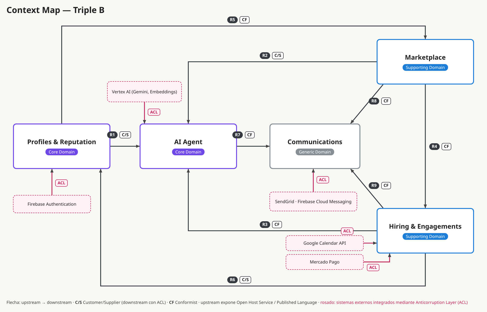

| ID | Upstream | Downstream | Patrón | Descripción |
| :---: | --- | --- | --- | --- |
| R1 | Profiles & Reputation (OHS/PL) | AI Agent (ACL) | Customer/Supplier | El agente consume el CV maestro y los eventos de verificación y los traduce a su propio modelo de candidato. |
| R2 | Marketplace (OHS/PL) | AI Agent (ACL) | Customer/Supplier | El agente traduce las ofertas publicadas a su proyección Opportunity. |
| R3 | Hiring & Engagements (OHS/PL) | AI Agent | Conformist | El agente registra postulaciones con el contrato de la API de postulaciones y consume sus estados. |
| R4 | Marketplace (OHS/PL) | Hiring & Engagements | Conformist | Las postulaciones y solicitudes referencian ofertas y servicios del catálogo. |
| R5 | Profiles & Reputation (OHS/PL) | Marketplace | Conformist | El catálogo muestra el perfil público y la reputación del estudiante. |
| R6 | Hiring & Engagements (PL) | Profiles & Reputation | Customer/Supplier | EngagementCompleted habilita las reseñas. |
| R7–R9 | AI Agent, Marketplace e Hiring & Engagements (PL) | Communications | Conformist | Communications notifica a partir de los eventos publicados. También consume, con la misma relación, los eventos de Profiles & Reputation (no dibujados para mantener la legibilidad). |
| E1–E5 | Firebase Authentication, Vertex AI, Google Calendar, Mercado Pago, SendGrid y FCM | Profiles & Reputation, AI Agent, Hiring & Engagements y Communications | Anticorruption Layer | Cada integración externa se traduce en un adaptador para que el modelo del proveedor no contamine el dominio. |

El mapa también se describe en ContextMapper DSL en [`architecture/context-map.cml`](architecture/context-map.cml).

## 4.3. Software Architecture

La arquitectura se especifica con el C4 Model (Brown, s.f.). Los diagramas se definen como código en Structurizr DSL en [`architecture/workspace.dsl`](architecture/workspace.dsl) y se exportan con Structurizr CLI y PlantUML mediante `python3 architecture/render.py`; el mismo archivo puede abrirse en Structurizr Lite para editar la disposición.

### 4.3.1. Software Architecture System Landscape Diagram

El System Landscape muestra los sistemas de NodoB y su entorno: la **Triple B Landing Page**, que atrae a visitantes de ambos segmentos y registra su navegación en Google Analytics, y la **Triple B Platform**, que usan estudiantes, empleadores y administradores. La plataforma depende de servicios externos para la autenticación (Firebase Authentication), los modelos de IA (Vertex AI), los calendarios (Google Calendar API), los pagos (Mercado Pago), el correo (SendGrid) y las notificaciones push (Firebase Cloud Messaging).

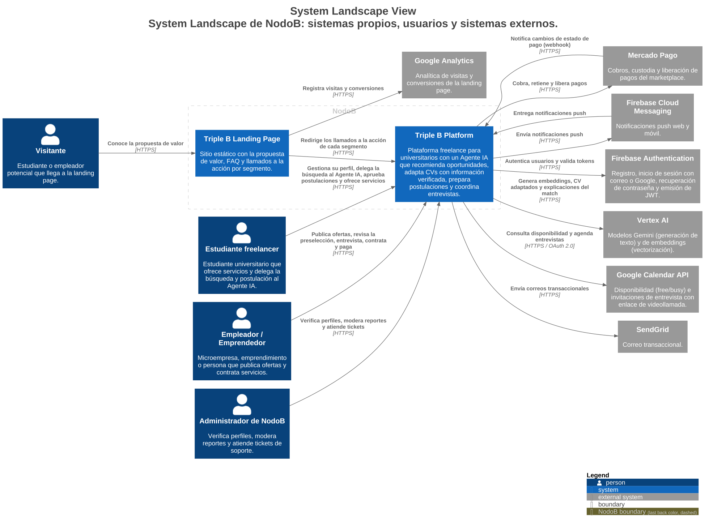

### 4.3.2. Software Architecture Context Level Diagrams

El diagrama de contexto ubica a Triple B Platform al centro, rodeada por sus usuarios —estudiante freelancer, empleador o emprendedor y administrador— y por los sistemas con los que interactúa. La landing page redirige los llamados a la acción de cada segmento a la aplicación web. Mercado Pago tiene una relación bidireccional: recibe cobros y liberaciones y notifica los cambios de estado mediante webhooks.

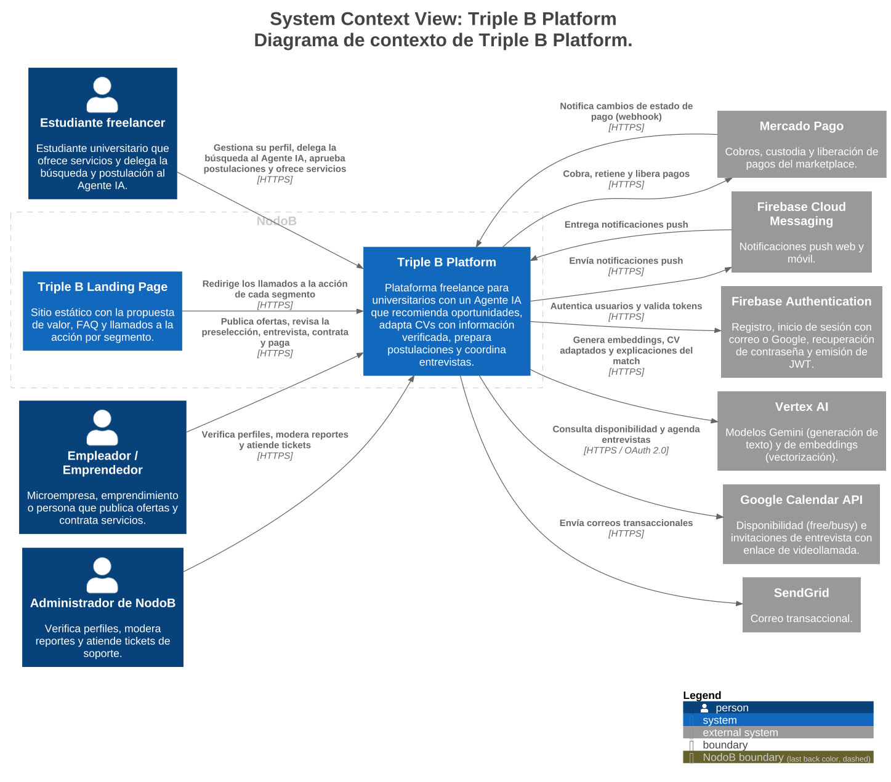

### 4.3.3. Software Architecture Container Level Diagrams

El diagrama de contenedores muestra cómo se distribuyen las responsabilidades. Las aplicaciones web y móvil se autentican con Firebase y consumen los servicios a través del API Gateway, que valida el JWT; la mensajería en tiempo real usa WebSocket directo con Communications Service. Existe un servicio por bounded context, cada uno con su base de datos lógica, y los contextos se integran mediante eventos en el Event Bus. El AI Agent se divide en un servicio de API y un worker que procesa los eventos y los barridos periódicos.

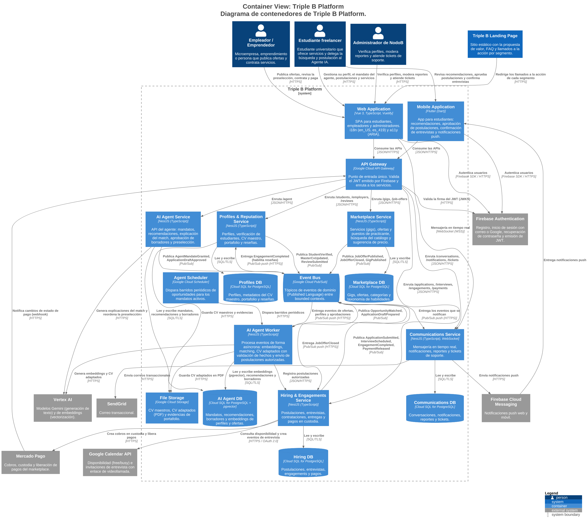

La siguiente vista se centra en los contenedores que participan en el flujo del Agente IA:

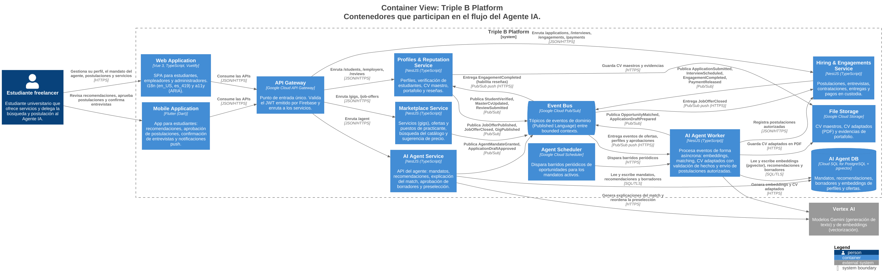

| Contenedor | Tecnología | Responsabilidad | Bounded context |
| --- | --- | --- | --- |
| Web Application | Vue 3, TypeScript, Vuetify | SPA para estudiantes, empleadores y administradores; i18n y a11y. | — |
| Mobile Application | Flutter (Dart) | Recomendaciones, aprobación de postulaciones, entrevistas y push para estudiantes. | — |
| API Gateway | Google Cloud API Gateway | Punto de entrada único y validación del JWT. | — |
| Profiles & Reputation Service | NestJS | Perfiles, verificación, CV maestro, portafolio y reseñas. | Profiles & Reputation |
| Marketplace Service | NestJS | Servicios, ofertas, catálogo y sugerencia de precio. | Marketplace |
| AI Agent Service | NestJS | Mandatos, recomendaciones, aprobación de borradores y preselección. | AI Agent |
| AI Agent Worker | NestJS | Embeddings, matching, CV adaptados con validación y envío de postulaciones. | AI Agent |
| Hiring & Engagements Service | NestJS | Postulaciones, entrevistas, encargos y pagos en custodia. | Hiring & Engagements |
| Communications Service | NestJS, WebSocket | Mensajería, notificaciones, reportes y tickets. | Communications |
| Event Bus | Google Cloud Pub/Sub | Eventos de dominio entre contextos. | — |
| Agent Scheduler | Google Cloud Scheduler | Barridos periódicos de oportunidades. | AI Agent |
| Profiles, Marketplace, AI Agent, Hiring y Communications DB | Cloud SQL for PostgreSQL (pgvector en AI Agent DB) | Persistencia de cada contexto. | Uno por contexto |
| File Storage | Google Cloud Storage | CV maestros, CV adaptados y evidencias de portafolio. | Profiles & Reputation, AI Agent |

### 4.3.4. Software Architecture Deployment Diagrams

En producción, la landing page y los archivos de la aplicación web se sirven desde Firebase Hosting con CDN global; la aplicación web se ejecuta en el navegador y la aplicación móvil en el smartphone del estudiante (distribuida en beta con Firebase App Distribution). En Google Cloud, región us-central1, el API Gateway enruta a los seis servicios desplegados en Cloud Run, que escalan a cero cuando no hay demanda; Pub/Sub entrega los eventos por push; Cloud Scheduler dispara los barridos del agente; Cloud SQL aloja una base de datos lógica por contexto con pgvector; Cloud Storage guarda los archivos con acceso mediante URL firmadas; Secret Manager resguarda las credenciales de los servicios externos; y Cloud Logging & Monitoring centraliza logs, métricas y alertas. Para facilitar la lectura, el diagrama omite las relaciones con el Event Bus y el almacenamiento, que se muestran en el diagrama de contenedores.

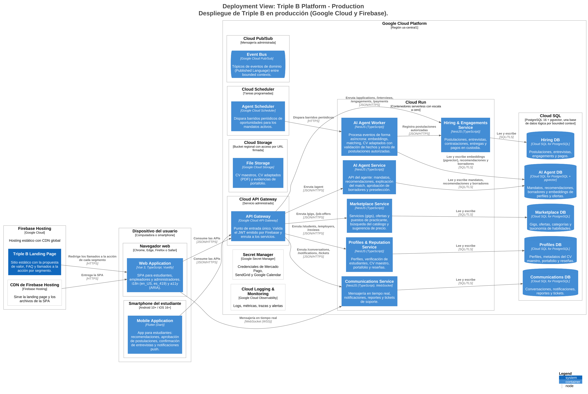

# Conclusiones

## Conclusiones y recomendaciones

**Conclusiones del avance TB1**

1. La problemática de Triple B está sustentada con fuentes oficiales: el desempleo juvenil (11.3% en el primer trimestre y 13.0% en el segundo trimestre de 2025) duplica el promedio nacional y el subempleo afecta al 58.2% de la PEA ocupada joven (Instituto Nacional de Estadística e Informática, 2025a, 2025b); además, el 31.6% de los estudiantes que no hizo prácticas lo atribuye a la falta de tiempo (Ministerio de Educación del Perú, 2021). Este último dato vincula el problema con la propuesta del Agente IA.
2. Las seis entrevistas registradas confirman la desconfianza hacia los perfiles estudiantiles (100% del Segmento 1), la preferencia por que la plataforma gestione acuerdos y pagos (100% del Segmento 2) y la demanda de sugerencias de proyectos por perfil (50% del Segmento 1). En cambio, la disposición a delegar la postulación a una IA aún no fue consultada, por lo que las hipótesis H1 a H4 siguen abiertas y el diseño adopta el modo Asistido como predeterminado.
3. El análisis competitivo muestra que la automatización de postulaciones con IA ya existe (AIApply) y que los marketplaces globales incorporan agentes (Upwork); la ventaja de Triple B no es la IA en sí, sino combinarla con la verificación académica, el control del estudiante y los pagos en custodia dentro de un mismo marketplace.
4. La especificación se consolidó en 14 Epics y 86 historias (User Stories, Technical Stories y Spikes), priorizadas por valor en un Product Backlog de 318 Story Points y trazadas a seis Business Goals SMART.
5. El diseño estratégico, obtenido con ADD en tres iteraciones y DDD estratégico, define cinco bounded contexts (dos core, dos supporting y uno generic) desplegados como microservicios en Google Cloud Run, integrados por eventos y con una base de datos lógica por contexto. Las decisiones de mayor impacto responden a los escenarios de veracidad del CV adaptado (QA-05), recomendaciones oportunas (QA-01) e independencia del proveedor de IA (QA-06).

**Recomendaciones para las siguientes entregas**

1. Completar la tercera entrevista del Segmento 2 y aplicar las preguntas † de la guía TB1 para validar H1 a H4, midiendo la línea base de tiempo de búsqueda y postulación que requiere BG2.
2. Desarrollar el diseño táctico (Capítulo V) de los cinco bounded contexts, asignando un contexto a cada integrante para distribuir el trabajo y evidenciar la participación individual.
3. Prototipar en el Capítulo VI los flujos de mandato, aprobación de borradores y explicación del match, que concentran la confianza en el agente (QA-08).
4. Evaluar en la Unidad 3 del curso la custodia de pagos mediante smart contracts (DF-01) y aprovechar los módulos de Vector Search and Embeddings y Responsible AI del programa Google Cloud Career Launchpad, directamente relacionados con DD-04 y TS-C10.

# Bibliografía

AIApply. (2026). *AIApply: AI job search platform*. Recuperado el 25 de septiembre de 2026, de https://aiapply.co/

Banco Mundial. (2023). *Working without borders: The promise and peril of online gig work*. https://openknowledge.worldbank.org/entities/publication/ebc4a7e2-85c6-467b-8713-e2d77e954c6c

Banco Mundial. (2024). *Working without borders: The promise and peril of online gig work. Short note series #7: Designing online gig work programs*. https://documents1.worldbank.org/curated/en/099031124115527812/pdf/P17730216232d302c18090144487d337250.pdf

Bass, L., Clements, P., & Kazman, R. (2021). *Software architecture in practice* (4.ª ed.). Addison-Wesley.

Brandolini, A. (2021). *Introducing EventStorming*. Leanpub. https://leanpub.com/introducing_eventstorming

Brown, S. (s.f.). *The C4 model for visualising software architecture*. https://c4model.com

Cervantes, H., & Kazman, R. (2016). *Designing software architectures: A practical approach*. Addison-Wesley.

Congreso de la República del Perú. (2011). *Ley N.º 29733, Ley de Protección de Datos Personales*. https://www.leyes.congreso.gob.pe/documentos/leyes/29733.pdf

Congreso de la República del Perú. (2014). *Ley N.º 30220, Ley Universitaria*. https://leyes.congreso.gob.pe/Documentos/Leyes/Textos/30220.pdf

DDD Crew. (s.f.). *The Bounded Context Canvas*. GitHub. https://github.com/ddd-crew/bounded-context-canvas

Evans, E. (2003). *Domain-driven design: Tackling complexity in the heart of software*. Addison-Wesley.

Gothelf, J., & Seiden, J. (2021). *Lean UX: Creating great products with agile teams* (3.ª ed.). O'Reilly Media.

Hofer, S., & Schwentner, H. (2021). *Domain storytelling: A collaborative, visual, and agile way to build domain-driven software*. Addison-Wesley.

Instituto Nacional de Estadística e Informática. (2025a). *Perú: Comportamiento de los indicadores del mercado laboral a nivel nacional y en 27 ciudades. Primer trimestre 2025* [Informe técnico]. https://www.inei.gob.pe/media/MenuRecursivo/boletines/informe-tecnico_empleonacional_1.pdf

Instituto Nacional de Estadística e Informática. (2025b). *Perú: Comportamiento de los indicadores del mercado laboral a nivel nacional y en 27 ciudades. Segundo trimestre 2025* [Informe técnico]. https://m.inei.gob.pe/media/MenuRecursivo/boletines/informe-tecnico_empleonacional_2.pdf

Ministerio de Educación del Perú. (2021). *Encuesta Nacional de Estudiantes de Educación Superior Universitaria 2019: Principales resultados*. https://repositorio.minedu.gob.pe/handle/20.500.12799/7745

Ministerio de Educación del Perú. (2023). *La universidad en cifras*. https://repositorio.minedu.gob.pe/handle/20.500.12799/9077

Ministerio de la Producción. (2024). *Las MIPYME en cifras 2023*. https://ogeiee.produce.gob.pe/index.php/en/shortcode/oee-documentos-publicaciones/publicaciones-anuales/item/1225-las-mipyme-en-cifras-2023

Organización Internacional del Trabajo. (2021). *Perspectivas Sociales y del Empleo en el Mundo 2021: El papel de las plataformas digitales en la transformación del mundo del trabajo*. https://www.ilo.org/sites/default/files/wcmsp5/groups/public/@dgreports/@dcomm/@publ/documents/publication/wcms_823119.pdf

Organización Internacional del Trabajo. (2025). *Juventud en cambio: Desafíos y oportunidades en el mercado laboral de América Latina y el Caribe*. https://www.ilo.org/es/publications/informe-juventud-en-cambio-lac

Upwork Inc. (2025, 23 de julio). *Upwork evolves Uma AI into AI work agent, advances human-AI collaboration across hiring and work management* [Comunicado de prensa]. https://investors.upwork.com/news-releases/news-release-details/upwork-evolves-uma-ai-ai-work-agent-advances-human-ai

Vernon, V. (2016). *Domain-driven design distilled*. Addison-Wesley.

# Anexos

## Anexo A. Tableros, fuentes de diagramas y backlog

| Artefacto | Herramienta | Enlace o archivo |
| --- | --- | --- |
| As-Is Scenario Mapping | Miro | https://miro.com/app/board/uXjVIFvzuZo=/?share_link_id=785027992176 |
| To-Be Scenario Mapping e Impact Maps (versión TB1) | Diagramas como código | [`diagrams/cap3.py`](diagrams/cap3.py) |
| EventStorming, Candidate Contexts, Domain Storytelling y Context Map | Diagramas como código | [`diagrams/cap4.py`](diagrams/cap4.py) |
| Context Map | ContextMapper DSL | [`architecture/context-map.cml`](architecture/context-map.cml) |
| Diagramas C4 | Structurizr DSL | [`architecture/workspace.dsl`](architecture/workspace.dsl) |
| Product Backlog | Jira Software (importación CSV) | [`backlog/product-backlog.csv`](backlog/product-backlog.csv) |
| User Personas y Empathy Maps | UXPressia | ⚠️ PENDIENTE: enlace público del proyecto |

Los diagramas como código se regeneran con `python3 diagrams/build_diagrams.py` y `python3 architecture/render.py` (ver [`diagrams/README.md`](diagrams/README.md)).

## Anexo B. Videos de Exposiciones

| Entrega | Video | Archivo |
| --- | --- | --- |
| TB1 | ⚠️ PENDIENTE: enlace privado de Microsoft Stream | `upc-pre-202620-1asi0728-9075-nodob-expo-tb1.mp4` |

## Anexo C. Videos de entrevistas (Needfinding)

| Entrevista | Segmento | Video |
| --- | --- | --- |
| Video consolidado de needfinding | Ambos | ⚠️ PENDIENTE: `upc-pre-202620-1asi0728-9075-nodob-needfinding-sprint-1` en Microsoft Stream |
| Bruno Sebastián Gamarra Torres | 1 | ⚠️ PENDIENTE |
| Werner Lang | 1 | ⚠️ PENDIENTE |
| Mario André Cacho Seminario | 1 | [YouTube](https://youtu.be/hSg2bZ3Jgbc) |
| Gabriela Diaz | 1 | [Microsoft Stream (SharePoint UPC)](https://upcedupe-my.sharepoint.com/:v:/g/personal/u202118152_upc_edu_pe/IQCYZtcqd5fXSLvFSwvj0aurAVTUJ0an7Q1sDr3I0NYXtVo) |
| Yulia Estephania Martinez Martinez | 2 | [YouTube](https://youtu.be/MFs44DHr8_Q) |
| Fabrizio Morales | 2 | [Microsoft Stream (SharePoint UPC)](https://upcedupe-my.sharepoint.com/:v:/g/personal/u202213241_upc_edu_pe/ERWRYYotMDNKrb9UZXiaV90BczcuHnygJ1UOZNQE1nmmxQ) |
| Entrevistado N°3 del Segmento 2 | 2 | ⚠️ PENDIENTE |

## Anexo D. Uso de inteligencia artificial generativa

De acuerdo con la metodología del curso, que incorpora el uso de IA generativa para identificar drivers arquitectónicos y generar artefactos de arquitectura, en la versión 0.6.0 del informe se utilizó un asistente de IA generativa (Claude, de Anthropic) para:

- Revisar el informe contra el enunciado del trabajo final y el sílabo, e identificar secciones faltantes o inconsistentes.
- Verificar en las fuentes originales las cifras citadas (INEI, MINEDU, PRODUCE, OIT y Banco Mundial) y corregir las referencias que no correspondían.
- Proponer la primera versión de los cuadros de ADD (escenarios, restricciones, drivers y matrices de patrones), de los Bounded Context Canvases y del Context Map.
- Generar los diagramas como código (To-Be, Impact Maps, EventStorming, Domain Storytelling, Context Map y C4 en Structurizr DSL) y reorganizar las User Stories y el Product Backlog.

La IA no generó datos de entrevistas ni resultados de usuarios: los datos de las entrevistas provienen de las grabaciones registradas en el historial del repositorio, y los faltantes se marcan como PENDIENTE. El equipo es responsable de revisar, validar y ajustar todo el contenido antes de la entrega.

