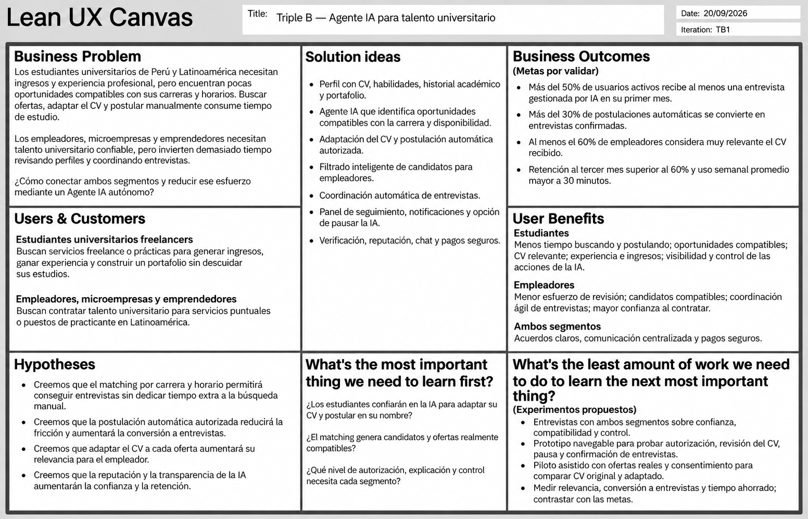
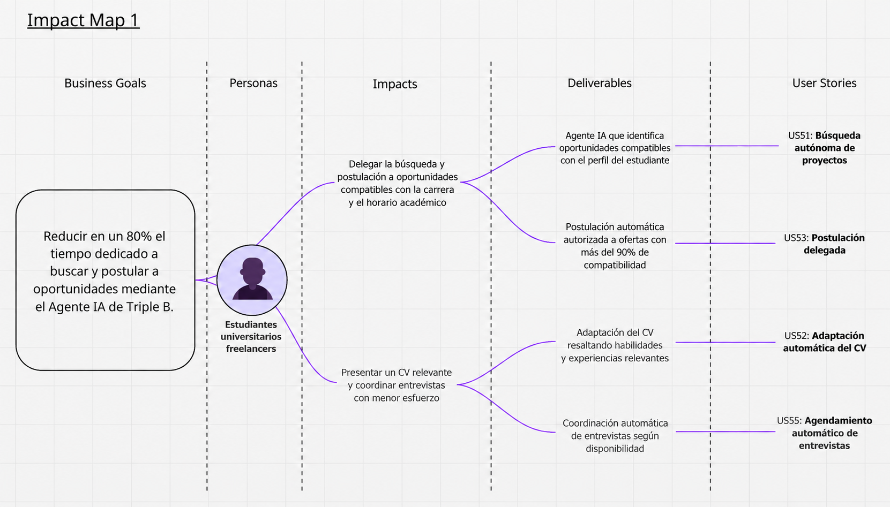
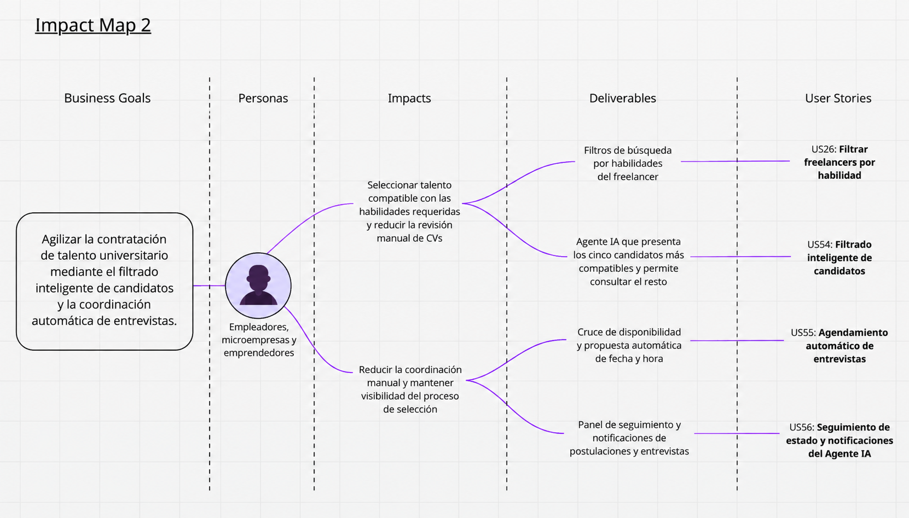

  

## 
Universidad Peruana de Ciencias Aplicadas

Ingeniería de Software

9075 — Arquitecturas de Software Emergentes

<strong>Profesor:</strong> Wilder Aurelio Vega Calero

# 
TRABAJO FINAL

<strong>Nombre del Producto: </strong> Triple B

<strong>Startup: </strong> NodoB

### Integrantes:

| Código     | Nombres y Apellidos            |
| ---------- | ------------------------------ |
| U202120836 | Gonza Morales, Anderson        |
| U202222745 | Guerrero Tomas, Nelson         |
| U202118152 | Gutierrez Tume Stanley Jeremy         |
| U20231f226 | Rafael Augusto Tasayco Almonacid         |
| u202218531| Andy Alejandro Mio Mejia       |

<strong>Septiembre 2026</strong>

# Project Report Collaboration Insights

Para realizar el informe de este proyecto, utilizaremos un repositorio llamado “1ASI0728-2620-9075-Report” el cual está colocado en nuestra organización llamada  
“1ASI0728-2620-9075-Triple B” en GitHub. Se puede observar en el siguiente enlace:
https://github.com/1ASI0728-2620-9075-Triple-B/1ASI0728-2620-9075-Report

# Registro de versiones del informe

| Versión | Fecha | Autores | Descripción |
| :------ | :--------- | :-------------------------------------------------------------------------- | :------------------------------------------------------------------------------------------------------------------------------------------------------------------------------------------------------------------------------------------------------------------------------------------------------------------------------------------- |
| TB1 | 19/09/2026 | Gonza Morales, Anderson; Guerrero Tomas, Nelson; Gutierrez Tume, Stanley  Jeremy ;Tasayco Almonacid, Rafael Augusto; Andy Alejandro Mio Mejia | Se elaboró la primera versión del informe del Trabajo Final de Triple B para el curso de Arquitecturas de Software Emergentes. Se adaptó el informe previo del curso de Fundamentos de Arquitectura de Software, actualizando la carátula, el registro de versiones, el Student Outcome (SO3) y los Capítulos I, II y III para reflejar el nuevo nombre del producto y la incorporación de la Inteligencia Artificial como componente emergente central: el Agente IA autónomo que actúa como intermediario entre estudiantes y empleadores. Se añadió el Epic EP13 (Agente IA Autónomo) con las User Stories US51–US56. Se desarrolló íntegramente el nuevo Capítulo IV (Strategic-Level Software Design), incluyendo las secciones de Strategic-Level Attribute-Driven Design, Strategic-Level Domain-Driven Design (EventStorming, Candidate Contexts, Domain Message Flows, Bounded Context Canvases, Context Mapping) y Software Architecture (System Landscape, Context Level, Container Level y Deployment Diagrams). |

# Tabla de Contenidos

* [Student Outcome](#student-outcome)

* [Capítulo I: Introducción](#capítulo-i-introducción)

  * [1.1. Startup Profile](#11-startup-profile)

    * [1.1.1. Descripción de la Startup](#111-descripción-de-la-startup)
    * [1.1.2. Perfiles de integrantes del equipo](#112-perfiles-de-integrantes-del-equipo)

  * [1.2. Solution Profile](#12-solution-profile)

    * [1.2.1. Nombre del producto](#121-nombre-del-producto)
    * [1.2.2. Antecedentes y problemática](#122-antecedentes-y-problemática)
    * [1.2.3. Lean UX Process](#123-lean-ux-process)

      * [1.2.3.1. Lean UX Problem Statement](#1231-lean-ux-problem-statement)
      * [1.2.3.2. Lean UX Assumptions](#1232-lean-ux-assumptions)
      * [1.2.3.3. Lean UX Hypothesis Statements](#1233-lean-ux-hypothesis-statements)
      * [1.2.3.4. Lean UX Canvas](#1234-lean-ux-canvas)

  * [1.3. Segmentos objetivo](#13-segmentos-objetivo)

* [Capítulo II: Requirements & Analysis](#capítulo-ii-requirements--analysis)

  * [2.1. Competidores](#21-competidores)

    * [2.1.1. Análisis competitivo](#211-análisis-competitivo)
    * [2.1.2. Estrategias y tácticas frente a competidores](#212-estrategias-y-tácticas-frente-a-competidores)

  * [2.2. Entrevistas](#22-entrevistas)

    * [2.2.1. Diseño de entrevistas](#221-diseño-de-entrevistas)
    * [2.2.2. Registro de entrevistas](#222-registro-de-entrevistas)
    * [2.2.3. Análisis de entrevistas](#223-análisis-de-entrevistas)

  * [2.3. Needfinding](#23-needfinding)

    * [2.3.1. User Personas](#231-user-personas)
    * [2.3.2. User Task Matrix](#232-user-task-matrix)
    * [2.3.3. Empathy Maps](#233-empathy-maps)
    * [2.3.4. As-Is Scenario Mapping](#234-as-is-scenario-mapping)

* [Capítulo III: Requirements Specification](#capítulo-iii-requirements-specification)

  * [3.1. To-Be Scenario Mapping](#31-to-be-scenario-mapping)
  * [3.2. User Stories](#32-user-stories)
  * [3.3. Impact Map](#33-impact-map)
  * [3.4. Product Backlog](#34-product-backlog)

* [Capítulo IV: Strategic-Level Software Design](#capítulo-iv-strategic-level-software-design)

  * [4.1. Strategic-Level Attribute-Driven Design](#41-strategic-level-attribute-driven-design)

    * [4.1.1. Design Purpose](#411-design-purpose)
    * [4.1.2. Attribute-Driven Design Inputs](#412-attribute-driven-design-inputs)

      * [4.1.2.1. Primary Functionality: Primary User Stories](#4121-primary-functionality-primary-user-stories)
      * [4.1.2.2. Quality Attribute Scenarios](#4122-quality-attribute-scenarios)
      * [4.1.2.3. Constraints](#4123-constraints)

    * [4.1.3. Architectural Drivers Backlog](#413-architectural-drivers-backlog)
    * [4.1.4. Architectural Design Decisions](#414-architectural-design-decisions)
    * [4.1.5. Quality Attribute Scenario Refinements](#415-quality-attribute-scenario-refinements)

  * [4.2. Strategic-Level Domain-Driven Design](#42-strategic-level-domain-driven-design)

    * [4.2.1. EventStorming](#421-eventstorming)
    * [4.2.2. Candidate Context Discovery](#422-candidate-context-discovery)
    * [4.2.3. Domain Message Flows Modeling](#423-domain-message-flows-modeling)
    * [4.2.4. Bounded Context Canvases](#424-bounded-context-canvases)
    * [4.2.5. Context Mapping](#425-context-mapping)

  * [4.3. Software Architecture](#43-software-architecture)

    * [4.3.1. Software Architecture System Landscape Diagram](#431-software-architecture-system-landscape-diagram)
    * [4.3.2. Software Architecture Context Level Diagrams](#432-software-architecture-context-level-diagrams)
    * [4.3.3. Software Architecture Container Level Diagrams](#433-software-architecture-container-level-diagrams)
    * [4.3.4. Software Architecture Deployment Diagrams](#434-software-architecture-deployment-diagrams)

* [Conclusiones y recomendaciones](#conclusiones-y-recomendaciones)

* [Video About-The-Team](#video-about-the-team)

* [Referencias bibliográficas](#referencias-bibliográficas)

* [Anexos](#anexos)

* [Links](#links)

# Student Outcome

ABET – EAC - Student Outcome 3: Capacidad de comunicarse efectivamente con un rango de audiencias.

**Criterio:** La capacidad de comunicar los resultados del trabajo de forma oral y escrita, adaptando el mensaje al nivel técnico de la audiencia, tanto a pares del área de ingeniería como a audiencias no especializadas.

| Criterio específico | Acciones realizadas | Conclusiones |
|---|---|---|
| **Comunica en forma escrita ideas y/o resultados con objetividad a público de diversas especialidades y niveles jerárquicos, en el marco del desarrollo de un proyecto en ingeniería.** | **Gonza Morales, Anderson** **AV1:** Elaboré la adaptación del informe al nuevo curso de Arquitecturas de Software Emergentes, reescribiendo los Capítulos I, II y III para explicar la incorporación del Agente IA autónomo a un público con conocimiento de ingeniería de software. Redacté además el nuevo Capítulo IV (Strategic-Level Software Design), comunicando decisiones arquitectónicas como bounded contexts, ADD, DDD y diagramas C4 de forma clara y estructurada.  **Guerrero Tomas, Nelson** **AV1:** Contribuí al desarrollo del Lean UX Process, las User Stories del Agente IA (US51–US56) y los artefactos del Capítulo III, redactando los requisitos funcionales del nuevo Epic EP13 en lenguaje accesible tanto para el equipo técnico como para perfiles de negocio.  **Gutierrez Tume, Stanley Jeremy** **AV1:** Diseñé y estructuré la documentación base del informe (Carátula, Registro de Versiones, Tabla de Contenido y Student Outcome), estableciendo una organización clara y navegable que sirve como columna vertebral del proyecto. Asimismo, lideré la redacción del diseño y análisis de entrevistas, así como los artefactos de Needfinding (User Personas, Empathy Mapping y As-is Scenario Mapping) del Capítulo II, traduciendo los hallazgos cualitativos de los dos segmentos objetivo en información accionable para el diseño de la solución. | En AV1, el equipo demostró capacidad de comunicación escrita al adaptar el informe a un nuevo contexto académico y tecnológico. Se reescribieron secciones de análisis, especificación y diseño arquitectónico de forma clara y trazable, conectando la problemática del negocio con decisiones técnicas concretas mediante lenguaje accesible para distintas audiencias. |
| **Comunica en forma oral ideas y/o resultados con objetividad a público de diversas especialidades y niveles jerárquicos, en el marco del desarrollo de un proyecto en ingeniería.** | **Gonza Morales, Anderson** **AV1:** Expliqué las decisiones de diseño del nuevo Capítulo IV a mis compañeros de equipo, presentando la nueva estructura de bounded contexts, el rol del Agente IA autónomo y el impacto en la arquitectura del sistema de forma comprensible para distintos perfiles del equipo.  **Guerrero Tomas, Nelson** **AV1:** Participé en las discusiones de equipo para validar los nuevos User Stories y el flujo del Agente IA, explicando el impacto funcional de cada escenario de forma accesible para perfiles con distintos niveles de experiencia técnica.  **Gutierrez Tume, Stanley Jeremy** **AV1:** Comuniqué al equipo la arquitectura de colaboración del proyecto, asegurando que todos los integrantes comprendieran el flujo de contribución. De igual manera, presenté los hallazgos obtenidos en las entrevistas a los segmentos objetivo, facilitando la discusión del equipo sobre cómo estos insights debían traducirse en los artefactos de Needfinding del Capítulo II. | En AV1, el equipo evidenció comunicación oral efectiva al coordinar la adaptación del informe y la incorporación de la IA. Las discusiones permitieron alinear criterios entre integrantes con distintos perfiles y garantizar que las decisiones arquitectónicas fueran comprensibles para el conjunto del equipo antes de ser documentadas. |

# Capítulo I: Introducción

## 1.1. Startup Profile

### 1.1.1. Descripción de la Startup

Somos Triple B (Bueno, Bonito y Barato), un equipo de estudiantes de la Universidad Peruana de Ciencias Aplicadas comprometidos con la innovación tecnológica y la creación de oportunidades para la comunidad universitaria latinoamericana.

Nuestra misión es ofrecer una plataforma que permita a los estudiantes universitarios ofrecer sus habilidades y conocimientos a través de servicios freelance, y conectarlos de forma proactiva con clientes, microempresas, emprendedores y empleadores que requieren servicios profesionales o puestos de practicante, todo ello potenciado por un **Agente de Inteligencia Artificial autónomo** que actúa como intermediario inteligente entre la oferta y la demanda.

Nuestra visión es convertirnos en la principal plataforma de trabajo freelance para estudiantes en Perú y Latinoamérica, diferenciándonos por un Agente IA que identifica oportunidades compatibles con el perfil del estudiante, ajusta el CV automáticamente, realiza postulaciones en nombre del estudiante y coordina entrevistas; facilitando la conexión entre talento joven y clientes que buscan soluciones creativas y eficientes en múltiples áreas como desarrollo de software, diseño, tutorías, gestión empresarial, entre otros.

Nuestro producto principal es **Triple B**, una plataforma que conecta a estudiantes con clientes interesados en servicios freelance o puestos de practicante. Los freelancers pueden publicar sus servicios, definir tarifas y cotizar precios de manera inteligente con base en factores como el tiempo estimado de trabajo, la complejidad del servicio y las tarifas del mercado. El **Agente IA autónomo** escanea las publicaciones disponibles a nivel latinoamericano, identifica las oportunidades compatibles con el perfil y CV del estudiante, ajusta el CV si es necesario, postula automáticamente en su nombre y coordina la fecha y hora de reuniones o entrevistas con el empleador, notificando al estudiante en cada paso del proceso.

### 1.1.2. Perfiles de integrantes del equipo

| Nombre | Detalle |
| :--- | :--- |
| **Gonza Morales, Anderson**  **Código:** U202120836  **Carrera:** Ingeniería de Software | Estudiante de la carrera de Ingeniería de Software. Destaca por su capacidad de liderazgo y organizacion en equipos de trabajo. Tiene conocimiento en python, Java, HTML, CSS, MySQL, analisis de datos, arquitectura de software, seguimiento de actividades orientadas a cumplir objetivos del proyecto. |
| **Guerrero Tomas, Nelson**  **Código:** U202222745  **Carrera:** Ingeniería de Software | Estudiante de Ingeniería de Software en la UPC. Con enfoque en el análisis de requisitos, especificación de User Stories y modelado de negocio. Interesado en la automatización de procesos con IA y en el diseño de productos centrados en el usuario. Aporta habilidades en Lean UX, needfinding, product backlog y comunicación de ideas técnicas a audiencias diversas. |
| **Gutierrez Tume, Stanley Jeremy**  **Código:** U202118152  **Carrera:** Ingeniería de Software | Estudiante de Ingeniería de Software en la Universidad Peruana de Ciencias Aplicadas (UPC). Cuenta con experiencia en proyectos desarrollados con C++, Python, HTML y CSS, además de conocimientos en JavaScript, TypeScript y Java. Se considera una persona responsable y comprometida, que aporta su mayor esfuerzo al proyecto y mantiene una comunicación efectiva para el trabajo en equipo. |
| **Rafael Augusto Tasayco Almonacid**  **Código:** U20231f226  **Carrera:** Ingeniería de Software |  |
| **Andy Alejandro Mio Mejia**  **Código:** u202218531  **Carrera:** Ingeniería de Software | Soy estudiante de Ingeniería de Software, apasionado por la tecnología, la lógica y el aprendizaje constante. Me considero una persona curiosa, tranquila y siempre motivada por seguir desarrollando nuevas habilidades.|

## 1.2. Solution Profile

### 1.2.1. Antecedentes y problemática

##### **¿Cuál es el problema?**

Muchos estudiantes universitarios enfrentan serias dificultades para generar ingresos y adquirir experiencia profesional mientras cursan sus estudios. Esta carencia de oportunidades laborales adecuadas no solo limita su independencia económica, sino también el desarrollo temprano de habilidades prácticas y su inserción competitiva en el mercado laboral. Según datos del Ministerio de Educación del Perú, una parte importante de los estudiantes universitarios combina estudios y trabajo de manera simultánea, reflejando que la necesidad de generar ingresos aparece incluso antes del egreso. Sin embargo, a pesar de contar con talentos y conocimientos valiosos, la mayoría no dispone de una plataforma accesible, segura y adaptada que les permita ofrecer sus servicios de forma organizada y profesional, especialmente bajo la modalidad freelance.

Como antecedente, el Ministerio de Educación aplicó la Encuesta Nacional de Estudiantes de Educación Superior Universitaria 2019 a 63,412 estudiantes de 18 universidades públicas. En dicha encuesta, el 28.5% de los estudiantes que interrumpieron sus estudios señaló como razón principal la falta de recursos económicos, lo que evidencia que la presión financiera puede afectar directamente la continuidad académica (Ministerio de Educación del Perú, 2021).

Además, el sistema universitario peruano concentra una población joven altamente expuesta a esta problemática. El Ministerio de Educación reporta que el 65% de los estudiantes universitarios tiene entre 18 y 25 años, y que el 24% pertenece a hogares en situación de pobreza o pobreza extrema. Por ello, la necesidad de generar ingresos durante la etapa universitaria no es un caso aislado, sino una condición relevante para una parte importante de la población estudiantil (Ministerio de Educación del Perú, 2023).

##### **¿Cuándo ocurre el problema?**

El problema se presenta a lo largo de toda la etapa universitaria, con mayor énfasis a partir del 2.º o 3.º año de carrera, cuando los estudiantes ya han adquirido capacidades técnicas, académicas o creativas que podrían ser aplicadas en el ámbito laboral. La necesidad de generar ingresos se intensifica en periodos críticos como matrículas, proyectos finales o gastos personales, momentos en los que la presión financiera se convierte en un factor determinante para su permanencia y rendimiento académico.

Este problema también se vuelve más evidente en la transición entre la formación académica y la empleabilidad temprana. La universidad peruana exige progresivamente que los estudiantes desarrollen competencias profesionales, portafolios, prácticas y experiencia demostrable; sin embargo, el acceso a oportunidades compatibles con horarios académicos sigue siendo limitado. Aunque la Ley Universitaria reconoce mecanismos orientados a mejorar la formación y empleabilidad, como bolsas de trabajo y promoción de iniciativas estudiantiles, estos mecanismos suelen estar más orientados al egreso, las prácticas o la empleabilidad institucional, no necesariamente a servicios freelance flexibles durante la etapa formativa (Ministerio de Educación del Perú, 2024).

##### **¿Dónde ocurre el problema?**

Esta problemática es evidente en el contexto universitario peruano y latinoamericano, especialmente en instituciones donde las políticas de empleabilidad son limitadas o inexistentes, y donde los programas de prácticas preprofesionales o los vínculos con el mercado freelance son insuficientes o inaccesibles. Asimismo, en el entorno digital persiste la falta de una plataforma centralizada y especializada que facilite a los estudiantes la oferta de servicios freelance de manera organizada, validada y segura.

En América Latina y el Caribe, la Organización Internacional del Trabajo advierte que las personas jóvenes enfrentan tasas de desocupación 3 veces superiores a las de los adultos, y que la informalidad afecta al 60% de los jóvenes que trabajan. Este contexto regional refuerza la necesidad de soluciones que no solo conecten oferta y demanda, sino que también reduzcan la informalidad, aumenten la confianza entre estudiantes y clientes, y permitan que el trabajo independiente se realice bajo condiciones más transparentes (Organización Internacional del Trabajo, 2025).

##### **¿A quién afecta el problema?**

El problema impacta directamente a estudiantes universitarios que buscan generar ingresos, adquirir experiencia laboral temprana y construir un portafolio real antes de egresar. Esta situación también afecta a microempresas, emprendedores y particulares que requieren servicios profesionales accesibles, confiables y de calidad, y que a menudo no logran encontrar talento joven disponible y verificado en su entorno inmediato.

El impacto sobre los estudiantes es especialmente relevante porque se trata de una población que combina necesidades económicas, restricciones de horario y baja experiencia laboral acumulada. Al mismo tiempo, las microempresas y emprendimientos suelen requerir servicios puntuales de diseño, desarrollo web, edición, marketing, traducción, soporte tecnológico, asistencia académica o producción de contenido, pero no siempre cuentan con presupuesto para contratar agencias o personal permanente. El Banco Mundial señala que las plataformas de trabajo digital pueden facilitar la conexión entre trabajadores independientes y empresas que requieren servicios específicos, aunque también advierte que estos mercados necesitan mecanismos de confianza, acceso y protección para ser sostenibles (Banco Mundial, 2023).

##### **¿Por qué sucede el problema?**

El problema radica en la falta de plataformas diseñadas específicamente para conectar estudiantes con clientes potenciales, considerando sus limitaciones de tiempo, experiencia y recursos. Las plataformas freelance tradicionales imponen barreras de entrada significativas, como comisiones elevadas, competencia global desproporcionada y escasa validación académica de perfiles, lo que desalienta la participación de estudiantes y perpetúa su informalidad laboral.

Las plataformas globales de trabajo independiente permiten acceder a mercados amplios, pero no siempre son adecuadas para estudiantes que recién comienzan. El Banco Mundial identifica que las plataformas locales o regionales pueden reducir barreras para jóvenes y trabajadores primerizos, debido a una menor competencia global, mayor cercanía con clientes locales y menor dependencia de idiomas extranjeros. También advierte que las plataformas globales pueden generar barreras de entrada más altas para nuevos trabajadores. Por ello, una solución especializada para universitarios puede aportar valor si incorpora validación académica, reputación inicial, categorías alineadas a carreras, pagos seguros y reglas claras de contratación (Banco Mundial, 2024).

##### **¿Cómo sucede el problema?**

En ausencia de alternativas formales y especializadas, los estudiantes optan por ofrecer sus servicios a través de redes sociales, contactos personales o plataformas genéricas que no garantizan seguridad, visibilidad ni condiciones laborales justas. Esta informalidad expone a los estudiantes a malas prácticas, incumplimientos de pago, sobreexplotación de tiempo y escaso reconocimiento de sus capacidades, lo que frecuentemente deriva en frustración, desmotivación y experiencias laborales negativas.

Este proceso ocurre porque el estudiante suele iniciar su búsqueda laboral desde redes informales, sin mecanismos claros de verificación, contratos simples, protección frente a incumplimientos, gestión de entregables o calificación del cliente. La Organización Internacional del Trabajo señala que el trabajo mediante plataformas digitales puede ampliar oportunidades, pero también plantea riesgos vinculados a condiciones de trabajo, ingresos variables y ausencia de protección suficiente si no existen reglas claras. En el mismo sentido, el Banco Mundial advierte que el trabajo digital puede ofrecer flexibilidad, pero también generar tareas esporádicas, dificultad para progresar profesionalmente y altos tiempos de búsqueda de encargos (Organización Internacional del Trabajo, 2021; Banco Mundial, 2023).

##### **¿Cuán grande es el impacto de este problema?**

El impacto es considerable tanto en el plano individual como en el social. En el Perú, una alta proporción de jóvenes trabaja en condiciones de informalidad, lo que evidencia una fuerte precarización del empleo juvenil y una limitada protección social. Además, la tasa de desempleo juvenil supera al promedio nacional, posicionando a este grupo como uno de los más vulnerables del mercado laboral. Esta realidad afecta directamente su desarrollo personal y profesional, retrasa su independencia económica y limita su proyección laboral futura.

Los indicadores laborales recientes refuerzan esta situación. Según el Instituto Nacional de Estadística e Informática, en el 1.er trimestre de 2025 la tasa de desempleo nacional fue de 5.5%, mientras que en jóvenes de 14 a 24 años alcanzó 11.3%. En el mismo periodo, el desempleo afectó al 8.0% de la población con educación superior universitaria, y el subempleo afectó al 58.2% de la población económicamente activa ocupada joven (Instituto Nacional de Estadística e Informática, 2025a).

En el 2.º trimestre de 2025, el INEI reportó que la tasa de desempleo nacional fue de 5.9%, mientras que en jóvenes de 14 a 24 años alcanzó 13.0%. Además, la tasa de desempleo entre personas con educación superior universitaria fue de 7.0%. Estos datos no corresponden exclusivamente a estudiantes universitarios, pero sí describen el entorno laboral del grupo etario y educativo al que pertenece gran parte de ellos (Instituto Nacional de Estadística e Informática, 2025b).

### 1.2.2. Lean UX Process

#### 1.2.2.1. Lean UX Problem Statement

En el contexto universitario peruano, los estudiantes enfrentan grandes desafíos para insertarse en el mercado laboral mientras cursan sus estudios. Esta situación se relaciona con factores económicos, académicos y laborales: el 65% de los estudiantes universitarios tiene entre 18 y 25 años, el 24% pertenece a hogares en situación de pobreza o pobreza extrema, y la falta de recursos económicos aparece como una causa relevante de interrupción de estudios universitarios (Ministerio de Educación del Perú, 2023).

Hemos observado que no existen plataformas efectivas y especializadas que conecten directamente a estudiantes universitarios con oportunidades laborales formales, flexibles y alineadas a sus carreras, lo cual perpetúa la falta de experiencia profesional al egresar. Aunque existen plataformas freelance globales, estas no resuelven completamente el problema para estudiantes que recién comienzan, debido a barreras como alta competencia, dificultad para construir reputación inicial, posibles comisiones, baja validación académica y menor adaptación al mercado local (Banco Mundial, 2024). Adicionalmente, incluso cuando el estudiante ya cuenta con un perfil publicado, sigue siendo responsabilidad suya buscar activamente las oportunidades, adaptar su CV y postular manualmente a cada oferta, lo que demanda tiempo que compete con su carga académica.

Este problema afecta principalmente a estudiantes universitarios que necesitan generar ingresos, adquirir experiencia práctica y construir un portafolio profesional antes de egresar. También afecta a emprendedores, microempresas y particulares que requieren servicios accesibles y confiables a nivel latinoamericano, pero no cuentan con un canal especializado para encontrar y contratar talento universitario verificado de forma ágil.

¿Cómo podemos ayudar a los estudiantes universitarios en Perú y Latinoamérica a insertarse en el mercado laboral de forma formal, flexible y proactiva durante su etapa académica, permitiéndoles desarrollar habilidades prácticas, generar ingresos y mejorar su empleabilidad sin que tengan que dedicar tiempo extra a la búsqueda manual de oportunidades?

#### 1.2.2.2. Lean UX Assumptions

**¿Quién es el usuario?**
Estudiantes universitarios peruanos y latinoamericanos, principalmente entre los 17 y 25 años, que buscan generar ingresos y experiencia profesional compatible con sus horarios académicos. También son usuarios los empleadores, microempresas y emprendedores de Latinoamérica que publican servicios requeridos o puestos de practicante.

**¿Dónde encaja nuestro producto en su vida?**
Triple B se integra como una herramienta esencial para complementar la formación académica del estudiante con experiencia laboral real. El **Agente IA autónomo** actúa en segundo plano: escanea publicaciones de servicios o puestos de practicante a nivel latinoamericano, identifica las compatibles con el perfil y CV del estudiante, ajusta el CV si es necesario, postula en su nombre y coordina entrevistas con el empleador, notificando al estudiante solo cuando necesita su confirmación.

**¿Qué problemas tiene nuestro producto y cómo se pueden resolver?**

* Posible desconfianza hacia la formalidad de las oportunidades.
  Solución: verificación de empleadores o clientes y contratos inteligentes gestionados por la plataforma.

* El estudiante no tiene tiempo para buscar y postular manualmente a cada oportunidad.
  Solución: el Agente IA realiza la búsqueda y postulación automática; el estudiante solo confirma entrevistas.

* Dificultad para adaptar el CV a cada oferta específica.
  Solución: el Agente IA ajusta automáticamente el CV del estudiante resaltando las habilidades más relevantes para cada oportunidad.

* Baja retención o uso esporádico.
  Solución: el Agente IA mantiene al estudiante activo notificándole sobre oportunidades relevantes y el estado de sus postulaciones.

**¿Cómo y cuándo es usado nuestro producto?**
El estudiante actualiza su perfil y CV en la plataforma. A partir de ahí, el Agente IA opera de forma autónoma y continua: detecta oportunidades, postula y coordina. El estudiante recibe notificaciones cuando hay una entrevista por confirmar o cuando una postulación progresa. Los empleadores interactúan con la plataforma publicando sus necesidades y coordinando con el Agente IA la agenda de entrevistas.

**¿Qué características son importantes?**

* Perfil del estudiante con CV, historial académico y portafolio.
* Agente IA autónomo que escanea, filtra y postula oportunidades a nivel latinoamericano.
* Ajuste automático del CV según el perfil de cada oportunidad.
* Coordinación automática de entrevistas con el empleador.
* Panel de seguimiento del estado de cada postulación gestionada por el Agente IA.
* Retroalimentación entre estudiantes y clientes/empleadores.
* Chat seguro para coordinación de entrevistas y confirmaciones.
* Integración con LinkedIn y portafolios para enriquecer el perfil.
* Sistema de reputación y badges por proyectos completados.

**¿Cómo debe verse nuestro producto y cómo comportarse?**
Debe tener un diseño moderno, amigable y responsivo. Su comportamiento debe ser fluido, transparente sobre las acciones del Agente IA y con notificaciones claras sobre el estado de cada postulación. El estudiante debe sentir que tiene control en todo momento, pudiendo ver, pausar o rechazar cualquier acción del Agente IA antes de que se materialice.

#### 1.2.2.3. Lean UX Hypothesis Statements

* Creemos que al conectar estudiantes universitarios con oportunidades laborales compatibles con sus carreras y horarios mediante el Agente IA, lograremos que desarrollen experiencia profesional antes de egresar sin que tengan que invertir tiempo en la búsqueda manual.
  Sabremos que hemos tenido éxito cuando más del 50% de los usuarios activos reciba al menos una entrevista gestionada por el Agente IA en su primer mes.

* Creemos que el Agente IA autónomo que postula automáticamente en nombre del estudiante reducirá la fricción de entrada al mercado laboral freelance y aumentará la tasa de contratación exitosa.
  Sabremos que hemos tenido éxito cuando la tasa de conversión de postulación a entrevista confirmada supere el 30% de las postulaciones automáticas generadas por el Agente IA.

* Creemos que el ajuste automático del CV por parte del Agente IA para cada oportunidad específica aumentará la relevancia percibida por los empleadores y mejorará la tasa de aceptación.
  Sabremos que hemos tenido éxito cuando al menos el 60% de los empleadores califique el CV recibido como muy relevante para la oportunidad publicada.

* Creemos que implementar un sistema de reputación y transparencia sobre las acciones del Agente IA aumentará la confianza del estudiante en la plataforma y reducirá el abandono.
  Sabremos que hemos tenido éxito cuando el tiempo promedio de uso semanal supere los 30 minutos y la tasa de retención al tercer mes sea superior al 60%.

#### 1.2.2.4. Lean UX Canvas

## 1.3. Segmentos objetivo

#### **Estudiantes Universitarios Freelancers**

Estudiantes de cualquier ciclo universitario en Perú y Latinoamérica que buscan ofrecer sus servicios de manera independiente o postular a puestos de practicante para adquirir experiencia laboral, generar ingresos y construir un portafolio profesional. Pueden pertenecer a diversas especialidades como diseño gráfico, programación, marketing digital, redacción, tutorías académicas, gestión empresarial, entre otros.

**Características:**

* Buscan oportunidades de trabajo flexible compatibles con sus horarios académicos.
* No tienen tiempo para buscar y postular manualmente; valoran que el **Agente IA** lo haga de forma autónoma en su nombre.
* Necesitan que su CV sea presentado de la manera más relevante posible para cada oportunidad.
* Valoran recibir notificaciones solo cuando necesitan tomar una decisión (confirmar entrevista, aceptar oferta).
* Requieren seguridad en la gestión de contratos y pagos.

#### **Empleadores, Microempresas y Emprendedores**

Individuos, microempresas, startups o emprendimientos a nivel latinoamericano que requieren servicios profesionales puntuales o desean incorporar practicantes universitarios sin la necesidad de contratar personal permanente.

**Características:**

* Publican sus necesidades o puestos de practicante en la plataforma.
* Reciben postulaciones curadas por el **Agente IA**, con CVs ya ajustados al perfil requerido.
* Valoran el ahorro de tiempo en la revisión de candidatos: el Agente IA filtra y presenta solo los perfiles más compatibles.
* Prefieren plataformas que garanticen la seriedad y verificación académica de los postulantes.
* Coordinan fechas y horas de entrevista directamente con el Agente IA de forma automática.

# Capítulo II: Requirements & Analysis

## 2.1. Competidores

En el mercado freelance existen múltiples plataformas consolidadas, pero ninguna está 100% orientada al talento universitario. Por ello, los competidores identificados para Triple B son plataformas freelance generalistas que, aunque comparten funcionalidades similares, no cubren a profundidad las necesidades específicas de los estudiantes universitarios que buscan dar sus primeros pasos profesionales.

### 2.1.1. Análisis competitivo

A continuación se presenta el análisis competitivo comparando a Triple B con las principales alternativas del mercado freelance. Se evalúan dimensiones como perfil estratégico, segmento objetivo, propuesta de valor, canales, relaciones con el cliente y ventajas competitivas.

| Categoría | Subcategoría | Triple B (Agente IA) | Fiverr | Freelancer | Workana |
| :--- | :--- | :--- | :--- | :--- | :--- |
| **Perfil** | **Overview** | Plataforma digital potenciada por IA que conecta a estudiantes universitarios de Latinoamérica con clientes, delegando la búsqueda y postulación a un Agente autónomo. | Fiverr es una plataforma global donde freelancers ofrecen servicios en múltiples categorías, los clientes contratan directamente según precio, reputación y tiempo de entrega, sin necesidad de negociación previa. | Freelancer es una plataforma internacional que conecta clientes con freelancers a través de proyectos abiertos a licitación. Los freelancers compiten con propuestas personalizadas, y el cliente elige la mejor opción según precio, perfil y experiencia. | Workana es una plataforma freelance enfocada en el mercado latinoamericano. Permite a los clientes publicar proyectos y recibir propuestas de freelancers, facilitando el trabajo remoto. |
| | **Ventaja competitiva ¿Qué valor ofrece a los clientes?** | Un Agente IA autónomo que elimina la fricción de búsqueda y postulación manual. El Agente escanea ofertas, adapta el CV del estudiante, postula automáticamente y coordina entrevistas, ahorrando tiempo significativo al estudiante y asegurando perfiles altamente compatibles para el empleador. | Ofrece a los clientes contratar servicios de manera rápida y directa, con precios visibles desde el inicio. Su modelo facilita la comparación entre opciones y acelera el proceso de contratación, ideal para quienes buscan soluciones listas para usar. | Ofrece a los clientes la posibilidad de elegir entre múltiples propuestas personalizadas para un mismo proyecto. Este enfoque competitivo reduce costos y aumenta la variedad de opciones, permitiendo al cliente comparar presupuestos, plazos y calificaciones antes de decidir. | Ofrece a los clientes una interfaz amigable en español y soporte local, facilitando la comunicación con freelancers de la región. Los clientes pueden trabajar con profesionales que entienden el contexto latinoamericano, con mayor afinidad cultural y disponibilidad horaria alineada. |
| **Perfil de Marketing** | **Mercado Objetivo** | Estudiantes universitarios latinoamericanos sin tiempo para buscar ofertas, y empleadores/emprendedores que buscan contratar talento joven verificado sin perder tiempo filtrando CVs irrelevantes. | Emprendedores, Empresas pequeñas y medianas, usuarios individuales de todo el mundo que requieren servicios rápidos y económicos, especialmente en diseño, programación, redacción y marketing. | Empresas de todos los tamaños y particulares que necesitan contratar freelancers para proyectos específicos mediante un sistema de propuestas. El mercado es global y competitivo. | Startups, empresas y emprendedores de América Latina que valoran la cercanía cultural, el idioma compartido y la contratación de profesionales de la región para proyectos remotos. |
| | **Estrategias de marketing** | • Marketing resaltando el ahorro de tiempo gracias al Agente IA ("Tu IA personal busca trabajo por ti"). • Alianzas universitarias para validación académica. • Casos de éxito mostrando contrataciones rápidas y efectivas. | • Publicidad digital global: campañas fuertes en Google Ads y redes sociales con alcance masivo. • Sistema de niveles: incentivos para que freelancers mejoren su rendimiento y reputación dentro de la plataforma. • Marketing por influencers: colaboraciones con creadores de contenido o freelance en YouTube y TikTok. | • Publicidad enfocada en proyectos grandes: campañas dirigidas a empresas que buscan contratar talento para desarrollos complejos. • Certificaciones internas: los freelancers pueden certificarse dentro de la plataforma, generando confianza al cliente. • Programa de referidos: bonificaciones para usuarios que inviten a otros. • Email marketing personalizado: seguimiento constante a clientes con proyectos activos o antiguos. | • Campañas regionales específicas: acciones adaptadas por país según eventos, necesidades laborales o tendencias. • Historias de éxito local: testimonios de freelancers y clientes en la región como estrategia de credibilidad. • Promoción en LinkedIn y medios especializados: orientado a captar empresas interesadas en talento remoto. • Segmentación geográfica avanzada: anuncios pagados dirigidos a zonas con alta demanda de servicios freelance. |
| **Perfil de productos** | **Productos & Servicios** | • Agente IA para matching, adaptación de CVs y agendamiento automático de entrevistas. • Marketplace de servicios freelance orientado a talento universitario. • Portafolio verificado e integración académica. • Contratos inteligentes y gestión de pagos seguros. | • Servicios predefinidos: los freelancers publican paquetes de servicios con precios fijos por niveles (básico, estándar, premium). • Fiverr Business: solución para empresas que necesitan gestionar múltiples freelancers. • Cursos online con Fiverr Learn para capacitar freelancers. • Niveles y reputación del vendedor para aumentar la visibilidad. • Soporte multilingüe y presencia internacional. | • Marketplace para proyectos freelance de cualquier tamaño. • Sistema de licitación: los clientes publican proyectos y los freelancers ofertan. • Concursos freelance: para diseños y propuestas creativas donde el mejor resultado gana el pago. • Certificaciones internas que validan conocimientos técnicos de los freelancers. • Freelancer Enterprise: solución corporativa para grandes empresas que buscan equipos remotos. | • Publicación de proyectos: los clientes describen lo que necesitan y los freelancers envían propuestas. • Sistema de reputación y calificación: basado en entregas anteriores. • Envío de propuestas múltiples: los freelancers pueden personalizar su oferta para cada cliente. • Filtros de búsqueda por categoría, país, experiencia, idioma, etc. |
| | **Precios & Costos** | • Comisión del **10%** por cada transacción para los freelancers (incluye el uso del Agente IA). • Uso gratuito y sin comisiones para los clientes. | • Comisión fija del **20%** por cada venta de los freelancer. • Tarifa de gastos de servicio son el 5,5 % para los clientes y para compras menores a 100 dólares es 3 dólares. • Fiverr Pro: plan mensual con costo de 129 dólares. | • Comisión del 10% o 5 dólares en proyectos fijos o por hora para freelancer. • Tarifa de 3% o $3 USD mínimo al contratar un freelance. • Ofrece uso gratuito o planes que cuestan: 4.49–49 y 99 dólares. | • Costo por comisión escalonado con costos de 20% hasta $300, 10% de 301 a 3000$ y 5% de 3001 a más. • Uso gratuito para los clientes donde el costo final depende del proyecto. • Ofrece planes de 3.92–13.52–19.92 dólares. |
| | **Canales de distribución (Web y/o Móvil)** | • **Plataforma web** accesible desde múltiples dispositivos. • Notificaciones por correo/mensajería gestionadas por el Agente IA. | • **Plataforma web** disponible globalmente para ser accesible desde computadoras, tablets y smartphones. • **Aplicación móvil** para Android y iOS, con todas las funcionalidades. | • **Plataforma web** disponible globalmente para ser accesible desde computadoras, tablets y smartphones. • **Aplicación móvil** para Android y iOS, con todas las funcionalidades. | • **Plataforma web** disponible globalmente para ser accesible desde computadoras, tablets y smartphones. • **Aplicación móvil** para Android y iOS, con todas las funcionalidades. |
| **Análisis SWOT** | **Fortalezas** | • Diferenciación tecnológica única mediante el Agente IA que postula de forma autónoma. • Reducción drástica del tiempo de reclutamiento para los empleadores y del tiempo de búsqueda para estudiantes. • Enfoque exclusivo en estudiantes verificados (mayor confianza). | • Posicionamiento global consolidado y alto reconocimiento de marca. • Interfaz intuitiva y sistema de proyectos estructurado que facilita la contratación. • Base de usuarios extensa tanto de clientes como freelancers. • Sistema de puntuaciones y comentarios que refuerza la confianza. • Mecanismos de pago seguros y política clara de protección al comprador. | • Diversidad de categorías de servicios disponibles, incluyendo grandes proyectos empresariales. • Sistema de licitaciones que permite a los clientes recibir múltiples propuestas. • Funciones avanzadas como gestión de proyectos y uso de herramientas colaborativas integradas. • Gran base de datos de usuarios registrados a nivel mundial. | • Enfocado en el mercado de habla hispana y portuguesa, lo que mejora la comunicación entre clientes y freelancers de la región. • Plataforma con herramientas que facilitan la relación freelancer-cliente (contratos, pagos seguros, gestión del tiempo). • Comunidad sólida en Latinoamérica. • Interfaz clara y fácil de usar para proyectos pequeños y medianos. |
| | **Debilidades** | • Dependencia del rendimiento y costos de las APIs de modelos LLM (OpenAI/Gemini). • Plataforma nueva sin base consolidada de usuarios. • Posible desconfianza inicial de clientes ante perfiles estudiantiles. | • Alta competencia entre freelancers, especialmente para nuevos usuarios que tienen dificultades para destacarse. • Comisión elevada (hasta 20%), lo que reduce las ganancias del freelancer. • Algunos servicios pueden parecer poco personalizados o masificados. • Puede dar lugar a proyectos genéricos de baja calidad si no se filtra adecuadamente. | • El proceso de licitación puede ser complejo y frustrante para nuevos freelancers. • Comisiones tanto al cliente como al freelancer, lo que puede ser muy costoso. • Interfaz menos intuitiva en comparación con otros competidores más modernos. • Algunos usuarios han reportado experiencias de proyectos cancelados o clientes poco confiables. | • Base de usuarios más reducida en comparación con Fiverr o Freelancer. • Los proyectos pueden ofrecer remuneraciones bajas comparadas con los competidores. • Poca diferenciación entre tipos de freelancers, lo que puede generar confusión para el cliente al elegir. • Sistema de reputación y visibilidad puede dificultar el ingreso a nuevos usuarios. |
| | **Oportunidades** | • Alta adopción de herramientas de IA por parte de la generación joven. • Ausencia de competidores regionales que ofrezcan postulación y adaptación de CV totalmente autónoma. • Crecimiento del mercado freelance en Latinoamérica. | • Expansión hacia nuevos nichos profesionales o categorías emergentes (IA, automatización, etc.). • Incorporación de herramientas educativas o de capacitación para mejorar habilidades de los freelancers. • Alianzas estratégicas con grandes empresas que buscan soluciones creativas a bajo costo. • Adaptación al trabajo remoto global tras la pandemia. | • Posibilidad de integrar inteligencia artificial para facilitar el emparejamiento entre proyectos y freelancers. • Expansión hacia mercados específicos con funcionalidades más localizadas o especializadas. • Incorporación de soluciones corporativas para empresas grandes. • Aprovechar el crecimiento del teletrabajo para consolidar su presencia global. | • Expansión a nuevos países de habla hispana o portugués. • Fomentar la inclusión de profesionales jóvenes mediante programas de mentoría o formación. • Creación de planes especiales para empresas o instituciones que busquen contratar talento regional. |
| | **Amenazas** | • Plataformas globales podrían integrar funciones de IA autónomas similares en el futuro. • Desconfianza inicial de los empleadores hacia CVs y postulaciones generadas por IA. • Competencia dominante de Fiverr, Freelancer y Workana. | • Saturación del mercado y disminución de calidad en algunos servicios. • Posibles regulaciones en ciertos países sobre trabajo freelance y tributación. • Incremento de plataformas emergentes con propuestas más innovadoras o comisiones más bajas. • Riesgo de fraude o mal uso de la plataforma si no se refuerzan los mecanismos de verificación. | • Complejidad en el sistema de postulaciones. • Desconfianza generada por experiencias negativas con proyectos. • El incremento en las comisiones puede alejar tanto a clientes como a freelancers. • Desafíos para mantenerse competitivo frente a plataformas más ágiles y enfocadas en nichos específicos. | • Presión competitiva de plataformas globales con mayor presupuesto para marketing y expansión. • Dificultad para diferenciarse en un mercado freelance cada vez más estandarizado. • Riesgo de fuga de talento hacia plataformas con mayores oportunidades o ingresos. • Posible desaceleración económica en países clave que reduzca la demanda de freelancers. |

### 2.1.2. Estrategias y tácticas frente a competidores

Triple B adopta una estrategia de **diferenciación centrada en el talento universitario**, apoyándose en un enfoque educativo, precios accesibles y alianzas con instituciones académicas. A diferencia de los grandes actores del mercado freelance global, nuestra plataforma se posiciona como una alternativa confiable y de propósito social que conecta clientes con estudiantes verificados académicamente.

Las tácticas principales son:

* **Agente IA autónomo como diferenciador principal:** Ninguna plataforma competidora ofrece un agente que postule automáticamente en nombre del estudiante, ajuste el CV y coordine entrevistas. Esta funcionalidad elimina la barrera de tiempo y esfuerzo que desalienta a estudiantes a competir en plataformas globales.
* **Verificación académica:** Validar que los freelancers sean estudiantes activos para transmitir confianza al empleador o cliente.
* **Cobertura latinoamericana activa:** El Agente IA escanea oportunidades publicadas en cualquier parte de Latinoamérica, expandiendo el alcance del estudiante más allá de su entorno local sin esfuerzo adicional.
* **Soporte regional y en español:** Aprovechar la debilidad de plataformas globales con soporte limitado o genérico para el contexto latinoamericano.
* **Ajuste automático del CV:** El Agente IA adapta el CV del estudiante a cada oportunidad, mejorando la tasa de aceptación frente a candidatos que envían CVs genéricos.
* **Garantías y filtros de calidad:** Mitigar la percepción de "poca experiencia" con reseñas reales, portafolios y calificaciones visibles para los empleadores.
* **Pagos seguros y automatizados:** Reducir la fricción e inseguridad de métodos informales (Yape, transferencias directas).

En conjunto, la estrategia busca capitalizar las debilidades de los competidores (poca personalización, fuerte competencia global, comisiones elevadas, ausencia de IA proactiva) y convertirlas en ventajas competitivas para Triple B mediante el Agente IA como intermediario inteligente.

## 2.2. Entrevistas

### 2.2.1. Diseño de entrevistas

Para el proceso de *needfinding* se diseñaron dos guías de entrevista, una por cada segmento objetivo. El objetivo fue identificar motivaciones, dificultades actuales, comportamientos de búsqueda de trabajo/contratación y requisitos ideales de una plataforma freelance universitaria.

**Segmento objetivo 1: Estudiantes Universitarios Freelancers**

* ¿Cuál es tu nombre completo?
* ¿Cuál es tu edad?
* ¿Dónde vives?
* ¿Has ofrecido tus servicios como freelancer alguna vez? ¿En qué área?
* ¿Qué te motivó a ofrecer tus servicios de manera independiente?
* ¿Dónde sueles buscar oportunidades freelance (redes, plataformas, conocidos, etc.)?
* ¿Qué dificultades has encontrado al intentar conseguir clientes como estudiante?
* ¿Qué características debería tener una plataforma ideal para ayudarte a encontrar clientes?
* ¿Qué métodos usas actualmente para cobrar tus servicios? ¿Has tenido problemas con eso?
* ¿Cuánto tiempo a la semana podrías dedicarle a trabajos freelance?
* ¿Crees que sería útil que un Agente de Inteligencia Artificial busque proyectos a nivel latinoamericano, ajuste tu CV y postule automáticamente en tu nombre?
* ¿Qué tanta autonomía estarías dispuesto a darle a un Agente IA para que coordine entrevistas o reuniones por ti?
* ¿Qué tan importante es para ti tener una forma segura y automática de cobrar por tu trabajo freelance?

**Segmento objetivo 2: Personas y Emprendimientos que buscan contratar servicios freelance**

* ¿Cuál es tu nombre completo?
* ¿Cuál es tu edad?
* ¿Dónde vives?
* ¿Alguna vez has contratado a un freelancer para un proyecto? ¿Cómo fue tu experiencia?
* ¿Qué tipo de tareas sueles tercerizar o te gustaría tercerizar?
* ¿Qué canales usas actualmente para encontrar freelancers (plataformas, conocidos, redes)?
* ¿Qué te haría confiar en un estudiante universitario como freelancer?
* ¿Qué tan importante es para ti poder ver recomendaciones o validaciones de otros clientes?
* ¿Confiarías en un Agente de Inteligencia Artificial que filtre, ajuste los CVs y te presente solo a los estudiantes más idóneos para tu requerimiento?
* ¿Te resultaría útil que el Agente IA coordine directamente contigo la fecha y hora de la entrevista en lugar de esperar la respuesta manual del postulante?
* ¿Te gustaría una plataforma que se encargue de gestionar los pagos y acuerdos con el freelancer, o prefieres hacerlo tú directamente con la persona?
* ¿Qué haría que descartes a un freelancer incluso si su precio es atractivo?
* ¿Qué funcionalidades te gustaría ver en una plataforma para contratar freelancers?
* ¿Qué tan importante es para ti poder negociar el precio antes de contratar un servicio freelance? ¿Preferirías un precio fijo o la opción de llegar a un acuerdo con el freelancer?
* ¿Qué factores tomas en cuenta al elegir a un freelancer: precio, portafolio, tiempo de entrega, reputación, otro? ¿Cuál de ellos pesa más para ti al decidir?

### 2.2.2. Registro de entrevistas

**Segmento objetivo #1: Estudiantes Universitarios Freelancers**

**Entrevistado N°1: Bruno Sebastián Gamarra Torres**

* Sexo: Masculino
* Edad: 23
* Ubicación: Surco
* Instante de inicio: 0:03 min · Duración: 3:44

**Resumen:** Bruno ofrece servicios de diseño gráfico y edición de video desde hace algunos meses, motivado por la necesidad económica y por ganar experiencia. Consigue clientes sobre todo vía Instagram y TikTok, pero lidia con la desconfianza hacia estudiantes. Cobra por Yape, Plin y transferencias, y a veces sufre retrasos. Una plataforma ideal, según él, debería permitir reseñas reales, chat integrado y contratos.

**Entrevistado N°2: Werner Lang**

* Sexo: Masculino
* Edad: 20
* Ubicación: San Isidro
* Instante de inicio: 3:45 min · Duración: 9:57 min

**Resumen:** Werner trabaja en diseño gráfico y desarrollo web como freelancer para aplicar lo aprendido y ganar experiencia antes de egresar. Consigue clientes por conocidos, redes sociales y Workana, pero siente que no lo toman en serio por ser estudiante; además carece de un portafolio sólido. Cobra por Yape o transferencia, con demoras ocasionales. Dedica 8–12 horas semanales. Considera que una plataforma ideal debe facilitar mostrar habilidades, cotizar, asegurar pagos y permitir comunicación fluida, además de sugerirle proyectos alineados a su perfil.

**Entrevistado N°3: Gabriela Diaz**

* Sexo: Femenino
* Edad: 27
* Ubicación: Surco
* Link:  https://upcedupe-my.sharepoint.com/:v:/g/personal/u202118152_upc_edu_pe/IQCYZtcqd5fXSLvFSwvj0aurAVTUJ0an7Q1sDr3I0NYXtVo?nav=eyJyZWZlcnJhbEluZm8iOnsicmVmZXJyYWxBcHAiOiJPbmVEcml2ZUZvckJ1c2luZXNzIiwicmVmZXJyYWxBcHBQbGF0Zm9ybSI6IldlYiIsInJlZmVycmFsTW9kZSI6InZpZXciLCJyZWZlcnJhbFZpZXciOiJNeUZpbGVzTGlua0NvcHkifX0&e=XxdZm7

* Instante de inicio: 0:00 · Duración: 4:01

**Resumen:** Gabriela hace diseño gráfico y community management desde hace como un año, empezó haciendo piezas para el negocio de su tía.Busca oportunidades freelance principalmente por recomendación de conocidos, y a veces revisa grupos de Facebook o Workana.Cuesta que confíen en ella por ser estudiante y no tener tantos trabajos anteriores que mostrar.

**Segmento objetivo #2: Personas y Emprendimientos que buscan contratar servicios freelance**

**Entrevistada N°1: Yulia Estephania Martinez Martinez**

* Sexo: Femenino
* Edad: 19
* Ubicación: Surco
* Instante de inicio: 0:01 · Duración: 5:46

**Resumen:** Yulia tiene un emprendimiento de cuadros personalizados (*Quack_cuadros*). Aún no ha contratado freelancers pero está interesada en tercerizar marketing digital (reels) y diseño web. Actualmente busca talento por Instagram y contactos, lo cual considera poco confiable.

* **Criterios para confiar:** portafolio visual para trabajos creativos; CV para otros; valora recomendaciones y validaciones.
* **Pagos:** prefiere que la plataforma gestione pagos y acuerdos.
* **Motivos de descarte:** mala calidad, falta de responsabilidad, poca puntualidad.
* **Funciones deseadas:** perfiles detallados, herramientas de negociación, reuniones dentro de la plataforma, chats y acuerdos formales.
* **Factores de decisión:** el portafolio es lo más determinante, seguido del precio; un trabajo que impacte positivamente la vuelve flexible en el pago.

**Entrevistado N°2: Fabrizio Morales**

* Sexo: Masculino
* Edad: 22
* Ubicación: La Molina
* Instante de inicio: 25:32 min · Duración: 31:17 min

**Resumen:** Fabrizio dirige un negocio de venta de vapes y contrata freelancers para marketing y ventas, principalmente por Facebook y LinkedIn, apoyándose también en recomendaciones cercanas.

* **Criterios para confiar:** portafolio visual o ejemplos previos para trabajos creativos; CV para otros; testimonios de antiguos clientes.
* **Pagos:** prefiere que la plataforma gestione acuerdos y pagos para evitar negociaciones directas.
* **Motivos de descarte:** trabajo deficiente, falta de responsabilidad, retrasos en entregas.
* **Funciones deseadas:** perfiles completos, herramientas de negociación, reuniones dentro de la plataforma, chats formales con acuerdos visibles.
* **Factores de decisión:** el portafolio visual es lo más determinante; si un resultado impacta positivamente, acepta pagar más de lo previsto.

### 2.2.3. Análisis de entrevistas

**Segmento 1 — Estudiantes Universitarios Freelancers.** Los tres entrevistados (Bruno, Werner y Mario) coinciden en que la principal motivación es generar ingresos mientras ganan experiencia profesional, y que la mayor barrera es la **desconfianza del cliente hacia los estudiantes**. El insight central es que, más que su nivel de experiencia, el obstáculo real es la percepción del mercado; esto evidencia la necesidad de **mecanismos de validación**: reseñas, calificaciones y contratos formales dentro de la plataforma.

Usan redes sociales y plataformas como Workana, pero obtienen poca visibilidad y gastan mucho tiempo buscando ofertas. Surge así un segundo insight: los freelancers no solo quieren ser emparejados por habilidades, sino que desean **delegar la búsqueda y postulación a un Agente IA autónomo** que optimice su CV por ellos, dada su alta carga académica. En cuanto a pagos, todos usan Yape y transferencias y han sufrido retrasos, lo que refuerza la necesidad de un **sistema de cobros seguro y automatizado**. Además del ingreso, valoran construir reputación profesional y recibir retroalimentación, señal de que la plataforma también debe actuar como un espacio de **desarrollo de carrera**.

**Segmento 2 — Personas y Emprendimientos que buscan freelancers.** Yulia y Fabrizio priorizan **calidad y responsabilidad** por encima del precio. El insight clave es que el **portafolio visual pesa más que el costo**: si un trabajo impacta positivamente, están dispuestos a pagar más. Ambos muestran desconfianza hacia perfiles sin referencias, por lo que las **recomendaciones, testimonios y perfiles detallados** son elementos indispensables.

En la gestión de acuerdos y pagos ambos prefieren no tratar directamente con el freelancer, lo que revela una necesidad de **automatizar negociación, acuerdos y pagos dentro de la plataforma**. Finalmente, el impacto emocional del resultado influye en la disposición a pagar más, lo que asigna un rol estratégico a la **presentación del trabajo** (antes y después de la entrega).

**Conclusión transversal.** Ambos segmentos convergen en la necesidad de una plataforma que ofrezca: (i) perfiles verificados y portafolios, (ii) **un Agente IA intermediario que automatice la postulación y filtrado**, (iii) acuerdos y pagos seguros gestionados por la plataforma, (iv) reseñas y reputación, y (v) coordinación automatizada de entrevistas. Estos hallazgos alimentan directamente los *User Personas*, la *User Task Matrix* y los *Empathy Maps* del siguiente apartado.

## 2.3. Needfinding

En esta sección se presentan los artefactos derivados del análisis de la información recolectada en las entrevistas, sintetizando motivaciones, problemas y requisitos para cada segmento objetivo.

**Segmento objetivo #1: Estudiantes Universitarios Freelancers**

* **Motivaciones principales:**
  * Desarrollo profesional y aplicación de lo aprendido en la universidad.
  * Ganar experiencia real antes de egresar.
  * Explorar distintas áreas del mercado y ampliar su perspectiva profesional.
* **Problemas identificados:**
  * Dificultad para conseguir clientes por el prejuicio hacia su condición de estudiante.
  * Falta de tiempo para buscar oportunidades, adaptar CVs y postular manualmente debido a su carga académica.
  * Poca visibilidad en plataformas tradicionales y baja confianza hacia perfiles jóvenes.
  * Problemas con los pagos: demoras, renegociaciones y falta de sistemas seguros.
* **Requisitos para una plataforma ideal:**
  * Permitir mostrar habilidades y portafolio aun con experiencia limitada.
  * **Agente IA autónomo** que escanee, ajuste el CV y postule automáticamente a proyectos latinoamericanos.
  * Herramientas de cotización automática y segura.
  * Historial de trabajos realizados y estado de postulaciones.
  * Cobros seguros y automatizados.
  * Coordinación automática de entrevistas gestionada por el Agente IA.

**Segmento objetivo #2: Personas y Emprendimientos que buscan contratar servicios freelance**

* **Motivaciones principales:**
  * Externalizar tareas específicas (diseño, marketing, desarrollo web).
  * Falta de tiempo o conocimiento técnico para tareas clave del negocio.
  * Necesidad de soluciones rápidas y flexibles sin contratar personal fijo.
* **Problemas identificados:**
  * Desconfianza al contratar freelancers sin referencias y dificultad para verificar si son estudiantes activos.
  * Exceso de tiempo perdido filtrando currículums irrelevantes.
  * Miedo a mala calidad, incumplimiento o falta de responsabilidad.
  * Inseguridad para negociar precios o gestionar pagos.
* **Requisitos para una plataforma ideal:**
  * Perfiles detallados con muestras de trabajo previas.
  * **Agente IA** que filtre postulantes y presente solo CVs altamente compatibles y adaptados al proyecto.
  * Sistema de calificaciones y opiniones verificadas.
  * Agendamiento automático de entrevistas coordinado directamente por el Agente IA.
  * Gestión clara de pagos y acuerdos dentro de la plataforma.
  * Chat interno, reuniones virtuales y acuerdos escritos.
  * Negociación dentro de rangos sugeridos.
  * Visualización clara del costo total del proyecto.

### 2.3.1. User Personas

A partir del análisis anterior se construyeron dos *User Personas* que representan arquetípicamente a cada segmento. Estos perfiles orientarán las decisiones de diseño y priorización del Product Backlog.

User Persona del Usuario Estudiante Freelancer:

User Persona del Usuario Persona o Emprendimiento:

### 2.3.2. User Task Matrix

La *User Task Matrix* cruza las tareas clave identificadas con la frecuencia e importancia que cada *User Persona* les asigna. Este artefacto nos permite priorizar funcionalidades en las fases de arquitectura e implementación.

| USER TASK                                         | Julio Bernal (Freelancer) |            | Luisa Fuentes (Cliente) |            |
| :------------------------------------------------ | :-----------------------: | :--------: | :---------------------: | :--------: |
|                                                   |         Frequency         | Importance |        Frequency        | Importance |
| Publicar servicios y mostrar habilidades          |           Often           |    High    |        Sometimes        |    High    |
| Cotizar precios fácilmente según tipo de trabajo  |         Sometimes         |    High    |          Often          |    High    |
| Encontrar oportunidades mediante una app central  |         Sometimes         |    High    |          Often          |   Medium   |
| Procesar pagos seguros a través de la plataforma  |           Always          |    High    |          Always         |    High    |
| Mostrar historial de trabajos realizados          |         Sometimes         |   Medium   |          Often          |   Medium   |
| Negociar precios dentro de un rango flexible      |         Sometimes         |   Medium   |          Always         |    High    |
| Establecer acuerdos y comunicación en la plataforma |         Often           |    High    |          Always         |    High    |

### 2.3.3. Empathy Maps

Los *Empathy Maps* permiten construir una comprensión profunda de la perspectiva y experiencia de cada *User Persona*. Para cada perfil se describe lo que el usuario **ve, escucha, dice, hace y siente**, así como sus *pains* y *gains*, lo que habilita decisiones de diseño centradas en el usuario.

Empathy Map del Estudiante Freelancer:

Empathy Map de Persona o Empresa:

### 2.3.4. As-Is Scenario Mapping

El *As-Is Scenario Mapping* refleja el estado actual de la experiencia de cada segmento **antes** de utilizar Triple B. Recorre las fases típicas —desde la búsqueda de oportunidades o de talento, pasando por la contratación, ejecución y cobro— e identifica emociones, acciones y puntos de dolor en cada paso. Este artefacto es la línea base sobre la que, en el Capítulo III, se diseñará el *To-Be Scenario*.

As-Is del Estudiante Freelancer (búsqueda de clientes, negociación informal y cobro mediante Yape/transferencias):

As-Is de Persona o Emprendimiento (búsqueda de freelancers vía redes, contratación sin contratos formales y coordinación manual de pagos):

# Capítulo III: Requirements Specification

## 3.1. To-Be Scenario Mapping

Se realizaron los siguientes cuadros en la herramienta Miro, el link original puede ser observado aquí: 

[LINK TO-BE](https://miro.com/app/board/uXjVIFvzuZo=/?share_link_id=785027992176)

*Nota: El flujo «To-Be» integra ahora al Agente IA como actor secundario que automatiza la búsqueda, postulación, adaptación del CV y agendamiento de entrevistas, reduciendo drásticamente la carga manual de ambos segmentos objetivos.*

* To-Be Scenario Mapping para Estudiantes Universitarios Freelancers

* To-Be Scenario Mapping para Personas y Emprendimientos que buscan contratar servicios Freelance

## 3.2. User Stories

* EPICS
Las epics definidas para el proyecto Triple B están orientadas a cubrir las necesidades principales tanto de los estudiantes de la UPC como de los usuarios que buscan contratar servicios freelance. Estas epics abordan funcionalidades esenciales para el funcionamiento de la plataforma, asegurando una experiencia fluida y efectiva desde la publicación de habilidades por parte de los estudiantes hasta la contratación por parte de clientes o emprendimientos. Desde la interfaz de la landing page, donde los usuarios conocen la propuesta de valor de Triple B, hasta la gestión técnica del backend, frontend y servicios web, las epics actúan como una guía estructurada que facilita el desarrollo progresivo y coherente del sistema, alineándose con los objetivos académicos y de empleabilidad del proyecto.

| Epic ID | Título | Descripción |
| :---: | ----- | ----- |
| EP01 | Onboarding del Visitante | Como visitante, deseo navegar la landing page, conocer los beneficios y modelo de uso de Triple B, y consultar preguntas frecuentes para decidir si registrarme. |
| EP02 | Autenticación y Gestión de Cuenta | Como usuario, deseo registrarme, iniciar sesión y recuperar mi acceso de forma segura para proteger mi información y operar bajo mi identidad. |
| EP03 | Perfil Profesional del Freelancer | Como freelancer, deseo crear y mantener un perfil público con habilidades, experiencia y descripción personal para presentar mi propuesta profesional a clientes potenciales. |
| EP04 | Portafolio y Evidencias del Freelancer | Como freelancer, deseo publicar evidencias de trabajos previos en mi portafolio para respaldar mi experiencia y generar confianza ante clientes potenciales. |
| EP05 | Publicación y Mantenimiento de Servicios | Como freelancer, deseo publicar, editar, pausar y retirar servicios con descripción, tarifa y plazo para ofrecerlos en el catálogo de Triple B. |
| EP06 | Descubrimiento del Catálogo | Como cliente, deseo explorar el catálogo de servicios mediante búsqueda, filtros y ordenamiento para encontrar la oferta que mejor se ajuste a mi necesidad. |
| EP07 | Reputación y Reseñas Públicas | Como cliente y freelancer, deseo registrar y consultar calificaciones y comentarios sobre servicios entregados para sustentar la confianza pública entre las partes. |
| EP08 | Solicitud y Acuerdo de Contratación | Como cliente y freelancer, deseo enviar, recibir, aceptar o rechazar solicitudes de contratación para formalizar el inicio de un proyecto en condiciones acordadas. |
| EP09 | Gestión del Ciclo de Vida del Proyecto | Como cliente y freelancer, deseo dar seguimiento a los proyectos activos, registrar avances y formalizar la entrega para coordinar el trabajo de forma transparente. |
| EP10 | Sugerencia de Precio Asistida | Como freelancer, deseo recibir una sugerencia de precio basada en complejidad, tiempo y categoría del servicio para cotizar de forma consistente y justa. |
| EP11 | Mensajería Coordinada Cliente-Freelancer | Como cliente y freelancer, deseo intercambiar mensajes y notificaciones dentro de la plataforma para coordinar detalles del servicio antes y durante el proyecto. |
| EP12 | Reportes, Moderación y Soporte | Como usuario y administrador, deseo reportar comportamientos indebidos, bloquear interacciones no deseadas y abrir tickets de soporte para mantener un entorno seguro y atendido. |
| EP13 | Agente de Inteligencia Artificial (AI Agent) | Como usuario (estudiante o empleador), deseo que un Agente IA autónomo gestione activamente la búsqueda de oportunidades, adaptación de CVs, filtrado de perfiles y coordinación de entrevistas para ahorrar tiempo y mejorar la precisión de las contrataciones. |

* User Stories

| Story ID                | User                                                                                                                                                                                                                                                                                                                  | Priority | Epic |
| :---------------------- | :-------------------------------------------------------------------------------------------------------------------------------------------------------------------------------------------------------------------------------------------------------------------------------------------------------------------- | :------- | :--- |
| US01                    | Visitante de Triple B                                                                                                                                                                                                                                                                                                     | Alta     | EP01 |
| **Title**               | Navegar de forma intuitiva en la landing page                                                                                                                                                                                                                                                                         |          |      |
| **Description**         | Como visitante de Triple B, deseo que la landing page tenga una barra de navegación clara y accesible para encontrar fácilmente las secciones importantes.                                                                                                                                                                |          |      |
|                         |                                                                                                                                                                                                                                                                                                                       |          |      |
| **Acceptance Criteria** | **Escenario 01:** Dado que un visitante está en la landing page, cuando consulta el menú de navegación, entonces el sistema muestra las secciones principales del sitio.  **Escenario 02:** Dado que un visitante navega por la página, cuando cambia de sección, entonces el sistema indica la sección activa. |          |      |

| Story ID                | User                                                                                                                                                                                                                                                                                                                                                                  | Priority | Epic |
| :---------------------- | :-------------------------------------------------------------------------------------------------------------------------------------------------------------------------------------------------------------------------------------------------------------------------------------------------------------------------------------------------------------------- | :------- | :--- |
| US02                    | Visitante                                                                                                                                                                                                                                                                                                                                                             | Alta     | EP01 |
| **Title**               | Acceder rápidamente a funcionalidades clave                                                                                                                                                                                                                                                                                                                           |          |      |
| **Description**         | Como visitante, deseo acceder desde la landing page a secciones clave como publicar proyecto o registrarme para actuar rápidamente.                                                                                                                                                                                                                                   |          |      |
|                         |                                                                                                                                                                                                                                                                                                                                                                       |          |      |
| **Acceptance Criteria** | **Escenario 01:** Dado que un visitante está en la landing page, cuando busca acciones principales, entonces el sistema muestra accesos visibles a funcionalidades clave.  **Escenario 02:** Dado que un visitante selecciona una acción principal, cuando solicita registrarse o publicar un proyecto, entonces el sistema lo dirige al flujo correspondiente. |          |      |

| Story ID                | User                                                                                                                                                                                                                                                                                                                                               | Priority | Epic |
| :---------------------- | :------------------------------------------------------------------------------------------------------------------------------------------------------------------------------------------------------------------------------------------------------------------------------------------------------------------------------------------------- | :------- | :--- |
| US03                    | Visitante de Triple B                                                                                                                                                                                                                                                                                                                                  | Alta     | EP01 |
| **Title**               | Navegar por la landing page con menú claro                                                                                                                                                                                                                                                                                                         |          |      |
| **Description**         | Como visitante de Triple B, deseo que la landing page tenga una barra de navegación clara para encontrar fácilmente las secciones importantes.                                                                                                                                                                                                         |          |      |
|                         |                                                                                                                                                                                                                                                                                                                                                    |          |      |
| **Acceptance Criteria** | **Escenario 01:** Dado que un visitante accede a la landing page, cuando consulta el menú, entonces el sistema presenta las secciones relevantes de forma estructurada.  **Escenario 02:** Dado que un visitante navega entre secciones, cuando usa el menú, entonces el sistema mantiene coherencia en el orden y nombres de las secciones. |          |      |

| Story ID                | User                                                                                                                                                                                                                                                                                                                              | Priority | Epic |
| :---------------------- | :-------------------------------------------------------------------------------------------------------------------------------------------------------------------------------------------------------------------------------------------------------------------------------------------------------------------------------- | :------- | :--- |
| US04                    | Usuario registrado                                                                                                                                                                                                                                                                                                                | Alta     | EP02 |
| **Title**               | Iniciar sesión como freelancer o cliente                                                                                                                                                                                                                                                                                          |          |      |
| **Description**         | Como usuario registrado, deseo poder iniciar sesión para acceder a mi cuenta y funcionalidades específicas según mi rol.                                                                                                                                                                                                          |          |      |
|                         |                                                                                                                                                                                                                                                                                                                                   |          |      |
| **Acceptance Criteria** | **Escenario 01:** Dado que un usuario proporciona credenciales válidas, cuando el sistema procesa el inicio de sesión, entonces habilita las funcionalidades según su rol.  **Escenario 02:** Dado que un usuario proporciona credenciales incorrectas, cuando intenta autenticarse, entonces el sistema rechaza el acceso. |          |      |

| Story ID                | User                                                                                                                                                                                                                                                                                                                                     | Priority | Epic |
| :---------------------- | :--------------------------------------------------------------------------------------------------------------------------------------------------------------------------------------------------------------------------------------------------------------------------------------------------------------------------------------- | :------- | :--- |
| US05                    | Visitante                                                                                                                                                                                                                                                                                                                                | Alta     | EP02 |
| **Title**               | Registrarse con cuenta de Google                                                                                                                                                                                                                                                                                                         |          |      |
| **Description**         | Como visitante, deseo registrarme con Google para agilizar el proceso de creación de cuenta.                                                                                                                                                                                                                                             |          |      |
|                         |                                                                                                                                                                                                                                                                                                                                          |          |      |
| **Acceptance Criteria** | **Escenario 01:** Dado que un visitante elige registrarse con Google, cuando autoriza el uso de sus datos básicos, entonces el sistema crea su cuenta.  **Escenario 02:** Dado que una cuenta de Google ya está registrada, cuando intenta registrarse nuevamente, entonces el sistema notifica que ya existe una cuenta asociada. |          |      |

| Story ID                | User                                                                                                                                                                                                                                                                                                                              | Priority | Epic |
| :---------------------- | :-------------------------------------------------------------------------------------------------------------------------------------------------------------------------------------------------------------------------------------------------------------------------------------------------------------------------------- | :------- | :--- |
| US06                    | Usuario                                                                                                                                                                                                                                                                                                                           | Alta     | EP02 |
| **Title**               | Solicitar recuperación de contraseña                                                                                                                                                                                                                                                                                              |          |      |
| **Description**         | Como usuario, deseo solicitar la recuperación de mi contraseña para volver a acceder si la olvido.                                                                                                                                                                                                                                |          |      |
|                         |                                                                                                                                                                                                                                                                                                                                   |          |      |
| **Acceptance Criteria** | **Escenario 01:** Dado que un usuario olvidó su contraseña, cuando proporciona un correo registrado, entonces el sistema genera un mecanismo seguro de recuperación.  **Escenario 02:** Dado que ingresa un correo no registrado, cuando solicita recuperar, entonces el sistema informa que no existe una cuenta asociada. |          |      |

| Story ID                | User                                                                                                                                                                                                                                                                    | Priority | Epic |
| :---------------------- | :---------------------------------------------------------------------------------------------------------------------------------------------------------------------------------------------------------------------------------------------------------------------- | :------- | :--- |
| US07                    | Usuario                                                                                                                                                                                                                                                                 | Alta     | EP02 |
| **Title**               | Restablecer contraseña mediante enlace seguro                                                                                                                                                                                                                           |          |      |
| **Description**         | Como usuario, deseo restablecer mi contraseña usando un enlace enviado a mi correo.                                                                                                                                                                                     |          |      |
|                         |                                                                                                                                                                                                                                                                         |          |      |
| **Acceptance Criteria** | **Escenario 01:** Dado que un usuario recibe un enlace válido, cuando accede a él, entonces puede crear una nueva contraseña.  **Escenario 02:** Dado que ingresa una contraseña inválida, cuando intenta registrarla, entonces el sistema notifica la invalidez. |          |      |

| Story ID                | User                                                                                                                                                                                                                                                                                                                      | Priority | Epic |
| :---------------------- | :------------------------------------------------------------------------------------------------------------------------------------------------------------------------------------------------------------------------------------------------------------------------------------------------------------------------ | :------- | :--- |
| US08                    | Visitante                                                                                                                                                                                                                                                                                                                 | Media    | EP01 |
| **Title**               | Conocer los beneficios de Triple B                                                                                                                                                                                                                                                                                            |          |      |
| **Description**         | Como visitante, deseo conocer los beneficios de usar Triple B para entender por qué debería utilizar la plataforma.                                                                                                                                                                                                           |          |      |
|                         |                                                                                                                                                                                                                                                                                                                           |          |      |
| **Acceptance Criteria** | **Escenario 01:** Dado que un visitante accede a la sección de información, cuando consulta los beneficios, entonces el sistema presenta los principales beneficios de la plataforma.  **Escenario 02:** Dado que selecciona un beneficio, cuando solicita ampliación, entonces recibe más información explicativa. |          |      |

| Story ID                | User                                                                                                                                                                                                                                                                                                                           | Priority | Epic |
| :---------------------- | :----------------------------------------------------------------------------------------------------------------------------------------------------------------------------------------------------------------------------------------------------------------------------------------------------------------------------- | :------- | :--- |
| US09                    | Visitante                                                                                                                                                                                                                                                                                                                      | Media    | EP01 |
| **Title**               | Conocer diferencias entre roles                                                                                                                                                                                                                                                                                                |          |      |
| **Description**         | Como visitante, deseo saber las diferencias entre registrarme como freelancer o cliente para elegir el rol adecuado.                                                                                                                                                                                                           |          |      |
|                         |                                                                                                                                                                                                                                                                                                                                |          |      |
| **Acceptance Criteria** | **Escenario 01:** Dado que un visitante revisa la sección de roles, cuando consulta la información, entonces el sistema muestra comparaciones claras.  **Escenario 02:** Dado que el visitante selecciona un rol, cuando consulta más detalles, entonces el sistema muestra información específica del flujo de ese rol. |          |      |

| Story ID                | User                                                                                                                                                                                                                                                                                                                 | Priority | Epic |
| :---------------------- | :------------------------------------------------------------------------------------------------------------------------------------------------------------------------------------------------------------------------------------------------------------------------------------------------------------------- | :------- | :--- |
| US10                    | Visitante                                                                                                                                                                                                                                                                                                            | Media    | EP01 |
| **Title**               | Ver experiencias de otros usuarios                                                                                                                                                                                                                                                                                   |          |      |
| **Description**         | Como visitante, deseo ver testimonios de usuarios anteriores para confiar en la plataforma.                                                                                                                                                                                                                          |          |      |
|                         |                                                                                                                                                                                                                                                                                                                      |          |      |
| **Acceptance Criteria** | **Escenario 01:** Dado que un visitante accede a la sección de experiencias, cuando visualiza testimonios, entonces el sistema muestra nombre, rol y comentario.  **Escenario 02:** Dado que solicita ver más testimonios, cuando el sistema detecta la acción, entonces muestra más experiencias registradas. |          |      |

| Story ID                | User                                                                                                                                                                                                                                                                                                | Priority | Epic |
| :---------------------- | :-------------------------------------------------------------------------------------------------------------------------------------------------------------------------------------------------------------------------------------------------------------------------------------------------- | :------- | :--- |
| US11                    | Visitante                                                                                                                                                                                                                                                                                           | Media    | EP01 |
| **Title**               | Conocer tipos de servicios disponibles                                                                                                                                                                                                                                                              |          |      |
| **Description**         | Como visitante, deseo conocer los tipos de servicios que puedo contratar o brindar en Triple B.                                                                                                                                                                                                         |          |      |
|                         |                                                                                                                                                                                                                                                                                                     |          |      |
| **Acceptance Criteria** | **Escenario 01:** Dado que un visitante consulta la sección de tipos de servicios, cuando selecciona uno, entonces el sistema muestra su descripción.  **Escenario 02:** Dado que desea más información, cuando selecciona detalles, entonces el sistema presenta casos prácticos y ejemplos. |          |      |

| Story ID                | User                                                                                                                                                                                                                                                                                                                  | Priority | Epic |
| :---------------------- | :-------------------------------------------------------------------------------------------------------------------------------------------------------------------------------------------------------------------------------------------------------------------------------------------------------------------- | :------- | :--- |
| US12                    | Visitante                                                                                                                                                                                                                                                                                                             | Media    | EP01 |
| **Title**               | Acceder a preguntas frecuentes                                                                                                                                                                                                                                                                                        |          |      |
| **Description**         | Como visitante, deseo ver una sección de preguntas frecuentes para resolver dudas comunes sin ayuda externa.                                                                                                                                                                                                          |          |      |
|                         |                                                                                                                                                                                                                                                                                                                       |          |      |
| **Acceptance Criteria** | **Escenario 01:** Dado que un visitante accede a FAQ, cuando consulta las preguntas, entonces el sistema muestra un listado con respuestas.  **Escenario 02:** Dado que selecciona una pregunta, cuando visualiza o cierra la respuesta, entonces el sistema muestra u oculta la información según corresponda. |          |      |

| Story ID                | User                                                                                                                                                                                                                                                                                                              | Priority | Epic |
| :---------------------- | :---------------------------------------------------------------------------------------------------------------------------------------------------------------------------------------------------------------------------------------------------------------------------------------------------------------- | :------- | :--- |
| US13                    | Usuario                                                                                                                                                                                                                                                                                                           | Media    | EP01 |
| **Title**               | Buscar información dentro de preguntas frecuentes                                                                                                                                                                                                                                                                 |          |      |
| **Description**         | Como usuario, deseo buscar palabras clave en la sección de FAQ para encontrar respuestas más rápido.                                                                                                                                                                                                              |          |      |
|                         |                                                                                                                                                                                                                                                                                                                   |          |      |
| **Acceptance Criteria** | **Escenario 01:** Dado que un usuario busca información, cuando ingresa una palabra clave, entonces el sistema muestra las preguntas relacionadas.  **Escenario 02:** Dado que la búsqueda no tiene coincidencias, cuando el sistema procesa el término, entonces informa que no se encontraron resultados. |          |      |

| Story ID                | User                                                                                                                                                                                                                                                                                                                      | Priority | Epic |
| :---------------------- | :------------------------------------------------------------------------------------------------------------------------------------------------------------------------------------------------------------------------------------------------------------------------------------------------------------------------ | :------- | :--- |
| US14                    | Usuario                                                                                                                                                                                                                                                                                                                   | Media    | EP12 |
| **Title**               | Enviar un ticket de soporte                                                                                                                                                                                                                                                                                               |          |      |
| **Description**         | Como usuario, deseo enviar un mensaje de soporte si no encuentro mi duda en la FAQ para recibir asistencia personalizada.                                                                                                                                                                                                 |          |      |
|                         |                                                                                                                                                                                                                                                                                                                           |          |      |
| **Acceptance Criteria** | **Escenario 01:** Dado que un usuario no encuentra solución, cuando proporciona la información necesaria, entonces el sistema registra el ticket.  **Escenario 02:** Dado que los datos están incompletos, cuando intenta registrar el ticket, entonces el sistema rechaza el envío e informa los campos faltantes. |          |      |

| Story ID                | User                                                                                                                                                                                                                                                                                                                                                                | Priority | Epic |
| :---------------------- | :------------------------------------------------------------------------------------------------------------------------------------------------------------------------------------------------------------------------------------------------------------------------------------------------------------------------------------------------------------------ | :------- | :--- |
| US15                    | Estudiante                                                                                                                                                                                                                                                                                                                                                          | Alta     | EP03 |
| **Title**               | Crear perfil freelance                                                                                                                                                                                                                                                                                                                                              |          |      |
| **Description**         | Como estudiante, deseo crear mi perfil freelance con mi nombre, carrera y universidad para que los clientes conozcan mi identidad profesional.                                                                                                                                                                                                                      |          |      |
|                         |                                                                                                                                                                                                                                                                                                                                                                     |          |      |
| **Acceptance Criteria** | **Escenario 01:** Dado que un estudiante accede a la creación de perfil, cuando proporciona información válida como nombre, carrera y universidad, entonces el sistema registra el perfil y lo deja disponible.  **Escenario 02:** Dado que el estudiante completa el registro, cuando el sistema valida los datos, entonces confirma la creación del perfil. |          |      |

| Story ID                | User                                                                                                                                                                                                                                                                                                                        | Priority | Epic |
| :---------------------- | :-------------------------------------------------------------------------------------------------------------------------------------------------------------------------------------------------------------------------------------------------------------------------------------------------------------------------- | :------- | :--- |
| US16                    | Freelancer                                                                                                                                                                                                                                                                                                                  | Alta     | EP03 |
| **Title**               | Añadir habilidades y descripción personal                                                                                                                                                                                                                                                                                   |          |      |
| **Description**         | Como freelancer, deseo añadir habilidades y una descripción personal para destacar mis fortalezas.                                                                                                                                                                                                                          |          |      |
|                         |                                                                                                                                                                                                                                                                                                                             |          |      |
| **Acceptance Criteria** | **Escenario 01:** Dado que un freelancer edita su perfil, cuando añade habilidades y descripción válida, entonces el sistema almacena la información.  **Escenario 02:** Dado que el freelancer actualiza sus habilidades, cuando consulta su perfil público, entonces el sistema muestra la información actualizada. |          |      |

| Story ID                | User                                                                                                                                                                                                                                                                                                                                        | Priority | Epic |
| :---------------------- | :------------------------------------------------------------------------------------------------------------------------------------------------------------------------------------------------------------------------------------------------------------------------------------------------------------------------------------------ | :------- | :--- |
| US17                    | Freelancer                                                                                                                                                                                                                                                                                                                                  | Alta     | EP05 |
| **Title**               | Establecer tarifas por servicio                                                                                                                                                                                                                                                                                                             |          |      |
| **Description**         | Como freelancer, deseo establecer mis tarifas por tipo de servicio para que los clientes conozcan mis precios.                                                                                                                                                                                                                              |          |      |
|                         |                                                                                                                                                                                                                                                                                                                                             |          |      |
| **Acceptance Criteria** | **Escenario 01:** Dado que un freelancer asigna una tarifa válida, cuando el sistema valida el valor ingresado, entonces registra el precio y lo muestra públicamente.  **Escenario 02:** Dado que el freelancer ingresa un valor fuera de rango, cuando intenta guardarlo, entonces el sistema rechaza la tarifa e informa el error. |          |      |

| Story ID                | User                                                                                                                                                                                                                                                                                                                          | Priority | Epic |
| :---------------------- | :---------------------------------------------------------------------------------------------------------------------------------------------------------------------------------------------------------------------------------------------------------------------------------------------------------------------------- | :------- | :--- |
| US18                    | Freelancer                                                                                                                                                                                                                                                                                                                    | Media    | EP04 |
| **Title**               | Subir portafolio de proyectos                                                                                                                                                                                                                                                                                                 |          |      |
| **Description**         | Como freelancer, deseo subir muestras de trabajos anteriores para demostrar mi experiencia a los clientes.                                                                                                                                                                                                                    |          |      |
|                         |                                                                                                                                                                                                                                                                                                                               |          |      |
| **Acceptance Criteria** | **Escenario 01:** Dado que un freelancer proporciona archivos o enlaces válidos, cuando el sistema valida el contenido, entonces lo almacena y muestra en su perfil.  **Escenario 02:** Dado que intenta subir un archivo no permitido, cuando el sistema valida el tipo, entonces rechaza la carga e informa el error. |          |      |

| Story ID                | User                                                                                                                                                                                                                                                                                                    | Priority | Epic |
| :---------------------- | :------------------------------------------------------------------------------------------------------------------------------------------------------------------------------------------------------------------------------------------------------------------------------------------------------ | :------- | :--- |
| US19                    | Freelancer                                                                                                                                                                                                                                                                                              | Alta     | EP03 |
| **Title**               | Actualizar perfil freelance                                                                                                                                                                                                                                                                             |          |      |
| **Description**         | Como freelancer, deseo poder actualizar mi perfil cuando quiera para mantener mi información al día.                                                                                                                                                                                                    |          |      |
|                         |                                                                                                                                                                                                                                                                                                         |          |      |
| **Acceptance Criteria** | **Escenario 01:** Dado que un freelancer modifica datos válidos, cuando el sistema los valida, entonces actualiza la información públicamente.  **Escenario 02:** Dado que el perfil es actualizado, cuando consulta su vista pública, entonces los cambios se muestran sin procesos adicionales. |          |      |

| Story ID                | User                                                                                                                                                                                                                                                                                | Priority | Epic |
| :---------------------- | :---------------------------------------------------------------------------------------------------------------------------------------------------------------------------------------------------------------------------------------------------------------------------------- | :------- | :--- |
| US20                    | Freelancer                                                                                                                                                                                                                                                                          | Alta     | EP05 |
| **Title**               | Publicar un servicio personalizado                                                                                                                                                                                                                                                  |          |      |
| **Description**         | Como freelancer, deseo publicar un servicio con título, descripción y precio para ofrecerlo a potenciales clientes.                                                                                                                                                                 |          |      |
|                         |                                                                                                                                                                                                                                                                                     |          |      |
| **Acceptance Criteria** | **Escenario 01:** Dado que un freelancer completa los datos del servicio, cuando el sistema los valida, entonces registra la publicación.  **Escenario 02:** Dado que falta un campo obligatorio, cuando intenta guardar, entonces el sistema indica la información faltante. |          |      |

| Story ID                | User                                                                                                                                                                                                                                                                       | Priority | Epic |
| :---------------------- | :------------------------------------------------------------------------------------------------------------------------------------------------------------------------------------------------------------------------------------------------------------------------- | :------- | :--- |
| US21                    | Freelancer                                                                                                                                                                                                                                                                 | Media    | EP05 |
| **Title**               | Establecer plazos de entrega                                                                                                                                                                                                                                               |          |      |
| **Description**         | Como freelancer, deseo definir el tiempo de entrega estimado para que el cliente tenga expectativas claras.                                                                                                                                                                |          |      |
|                         |                                                                                                                                                                                                                                                                            |          |      |
| **Acceptance Criteria** | **Escenario 01:** Dado que un freelancer define un plazo, cuando el sistema valida el valor, entonces lo registra y muestra públicamente.  **Escenario 02:** Dado que el plazo está registrado, cuando el servicio se consulta, entonces incluye los días estimados. |          |      |

| Story ID                | User                                                                                                                                                                                                                                                                                 | Priority | Epic |
| :---------------------- | :----------------------------------------------------------------------------------------------------------------------------------------------------------------------------------------------------------------------------------------------------------------------------------- | :------- | :--- |
| US22                    | Freelancer                                                                                                                                                                                                                                                                           | Media    | EP05 |
| **Title**               | Editar servicios publicados                                                                                                                                                                                                                                                          |          |      |
| **Description**         | Como freelancer, deseo editar mis servicios publicados para corregir errores o actualizar precios.                                                                                                                                                                                   |          |      |
|                         |                                                                                                                                                                                                                                                                                      |          |      |
| **Acceptance Criteria** | **Escenario 01:** Dado que un freelancer modifica la información de un servicio, cuando el sistema la valida, entonces actualiza la publicación.  **Escenario 02:** Dado que el servicio es editado, cuando un usuario lo consulta, entonces visualiza la versión actualizada. |          |      |

| Story ID                | User                                                                                                                                                                                                                                                                                                                      | Priority | Epic |
| :---------------------- | :------------------------------------------------------------------------------------------------------------------------------------------------------------------------------------------------------------------------------------------------------------------------------------------------------------------------ | :------- | :--- |
| US23                    | Freelancer                                                                                                                                                                                                                                                                                                                | Media    | EP05 |
| **Title**               | Pausar o eliminar servicios publicados                                                                                                                                                                                                                                                                                    |          |      |
| **Description**         | Como freelancer, deseo pausar o eliminar mis servicios cuando ya no desee ofrecerlos.                                                                                                                                                                                                                                     |          |      |
|                         |                                                                                                                                                                                                                                                                                                                           |          |      |
| **Acceptance Criteria** | **Escenario 01:** Dado que un freelancer decide pausar o eliminar un servicio, cuando el sistema procesa la acción, entonces lo retira de la vista pública.  **Escenario 02:** Dado que el servicio está pausado o eliminado, cuando el freelancer revisa su listado, entonces el sistema muestra su estado actual. |          |      |

| Story ID                | User                                                                                                                                                                                                                                                                                                       | Priority | Epic |
| :---------------------- | :--------------------------------------------------------------------------------------------------------------------------------------------------------------------------------------------------------------------------------------------------------------------------------------------------------- | :------- | :--- |
| US24                    | Freelancer                                                                                                                                                                                                                                                                                                 | Media    | EP05 |
| **Title**               | Añadir imágenes o archivos al servicio                                                                                                                                                                                                                                                                     |          |      |
| **Description**         | Como freelancer, deseo subir imágenes o archivos a mis servicios para facilitar la comprensión del cliente.                                                                                                                                                                                                |          |      |
|                         |                                                                                                                                                                                                                                                                                                            |          |      |
| **Acceptance Criteria** | **Escenario 01:** Dado que un freelancer sube archivos permitidos, cuando el sistema valida el contenido, entonces los muestra asociados al servicio.  **Escenario 02:** Dado que sube múltiples imágenes, cuando el servicio se visualiza, entonces el sistema permite recorrerlas secuencialmente. |          |      |

| Story ID                | User                                                                                                                                                                                                                                                                                                 | Priority | Epic |
| :---------------------- | :--------------------------------------------------------------------------------------------------------------------------------------------------------------------------------------------------------------------------------------------------------------------------------------------------- | :------- | :--- |
| US25                    | Cliente                                                                                                                                                                                                                                                                                              | Alta     | EP06 |
| **Title**               | Buscar freelancers por palabra clave                                                                                                                                                                                                                                                                 |          |      |
| **Description**         | Como cliente, deseo buscar freelancers usando palabras clave para encontrar rápidamente lo que necesito.                                                                                                                                                                                             |          |      |
|                         |                                                                                                                                                                                                                                                                                                      |          |      |
| **Acceptance Criteria** | **Escenario 01:** Dado que un cliente ingresa una palabra clave, cuando el sistema procesa la búsqueda, entonces muestra freelancers relacionados.  **Escenario 02:** Dado que ingresa múltiples palabras, cuando el sistema filtra, entonces muestra coincidencias con al menos una de ellas. |          |      |

| Story ID                | User                                                                                                                                                                                                                                                                                                                 | Priority | Epic |
| :---------------------- | :------------------------------------------------------------------------------------------------------------------------------------------------------------------------------------------------------------------------------------------------------------------------------------------------------------------- | :------- | :--- |
| US26                    | Cliente                                                                                                                                                                                                                                                                                                              | Alta     | EP06 |
| **Title**               | Filtrar freelancers por habilidad                                                                                                                                                                                                                                                                                    |          |      |
| **Description**         | Como cliente, deseo filtrar freelancers según sus habilidades para encontrar al más apto para mi proyecto.                                                                                                                                                                                                           |          |      |
|                         |                                                                                                                                                                                                                                                                                                                      |          |      |
| **Acceptance Criteria** | **Escenario 01:** Dado que el cliente selecciona una habilidad, cuando el sistema filtra, entonces muestra solo freelancers que la tengan registrada.  **Escenario 02:** Dado que selecciona varias habilidades, cuando el sistema filtra, entonces muestra freelancers que cumplan con al menos una de ellas. |          |      |

| Story ID                | User                                                                                                                                                                                                                                                                              | Priority | Epic |
| :---------------------- | :-------------------------------------------------------------------------------------------------------------------------------------------------------------------------------------------------------------------------------------------------------------------------------- | :------- | :--- |
| US27                    | Cliente                                                                                                                                                                                                                                                                           | Media    | EP06 |
| **Title**               | Filtrar por rango de precios                                                                                                                                                                                                                                                      |          |      |
| **Description**         | Como cliente, deseo establecer un rango de precios para ver freelancers dentro de mi presupuesto.                                                                                                                                                                                 |          |      |
|                         |                                                                                                                                                                                                                                                                                   |          |      |
| **Acceptance Criteria** | **Escenario 01:** Dado que el cliente define un rango, cuando el sistema filtra, entonces muestra freelancers dentro del presupuesto.  **Escenario 02:** Dado que no existen coincidencias, cuando el sistema completa el filtrado, entonces informa que no hay resultados. |          |      |

| Story ID                | User                                                                                                                                                                                                                                                                                                                    | Priority | Epic |
| :---------------------- | :---------------------------------------------------------------------------------------------------------------------------------------------------------------------------------------------------------------------------------------------------------------------------------------------------------------------- | :------- | :--- |
| US28                    | Cliente                                                                                                                                                                                                                                                                                                                 | Media    | EP06 |
| **Title**               | Filtrar freelancers por experiencia                                                                                                                                                                                                                                                                                     |          |      |
| **Description**         | Como cliente, deseo filtrar freelancers según su nivel de experiencia para elegir al adecuado.                                                                                                                                                                                                                          |          |      |
|                         |                                                                                                                                                                                                                                                                                                                         |          |      |
| **Acceptance Criteria** | **Escenario 01:** Dado que un cliente selecciona un nivel, cuando el sistema procesa el filtro, entonces muestra freelancers con dicho nivel.  **Escenario 02:** Dado que el freelancer tiene nivel registrado, cuando aparece en los resultados, entonces el sistema muestra su nivel en la tarjeta informativa. |          |      |

| Story ID                | User                                                                                                                                                                                                                                                                                     | Priority | Epic |
| :---------------------- | :--------------------------------------------------------------------------------------------------------------------------------------------------------------------------------------------------------------------------------------------------------------------------------------- | :------- | :--- |
| US29                    | Cliente                                                                                                                                                                                                                                                                                  | Media    | EP06 |
| **Title**               | Ordenar resultados de búsqueda                                                                                                                                                                                                                                                           |          |      |
| **Description**         | Como cliente, deseo ordenar resultados por relevancia o calificación para comparar perfiles.                                                                                                                                                                                             |          |      |
|                         |                                                                                                                                                                                                                                                                                          |          |      |
| **Acceptance Criteria** | **Escenario 01:** Dado que un cliente elige un criterio de ordenamiento, cuando el sistema procesa la solicitud, entonces reordena los resultados.  **Escenario 02:** Dado que cambia el criterio, cuando se muestran los resultados, entonces se mantienen los filtros aplicados. |          |      |

| Story ID                | User                                                                                                                                                                                                                                                                                                            | Priority | Epic |
| :---------------------- | :-------------------------------------------------------------------------------------------------------------------------------------------------------------------------------------------------------------------------------------------------------------------------------------------------------------- | :------- | :--- |
| US30                    | Cliente                                                                                                                                                                                                                                                                                                         | Alta     | EP08 |
| **Title**               | Contratar desde el perfil del freelancer                                                                                                                                                                                                                                                                        |          |      |
| **Description**         | Como cliente, deseo contratar a un freelancer directamente desde su perfil para ahorrar tiempo al iniciar una negociación.                                                                                                                                                                                      |          |      |
|                         |                                                                                                                                                                                                                                                                                                                 |          |      |
| **Acceptance Criteria** | **Escenario 01:** Dado que un cliente consulta el perfil del freelancer, cuando envía una solicitud de contratación, entonces el sistema registra la solicitud.  **Escenario 02:** Dado que la contratación fue iniciada, cuando el sistema la procesa, entonces se registra en el historial del cliente. |          |      |

| Story ID                | User                                                                                                                                                                                                                                                                                                           | Priority | Epic |
| :---------------------- | :------------------------------------------------------------------------------------------------------------------------------------------------------------------------------------------------------------------------------------------------------------------------------------------------------------- | :------- | :--- |
| US31                    | Cliente                                                                                                                                                                                                                                                                                                        | Media    | EP08 |
| **Title**               | Confirmación de contratación exitosa                                                                                                                                                                                                                                                                           |          |      |
| **Description**         | Como cliente, deseo recibir confirmación del sistema y por correo al contratar a un freelancer.                                                                                                                                                                                                                |          |      |
|                         |                                                                                                                                                                                                                                                                                                                |          |      |
| **Acceptance Criteria** | **Escenario 01:** Dado que la contratación es procesada, cuando el sistema finaliza el registro, entonces muestra una confirmación en pantalla.  **Escenario 02:** Dado que la contratación fue exitosa, cuando el sistema envía la notificación, entonces el cliente recibe un correo con los detalles. |          |      |

| Story ID                | User                                                                                                                                                                                                                                                                                 | Priority | Epic |
| :---------------------- | :----------------------------------------------------------------------------------------------------------------------------------------------------------------------------------------------------------------------------------------------------------------------------------- | :------- | :--- |
| US32                    | Freelancer                                                                                                                                                                                                                                                                           | Media    | EP08 |
| **Title**               | Aceptar o rechazar solicitud de contrato                                                                                                                                                                                                                                             |          |      |
| **Description**         | Como freelancer, deseo aceptar o rechazar solicitudes de contratación para gestionar mi disponibilidad.                                                                                                                                                                              |          |      |
|                         |                                                                                                                                                                                                                                                                                      |          |      |
| **Acceptance Criteria** | **Escenario 01:** Dado que un freelancer recibe una solicitud, cuando consulta los detalles, entonces puede aceptarla o rechazarla.  **Escenario 02:** Dado que rechaza una solicitud, cuando registra la acción, entonces el sistema almacena el motivo si fue proporcionado. |          |      |

| Story ID                | User                                                                                                                                                                                                                                                                                                | Priority | Epic |
| :---------------------- | :-------------------------------------------------------------------------------------------------------------------------------------------------------------------------------------------------------------------------------------------------------------------------------------------------- | :------- | :--- |
| US33                    | Cliente                                                                                                                                                                                                                                                                                             | Media    | EP08 |
| **Title**               | Ver historial de contrataciones                                                                                                                                                                                                                                                                     |          |      |
| **Description**         | Como cliente, deseo ver un historial de mis contrataciones para tener un registro de mis actividades.                                                                                                                                                                                               |          |      |
|                         |                                                                                                                                                                                                                                                                                                     |          |      |
| **Acceptance Criteria** | **Escenario 01:** Dado que el cliente ha realizado contrataciones, cuando accede al historial, entonces el sistema muestra la lista con fechas y estados.  **Escenario 02:** Dado que selecciona una contratación, cuando solicita más información, entonces el sistema muestra los detalles. |          |      |

| Story ID                | User                                                                                                                                                                                                                                                                                                                                           | Priority | Epic |
| :---------------------- | :--------------------------------------------------------------------------------------------------------------------------------------------------------------------------------------------------------------------------------------------------------------------------------------------------------------------------------------------- | :------- | :--- |
| US34                    | Freelancer                                                                                                                                                                                                                                                                                                                                     | Alta     | EP09 |
| **Title**               | Visualizar proyectos activos                                                                                                                                                                                                                                                                                                                   |          |      |
| **Description**         | Como freelancer, deseo ver una lista de mis proyectos activos para organizar mi trabajo.                                                                                                                                                                                                                                                       |          |      |
|                         |                                                                                                                                                                                                                                                                                                                                                |          |      |
| **Acceptance Criteria** | **Escenario 01:** Dado que existen proyectos activos, cuando el freelancer accede al listado, entonces el sistema muestra los proyectos con su información relevante.  **Escenario 02:** Dado que existen múltiples proyectos, cuando el freelancer solicita ordenarlos, entonces el sistema permite ordenarlos por criterios definidos. |          |      |

| Story ID                | User                                                                                                                                                                                                                                                                                            | Priority | Epic |
| :---------------------- | :---------------------------------------------------------------------------------------------------------------------------------------------------------------------------------------------------------------------------------------------------------------------------------------------- | :------- | :--- |
| US35                    | Freelancer                                                                                                                                                                                                                                                                                      | Alta     | EP08 |
| **Title**               | Gestionar solicitudes recibidas                                                                                                                                                                                                                                                                 |          |      |
| **Description**         | Como freelancer, deseo revisar y gestionar solicitudes de nuevos proyectos para aceptar las que se ajusten a mi disponibilidad.                                                                                                                                                                 |          |      |
|                         |                                                                                                                                                                                                                                                                                                 |          |      |
| **Acceptance Criteria** | **Escenario 01:** Dado que el freelancer tiene solicitudes pendientes, cuando accede al panel, entonces el sistema muestra los detalles de cada solicitud.  **Escenario 02:** Dado que acepta o rechaza una solicitud, cuando el sistema procesa la acción, entonces actualiza su estado. |          |      |

| Story ID                | User                                                                                                                                                                                                                                                                             | Priority | Epic |
| :---------------------- | :------------------------------------------------------------------------------------------------------------------------------------------------------------------------------------------------------------------------------------------------------------------------------- | :------- | :--- |
| US36                    | Freelancer                                                                                                                                                                                                                                                                       | Media    | EP09 |
| **Title**               | Marcar proyecto como finalizado                                                                                                                                                                                                                                                  |          |      |
| **Description**         | Como freelancer, deseo marcar un proyecto como finalizado para indicar que mi trabajo fue completado.                                                                                                                                                                            |          |      |
|                         |                                                                                                                                                                                                                                                                                  |          |      |
| **Acceptance Criteria** | **Escenario 01:** Dado que un freelancer concluye un proyecto, cuando lo marca como finalizado, entonces el sistema actualiza su estado.  **Escenario 02:** Dado que un proyecto está finalizado, cuando el cliente lo consulta, entonces visualiza su estado actualizado. |          |      |

| Story ID                | User                                                                                                                                                                                                                                                                                                | Priority | Epic |
| :---------------------- | :-------------------------------------------------------------------------------------------------------------------------------------------------------------------------------------------------------------------------------------------------------------------------------------------------- | :------- | :--- |
| US37                    | Cliente                                                                                                                                                                                                                                                                                             | Media    | EP09 |
| **Title**               | Ver estado del proyecto                                                                                                                                                                                                                                                                             |          |      |
| **Description**         | Como cliente, deseo ver el estado de mis proyectos en curso para saber si están en espera, en proceso o finalizados.                                                                                                                                                                                |          |      |
|                         |                                                                                                                                                                                                                                                                                                     |          |      |
| **Acceptance Criteria** | **Escenario 01:** Dado que el cliente consulta sus proyectos, cuando accede al listado, entonces el sistema muestra su estado actual.  **Escenario 02:** Dado que un proyecto cambia de estado, cuando el cliente consulta su historial, entonces el sistema muestra los cambios registrados. |          |      |

| Story ID                | User                                                                                                                                                                                                                                                                          | Priority | Epic |
| :---------------------- | :---------------------------------------------------------------------------------------------------------------------------------------------------------------------------------------------------------------------------------------------------------------------------- | :------- | :--- |
| US38                    | Cliente                                                                                                                                                                                                                                                                       | Media    | EP07 |
| **Title**               | Calificar al freelancer                                                                                                                                                                                                                                                       |          |      |
| **Description**         | Como cliente, deseo calificar al freelancer al finalizar un proyecto para compartir mi experiencia.                                                                                                                                                                           |          |      |
|                         |                                                                                                                                                                                                                                                                               |          |      |
| **Acceptance Criteria** | **Escenario 01:** Dado que un proyecto finalizó, cuando el cliente registra una calificación con comentario, entonces el sistema guarda la reseña.  **Escenario 02:** Dado que ya calificó, cuando consulta el proyecto, entonces visualiza la calificación registrada. |          |      |

| Story ID                | User                                                                                                                                                                                                                                                                                                                             | Priority | Epic |
| :---------------------- | :------------------------------------------------------------------------------------------------------------------------------------------------------------------------------------------------------------------------------------------------------------------------------------------------------------------------------- | :------- | :--- |
| US39                    | Cliente                                                                                                                                                                                                                                                                                                                          | Media    | EP07 |
| **Title**               | Ver calificaciones del freelancer                                                                                                                                                                                                                                                                                                |          |      |
| **Description**         | Como cliente, deseo ver las calificaciones que otros usuarios han dejado a un freelancer antes de contratarlo.                                                                                                                                                                                                                   |          |      |
|                         |                                                                                                                                                                                                                                                                                                                                  |          |      |
| **Acceptance Criteria** | **Escenario 01:** Dado que un cliente visita un perfil, cuando consulta la sección de calificaciones, entonces visualiza el promedio y comentarios existentes.  **Escenario 02:** Dado que un comentario tiene más contenido, cuando el cliente solicita verlo completo, entonces el sistema muestra la versión extendida. |          |      |

| Story ID                | User                                                                                                                                                                                                                                                                                                               | Priority | Epic |
| :---------------------- | :----------------------------------------------------------------------------------------------------------------------------------------------------------------------------------------------------------------------------------------------------------------------------------------------------------------- | :------- | :--- |
| US40                    | Cliente                                                                                                                                                                                                                                                                                                            | Baja     | EP07 |
| **Title**               | Editar calificación después de un proyecto                                                                                                                                                                                                                                                                         |          |      |
| **Description**         | Como cliente, deseo editar una calificación si cometí un error o si el freelancer mejoró tras retroalimentación.                                                                                                                                                                                                   |          |      |
|                         |                                                                                                                                                                                                                                                                                                                    |          |      |
| **Acceptance Criteria** | **Escenario 01:** Dado que el cliente escribió una reseña, cuando solicita editarla, entonces el sistema permite cambiar puntuación y comentario.  **Escenario 02:** Dado que la reseña es modificada, cuando otros usuarios la visualizan, entonces el sistema muestra que fue editada y registra la fecha. |          |      |

| Story ID                | User                                                                                                                                                                                                                                                                                                            | Priority | Epic |
| :---------------------- | :-------------------------------------------------------------------------------------------------------------------------------------------------------------------------------------------------------------------------------------------------------------------------------------------------------------- | :------- | :--- |
| US41                    | Freelancer                                                                                                                                                                                                                                                                                                      | Media    | EP07 |
| **Title**               | Calificar al cliente                                                                                                                                                                                                                                                                                            |          |      |
| **Description**         | Como freelancer, deseo calificar al cliente luego de terminar un proyecto para informar a otros freelancers sobre su comportamiento.                                                                                                                                                                            |          |      |
|                         |                                                                                                                                                                                                                                                                                                                 |          |      |
| **Acceptance Criteria** | **Escenario 01:** Dado que un proyecto terminó, cuando el freelancer registra una calificación y comentario, entonces el sistema guarda la reseña.  **Escenario 02:** Dado que la calificación fue registrada, cuando el freelancer revisa su historial, entonces visualiza que ya calificó ese proyecto. |          |      |

| Story ID                | User                                                                                                                                                                                                                                                                                       | Priority | Epic |
| :---------------------- | :----------------------------------------------------------------------------------------------------------------------------------------------------------------------------------------------------------------------------------------------------------------------------------------- | :------- | :--- |
| US42                    | Usuario                                                                                                                                                                                                                                                                                    | Alta     | EP11 |
| **Title**               | Enviar mensaje a usuario desde perfil                                                                                                                                                                                                                                                      |          |      |
| **Description**         | Como usuario, deseo enviar un mensaje a otro usuario desde su perfil para coordinar detalles.                                                                                                                                                                                              |          |      |
|                         |                                                                                                                                                                                                                                                                                            |          |      |
| **Acceptance Criteria** | **Escenario 01:** Dado que un usuario accede al perfil de otro, cuando inicia una conversación, entonces el sistema crea el canal de mensajería.  **Escenario 02:** Dado que se recibe un mensaje, cuando el sistema registra la llegada, entonces notifica dentro de la plataforma. |          |      |

| Story ID                | User                                                                                                                                                                                                                                                                                                        | Priority | Epic |
| :---------------------- | :---------------------------------------------------------------------------------------------------------------------------------------------------------------------------------------------------------------------------------------------------------------------------------------------------------- | :------- | :--- |
| US43                    | Usuario                                                                                                                                                                                                                                                                                                     | Media    | EP11 |
| **Title**               | Ver historial de conversaciones                                                                                                                                                                                                                                                                             |          |      |
| **Description**         | Como usuario, deseo ver mi historial de conversaciones previas para recordar acuerdos importantes.                                                                                                                                                                                                          |          |      |
|                         |                                                                                                                                                                                                                                                                                                             |          |      |
| **Acceptance Criteria** | **Escenario 01:** Dado que el usuario tiene conversaciones previas, cuando accede a la sección de mensajes, entonces el sistema muestra la lista de chats recientes.  **Escenario 02:** Dado que revisa un chat antiguo, cuando navega hacia arriba, entonces el sistema carga el historial completo. |          |      |

| Story ID                | User                                                                                                                                                                                                                                                                          | Priority | Epic |
| :---------------------- | :---------------------------------------------------------------------------------------------------------------------------------------------------------------------------------------------------------------------------------------------------------------------------- | :------- | :--- |
| US44                    | Usuario                                                                                                                                                                                                                                                                       | Media    | EP11 |
| **Title**               | Recibir notificación de nuevo mensaje                                                                                                                                                                                                                                         |          |      |
| **Description**         | Como usuario, deseo recibir una notificación cuando me envíen un nuevo mensaje para no perder comunicación importante.                                                                                                                                                        |          |      |
|                         |                                                                                                                                                                                                                                                                               |          |      |
| **Acceptance Criteria** | **Escenario 01:** Dado que se recibe un mensaje, cuando el sistema lo registra, entonces genera una notificación visible.  **Escenario 02:** Dado que el usuario está dentro del chat, cuando se envía un mensaje nuevo, entonces aparece automáticamente sin recargar. |          |      |

| Story ID                | User                                                                                                                                                                                                                                                                        | Priority | Epic |
| :---------------------- | :-------------------------------------------------------------------------------------------------------------------------------------------------------------------------------------------------------------------------------------------------------------------------- | :------- | :--- |
| US45                    | Usuario                                                                                                                                                                                                                                                                     | Media    | EP12 |
| **Title**               | Bloquear o reportar usuario desde el chat                                                                                                                                                                                                                                   |          |      |
| **Description**         | Como usuario, deseo bloquear o reportar a otra persona si recibo mensajes inapropiados o spam.                                                                                                                                                                              |          |      |
|                         |                                                                                                                                                                                                                                                                             |          |      |
| **Acceptance Criteria** | **Escenario 01:** Dado que un usuario reporta a otro, cuando especifica un motivo válido, entonces el sistema registra el reporte.  **Escenario 02:** Dado que un usuario bloquea a otro, cuando el sistema procesa la acción, entonces impide futuras interacciones. |          |      |

| Story ID                | User                                                                                                                                                                                                                                                                                                     | Priority | Epic |
| :---------------------- | :------------------------------------------------------------------------------------------------------------------------------------------------------------------------------------------------------------------------------------------------------------------------------------------------------- | :------- | :--- |
| US46                    | Usuario                                                                                                                                                                                                                                                                                                  | Alta     | EP10 |
| **Title**               | Recibir sugerencia automática de precio                                                                                                                                                                                                                                                                  |          |      |
| **Description**         | Como usuario, deseo recibir una sugerencia automática de precio basada en variables del servicio.                                                                                                                                                                                                        |          |      |
|                         |                                                                                                                                                                                                                                                                                                          |          |      |
| **Acceptance Criteria** | **Escenario 01:** Dado que el usuario especifica tipo de servicio y nivel de experiencia, cuando el sistema procesa los datos, entonces genera una sugerencia automática.  **Escenario 02:** Dado que el usuario cambia parámetros, cuando el sistema recalcula, entonces actualiza la sugerencia. |          |      |

| Story ID                | User                                                                                                                                                                                                                                                                                                                      | Priority | Epic |
| :---------------------- | :------------------------------------------------------------------------------------------------------------------------------------------------------------------------------------------------------------------------------------------------------------------------------------------------------------------------ | :------- | :--- |
| US47                    | Usuario                                                                                                                                                                                                                                                                                                                   | Media    | EP10 |
| **Title**               | Ajustar manualmente el precio sugerido                                                                                                                                                                                                                                                                                    |          |      |
| **Description**         | Como usuario, deseo modificar manualmente el precio sugerido para adaptarlo a mis condiciones.                                                                                                                                                                                                                            |          |      |
|                         |                                                                                                                                                                                                                                                                                                                           |          |      |
| **Acceptance Criteria** | **Escenario 01:** Dado que existe una sugerencia, cuando el usuario ingresa un nuevo valor, entonces el sistema lo registra sin afectar la lógica base.  **Escenario 02:** Dado que el usuario ya modificó el precio, cuando consulta nuevamente la sección, entonces el sistema muestra el valor manual ingresado. |          |      |

| Story ID                | User                                                                                                                                                                                                                                                                                                  | Priority | Epic |
| :---------------------- | :---------------------------------------------------------------------------------------------------------------------------------------------------------------------------------------------------------------------------------------------------------------------------------------------------- | :------- | :--- |
| US48                    | Usuario                                                                                                                                                                                                                                                                                               | Baja     | EP10 |
| **Title**               | Ver detalle del cálculo del precio                                                                                                                                                                                                                                                                    |          |      |
| **Description**         | Como usuario, deseo ver una explicación breve de cómo se calculó el precio sugerido.                                                                                                                                                                                                                  |          |      |
|                         |                                                                                                                                                                                                                                                                                                       |          |      |
| **Acceptance Criteria** | **Escenario 01:** Dado que existe una sugerencia, cuando el usuario solicita ver detalles, entonces el sistema muestra los factores utilizados.  **Escenario 02:** Dado que se muestran factores, cuando el usuario solicita más información de uno, entonces el sistema explica su influencia. |          |      |

| Story ID                | User                                                                                                                                                                                                                                                                                                                | Priority | Epic |
| :---------------------- | :------------------------------------------------------------------------------------------------------------------------------------------------------------------------------------------------------------------------------------------------------------------------------------------------------------------ | :------- | :--- |
| US49                    | Usuario                                                                                                                                                                                                                                                                                                             | Media    | EP10 |
| **Title**               | Comparar propuesta y oferta                                                                                                                                                                                                                                                                                         |          |      |
| **Description**         | Como usuario, deseo comparar mi propuesta y la oferta de la otra parte para facilitar un acuerdo.                                                                                                                                                                                                                   |          |      |
|                         |                                                                                                                                                                                                                                                                                                                     |          |      |
| **Acceptance Criteria** | **Escenario 01:** Dado que ambas partes ingresan valores, cuando el usuario solicita compararlos, entonces el sistema muestra una tabla comparativa.  **Escenario 02:** Dado que hay diferencia significativa, cuando el sistema analiza los datos, entonces sugiere continuar negociación o ajustar valores. |          |      |

| Story ID                | User                                                                                                                                                                                                                                                                                                                  | Priority | Epic |
| :---------------------- | :-------------------------------------------------------------------------------------------------------------------------------------------------------------------------------------------------------------------------------------------------------------------------------------------------------------------- | :------- | :--- |
| US50                    | Usuario                                                                                                                                                                                                                                                                                                               | Baja     | EP10 |
| **Title**               | Consultar historial de precios similares                                                                                                                                                                                                                                                                              |          |      |
| **Description**         | Como usuario, deseo ver precios históricos de servicios similares para tomar decisiones informadas.                                                                                                                                                                                                                   |          |      |
|                         |                                                                                                                                                                                                                                                                                                                       |          |      |
| **Acceptance Criteria** | **Escenario 01:** Dado que existen datos históricos, cuando el usuario solicita verlos, entonces el sistema muestra un listado o gráfico.  **Escenario 02:** Dado que el usuario cambia de categoría, cuando el sistema actualiza los datos, entonces muestra información correspondiente a la nueva categoría. |          |      |

| Story ID                | User                                                                                                                                                                                                                                                                                      | Priority | Epic |
| :---------------------- | :---------------------------------------------------------------------------------------------------------------------------------------------------------------------------------------------------------------------------------------------------------------------------------------- | :------- | :--- |
| SP01                    | Equipo de desarrollo                                                                                                                                                                                                                                                                      | Media    | EP02 |
| **Title**               | Investigación de autenticación con Google                                                                                                                                                                                                                                                 |          |      |
| **Description**         | Como equipo de desarrollo, deseo investigar cómo integrar Google OAuth 2.0 para permitir registro e inicio de sesión seguro.                                                                                                                                                              |          |      |
|                         |                                                                                                                                                                                                                                                                                           |          |      |
| **Acceptance Criteria** | **Escenario 01:** Dado que se revisa la documentación, cuando se analizan los requisitos, entonces se documentan los pasos de integración.  **Escenario 02:** Dado que se desarrolla un prototipo, cuando se completa el flujo, entonces se valida que el token generado es seguro. |          |      |

| Story ID                | User                                                                                                                                                                                                                                                                                                 | Priority | Epic |
| :---------------------- | :--------------------------------------------------------------------------------------------------------------------------------------------------------------------------------------------------------------------------------------------------------------------------------------------------- | :------- | :--- |
| SP02                    | Equipo de desarrollo                                                                                                                                                                                                                                                                                 | Media    | EP02 |
| **Title**               | Recuperación segura de contraseña                                                                                                                                                                                                                                                                    |          |      |
| **Description**         | Como equipo de desarrollo, deseo investigar mecanismos seguros de recuperación de contraseña mediante enlaces temporales.                                                                                                                                                                            |          |      |
|                         |                                                                                                                                                                                                                                                                                                      |          |      |
| **Acceptance Criteria** | **Escenario 01:** Dado que se revisan buenas prácticas, cuando se analiza la documentación, entonces se define la estrategia recomendada.  **Escenario 02:** Dado que se genera un prototipo de envío de correo, cuando el usuario recibe el enlace, entonces este expira según configuración. |          |      |

| Story ID                | User                                                                                                                                                                                                                                                                            | Priority | Epic |
| :---------------------- | :------------------------------------------------------------------------------------------------------------------------------------------------------------------------------------------------------------------------------------------------------------------------------ | :------- | :--- |
| SP03                    | Equipo de desarrollo                                                                                                                                                                                                                                                            | Media    | EP06 |
| **Title**               | Investigación de motores de búsqueda y filtros                                                                                                                                                                                                                                  |          |      |
| **Description**         | Como equipo de desarrollo, deseo investigar motores de búsqueda eficientes para mejorar la experiencia de encontrar freelancers.                                                                                                                                                |          |      |
|                         |                                                                                                                                                                                                                                                                                 |          |      |
| **Acceptance Criteria** | **Escenario 01:** Dado que se revisan alternativas, cuando se documentan pros y contras, entonces se incluye una recomendación técnica.  **Escenario 02:** Dado que se desarrolla un prototipo, cuando se ejecuta en un dataset, entonces se mide el tiempo de respuesta. |          |      |

| Story ID                | User                                                                                                                                                                                                                                                                             | Priority | Epic |
| :---------------------- | :------------------------------------------------------------------------------------------------------------------------------------------------------------------------------------------------------------------------------------------------------------------------------- | :------- | :--- |
| SP04                    | Equipo de desarrollo                                                                                                                                                                                                                                                             | Media    | EP11 |
| **Title**               | Investigación de mensajería en tiempo real                                                                                                                                                                                                                                       |          |      |
| **Description**         | Como equipo de desarrollo, deseo investigar opciones para implementar mensajería en tiempo real.                                                                                                                                                                                 |          |      |
|                         |                                                                                                                                                                                                                                                                                  |          |      |
| **Acceptance Criteria** | **Escenario 01:** Dado que se revisan tecnologías, cuando se comparan, entonces el informe incluye la mejor opción.  **Escenario 02:** Dado que se crea un prototipo básico, cuando dos usuarios intercambian mensajes, entonces estos se reciben sin refrescar la página. |          |      |

| Story ID                | User                                                                                                                                                                                                                                                                               | Priority | Epic |
| :---------------------- | :--------------------------------------------------------------------------------------------------------------------------------------------------------------------------------------------------------------------------------------------------------------------------------- | :------- | :--- |
| SP05                    | Equipo de desarrollo                                                                                                                                                                                                                                                               | Media    | EP10 |
| **Title**               | Investigación para cálculo inteligente de precios                                                                                                                                                                                                                                  |          |      |
| **Description**         | Como equipo de desarrollo, deseo investigar modelos para sugerir precios justos evaluando variables y reglas.                                                                                                                                                                      |          |      |
|                         |                                                                                                                                                                                                                                                                                    |          |      |
| **Acceptance Criteria** | **Escenario 01:** Dado que se analizan variables, cuando se desarrolla un prototipo, entonces devuelve un precio sugerido.  **Escenario 02:** Dado que se documenta la investigación, cuando se presentan resultados, entonces se incluye complejidad y enfoque recomendado. |          |      |

| Story ID                | User                                                                                                                                                                                                                                                                                             | Priority | Epic |
| :---------------------- | :----------------------------------------------------------------------------------------------------------------------------------------------------------------------------------------------------------------------------------------------------------------------------------------------- | :------- | :--- |
| SP06                    | Equipo de desarrollo                                                                                                                                                                                                                                                                             | Media    | EP04 |
| **Title**               | Gestión de archivos y portafolio                                                                                                                                                                                                                                                                 |          |      |
| **Description**         | Como equipo de desarrollo, deseo investigar almacenamiento seguro de imágenes y archivos para portafolios multimedia.                                                                                                                                                                            |          |      |
|                         |                                                                                                                                                                                                                                                                                                  |          |      |
| **Acceptance Criteria** | **Escenario 01:** Dado que se evalúan proveedores de nube, cuando se documentan costos y seguridad, entonces se elige la opción más viable.  **Escenario 02:** Dado que se construye un prototipo, cuando un usuario carga una imagen, entonces esta es accesible mediante una URL segura. |          |      |

| Story ID                | User                                                                                                                                                                                                                                                                  | Priority | Epic |
| :---------------------- | :-------------------------------------------------------------------------------------------------------------------------------------------------------------------------------------------------------------------------------------------------------------------- | :------- | :--- |
| SP07                    | Equipo de desarrollo                                                                                                                                                                                                                                                  | Alta     | EP08 |
| **Title**               | Contratación directa y pagos                                                                                                                                                                                                                                          |          |      |
| **Description**         | Como equipo de desarrollo, deseo investigar opciones de integración de pagos para habilitar contrataciones directas.                                                                                                                                                  |          |      |
|                         |                                                                                                                                                                                                                                                                       |          |      |
| **Acceptance Criteria** | **Escenario 01:** Dado que se revisan APIs de pago, cuando se comparan, entonces se documentan dependencias y requisitos legales.  **Escenario 02:** Dado que se desarrolla un prototipo, cuando el cliente confirma, entonces se genera un registro de prueba. |          |      |

| Story ID                | User                                                                                                                                                                                                                                                                                             | Priority | Epic |
| :---------------------- | :----------------------------------------------------------------------------------------------------------------------------------------------------------------------------------------------------------------------------------------------------------------------------------------------- | :------- | :--- |
| SP08                    | Equipo de desarrollo                                                                                                                                                                                                                                                                             | Media    | EP07 |
| **Title**               | Sistema de calificaciones y opiniones                                                                                                                                                                                                                                                            |          |      |
| **Description**         | Como equipo de desarrollo, deseo investigar formas seguras y eficientes de almacenar calificaciones evitando fraudes.                                                                                                                                                                            |          |      |
|                         |                                                                                                                                                                                                                                                                                                  |          |      |
| **Acceptance Criteria** | **Escenario 01:** Dado que se diseña un esquema de BD, cuando se prueba, entonces soporta calificaciones con comentarios vinculados a proyectos finalizados.  **Escenario 02:** Dado que se documentan riesgos, cuando se presenta el informe, entonces se incluyen medidas de mitigación. |          |      |

| Story ID                | User                                                                                                                                                                                                                                                                                             | Priority | Epic |
| :---------------------- | :----------------------------------------------------------------------------------------------------------------------------------------------------------------------------------------------------------------------------------------------------------------------------------------------- | :------- | :--- |
| US51                    | Estudiante Universitario Freelancer                                                                                                                                                                                                                                                              | Alta     | EP13 |
| **Title**               | Búsqueda autónoma de proyectos                                                                                                                                                                                                                                                                   |          |      |
| **Description**         | Como estudiante, deseo que el Agente IA escanee constantemente la plataforma en busca de oportunidades alineadas a mi perfil y carrera para no tener que buscarlas manualmente.                                                                                                                  |          |      |
|                         |                                                                                                                                                                                                                                                                                                  |          |      |
| **Acceptance Criteria** | **Escenario 01:** Dado que hay nuevas ofertas publicadas, cuando coinciden con las habilidades del estudiante, entonces el Agente IA las añade a la lista de "prospectos" del estudiante automáticamente.  **Escenario 02:** Dado que no hay ofertas relevantes, cuando el Agente escanea, entonces el estudiante no recibe falsas alarmas. |          |      |

| Story ID                | User                                                                                                                                                                                                                                                                                             | Priority | Epic |
| :---------------------- | :----------------------------------------------------------------------------------------------------------------------------------------------------------------------------------------------------------------------------------------------------------------------------------------------- | :------- | :--- |
| US52                    | Estudiante Universitario Freelancer                                                                                                                                                                                                                                                              | Alta     | EP13 |
| **Title**               | Adaptación automática del CV                                                                                                                                                                                                                                                                     |          |      |
| **Description**         | Como estudiante, deseo que el Agente IA ajuste automáticamente mi currículum (resaltando habilidades relevantes) antes de enviarlo a una oportunidad específica para aumentar mis probabilidades de éxito.                                                                                       |          |      |
|                         |                                                                                                                                                                                                                                                                                                  |          |      |
| **Acceptance Criteria** | **Escenario 01:** Dado que el Agente IA postula a una oferta de "Desarrollo Web", cuando genera el CV, entonces resalta las experiencias y cursos de programación.  **Escenario 02:** Dado que el CV se modifica, cuando el estudiante lo revisa, entonces puede ver la versión que se envió. |          |      |

| Story ID                | User                                                                                                                                                                                                                                                                                             | Priority | Epic |
| :---------------------- | :----------------------------------------------------------------------------------------------------------------------------------------------------------------------------------------------------------------------------------------------------------------------------------------------- | :------- | :--- |
| US53                    | Estudiante Universitario Freelancer                                                                                                                                                                                                                                                              | Alta     | EP13 |
| **Title**               | Postulación delegada                                                                                                                                                                                                                                                                             |          |      |
| **Description**         | Como estudiante, deseo autorizar al Agente IA a enviar mi postulación de forma autónoma a los proyectos altamente compatibles para no perder tiempo en procesos manuales.                                                                                                                        |          |      |
|                         |                                                                                                                                                                                                                                                                                                  |          |      |
| **Acceptance Criteria** | **Escenario 01:** Dado que el estudiante tiene activada la "postulación automática", cuando el Agente encuentra un proyecto con +90% de compatibilidad, entonces envía el CV directamente.  **Escenario 02:** Dado que se envía una postulación, cuando se procesa, entonces el estudiante recibe una notificación de confirmación. |          |      |

| Story ID                | User                                                                                                                                                                                                                                                                                             | Priority | Epic |
| :---------------------- | :----------------------------------------------------------------------------------------------------------------------------------------------------------------------------------------------------------------------------------------------------------------------------------------------- | :------- | :--- |
| US54                    | Empleador / Emprendedor                                                                                                                                                                                                                                                                          | Alta     | EP13 |
| **Title**               | Filtrado inteligente de candidatos                                                                                                                                                                                                                                                               |          |      |
| **Description**         | Como empleador, deseo que el Agente IA filtre los CVs recibidos y me presente solo a los estudiantes más idóneos para mi requerimiento para ahorrar tiempo en la revisión.                                                                                                                       |          |      |
|                         |                                                                                                                                                                                                                                                                                                  |          |      |
| **Acceptance Criteria** | **Escenario 01:** Dado que se reciben 50 postulaciones, cuando el Agente IA las procesa, entonces presenta un top 5 de candidatos ordenados por compatibilidad.  **Escenario 02:** Dado que el empleador revisa el top 5, cuando solicita ver a los demás, entonces tiene acceso al resto de candidatos categorizados. |          |      |

| Story ID                | User                                                                                                                                                                                                                                                                                             | Priority | Epic |
| :---------------------- | :----------------------------------------------------------------------------------------------------------------------------------------------------------------------------------------------------------------------------------------------------------------------------------------------- | :------- | :--- |
| US55                    | Usuario (Ambos segmentos)                                                                                                                                                                                                                                                                        | Media    | EP13 |
| **Title**               | Agendamiento automático de entrevistas                                                                                                                                                                                                                                                           |          |      |
| **Description**         | Como usuario, deseo que el Agente IA lea la disponibilidad de ambas partes y proponga una fecha/hora de entrevista de forma automática para evitar el intercambio de mensajes manuales.                                                                                                          |          |      |
|                         |                                                                                                                                                                                                                                                                                                  |          |      |
| **Acceptance Criteria** | **Escenario 01:** Dado que un empleador aprueba a un candidato, cuando presiona "Agendar", entonces el Agente IA cruza calendarios y envía una invitación a ambos.  **Escenario 02:** Dado que una fecha propuesta no funciona, cuando un usuario la rechaza, entonces el Agente IA propone inmediatamente otra opción. |          |      |

| Story ID                | User                                                                                                                                                                                                                                                                                             | Priority | Epic |
| :---------------------- | :----------------------------------------------------------------------------------------------------------------------------------------------------------------------------------------------------------------------------------------------------------------------------------------------- | :------- | :--- |
| US56                    | Usuario (Ambos segmentos)                                                                                                                                                                                                                                                                        | Media    | EP13 |
| **Title**               | Seguimiento de estado y notificaciones del Agente IA                                                                                                                                                                                                                                             |          |      |
| **Description**         | Como usuario, deseo tener un panel de control donde el Agente IA me informe el estado de las postulaciones, retroalimentación recibida y próximas entrevistas para mantener el control sobre sus acciones.                                                                                       |          |      |
|                         |                                                                                                                                                                                                                                                                                                  |          |      |
| **Acceptance Criteria** | **Escenario 01:** Dado que el Agente realizó acciones en segundo plano, cuando el usuario entra al dashboard, entonces ve un resumen de "Postulaciones enviadas" y "Entrevistas pendientes".  **Escenario 02:** Dado que el usuario desea detener al Agente, cuando presiona "Pausar IA", entonces el Agente detiene todas sus actividades autónomas. |          |      |

## 3.3. Impact Map

Se realizaron los siguientes cuadros en la herramienta Miro.

**Impact Map Segmento 1:** Estudiantes Universitarios Freelancers  
El impact map de Triple B para los estudiantes universitarios freelancers busca proporcionar un sistema robusto con la integración del Agente IA como habilitador principal. Esto permite la delegación de búsqueda y postulación automática, adaptación dinámica de CVs y coordinación de entrevistas, aliviando la carga operativa y mejorando la empleabilidad sin afectar su horario académico.  

**Impact Map Segmento 2:** Personas y Emprendimientos que buscan contratar servicios freelance  
El impact map de Triple B para las personas y emprendimientos que buscan contratar servicios freelance busca optimizar radicalmente el proceso de selección y contratación. A través del Agente IA, el sistema filtra y presenta perfiles altamente compatibles, adaptados al proyecto específico, y automatiza la coordinación de reuniones, reduciendo drásticamente el tiempo de selección.  

## 3.4. Product Backlog
Se utilizó la escala Fibonacci para la estimación de los Story Points. En total se tuvieron **231** Story Points (incluyendo las estimaciones de las funcionalidades del Agente IA).

| # Orden | User Story ID | Título                                                      | Story Points |
| :-----: | :-----------: | ----------------------------------------------------------- | :----------: |
|  **1**  |    **US01**   | Navegación intuitiva en la landing page                     |       3      |
|  **2**  |    **US02**   | Acceso rápido a funcionalidades clave                       |       3      |
|  **3**  |    **US03**   | Registro con correo y contraseña                            |       3      |
|  **4**  |    **US04**   | Iniciar sesión como freelancer o cliente                    |       5      |
|  **5**  |    **US05**   | Registro con Google                                         |       2      |
|  **6**  |    **US06**   | Solicitar recuperación de contraseña                        |       2      |
|  **7**  |    **US07**   | Restablecer contraseña vía correo                           |       2      |
|  **8**  |    **US12**   | Acceso a preguntas frecuentes (FAQ)                         |       3      |
|  **9**  |    **US13**   | Búsqueda dentro de preguntas frecuentes                     |       3      |
|  **10** |    **US14**   | Envío de ticket de soporte                                  |       3      |
|  **11** |    **US08**   | Conocer los beneficios de Triple B                              |       1      |
|  **12** |    **US11**   | Detalles sobre tipos de servicios                           |       5      |
|  **13** |    **US10**   | Experiencias de otros usuarios                              |       5      |
|  **14** |    **US09**   | Diferencias entre roles (Freelancer / Cliente)              |       8      |
|  **15** |    **US25**   | Buscar freelancers por palabra clave                        |       3      |
|  **16** |    **US26**   | Filtrar freelancers por habilidad                           |       3      |
|  **17** |    **US29**   | Ordenar resultados por relevancia o calificación            |       3      |
|  **18** |    **US27**   | Filtrar por rango de precios                                |       5      |
|  **19** |    **US28**   | Filtrar por nivel de experiencia                            |       5      |
|  **20** |    **US30**   | Contratar desde el perfil del freelancer                    |       5      |
|  **21** |    **US31**   | Confirmación de contratación exitosa                        |       3      |
|  **22** |    **US24**   | Añadir imágenes o archivos al servicio (previo a contratar) |       3      |
|  **23** |    **US33**   | Historial de contrataciones realizadas                      |       2      |
|  **24** |    **US34**   | Visualizar proyectos activos                                |       5      |
|  **25** |    **US37**   | Seguimiento del estado del proyecto                         |       5      |
|  **26** |    **US32**   | Aceptar o rechazar una solicitud de contrato                |       3      |
|  **27** |    **US35**   | Gestionar solicitudes recibidas                             |       3      |
|  **28** |    **US36**   | Marcar proyecto como finalizado                             |       3      |
|  **29** |    **US38**   | Calificar al freelancer al finalizar el proyecto            |       3      |
|  **30** |    **US39**   | Ver calificaciones en perfil de freelancer                  |       5      |
|  **31** |    **US41**   | Calificar al cliente                                        |       5      |
|  **32** |    **US40**   | Editar calificación después del proyecto                    |       5      |
|  **33** |    **US42**   | Enviar mensaje a usuario desde perfil                       |       3      |
|  **34** |    **US43**   | Ver historial de conversaciones                             |       2      |
|  **35** |    **US44**   | Notificaciones de nuevos mensajes                           |       1      |
|  **36** |    **US45**   | Bloquear o reportar usuario desde chat                      |       2      |
|  **37** |    **US15**   | Creación de perfil freelance                                |       5      |
|  **38** |    **US16**   | Añadir habilidades y descripción personal                   |       8      |
|  **39** |    **US17**   | Establecer tarifas por servicio                             |       8      |
|  **40** |    **US18**   | Subir portafolio de proyectos                               |       5      |
|  **41** |    **US19**   | Editar y actualizar perfil en cualquier momento             |       3      |
|  **42** |    **US20**   | Publicar un servicio personalizado                          |       5      |
|  **43** |    **US21**   | Establecer plazos de entrega                                |       5      |
|  **44** |    **US22**   | Editar servicios publicados                                 |       5      |
|  **45** |    **US23**   | Pausar o eliminar servicios publicados                      |       5      |
|  **46** |    **US46**   | Sugerencia de precio inteligente                            |       8      |
|  **47** |    **US47**   | Ajuste manual sobre precio sugerido                         |       5      |
|  **48** |    **US48**   | Detalle del cálculo del precio sugerido                     |       5      |
|  **49** |    **US49**   | Comparación entre propuesta y oferta                        |       3      |
|  **50** |    **US50**   | Historial de precios de servicios similares                 |       2      |

# Capítulo IV: Strategic-Level Software Design

## 4.1. Strategic-Level Attribute-Driven Design

Esta sección presenta los conceptos de diseño, atributos de calidad y tácticas arquitectónicas aplicadas a Triple B utilizando el método ADD (Attribute-Driven Design). Nuestro enfoque integra al **Agente IA autónomo** como núcleo diferencial para conectar a estudiantes universitarios freelancers con clientes.

### 4.1.1. Business Goals & Architectural Drivers

*   **BG1:** Facilitar la inserción laboral temprana de estudiantes universitarios mediante un Agente IA que automatice la búsqueda y postulación a nivel latinoamericano, reduciendo el tiempo invertido por el estudiante en un 80%.
*   **BG2:** Reducir la fricción en la contratación para emprendedores, garantizando perfiles verificados y automatizando el filtrado y agendamiento.
*   **BG3:** Procesar múltiples CVs y ofertas concurrentemente utilizando servicios de IA de forma eficiente, manteniendo bajos costos de infraestructura.

**Architectural Drivers:**
*   **AD1 (Performance/Scalability):** El sistema debe soportar picos de peticiones concurrentes al Agente IA para procesar el filtrado de ofertas sin bloquear la experiencia del usuario.
*   **AD2 (Security):** Garantizar la protección de datos personales y académicos de los estudiantes, así como de la información de pagos.
*   **AD3 (Modifiability):** La arquitectura debe permitir actualizar o cambiar el proveedor de IA (LLM) sin afectar el resto del sistema.

### 4.1.2. Quality Attribute Scenarios y Tácticas

**QA1: Performance (Rendimiento del Agente IA)**
*   **Escenario:** El sistema recibe 500 nuevas ofertas de trabajo en un lapso de 10 minutos. El Agente IA debe procesarlas y emparejarlas con los CVs de 10,000 estudiantes sin degradar el tiempo de respuesta de la plataforma web.
*   **Tácticas:**
    *   *Introduce Concurrency:* Procesamiento asíncrono basado en eventos (Event-Driven Architecture) para el emparejamiento de perfiles.
    *   *Increase Resources:* Auto-escalado de los microservicios responsables de comunicarse con los modelos LLM (AI Matcher Service).

**QA2: Modifiability (Desacoplamiento de la IA)**
*   **Escenario:** El equipo decide migrar de OpenAI GPT-4 a Gemini 1.5 Pro debido a menores costos operativos. El cambio debe realizarse en menos de un sprint (2 semanas) sin alterar el frontend ni los servicios core.
*   **Tácticas:**
    *   *Abstract Common Services:* Uso del patrón *Adapter* y *Facade* para la capa de integración de IA.
    *   *Encapsulate:* El contexto del Agente IA está encapsulado como un Bounded Context independiente.

**QA3: Security (Privacidad de Datos)**
*   **Escenario:** Un cliente malicioso intenta acceder a información bancaria y datos personales sensibles (DNI, historial médico si aplica) de un postulante. El sistema debe denegar el acceso y registrar el intento de brecha.
*   **Tácticas:**
    *   *Authenticate / Authorize:* Uso de OAuth 2.0 y JWT con claims específicos por rol.
    *   *Limit Access / Data Encryption:* Encriptación en reposo y tránsito (TLS).

## 4.2. Strategic-Level Domain-Driven Design

Para modelar la complejidad del dominio de Triple B y su Agente IA, se emplean técnicas estratégicas de Domain-Driven Design (DDD).

### 4.2.1. EventStorming

A continuación se modelan los eventos de dominio (naranja), comandos (azul) y actores que participan en el ciclo de vida de un proyecto freelance mediado por IA.

### 4.2.2. Candidate Context Discovery

De la exploración del dominio, se identifican los siguientes Bounded Contexts principales:
1.  **AI Orchestration Context:** Encargado de analizar ofertas, adaptar CVs y gestionar postulaciones autónomas. (Core Domain)
2.  **Marketplace Context:** Gestión del catálogo de servicios y ofertas de trabajo publicadas. (Core Domain)
3.  **Identity & Profile Context:** Registro, validación académica y gestión del perfil del estudiante/empleador. (Supporting Domain)
4.  **Contract & Payment Context:** Gestión de acuerdos, contratos inteligentes y flujos de pago. (Generic Domain)
5.  **Communication Context:** Mensajería interna y notificaciones. (Supporting Domain)

### 4.2.3. Domain Message Flows

El siguiente diagrama muestra el flujo asíncrono de mensajes y eventos entre los contextos principales.

### 4.2.4. Bounded Context Canvases

**Context Name:** AI Orchestration Context
*   **Strategic Classification:** Core Domain. Representa la ventaja competitiva principal de Triple B.
*   **Domain Roles:** Analizador de ofertas, Adaptador de CVs, Coordinador de agenda.
*   **Inbound Communication:** Recibe eventos `JobOfferPublished` (Marketplace) y `UserProfileUpdated` (Identity).
*   **Outbound Communication:** Emite `ApplicationSubmitted` y `InterviewScheduled`.

**Context Name:** Marketplace Context
*   **Strategic Classification:** Core Domain.
*   **Domain Roles:** Catálogo de ofertas, Gestión de postulaciones visibles para el empleador.
*   **Inbound Communication:** Recibe postulaciones del AI Orchestration Context.
*   **Outbound Communication:** Emite `JobOfferPublished`.

### 4.2.5. Context Mapping

## 4.3. Software Architecture

Triple B utiliza un modelo C4 para documentar la arquitectura, mostrando la descomposición del sistema a través de múltiples niveles de abstracción.

### 4.3.1. System Landscape Diagram

Muestra el sistema Triple B en el contexto del ecosistema empresarial y sus interacciones con actores y sistemas externos (LLMs y Pasarelas de Pago).

### 4.3.2. Context Diagram

Se detalla la plataforma Triple B como una caja negra, enfocándose en los límites del sistema. *(Similar al Landscape, pero focalizado solo en Triple B).*

### 4.3.3. Container Diagram

Muestra la arquitectura de alto nivel de Triple B, evidenciando los microservicios principales, aplicaciones frontend y bases de datos.

### 4.3.4. Deployment Diagram

Ilustra cómo los contenedores se mapean a la infraestructura física o virtual en la nube.

# Conclusiones y recomendaciones

El desarrollo de este primer avance permitió validar que la problemática de Triple B —la dificultad de los estudiantes universitarios para generar ingresos y experiencia profesional durante su etapa académica— está respaldada por evidencia oficial y no es solo una percepción del equipo. Los indicadores del INEI muestran un desempleo juvenil de 11.3% en el 1.er trimestre de 2025 y de 13.0% en el 2.º trimestre, con un subempleo de 58.2% en la PEA joven ocupada (Instituto Nacional de Estadística e Informática, 2025a, 2025b), en un contexto regional donde la informalidad afecta al 60% de los jóvenes que trabajan (Organización Internacional del Trabajo, 2025).

El proceso de Lean UX y Needfinding, aplicado a los dos segmentos objetivo (estudiantes freelancers y clientes/emprendedores), permitió contrastar la hipótesis inicial del equipo con evidencia real recogida en cinco entrevistas (Bruno, Werner y Gabriela en el Segmento 1; Yulia y Fabrizio en el Segmento 2). De ahí surgieron los hallazgos que guiaron los User Personas, Empathy Maps y el As-Is/To-Be Scenario Mapping: la desconfianza hacia perfiles estudiantiles, la preferencia por que la plataforma gestione pagos y acuerdos, y la necesidad de delegar la búsqueda y postulación a un Agente IA autónomo, que se confirmó como el principal diferenciador frente a Fiverr, Freelancer y Workana en el análisis competitivo.

Estos hallazgos se tradujeron en un Product Backlog de 50 historias de usuario priorizadas (231 story points, incluyendo las funcionalidades del Agente IA), organizado mediante Impact Mapping y Scenario Mapping para ambos segmentos. A nivel de arquitectura, el uso de Attribute-Driven Design (ADD) y Strategic Domain-Driven Design permitió priorizar atributos de calidad críticos para el modelo de negocio —seguridad en los pagos, disponibilidad del Agente IA y escalabilidad regional— y trasladarlos a una primera propuesta de arquitectura en C4 (contexto, contenedores y despliegue), coherente con la estrategia de diferenciación planteada en el Capítulo II.

Como recomendaciones para el siguiente avance (TP1):

1. Complementar las cinco entrevistas cualitativas con una encuesta cuantitativa de mayor alcance, que permita dimensionar con más precisión el segmento de estudiantes freelancers en Lima.
2. Avanzar del nivel de contenedores (C4) al de componentes, detallando en particular el diseño interno del Agente IA (matching, adaptación de CV, agendamiento), que es el núcleo de la propuesta de valor.
3. Iniciar el diseño de mockups o un prototipo navegable a partir de las historias de usuario ya priorizadas, para validar con usuarios reales el flujo de postulación automática.
4. Profundizar el modelo de monetización (comisión del 10% a freelancers, plataforma gratuita para clientes) evaluando su sostenibilidad frente a comisiones de competidores como Fiverr (20%) y Workana (escalonada).

En conjunto, este avance deja a Triple B con un problema validado con datos, dos segmentos comprendidos a profundidad mediante entrevistas reales, un backlog priorizado y una arquitectura inicial alineada a su diferenciador principal (el Agente IA), lo que constituye una base sólida para continuar con el diseño detallado del sistema en las siguientes fases del curso.

# Referencias bibliográficas

Banco Mundial. (2023). *Informe sobre el desarrollo mundial 2023: Migrantes, refugiados y sociedades*. https://www.worldbank.org/

Banco Mundial. (2024). *Plataformas de trabajo digital y empleo juvenil en América Latina*. https://www.worldbank.org/

Instituto Nacional de Estadística e Informática. (2025a). *Comportamiento de los indicadores de mercado laboral a nivel nacional: enero-febrero-marzo 2025*. https://www.gob.pe/institucion/inei/

Instituto Nacional de Estadística e Informática. (2025b). *Comportamiento de los indicadores de mercado laboral a nivel nacional: abril-mayo-junio 2025*. https://www.gob.pe/institucion/inei/

Ministerio de Educación del Perú. (2021). *Encuesta Nacional de Estudiantes de Educación Superior Universitaria 2019*. https://www.gob.pe/minedu

Ministerio de Educación del Perú. (2023). *Caracterización de la población universitaria peruana*. https://www.gob.pe/minedu

Ministerio de Educación del Perú. (2024). *Ley Universitaria N.º 30220 y mecanismos de empleabilidad*. https://www.gob.pe/minedu

Organización Internacional del Trabajo. (2021). *El empleo y las cuestiones sociales en el mundo: el papel de las plataformas digitales en la transformación del mundo del trabajo*. https://www.ilo.org/

Organización Internacional del Trabajo. (2025). *Panorama Laboral 2025: América Latina y el Caribe*. https://www.ilo.org/
# Anexos

## Tableros de diseño (Miro / Notion)

- **As-Is / To-Be Scenario Mapping (Miro):** https://miro.com/app/board/uXjVIFvzuZo=/?share_link_id=785027992176
- **Impact Mapping (Miro):** https://miro.com/app/board/uXjVIE5Pk5Q=/?share_link_id=296495865120
- **Product Backlog (Notion):** https://www.notion.so/38aff0862f2c8064a987e23cf2b39555?v=38aff0862f2c8116a822000c80166dd1

## Grabaciones de entrevistas

**Segmento 1 — Estudiantes Universitarios Freelancers**
- Bruno Sebastián Gamarra Torres — captura adjunta en la sección 2.2.2 (sin link de video en el repo)
- Werner Lang — captura adjunta en la sección 2.2.2 (sin link de video en el repo)
- Gabriela Diaz — https://upcedupe-my.sharepoint.com/:v:/g/personal/u202118152_upc_edu_pe/IQCYZtcqd5fXSLvFSwvj0aurAVTUJ0an7Q1sDr3I0NYXtVo

**Segmento 2 — Personas y Emprendimientos**
- Yulia Estephania Martinez Martinez 
- Fabrizio Morales

